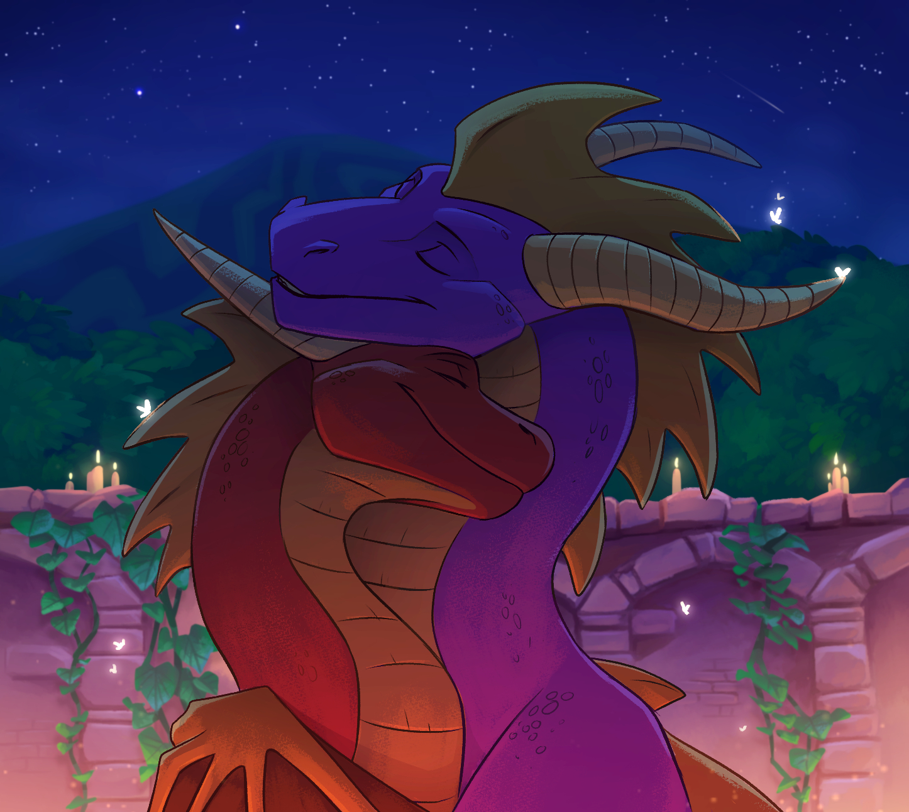

<h1 style="text-align: center;">Spyro's Old Flame</h1>

## Description

This is a young love story between two video game dragons I wrote as a request for my friend **MiaTheLynx** to go with the art above. Only it ended up being WAAAAY longer than I had planned. This is the first chapter of what is probably gonna be a 10 chapter series, so I hope you like Spyro!

This story series is gonna be about Spyro and Flame. Don’t know who Flame is? I don’t blame you. He’s a briefly seen NPC from A Hero’s Tail, that one Spyro game nobody played. If you haven’t played any Spyro game at all, don’t worry. While I reference events and locations from Spyro, this really is a standalone, alt-universe kind of thing.

The premise is simple. The story follows Flame who grew up with Spyro in the Dragon Realms. The two used to be very close before Spyro just up and left on a quest to some faraway realm, leaving poor Flame behind. With news that his old friend is finally returning to Dragon Village, Flame is forced to confront some old memories: some good, some bad, and decide once and for all if that Spyro is a dragon you can trust.

Oh, and that gorgeous art piece itself is by the wonderfully talented **Draktau**. Go give her a watch. She’s freaking amazing! 

## Tags
`dragons western_dragons spyro_(the_legend_of_spyro) ember_(spyro_a-hero's-tail) flame_(oc) alternate_universe m/m f/f`

## Chapters

- [Chapter 1 - Autumn Plains Glide](#-Chapter-1---Autumn-Plains-Glide)
- [Chapter 2 - Hatchlings](#-Chapter-2---Hatchlings)
- [Chapter 3 - Dragons Don’t Drink Tea](#-Chapter-3---Dragons-Don’t-Drink-Tea)
- [Chapter 4 - Spyro's Whole New Flame](#-Chapter-4---Spyro's-Whole-New-Flame)
- [Chapter 5 - Claw-Painting](#-Chapter-5---Claw-Painting)
- [Chapter 6 - Not on the List](#-Chapter-6---Not-on-the-List)
- [Chapter 7 - Flame's First Flight](#-Chapter-7---Flame's-First-Flight)
- [Chapter 8 - Back in Dark Hollow](#-Chapter-8---Back-in-Dark-Hollow)
- [Chapter 9 - Of Dragons and Elders](#-Chapter-9---Of-Dragons-and-Elders)
- [Chapter 10 - Beginnings and Endings](#-Chapter-10---Beginnings-and-Endings)
- [Chapter 11 - Precious and Fragile Things](#-Chapter-11---Precious-and-Fragile-Things)
- [Chapter 12 - Flame's Plan](#-Chapter-12---Flame's-Plan)
- [Chapter 13 - Flame the Hero](#-Chapter-13---Flame-the-Hero)
- [Chapter 14 - Going Home (Final Chapter!)](#-Chapter-14---Going-Home-(Final-Chapter!))

# Chapter 1 - Autumn Plains Glide

<i>First chapter, let's go!'</i> 
~ ~ ~

Flame had never been the adventurous type. In fact, had it not been for a certain purple dragon, he’d probably be sitting in his cave right now, with a warm cup of tea in his talons. Or maybe he’d be practicing his claw-painting or reading a good book.  

He would have never thought of breaking into the old castle in Autumn Plains, the one that stood so high over the surrounding valley you could see all the way to Dragonfly Falls from the roof. And then, as if that wasn’t dangerous enough, to use the magical whirlwinds to scale the southeast tower, which of course was higher up still. So high up, in fact, that Flame could see clouds drifting by below. Nor was he the type of dragon that would consider, even for a second, to jump off said tower, and glide some several hundred feet through the air, only to collect a stupid gem. Yet here he was, with the wind whistling between his horns, and the whole of Avalar sprawled out beneath him.

Flame calculated the distance between the tower and the platform and realized with some dismay that he would probably die today. The gem in question was on a platform, which in turn rested on a thin rock pinnacle far beyond the safety of the castle walls, on the other side of a ravine so deep Flame couldn’t even see the bottom, conveniently out of reach for all but the most suicidal of dragons.

He then carefully, very carefully, peeked over the edge, and immediately regretted doing so, because he realized with a start that the courtyard under him was barely visible behind a layer of clouds. He could just barely make out the pool, a small glimmering square somewhere far below, and those massive gold-crested ramparts, and the great gazebo, all shrunk to toylike insignificance under his nose. That was about all he could make out before his brain realized how very far up he was, and panic struck him. His chest tightened, his vision blurred and the mornings rushed breakfast tried to make a brave escape through his throat. He jerked back from the edge and wrapped his arms around the flagpole, the only solid thing to hold on to on the otherwise flat roof, then clenched his eyes shut to stop the world from spinning. And with his eyes closed, a vision of his cave came to him: Warm and safe with its promise of a wonderfully predictable and boring evening.

But had he stayed in his cave, he wouldn’t be with Spyro...

Spyro the Dragon, the one responsible for his current predicament, had never come across a mountaintop, ravine or tower so high he didn’t want to soar from it. While Flame grasped his flagpole for dear life, he stood perched on the crenellations, leaned so far out over the edge a light breeze might have knocked him off, with his tail twitching in anticipation and a wide grin on his snout. “This is gonna be AWESOME!” he declared, wings fluttering in barely contained excitement. His dragonfly friend Sparx buzzed in agreement.

Flame wasn’t so sure. He had followed Spyro to Avalar, and a great many other frightening homeworlds. This morning, he had promised to try the glide, happily, not realizing until later how very high up they’d be. He didn’t want to chicken out again, not when they were so close, but oh did it have to be so high up?

“Ehm Spyro... Are you sure we can make this distance?” He turned to his friend who had his eyes closed, wings spread wide, as if to imagine the incredible glide that would take him over the courtyard to his gem.

“Spyro?” Flame tried again, and finally, he looked up.

“Sorry, what?” The purple dragon shook his head, then turned to Flame. “Oh yeah, I’ve cleared longer skips than this!” he promised with a reassuring smile. Flame found that doubtful. He doubted there were even longer glides in Avalar, or any other place.

“You okay there?” Spyro asked him, a glint of concern in those bright, violet eyes. “You look a little green.”

“Oh, I’m fine...” Flame said with a talon wave, his quivering voice almost getting lost in the wind. “I was just wondering... why are we risking our lives for a single gem again? I’m sure there are plenty of gems back in the village.”

“Because it’s not just any gem. It’s the last gem.” Spyro rolled his eyes as if it was the most obvious thing in the world. “We have to one-hundred-percent the homeworld!”

“It’s just... it’s a very long drop from up here.” Flame glanced at the rock pinnacle again, partly obscured by fog, with its gem glimmering invitingly.

“That’s why we have our wings, bud!” Spyro said, cheerfully, and he had that look on him, that bemused smile that seemed to say he was being silly to worry so much; that everything was gonna be fine because he was with Spyro after all. And Spyro never failed. Spyro could do anything, so that meant Flame could do anything too, if only he set his mind to it.

But that was easy for him to think. Spyro was tragically born without a shred of self-preservation instincts. He loved nothing more than to hurl himself over endless pits, collect gems in places with names like Sunken Ruins or Volcanic Isle, and fight gnorcs and other nasty things. How he was still alive was a great mystery to Flame. The fact that he for some reason always seemed to want Flame along, useless, cowardly Flame who couldn’t breathe fire and was scared of heights, was an even greater mystery. And Flame really wanted to follow Spyro on his adventures, and learn to be a little less useless, but this was too much. He couldn’t do it. He looked down again, at the courtyard with its miniature walls and miniature pool and tiny, miniature trees, and his chest clenched tight again and breathing became hard.

“I’m sorry...” he said, finally. “I’m going back down.”

“Wait!” Spyro who had looked like he was imagining to glide again, bristled instantly and hopped down from his spot on the crenellation to intercept Flame. “Wait, Flames, we were gonna do this one together!”

“Yes, but I think I’ll just sit this one out. It’s late and I’m tired and I could just watch your fly from below. I could see you better that way, anyhow.” And if Spyro was to fall after all, he could go get the elders, he thought to himself.

“Well, okay, I understand... but you kinda *have* to glide.”

Flame slowly shook his head. “I’m not doing it, Spyro.”

“Well... it’s just...” Spyro sat down on his haunches, running a claw over his yellow frills, looking a little awkward. “Remember, we took the whirlwinds up because the stairs didn’t go all the way...”

“So?”

“So, whirlwinds aren’t like elevators. They can take you up, but you have to get down yourself.”

“What!? You’re telling me this now!?”

“I’m sorry, Flamey! I thought you knew that whirlwinds are a one-way trip!”

“Oh no... oh sweet Ancestors no...” In a second he was gasping for air again, feeling dizzy, and he could see before him the elders having to scrape his flattened remains off the cobblestone below, to hand over to his mother in a jar or something. He would definitely, absolutely going to die today, and all for a gem.

He had given up trying to hide his fear and Spyro scrambled for something to say. “Don’t worry, okay? If you fall, I’ll just catch you!”

“No you won’t. You can’t fly any better than me.” 

“I don’t have to fly, I just need to fall faster than you to catch up!”

Flame gave Spyro a dubious look. He remained unconvinced. But then Spyro sat himself down next to Flame and draped a wing over his back. “Look,” he said. “Look, if we get the gem. It’s yours, okay?”

Flame looked up. There were two things about Spyro that everyone knew. The first thing is that he loved to glide. The second is that he never shared a gem. Ever.

“But... you’ve been wanting to complete this homeworld forever?”

“Pfft, I don’t care about some stinking gem,” he scoffed. “I’m just in it for the glide, baby!” Of course, Flame knew that wasn’t true. Spyro very clearly did care. He’d been talking about that stupid gem for weeks. But then Spyro inched closer, closer than some friendly encouragement should require, and his nose brushed against Flame’s cheek. Flame’s heart sped up again, and this time it had nothing to do with the height. “We’ll jump together... And if I get that gem, it’s yours.” Spyro promised.

Flame sighed. A deep, guttural sigh. He swallowed down his fears, resigned himself to his fate and said, somberly: “Let’s do it.”

“Awesome!” Spyro wrapped his arms around Flame, squeezing the smaller dragon tightly. Then he rushed back to the edge, skidding to a stop between the battlements. “Come on!”

The hug lasted only for a second, but it did transfer some small amount of courage to Flame. Courage that vanished the second he laid eyes on the edge again. Flame took a deep breath. Fighting the urge to run back down the stairs, he slowly crept forward until he was standing side by side with Spyro. He was dizzy again, lightheaded even, and his stomach turned at the sight of that tiny platform in the distance, that was their target. He pictured himself falling to the very bottom of that endless ravine, falling and falling and falling for the rest of his life.

The gentle brush of Spyro’s wing against his scales brought him back to the moment. “Just spread your wings like this.” Spyro spread his yellow wings wide for Flame to see. The red dragon tried to do the same, his own trembling like aspen leaves.

“Hey, that’s great! Maybe just a liiiiittle bit wider, so that you can actually glide.” Spyro said, with a gentle smile.

Flame gulped nervously, then took a deep breath and slowly began to stretch his wings out all the way. With a little help from Spyro’s steady talons, he even stopped the worst of the shaking.

“That’s more like it! So now we just... you know... jump! I’ll go first, and then you can follow me all the way to the platform. And if it gets scary, don’t look down, just look at my tail until we land, okay?”

“And you did say you’ve done this before right?”

“Only like a million times!” Spyro beamed at him, as confident as ever. He could see the excitement brimming in his violet eyes. Oh, how Flame wished some of that infinite confidence could rub off on him. But he trusted Spyro. He always dragged him along on his daring feats like this, but they were always fine in the end, just like Spyro always said they would be. Flame trusted him. So far his purple friend hadn’t let him down.

So far...

Spyro smiled at him again, and this was his softer ‘I know you can do this’ smile he reserved for moments just like these. And then his wing brushed against Flame’s like he did before, and this time it couldn’t possibly be an accident. “Are you ready?” he asked, looking at Flame with keen eyes.

Against all reason, Flame found himself nodding. “But next time we’re doing something I like.”

Spyro chuckled and nodded. And then he leapt off the tower and into the thin air. And then Flame jumped too.

Then freezing water splashed him right in his face.

“What the...?” Flame’s eyes shot open and he brushed the water off his snout. He looked around, and found to his surprise that he wasn’t in Autumn Plains anymore. He wasn’t even in Avalar. And there was no Spyro to be seen either. Instead, the gray dunes of Dragon Shores stretched out on each side of him. Another wave crashed against the beach, spraying more ice-cold water on his scales.

So what was he doing here, on a cold beach, when he should be snuggled up in his warm cave? Oh, that’s right. He was waiting for Spyro. But why was he waiting for Spyro? Spyro had left the Dragon Village ten years ago, and nobody had seen or heard from him since.

Then he remembered speaking with his sister Ember that morning. The pink dragon had rushed into his cave, rudely awakening him to tell him all about how she had heard from one of her friends, who had heard from Elder Titan, who had heard from his contacts beyond the realm, that Spyro was coming home. The Welcome Home party was going to be on Dragon Shores, and since everyone was going to be there, Flame absolutely had to be on time, or he might miss his chance to see Spyro again.

Had Flame been a smart dragon, he would have remembered the last time his sister came with news of Spyro: like that fake love letter (which she and her friends had written), or that “secret date” in Thornbush Park (it had taken him forever to pluck the thorns off his scales). A smart dragon would have told her to shove her Welcome Home party up her eggpipe and leave him be.

Flame couldn’t be a very smart dragon, because here he was, freezing his tail off on an empty beach in monsoon season February, risking hypothermia or at the very least a nasty cold, all for a dragon he knew would never show. He had rushed down to the beach, planted his butt in the wet sand and scanned the gray horizon for a sight of his childhood friend for hours, at first with burning anticipation, then with fading hope, and at last, with desperation. At some point, he had slipped back into old memories again, and now he was feeling pretty dumb.

“He won’t come. It’s just a prank,” he mumbled to himself. “Haha! Stupid Flame. Always falling for the pranks,” he continued, a little louder now, staring at some particularly suspicious nearby bushes. “You can come out! You got me!”

But no laughing sister came jumping out of the bushes, or any other dragon for that matter. The beach was just as empty as it had been when Flame arrived, three hours ago. This only made him feel dumber since he should have realized something was off when not a single other dragon had shown.

He kicked a rock through the sand. It skipped twice on the pooling water before landing in some dragonets sandcastle.

“Stupid Ember...” he mumbled to himself. “Go down to the south beach,” she had said. “Everyone’s gonna be there, so make sure to be early! You wouldn’t want to miss him. I know *YOU* in particular wouldn’t want to miss him” She had gotten a wink in before he had pushed her out the door. Stupid, stupid Ember...

Feeling that he had spent enough time on the beach feeling sorry for himself, he decided that he'd much rather go home and feel sorry for himself in his cave instead. He shook the worst excess of rainwater off his scales, got off his butt and started trudging up the beach back to the village.

On his way, he passed the portal to Autumn Plains in Avalar, and an image from his daydreams flashed back into his mind, of Spyro with that warm smile on him, brushing their wings together before they took off from the tower. The funny thing is that he barely remembered the glide itself, even though it was quite possibly the most frightening moment of his life. He remembered how relieved he had felt when they landed and they hadn’t died, and he remembered how Spyro had given him the last gem like he promised, even though he had been after that gem for ages.

The memories made his paws feel a little heavier as he walked the wet, gravel road back to the village. He didn’t like to think about Spyro. He had made peace with the fact that he would never meet his old friend again, then his sister had to come and get his hopes up for nothing.

Involuntarily, another image came to him, of an older Spyro, on adventures somewhere off in Twilight Falls or Ancient Grove, any of those mysterious lands beyond The Forgotten Realms where he had gone to do who knows what. Probably saving the world or something. With Spyro, there always seemed to be a world to save.

What would he look like now, ten years older? Would his scales remain as bright purple, or would they have taken on a darker hue like Flame’s had? How would his golden frills look all grown out? Would he still have his weird dragonfly friend of his with him?

Flame wondered if he even remembers that dorky red dragon he used to spend so much time with; and how close they used to be as dragonets, or how they had collected every single gem in the Dragon Realms and Avalar together. Does he remember that weird night in Dark Hollow when he had pressed his muzzle against Flame’s without warning, a warm, wet and awkward moment Flame had replayed in his mind so many times he sometimes wondered if it had actually happened? That was the night he had left, promising to be back soon before jumping through the portal.

*Does he remember you at all?*

Flame decided that he probably doesn’t. They had been little more than hatchlings then, horns barely grown out. And a lot can happen in a decade.

Since then, Spyro had never returned, never visited, never even sent a postcard. Of course, he heard the tales. Every dragon on the island had. The elders kept everyone updated on Spyro’s great adventures, sharing every little detail that made its way back to Dragon Village, delighting in the fact that a dragon from their realm was actually achieving something of note. He’d heard something about some “dark lord” causing problems in places beyond The Forgotten Realms and how Spyro had teamed up with another dragon to defeat him. The dragon’s name had been Tinder or Cinder or something stupid like that. He remembered him mentioning her the night he left. Maybe she was the reason Spyro had never returned. Or perhaps he and Spyro were never as close as Flame had thought.

The village was mostly empty, which was odd. Even on a winter evening, there were usually one or two dragons out. Was there some sort of holiday or something he didn’t know about? Flame decided that he didn’t care as he made his way through the town center. He just wanted to get home.

His home was a short walk from the village and was the more primitive variant of dragon living: simply a cave etched into the hillside with a wooden door. It’s the cave where he was born, and when his mom decided that Dragon Village was far too noisy of a place to spend her twilight years, he had inherited it. He was just about to nudge the door open and step inside, when he heard a voice behind him.

“Hey, aren’t you Ember’s brother?”

He spun around and found himself looking into the eyes of another dragon. She was probably around Flame’s age, had gray scales mixed with a darker shade of blue on her back, and was annoyingly just slightly taller than him. He just vaguely recognized her as one of his sister's friends. How long had she been standing there without him noticing, he had no idea.

Flame cleared his throat. “I guess?”

“Oh cool! Ember asked me to come by and make sure you’re not late to Spyro’s Welcome Home party.”

*Oh, so she’s in on it.*

“Oh yes, the Welcome Home party!” Flame rolled his eyes. “The one over at Dragon Shores, right? Well, I just came from there, so you can tell my sister that if I see her tonight, I’m throwing her into Crocodile Swamp.

The dragoness looked confused. “The party isn’t at Dragon Shores, it’s at Dragon Beach”

“Oh...”

# Chapter 2 - Hatchlings

<i>Alright, the second chapter is here, in which Flame makes a new friend! Sort of! This chapter just like the previous one is very flashback heavy and flashbacks are definitely gonna be a recurring theme through the rest of the series. I'll be switching back and forth between these two timelines a lot, so let me know if you think it works!</i> 
~ ~ ~

Her name was Ashes, apparently, and for being one of Ember’s friends she seemed surprisingly tolerable. Dragon Beach was on the opposite end of the island, a sad piece of sand nestled between Coastal Remains and the elder temple that barely deserved the distinction of being called “beach”, and seemed to Flame, a weird place to host a homecoming party. This also meant they had a long, boring walk ahead of them: a walk that would be infinitely worse had she been one of those talkative types. But they were almost at the old waterwheel now and so far, she had barely said a word.

She did hum to herself as they walked, which was annoying, and every now and then Flame would catch her glancing in his direction when she thought he wasn’t looking, which was even more annoying. And a little odd too. But he decided to ignore her. He had more important things to worry about anyway: like the fact that he might actually meet Spyro in a few hours. His belly flopped nervously at the thought, a whirlwind of ambivalent, contradictory emotions. He was ecstatic, anxious and scared shitless all at the same time. What if Spyro wouldn’t recognize him after all these years apart? Or worse yet, what if he wanted to know what Flame had been up to since he left?

He’d have to tell him that in the last ten years, the most exciting thing to have happened to him was the time he got lost on the way to the store by Dragon Lake. That he had inherited his mother’s cave, where he had spent most of the intervening years, painting, reading and watching bitterly as all the dragons of his generation found mates and flew off, until it was mostly just him and the gray-scaled elders left. 

Flame winced. No, telling Spyro the truth would be way too embarrassing. If he asks, Flame should just tell him that he slipped on a banana peel the day he left, struck his head, and fell into a ten-year-long coma.

That’s assuming, of course, that Spyro was actually visiting, and it wasn’t just a prank. Flame still wasn’t entirely convinced. And even if Spyro was coming, Ember had never bothered to tell him if he was returning to stay or just visiting. What if Flame got there late and missed him? What if there were too many dragons there and Spyro misses him? The town had seemed unusually empty and Flame suspected many dragons had made their way to the north beach already, hoping to catch a glimpse of the famous dragon. And did Spyro even know Flame was gonna be there? It was all a mess and he suddenly realized he wasn’t the least bit ready to meet Spyro tonight, and on top of everything else, that stupid dragon was staring at him again. They had reached the crossroad by Crocodile Swamp when Flame decided that enough was enough.

“Do I have something on my face?” he asked, standing himself in the gray dragon’s way.

The dragoness looked at him, surprised. “No, your face looks fine to me,” she assured him with a shrug.

“Then why are you staring at me all the time?”

“I wasn’t staring,” she tried, even though she very obviously was. “It’s just... you’re a little shorter than I imagined.”

Flame blinked. “You’re staring because I’m... short?”

“A little bit.” The gray dragon shrugged again, as if commenting on someone’s height wasn’t extremely rude. And at any rate, Flame wasn’t that short. He was possibly slightly below average, but he had always felt that his long horns compensated nicely for it.

But before he could tell her as much, she went on: “I mean, you hear so much about the other realms being these really scary and dangerous places, that only the biggest, bravest dragons would set foot in, so I guess I just imagined someone... taller”. She turned to him again and asked with a skeptically raised brow. “Have you really been to Avalar?”

“As it happens, I have,” Flame answered, a little indignantly. “Not that I see how it’s any of your business.” Flame had in fact been to Avalar three times in his life. Spyro had been with him every time of course, and to be fair, he would have never gone if it wasn’t for him. And that was all a long time ago, anyway.

Still, he remembered the Autumn Plains glide as clearly as if it had happened yesterday. He could recall every word passed between him and Spyro, how many times he had smiled and how cold the wind had felt, every little detail burned into long-term memory. But that didn’t matter, because the feelings that had compelled him to climb that terrible tower with Spyro, and then jump from it, were gone. In retrospect, they even seemed strange and foreign to him. Incomprehensible that they should ever have belonged to him at all, like a memory borrowed from a complete stranger, or a half-forgotten dream where you can clearly remember doing something embarrassing but not why you were doing it. All he felt now looking back those days was a vague sense of regret, and even that had dulled after so many years, so that now he mostly felt nothing. He never talked about those days, making it weirder still that this Ashes weirdo should know about his trips to Avalar.

The gray dragon regarded him curiously, as if she wasn’t quite sure what to make out of him, but Flame didn’t care if she believed him or not. He snorted and pushed past her. Unfortunately, she didn’t quite get the message and reappeared beside him just as quickly.

“As I was saying, it takes a special kind of dragon to go collect all the gems in Avalar. And you seem nothing like Spyro. But I guess opposites really do attract, huh?”

She said that last part with a coy smile that Flame did not much care for. “Yeah sure, whatever...” he mumbled, walking on with his eyes fixed on the road. He decided not to ask why she was talking about Spyro now, or what she meant by that opposites attract thing, but then the other dragon said something that was impossible to ignore:

“You used to be Spyro’s... special friend, right?”

Flame nearly choked as half a dozen questions collided in his head. How did she know? How much did she know? And most importantly, who had told her!?

“Ember.” Ashes chirped innocently when he demanded to know, still with that stupid smile on her face, as if his sister telling strangers about him and Spyro was the most natural thing in the world. “She told me you took it very hard; that you boys were pretty close. Before he left, I mean,” she continued, shuffling her talons a little timidly.” She says that’s why you’re always angry and never talk to anyone...”

“That’s not true!” Flame bristled. *He wasn't always angry, just when dragons annoyed him.* “And anyway, Ember shouldn’t be running her snout about things that don’t concern her!” Especially not to strangers, he added under his breath. Of course, he should have known that Ember would be leaking about it to every dragon on the island. He redoubled his promise to himself to find her and throw her in Crocodile Swamp at the earliest opportunity.

“So... it’s just made up then?” Ashes asked, a little apprehensively.

“Ember just likes to exaggerate things, that’s all,” Flame brushed his ruff back down. He hated the way it always rose when he got upset. “We weren’t that close. Just friends, really. Nothing remotely special about it.”

“Oh...” Ashes said, and almost seemed a little disappointed.

“Yeah.” Flame marched on, hoping that she’d take a hint this time, but like before she caught up with him.

“So you were really just friends?”

“Yes.”

“And you don’t miss him every day? You aren’t sad he left?”

“Not at all.” he blurted out, a little louder than intended.

“Well...” the annoying voice continued next to him. “If you did have a crush on Spyro, that wouldn’t be so weird. I think pretty much every dragon had a crush on Spyro at some point back then.”

Well, she was right about that, at least, he thought bitterly. Spyro had had half the village hanging off his tail since puberty and was never seen without one or two fans hovering over him. Even worse, he had always seemed to really enjoy the attention too.

“Anyway,” she continued, and a somewhat mischievous smile curled on her lips, “He was always so popular. So I guess it makes sense you weren’t more than friends, with how many other dragons he had to choose from, I mean!”

Flame just glared at her, taken aback by such a blatant attempt at manipulation. He was sure he had never met anyone so rude in his entire life, with the possible exception of Ember and she had the excuse of being his bigger sister. Who did this dragon think she was anyway, calling him short and now this? Wounded pride swelled up in his chest, and then he decided to tell her, except he doesn’t really decide, the words just sort of tumble out:

“We kissed actually.”

It was true. To this day, Flame couldn’t tell you what had come over the purple dragon that night, and of course, they had never had the chance to talk about it before he left.

The dragoness stared at him with wide eyes. “Really!? You kissed Spyro the dragon!?” she asked, voice bubbling with equal parts surprise and disbelief.

Flame nodded proudly. “I guess I must have been more than just any old dragon to him after all.”

He nearly jumped when the other dragon let out a happy squeal. “THAT’S SO CUTE! When!? Where!? What was it like!?” Her pale blue eyes sparkled with curiosity.

Her excitement was more than he expected, but a warm feeling still spread through Flame, and he had to stifle a dumb smile. “Dark Hollow, on the elder's side of the island. And it was just like a regular kiss I guess. Wet. Awkward. You know what a kiss is like.”

“Well, duh... I’ve kissed dragons. But not Spyro! And you didn’t say when he kissed you. How long were you together?”

Flame had intentionally left the when out. The truth was that it had been the same night Spyro had left, and thinking about this night still made his heart sink. “We weren’t really together. At least not *officially* together.”

“Yeah yeah...” Ashes waved her talons dismissively. “So how long were you *unofficially* together, then? When did you guys meet?” She was sitting on her haunches now, tail wrapped neatly over her talons, looking at Flame in a way that made it clear nothing less than a detailed account would do.

“That’s kind of a long story.”

“Yes, but Dragon Beach is a long walk!”

Flame sighed. “Fine... I’ll tell you. On the way.”

He walked on with Ashes hovering over him, her gray wings fluttering with anticipation. “Start from the beginning! Start with how you first met!”

Flame opened his mouth to tell her, but then realized he wasn’t so sure what the beginning even was. He and Spyro had kind of always been together, in one way or another.

They had even hatched together, through force of circumstance. It had been a perfectly ordinary day in Dragon Village , which had been so far as any other ordinary day except for the fact that it had been on the Year of the Dragon Festival and all the eggs had been gathered outside the Elder Temple as per tradition.

All eggs had been accounted for except a big white one with purple dots all over it. Flame’s mother, who was a bit low on eggs herself and a dependable dragon by all accounts, had been given the egg by the elders to care for until it hatched. Nobody knew what else to do with it, and his mother had reluctantly agreed, seeing it her duty, and so it was that Spyro’s egg would be placed in a nest right next to Flame’s egg and his sister’s.

Ember had hatched first, giving her an unfortunate two-day head start on Flame that had earned her the annoying right to call him “little brother”. He and Spyro had pierced their respective shells at the same minute, nearly on the very same second, according to his mother. But while Spyro had practically exploded out of his egg, eager to explore the world, Flame had taken one look at the big world outside and promptly decided to stay in his egg where he felt safe.

When Spyro felt done exploring the cave, he had stumbled back to Flame’s semi-hatched egg. Then the curious hatchling had pressed his nose inside the shell and started snuffling on Flame and tried to nudge him out. And with Spyro there, Flame finally felt brave enough to come out into the world.

His mother always said he and Spyro had been inseparable since that day, and the elders used to joke that wherever purple went, red was sure to follow. When a tiny Spyro, bored with his cave, had ventured out into Dragon Village to explore, Flame had followed closely, petrified of the outside world, and afraid he’d get into trouble, but still happy to be with his hatchmate.

Yet they could not be more different, even as hatchlings. Little Spyro was brave, curious and had an insatiable lust for adventure. Flame, on the other claw, was afraid of everything. He was afraid of the elders, the forests and swamplands surrounding the village, most things outside the cave scared him in fact. Yet he never wanted to stay in his cave if Spyro was out exploring. And even though the outside world was scary, he felt safer with Spyro.

One time, Elder Tomas had found the hatchlings running about in the swamplands outside the village, gathered them up and promptly returned them to Mother. She had been furious with them, angrier than Flame had ever seen her before, and said that they could be kidnapped by gnorcs if they went out too far, and threatened that she’d give them over to the elders if they didn’t stop sneaking about. It hadn’t stopped Flame from following Spyro out the next day.

Even back then, Spyro had his way of making the world seem more interesting than it had any right to be, like how exploring an old swamp could be an adventure for no other reason than that Spyro thought it was. And with Spyro there was never any shortage of adventures. They’d sneak out early in the morning, as soon as Mother had left the cave, to explore or play in the lake or collect gems, sometimes with Ember, sometimes with other dragonets from the village, but mostly just the two of them. And then late at night they’d drag their tired feet back to the cave, curl up and fall asleep, only to do the same thing the next day, and Flame felt safe knowing that every day would be the same.

And then the next day came and Spyro was gone. His spot in the nest next to him was empty, which felt all wrong to Flame who hadn’t gone a day in his life without waking up next to Spyro. He wasn’t in his cave or outside in the village, and his mother wouldn’t help look for him or tell him where he was. She’d just shake her head and tell him to calm down. Then Thomas had come over, sat himself down next to Flame, and explained calmly that from now on Spyro would be living with the elders on their side of the island, in the Elder Temple. He said it would be best for Spyro, to have a place where he could grow and train without causing trouble for the village or his mother. “Or you, for that matter,” they had added as if Flame should be happy to be rid of his adoptee hatchbrother.

Flame didn’t like that idea one bit. No young dragons were allowed on the elder side of the island, so he wouldn’t even be allowed to visit Spyro without explicit permission. So far, Spyro had been a constant in Flame’s life, like his sister or the sunrise or the nest where they slept at night, and to suddenly have him not be there felt like having lost a part of himself. He had been even more devastated when Ember told him, in secret, that the new arrangement had been his mother’s idea.

He had cried, and Ember had wrapped her wings around him and tried to tell him that he shouldn’t be sad because at least this meant that Spyro would be happier, with all that room to explore. But Spyro had been happy with Flame, and he did not see how neither of them could ever be happy apart. And he had promised himself never to forgive Mother for separating them.

A month or so later, Flame had finally been allowed to visit Spyro. With the elder’s reluctant consent, their mother had flown him and Ember across the island to their side, and they had touched down outside the great elder temple. Flame remembered how the big, imposing structure had frightened him. First, a massive courtyard with a great many statues of various important dragons. Then the temple itself, a thousand years old, four massive pillars joined by stone walls that sank directly into the cliffside and looked like they had grown out of it.

They had found Spyro training in the antechamber with Elder Magnus, whom Flame had met only briefly before and had always found to be a particularly odd dragon, with his beard and staff and his ways of always mumbling to himself.

Flame had expected, and to some extent hoped, that Spyro would be as miserable without him as he had been without Spyro. But while Spyro had been overjoyed to see Flame, it quickly became apparent that he was happy and comfortable living in the temple with the elders. He liked his lessons with Tomas, and his Martial arts training with Titan. He liked that he was allowed to explore nearby Coastal Remains and use the gateways to explore other homeworlds too. They had taught him to charge attack and headbash, and a few other cool tricks that Spyro had shown off enthusiastically, and while certainly very cool, Flame couldn’t see why any dragon would need to know so many different types of attacks.

He had left the temple with a very peculiar and uncomfortable feeling: a sinking feeling of loneliness, but for reasons he couldn’t quite put his claw on yet. Things would only get worse as they got older.

As they grew up on different sides of the island, they also grew apart. And If they had been different as hatchlings, they were even more different as young dragonets. While Flame was just realizing he had wings, Spyro was soaring between mega-trees in Dragonfly Falls. While Flame was just figuring out what his horns were for, Spyro was headbutting gnorcs off their feet with his new charge attack. Six summers past their hatchday, both Ember and Spyro had their fire breath. Flame, ironically, could at best cough out some smoke. And when it was time for the young dragonets to start their gliding lessons, it was discovered that Flame had a very undragonlike fear of heights.

Spyro, on the other claw, was born to glide, as their tutor Elder Astor liked to say, and indeed even his sister managed the glides with ease, but Flame could barely step on a platform without getting dizzy. His ineptitude at all the things a dragon was supposed to be good at perplexed the elders and was a constant source of humiliation for his mother. The simple truth was that in every way a dragon could be better than another dragon, Spyro was better than Flame.

There were times Flame wondered if his mother regretted sending Spyro away. If perhaps she even wished that Spyro had been her egg instead of Flame’s. He never dared to ask.

But the bad part wasn’t being so much worse of a dragon than Spyro. He was still happy to be spending time with him whenever he was able, even if that happened less and less often, and didn’t give a horn about what the village thought about him either. No, the bad part was the gradual realization that Spyro was doing just fine without him.

“So?” Ashes’ voice appeared next to him, and Flame was pulled back to reality. “You were gonna tell me how you guys met.”

“Oh. I actually don’t really remember...” Flame lied.

“What?” Ashes sat back on her haunches and gave him a weird look. “What do you mean you don’t remember?”

“Look, it’s not even that interesting of a story anyway. We were close as hatchlings. We grew apart.”

“But you promised you’d tell me.” Ashes said, furrowing her brows.

“I’m sorry, but we don’t always get what we want, do we?” He turned his back to the perplexed dragon, then continued down the road. “And that kiss,” he added, looking over his shoulder, “I doubt Spyro even remembers it.”

Ashes caught up with him, but at least she stayed quiet this time. Flame felt a twinge of guilt at the sight of her dismay but pushed that feeling aside. Why should he feel sorry about her? It’s not like Flame owed her to reveal every embarrassing detail about his life. For all he knew, she was probably just like his sister, meaning that she’d go share his story with every dragon who would listen or tease him about it to no end.

Ember had figured out Flame had had a crush on Spyro, but she didn’t know about all the other things. She didn’t know about the kiss – and Flame was happy to keep it that way.

Besides, if he told her the rest she’d just want to know how Spyro could leave without him if they were so close, a question Flame had been asking himself for ten years and still had no answer to. And it would make things even more awkward if, when he meets Spyro later today, it turns out that he barely remembers Flame.

Flame let out a deep sigh. Maybe he should have stayed on the beach.

# Chapter 3 - Dragons Don’t Drink Tea

<i>Sorry for the wait, guys, but at least this chapter is a little longer to make up for it! And poor Flame goes through a lot in this installment, but read on. It gets better in the end!

Also a note regarding the elders. They're the ones from A Hero's Tail, not the original trilogy! And I had this idea that all the elders in the village would be responsible for teaching the young dragonets the various important skills a dragon is expected to have, like flying and fighting gnorcs. Titan could teach charge attacks, Astor gliding and eventually flying, and Magnus would get the creative artisan stuff, because you know, he seems the type.I'm thinking Tomas could be the head of the elders and the one directly in charge of Spyro's training. </i> 
~ ~ ~

They walked in silence. Uncomfortable, awkward, so-thick-you-could-cut-it-with-a-claw silence. Flame had realized very suddenly that he didn't feel like talking about Spyro at all. That the story of how they grew up as hatchlings, and then grew apart as dragonets, would just lead to more questions from Ashes. Nor did he feel he owed her any sort of explanation as to *why* he didn't want to talk about Spyro, and even if he tried to explain it, what would he say? Spyro had bounced back and forth in his life like a purple yo-yo, and whenever Flame had allowed himself to think that he might get to keep him, some cruel twist of fate had pulled them apart. 

How would he explain how a single, misguided attempt by Flame to disable a few force fields in Red's Cave had almost ended their friendship completely, or how an embarrassing episode involving a mud-filled well in Crocodile Swamp had brought them back together again? 

Ironically, they were just passing that very cave, Red's Cave, where it had all started. The force fields were long gone, but the cave opening still remained, as deep and dark as he remembered it. The cave itself was not outwardly different from any of the other caves that permeated the valley between the village and Crocodile Swamp. What made it special is that the outcast and fallen Elder Red had taken up residence there, and that's how it had gotten its name. Red was a diabolic red dragon who, using his dark gems, had tried to take over the entire realm. But it wasn’t because of Red the sight of that cave made Flame's stomach turn. In fact, he had never even met the dragon.

He stopped at the cave opening to stare into that damp, dark hole, and the familiar odor of musky water and dead fish reached his nose. He winced, not because of the smell, but because of the memories it brought with it. The memories of one of the most embarrassing moments in his life - the first time Spyro had saved him.

He had been sixteen years out of the shell. The summer had been as bright and peaceful as any summer in Dragon Village, and Flame and Spyro weren't hatchlings anymore, but dragonets. But what he remembered the most is that he couldn't breathe fire.

At sixteen summers, a young dragon was supposed to gain his fire-breath - the true mark of a dragon. Flame's sister Ember could jet out a formidable gout of flame, which had impressed Mother so that she liked to do it all the time just to show off. And of course, Spyro had been running about setting fire to things since he was six. Yet, no matter how hard he tried, the best Flame could do was cough out some black smoke.

“Could be underdeveloped fire sacs...” Elder Magnus had suggested with a shrug when Mother had brought the issue to his attention. He had inspected Flame’s gullet, and asked him to cough a couple of times, but found nothing wrong with the young dragon.  

“Flame, my dear, I wouldn’t worry about it at all,” he had assured him with a wave of his claw. “Some dragons bloom a little later than their pairs. Why, I didn't get my fire breath until I was well into my first century!”. Magnus laughed heartily but his anecdote did little to ease Flame's worry, and even less so his mother's.

For her part, the comparison just seemed to worry her more; Elder Magnus, pink, wide and with a flamboyant personality, had as little in common with the other elders as he did with dragon ideals in general. So the idea that he should have anything in common with his son made her wince. Flame could never understand why the older dragons seemed to dislike Magnus so. He was by far the nicest of the elders!

In Any Case, Magnus had taught him some throat exercises that might help, and prescribed him some of his herbal tea (to relax the cricopharyngeal muscle). And Flame had started practicing his fire breath as soon as he got home, and continued the next day. He'd spend his evenings outside, trying to produce at least the tiniest bit of flame until his throat was sore, but still, there was no fire.

“I’m sure I’ll figure it out soon,” he croaked to his mother when she had come outside one night to check on him. “after all, if Ember can do it, it can’t be that hard!”

His mother sighed. “I’m sure you will, Flame,” she said, her forced smile telling him that she was anything but sure. Then she had left him to practice. She did not say she was disappointed in him, or that she wished Spyro would have been her egg instead, but she didn't have to. Flame could feel it. She could feel it in every sigh, or the way she looked at him when she came on to find him curled up inside with a book instead of playing outside with the other dragons.

He wasn't good at any of the things a dragon was *supposed* to be good at, the all-important dragon abilities like fighting gnorcs, finding gems, performing charge attacks or horn dives, nor did he feel that need to explore the other realms and build up his hoard, or whatever it was exactly a dragon was supposed to do out there. He couldn't understand why breathing fire was so important anyway, as if somehow being able to combust flammable objects would drastically improve his life. But for some reason, it was important to mother. 

And maybe his inability to breathe fire wouldn't be so bad if at least he was a better glider, but sadly, his fear of heights, that the elders had been sure he'd grow out of, had only gotten worse over the years. His instructor Astor had nearly ripped his horns off when Flame's crippling acrophobia had kept him from jumping off even the lowest platform. And he had trouble learning all of Elder Titan's different attacks, like the charge-attach or the all-important headbash, and didn't share the other dragonets passion for fighting either. 

So for all of these reasons, it seemed especially unfair to Flame, that he was already a poor fighter and a worse glider, should also be bad at the one thing that, apparently, all dragons needed to be good at. 

Flame liked other things. He liked to work with his claws and loved Magnus' sculpting class, so much so he had taken up the practice himself and had could now carve out a pretty good looking dragon out of a block of wood. He had kept his claw-painting up, and liked to think he had become a pretty decent artist. He enjoyed reading and had taken a liking to that chamomile tea Magnus had given him. But all the things he did enjoy didn't seem to matter to Mother. His artwork or sculptures got only the most bare-minimum, obligatory hum of approval, and all she wanted to know about was his gliding lessons. Nor did she approve of his newfound tea-drinking, because apparently, “dragon’s don’t drink tea”. 

And then, of course, there was Spyro, the type of dragon Flame ought to have been. He continued to be effortlessly perfect at everything he tried his claws at. At thirteen summers, he had already saved the village from more gnorc attacks than anyone could count. And unlike Flame, he wasn't afraid to try his growing wings: there wasn't a peak or tower on the island that he hadn't soared from. He held all the speedway records and infuriated Astor by skipping all his lessons and still being the best glider in the class. 

"I wish I could be more like you," Flame sighed one day, flopping down next to his purple friend. Spyro was supposed to be training in the temple, but had snuck out to spend some time with Flame. 

"You don't want to be like me," Spyro chuckled. "If you were, Tomas would make you guard the dark gems as well, and keep the borders safe, and everything else those old hens can't seem to do themselves."

He laughed, but Flame knew Spyro loved his quests to the other realms. He loved that the elders trusted him enough to give him "portal privileges", and could use the many gateways scattered across the island. Spyro would disappear for days, even weeks, to Avalar or the Artisans Homeworld or even The Forgotten Realms, missing his tutorage and returning home with thousands of gems. And none of the elder dragons seemed to have a problem with it, and Spyro wouldn't care even if they did. That's how things were now. Spyro just sort of did whatever he wanted and he never got in trouble for it and things always worked out in the end, like he was the main character in a story where Flame was at best an extra. And Flame wouldn't have minded so much, if it wasn't for the fact that he barely had time to hang out anymore. 

"Well, if I were more like you, maybe mom would..."

He stopped himself, but Spyro was already looking at him. And Flame cleared his throat. "Do you think that, I mean, sometimes I wonder if my mother doesn't like me very much."

"Why wouldn't she?" Spyro asked, with a perplexed look on his muzzle. 

"No particular reason..." Flame looked down, dragging his claw through the grass and picking at some straws. "But let's say, theoretically, that I couldn't breathe fire yet..."

Spyro blinked. "Of course you can't breathe fire. Everyone knows that." 

Flame gasped. "They do!?"

"Or well..." Spyro sat back and brushed a claw through his frills. "I mean, it's kind of obvious since you never use your fire breath. Because if you had it, you would be breathing fire all the time because it's so awesome!" he continued, beaming at Flame.

"Yeah, right..." Flame took a breath. "But do you think that would, theoretically, be a good reason for my mom, or *any dragon*, to dislike me?" Flame's voice was quiet and he pretended to be more interested in furrowing little circles in the grass.

"Well," Spyro brought a claw to his chin, deep in thought. "In that theoretical case, I'd say your mum is being silly. Everyone gets their fire breath sooner or later. And there's more to being a dragon than just breathing fire, you know." 

"Like what?"

"Like, you know, fighting gnorcs, flying, all that stuff!" 

Flame's heart sank a bit. He wasn't good at *any* of those things. 

"And even if you don't get your fire breath, we're still friends," Spyro continued, smiling. "So don't worry so much!"

Flame nodded and gave a small smile back. Spyro said they were friends, and Flame wanted to believe him. But friends were supposed to spend time together, and he and Spyro rarely ever did. Maybe he could come on one of Spyro's quests some time, he thought to himself. Then at least they could hang like they used to. But before he could ask Spyro, the purple dragon jumped up on all fours. 

"Oh, crap, I gotta go!" Spyro sat up and turned his nose to the elder's temple. "Tomas had something he wanted to talk to me about. Something important!"

He was just about to rush off when Flame grabbed his tail, then quickly let go of it and felt his cheeks, unaccountably, heat a bit. "Wait... I mean. We're still on for tonight, right?"

Spyro gave him a blank stare. "What happens tonight?"

Flame gulped nervously. "You know, you said you'd go with me to Dragonfly Falls, catch Red Nestor." The comet would be visible tomorrow, around midnight, and the hill near Dragonfly Falls would be the best place to see it. Flame was hoping to paint it - and he wanted to have Spyro too, and Spyro had agreed over a month ago. Since then, he'd made sure to remind Spyro as often as he dared without being overbearing. 

"Oh, that! Yes, of course. You can count on Spy'!" He flashed him a lopsided smirk then ran off. 

Flame's heart did a happy jump because at least see Spyro again tonight. But when he had gone to the hill near the waterfall, where they were supposed to meet, Spyro wasn't there. And Flame waited and waited, and it got dark, and Red Nestor came shooting through the sky, as bright and red as he had hoped, but Spyro never showed.

He later found out that Tomas had sent Spyro back to Avalar, to find some stolen eggs. And Spyro had apologized, of course he had, and happily promised that they'd catch Red Nestor next time. Flame had just nodded, sadly. He didn't feel like reminding Spyro that The Red Nestor comet was visible every 40 years. 

And so it was. Spyro was away exploring the other realms. Flame was home, because he didn't have his fire breath and couldn't fight gnorcs. But there has to be more to do in the other realms than torching things and fighting gnorcs, Flame felt.

But there were many things Flame could do! He wasn't as big as most dragons his age, but he was fast. And thanks to all the exploring he and Spyro used to do, he knew every inch of the island, and in difference to Spyro, he had memorized the tunnel systems, and the portal gateways, since usually, when the two got lost, they had to rely on Flame's maps to get back anyway.

And then something absolutely amazing happened. A gift from the Ancestors, Flame was sure. A perfect chance for him to prove himself.

Flame had been out gathering mint leaves when he had seen the elders gathered in the town's center, and sneaking closer, had heard them discussing what's to be done about the fallen Elder Red.

Of course, Red had been banished by the council before Flame was even hatched and he knew precious little about the red dragon, or why he was banished to begin with. He did hear, however, that he had taken up residence in the cave system near Dragonfly Falls, which he used for his dark gem experiments. It was all anyone in the village ever talked about.

And it just so happened that Spyro was in Avalar.

“We’re simply gonna have to wait until he gets back,” Thomas had declared, to a murmur of agreement from the council. Spyro was the only one small enough to sneak in and disable the force fields, after all, and Flame suspected that none of the older dragons were particularly keen on facing Red themselves, even if they were able to.

But Flame knew the cave-system. He knew it like the back of his claw, and more importantly, he knew where the force fields were. Last time he and Spyro had been through, he had marked them all on his map. A map which he still found, a little dusty under his bed. And with that it was decided.

Flame would disable the force fields himself, proving to his mom, the elders and Spyro that he wasn't so useless after all. And then, the elders might even let Flame follow him on his quests.

How he found the courage to venture into Red’s dark lair all alone, had been a mystery to everyone, not the least to Flame. But he quickly scribbled down a note for Mother explaining where he was going, then ran off into the cave. And at first things had gone well. The tunnels were dark and wet, and many of the compartments were flooded and stank of dead fish, but at least he had plenty of time before the tide would come in. He had managed to locate most of the dark gem generators and had disabled all force fields but one, but he must have forgotten a generator somewhere, because just as he was about to return that last force field powered back on trapping poor Flame inside.

He had tried to smash through the force field repeatedly, only to get zapped and fall back on the ground. All he could do was lie there and wonder how long it would take the elders or Ember or his mother to realize he was missing. But the elders didn't come, nor Ember, nor his mother or anyone else, and the longer worried he waited, the more worried he'd get. What if nobody came by and found him? What if he was still trapped here in the morning when the tidewater came in? What if everyone had forgotten about him? 

But who would come to his rescue if not Spyro?

He had come in, exhausted, but brimming with typical heroic energy, and disabled the force field to let Flame out. And while it was an embarrassing state to be found in, Flame had been overjoyed to see his purple friend.

"Thanks for coming for me!" he sighed with relief. "I was starting to think they had forgotten about me up there!"

But Spyro wasn't as happy to see Flame as he had hoped. "You shouldn't have come here," he said, shaking his head. "It's dangerous!" Nor did he want Flame along for his fight with Red. "I got this, bud. I'll see you back at the village!" he said then charged off before Flame had any chance to protest. And he hadn't even thanked Flame for disabling the force fields.

Flame didn't feel like a very heroic dragon walking up that day, wet and smelling of dead trout. And Mother had been furious.

"What on earth were you thinking, Flame, going into Red's Cave all alone? You know better than to risk your life on such foolish nonsense!" she roared, pinning the smaller dragon under her gaze. 

"I'm sorry..." Flame stammered, making himself as small as possible. “It's just that Spyro...”

“Spyro is trained for these things and you aren't! And even if you were, you’re just not...” She had stopped herself before saying whatever it was she had intended to say. Then she composed herself, sighed deeply then left with a low "I'm needed at the council." And with that, she left, leaving Flame alone. 

The story of Red's defeat by Spyro's claw spread like wildfire, and by next morning, the whole village was buzzing about it. Flame couldn't walk through the town center without hearing Spyro's name a dozen times, often associated with the most hyperbolic exclamations imaginable. *"Spyro had defeated Red with a single burst of fire!"* *"He had saved the village from near-certain doom, single-handedly!"*. *"No, he had saved the village AND disabled all those pesky force field traps!"*. It was all quite silly, for Flame, when all Spyro had done was torch an elderly old dragon a couple of times, and anyway *he* had been the one who disabled the force fields!

And if Spyro had been busy before, it was nothing compared to now. Because on top of running errands for the elder, now Spyro had to contend with a fan club of dragonets, swarming over him wherever he went, wanting to hear again and again about how he kicked Red's butt, or his trips to Avalar and the tricks he knew. And Spyro clearly enjoyed the attention too. He loved to tell the story of how he kicked Red's butt, or his gem collections and speedway records, and was seen more and more with a pair of black sunglasses on, which just looked silly on him. They'd barely said three words to each other since that day in Red's cave, and now that he was surrounded by his adoring fan club wherever he went, approach was impossible. Flame had never liked the other dragons his age, and they never seemed to really like him either. A few of them like to tease him for being a little smaller than the rest, and while Spyro didn't know that, the truth was that his sudden popularity had relegated Flame to the background. 

As if all of that wasn't bad enough, he would start seeing Ember and Spyro together more often now. Ember had never shown much interest in Spyro before, so seeing her follow Spyro around with the rest of his "fan club" just seemed like blatant opportunism to Flame. A desperate attempt at a slice of Spyro's attention, just because he was popular now, even though they were never very close as hatchlings, and certainly not as close as he had Spyro had been. 

One day he had seen the two, alone, talking by the town center statue, and even though he wasn't the type of dragon to go eavesdropping on his sister and friend, he had snuck closer. Close enough to hear Ember's talking about... about something to do with... dark gems? And then he heard Spyro chuckling like she was saying something particularly funny. 

Spyro had been looking for dark gems he needed for some purpose, probably something to do with Tomas, and Ember being Ember had suggested Spyro should smash it and turn it into an engagement ring. It was definitely meant as a joke, of course, but the way Ember had been winking at Spyro had been completely serious, or how she just *accidentally* brushed up against him as they talked, and inched closer and closer with every word. Spyro hadn’t given her any ring that day, but Flame had gone home with a sinking feeling in his chest, a deep sort of sadness like he had swallowed a dozen rocks and even doing the things he liked, like painting or reading, was hard. 

And he didn't even know why seeing the two together made him feel the way he did. But the feeling only got worse as he had to watch Ember hover over Spyro wherever he went. And Spyro, who Flame felt couldn't possibly be interested, just seemed to be leading her on, winking and leaning in close as he bragged about his trips to Avalar. 

And it had gotten to the point where Flame could barely see the two together without feeling jealousy coil within him, and he'd go home sizzling in anger. This wasn't Spyro, he knew that much. The Spyro he knew didn't roll around on a skateboard and act like he was the hottest shit just because he had kicked some senile, old dragon out of a cave. Or forget about Flame just because, suddenly, he was the most popular dragon on the island. 

Unless, of course, he was ignoring him. And Flame supposed, it made sense if he did. He knew he was anything but popular in the village. He knew he was a runt, and his failure in Red's cave had only cemented that reputation. Could it be that Spyro was intentionally avoiding him? 

He was acutely aware that he wasn't exactly one of the most impressive dragons on the island either. This was around the time little dragonets frills and horns were supposed to grow out, and their wings should be big enough to let them glide, but somehow, Flame’s body had never gotten the memo. His horns didn’t grow out as long as the other dragons, and the same was true for his frills. His paws were too big and he kept tripping over them. Could that be why Spyro didn't come by his cave anymore, and was always so busy with his new adoring friends? 

Flame realized that he had to talk to Spyro, and in private too. He had no choice. He had to confront him. 

It was a warm evening in Dragon Shores and Flame had found Spyro where he usually spent his evenings, sitting in one of those fold-out beach chairs on the beach “catching some rays” as he called it. There was no sun out though, so instead, he was soaking up the attention from his group of fan dragons of which Ember of course was one. He had been talking about which levels, in his opinion, had the best charging ramps or something similarly uninteresting. At some point, he had waved his sister and the other dragons away to take a nap. That’s when Flame got his opportunity to confront his "friend".

He had charged up to Spyro, brimming with determination, sat himself down right in front of him and asked what he had wanted to ask for years:

“Why are you ignoring me?”

Spyro, wondering who was blocking his sun, had taken off his shades and looked up at Flame, blinking, and Flame was suddenly aware that this was the closest the two had been together since they were hatchlings.

“Flame?” he asked, staring at him, head tilted like a confused dog, as if he didn’t quite recognize the other dragon. Then his eyes widened, and a wide grin crept onto his muzzle. “Flame! I haven’t seen you in ages!”

“What are you talking about? I’ve been right here! We even have flight practice together with Elder Astor!”

“Oh? I usually skip those,” Spyro smirked as if it was something to be proud of. “Besides, those are for dragons that don’t already know how to glide, right?”

Flame, who struggled just to keep up with Astor’s classes, felt a stab of embarrassment with that, but ignored it and simply said “you must not have noticed me.”

“Well, you are kinda quiet,” Spyro said, as if it was any form of excuse. “Anyway, what have you been up to all this time? Me, I've just been busy gathering enough gems to unlock...”

“Spyro,” Flame interrupted, not the least bit interested in Spyro’s gem-collection. “Why don’t we ever hang out like we used to? You could at least say hi every now and then, or maybe we could go and explore the homeworlds, or maybe...”

Spyro’s confused expression made him trail off. The purple dragon was just staring at him blankly, as if he had sprouted an extra horn. “I don’t understand... Why would I be ignoring you, buddy?” his shades were off, and the confusion in his violet eyes seemed genuine. “We’re still totally best buds!”

“But we’ve barely talked in years! And now you're spending all your time with Ember, for some reason, even though you were close, not like we were...”

“What are you talking about? We were building sandcastles on the beach, like, just the other day.”

“That was two summers ago...”

“Oh,” Spyro sat back, claws brushing over his frills awkwardly, and he didn’t seem to know what to say to that. But Flame knew he had heard enough anyway. So before he could say another word, Flame turned his tail and hurried back up the beach, leaving the confused purple dragon alone.

It was worse than Flame thought. Spyro hadn’t been ignoring him like he thought. Spyro had forgotten he even existed.

It was a bad time to be Flame the Dragon. 

"Hello!? You there?"

Flame looked up, and in front of him stood, not Spyro, not his mother, but Ashes, looking at him apprehensively. She looked not as much impatient as worried.

"You seemed pretty zoned out."

"I was not that zoned out..." Flame turned back towards the cave, and a cold gust of wind brushed over his scales and he shivered. It brought with it a fresh whiff of that dead fish stink, and his paws were wet and cold, and he realized that Ashes was probably right.

“Are you okay?” she asked, stepping closer to him.

“I'm okay. Let's just go,” Flame muttered and pressed past Ashes. She gave him an odd look, but, thankfully, didn’t ask.

They walked in silence along the gravel road which leads through the wetlands. For once, Ashes didn't stare at him or ask him questions, although Flame almost wished that she did. He'd be happy for any distraction, anything that would keep his thoughts from going back to his misadventure in Red's Case, or how different he and Spyro had been as dragonets. Specifically, he didn't want to think about how different Spyro might be now, after ten years. He was afraid of meeting him now and realizing that he had always been a self-obsessed jerk, stupid dragon with stupid sunglasses who liked to talk about his speedway records or how far he can glide.

Maybe after ten years, all the worst parts of Spyro would have taken over, leaving behind a dragon he would barely recognize. The same kind of dragon who would ditch him on this island and disappear for ten years. Maybe he was better off just going home and remembering the parts of Spyro that he had liked, the dragon who jumped with him from Autumn Plains and who once snuggled up next to him in Dusky Woods before falling asleep. Not the Spyro that rolled around on a skateboard and looked at Flame like he didn’t recognize him. 

Maybe meeting Spyro wasn't such a good idea after all. It wasn’t too late to turn back. Maybe he could say he felt sick or something, then spend the remainder of his evening at home, in his cave, drinking the chamomile tea Elder Magnus had brought him.

He was getting more nervous with every second, until every step was a struggle and he had to fight himself not to run back to the safety of his cave.

They were walking along the creek that flowed from Dragonfly Falls, except to say that it flowed would be an overstatement since the stream was blocked up since last monsoon season. Flame stopped by the tranquil water and looked down at the shimmering reflection of himself.

The red dragon looking back at him through the watery mirror was an adult. His bright red scales had darkened with the year, into a deep crimson he liked much better His round face had morphed into the long nose and the distinct jawline of a male dragon while his once humble, whelpling form had sprung over the years, giving him a lean body with a long tail and neck. His horns had grown out, and frills now adorned his neck, and he was especially proud of his wings which were strong and wide enough to let him take to the sky and soar great distances. And while he still wasn’t quite as tall as his peers, he was every bit as fast, especially in the air. To everyone's surprise, he had become an excellent flier once he had gotten over his fear of heights. Nor was he quite as muscular as the other males, but this didn’t bother him either. He liked to imagine it made him a better flier.

Would it bother Spyro? Would he take one look at Flame today and remember why he ditched him all those years ago? 

“Are you always this weird?”

He looked up and there was Ashes, staring at him again. 

“Oh, I don’t know. Do you always sneak up on people?” Flame snorted in reply. 

"Look, I realize this is none of my business," his gray companion started, and Flame agreed, but then she continued as if it was anyway: "You've barely said a word since I brought up Spyro, and then you stand outside that cave for several minutes all spaced out, and now you're just staring at your own reflection..." 

"So what?" Flame snarled. He was getting quite fed up with this dragoness obsessing over him and Spyro.

"Sooooo.... I thought you wanted to actually meet Spyro today. But instead you’re dragging your claws like you don’t even want to get there!”

"I'm not dragging my claws," he shot back at her. "I'm walking exactly as fast as I want to. And anyway, I'm just tired because it's been a long day, so let's just drop it, okay?"

"Look..." Ashes stepped closer to Flame, who turned away from her. "I just want to know what he was like," She spun around to his other side and dipped her nose low to his. "Wasn't he kind to you? You clearly miss him, yet you act like you don't - it's just a little weird!" 

"And what do you care, exactly? You don't even know the guy," Flame muttered without looking up, taking instead to staring very intensively at the mud under his claws. 

“So what if I don’t know him? He’s the greatest dragon in living memory! He saved Avalar, he found all the dark gems, he defeated Red, and Gnasty Gnorc, and he...he..." she flailed her wings as she went on to list all of Spyro's great deeds, and Flame rolled his eyes. 

"...He’s *Spyro the Dragon* and I would give my left wing just for a chance to talk to him! In fact...” She hesitated, a faint small forming on her snout. "I was gonna ask him if he'd take me with him, you know, when he returns to The Forgotten Realms."

"Oh, is that so?" Flame chuckled dryly. "I'm sure he'll be delighted to bring you along." 

"Really?" Ashes gasped, staring at Flame with hopeful, pale blue eyes. 

"No..." 

The dragoness gave him an odd look. "Why not?" she demanded. "Is it too far to The Forgotten Realms?"

"Seriously? You're kidding me, right?" Flame snorted, frills bristling. "Tell me you're kidding. You can't be that naïve". 

The gray dragon just stared blankly at him. Flame brushed his frills back, took a deep breath, sighed demonstrably and set himself down to the other dragon. "Because Spyro had starstruck dragonets like yourself on his tail like a dime a dozen, all clambering for a chance to be his sidekick or tag along on his next big adventure. And you wanna know how many of them ever go to come along?" 

The gray dragon nodded slowly, a glint of uncertainty in her eyes. 

"Zero. Nada. Zilch. And does Spyro even know you exist? I doubt it." 

"Yes, he does!" Ashes countered, tail whipping the ground. "We met and he seemed... nice. Like he'd let me come."

"Figures. Yeah, that was his way, making you feel special. Trust me, he's forgotten all about you." 

But the dragoness just shook his head. "You don't know that." 

"Because that's what he does, don't you get it!?" he growled, jetting off his feet. "He goes around, making promises and makes stupid dragons like yourself feel special!" he yelled, right at her stupid wide-eyed face, and it was oh so satisfying, to finally watch that childish, hopeful glint in her eyes that he'd had to contend with since they first met disappear. How could she believe that Spyro would bring her when he hadn't even brought *him*? 

And he was just about to tell her that too, but the words got stuck in his throat when he saw her. 

He had hardly seen such a miserable dragon in his life, her wings sloped low, her characteristic curiosity gone. She didn't even want to look at him, nearly hiding her nose behind her wings, and her gray cheeks were flushed up red. 

He felt a sting of guilt grab hold of him. Cold, heavy remorse settled in, unwelcomed, since he would have loved to tell him how wrong she was to trust a dragon like Spyro, but he couldn't.

Instead he sighed, deeply.

"I'm sorry. I didn't mean it like that." He stepped closer to Ashes but she shied away. 

"No, it's alright." she said. "I was probably hoping for too much."

There was a long, uneasy pause and Flame looked at their reflections in the stream. Through the watery mirror, the two of them appeared like two wobbly blobs, not too dissimilar. "Well, you're not the only one," he whispered. 

Ashes looked up at him, confused. "But you were friends for so long, weren't you?" 

"I don't know..." Flame scraped the dirt under the talons. "We grew up together, and for a while he was the only one on the damn island that cared about me. I thought I was special to him, but maybe I wasn't...." 

"And yes", he added. "I realize how pathetic that sounds." 

Ashes regarded him, that trademark curiosity back in her eyes. Then a soft smile crept on her muzzle and she stepped closer. "I think you're still special to him. I really do." 

"Th...Thank you..." 

There was another pause, with neither of the dragons knowing quite what to say. It drizzled, and the rain made little drops in the river. Flame looked around, at Ashes, at their reflections in the water, and then his eyes fell on something he remembered very well from his past. Further down the creek stood a familiar well, laid in dark brown bricks. 

He got up on all fours, shook some rainwater off his wings and walked over to the well. The mud here was extra wet and slick, since the creek seeped into the earth.

Ashes regarded him with a quizzical look. "What are you doing?"

"Well, I did promise you the story of how we first met, and when I think about it, I guess you could say the first time we *really* met was right here." 

“Here?” Ashes looked around, confused. With nothing but swamplands around them, her confusion was understandable, if a little amusing. 

“Or more specifically, down there....” he pointed at the old well. It had been there long before Flame was hatched, and he couldn’t remember it was ever filled with water either. Elder Titan had at several points tried to drain the filth away, which had proved to be a pointless endeavor, since more filth would just leak in from the swamp again.  

The sight of it still made him feel sick, not because of the stench but because he remembered so clearly what it had been like to sit deep down in that dark pit, sharing the claustrophobic space with dung-grubs and glow worms and other disgusting things with the muddy water reaching up to his wings. The day that had amped up his fear of heights and fear of dark places both at once. Yet Spyro had turned the memories of that day from bitter to at least bittersweet.

“That’s where he found me, deep inside that very well there.”

“That well!?” The female’s gray snout curled in disgust, “That doesn’t seem really romantic.”

Flame had to chuckle. “It wasn't. But he pulled me out, brushed me off, since I was covered with this really icky slime you know, and then we just ran around and played all evening.”

“So what in all the realms were you doing in that well?”

It was a good question, and Flame’s gut twisted at the memory of that day. He looked down into the dark abyss and was immediately struck with a vision of his younger self trapped in that well, with the mean laughter from a dozen or so other dragonets echoing down from the world outside.

He shook his head, as if to rid himself from those visions, and instead turned to Ashes, who was flopped back on her haunches again and looking at him with anticipation. It was weird. Somehow the dragon made him feel like he could talk to her, despite her being one of Ember’s friends and a stranger at that. He didn’t make much sense, but he realized he had been aching to talk about this for so long, and right now, it seemed like Ashes could be that someone.

“I wasn’t a very popular dragon back then. I’m still not. But it was worse back then,” He explained, looking at his claws. “So, I was on my way home when some dragons spotted me and thought it’d be a fun idea to throw me into that well there.”

A vision of the dragon responsible, a big brute with bronze scales, and a vile grin who would never leave Flame alone. He and his friends picked on him constantly because of his shorter than average horns or diminutive size or because he sometimes talked to himself and liked claw-painting. They always found a new reason to make Flame’s life a living hell.

Ashes looked at him warily, her smile was gone. “Continue...” she said softly. “If you want to.”

“It wasn’t a big deal. I wasn’t down there for very long.” 

That was a lie. He had been down there for hours. He remembered sitting down at the bottom of that dark hole, more scared, helpless and weak than he had ever felt in his life. He’d remember the mean laughter, and clawing on the wet stones trying to climb out, only to fall back down, and hear even more laughter in response. He remembered crying and wondering how just being smaller and weaker than the other dragons meant he deserved to be treated like that.

Then suddenly, the laughter had been replaced by a startled yelp followed by a heavy thud – then more yelping, more bangs. He might have even heard a flame attack up there. Then someone had dropped a rope down so he could climb up. As he pulled himself out of the well, shivering and covered in mud, he had been greeted by a purple paw, and when he looked up, there he was – the last dragon he had expected in the entire world: Spyro.

“Hey, what are you doing down there, little dude ?” he joked, smiling. Then he had brushed some mud off Flame’s wings and pulled the sniveling dragon into a tight hug.

“If they touch you again, you let me know,” he whispered, and Flame just nodded mutely.

The other dragons had never bothered him again. And even though Flame stank from his dip in the sludge well, they had spent the whole afternoon running around Dragon Village chasing sheep.

It was like they were hatchlings again.

Flame had assumed his day with Spyro would be a one-time thing, just something Spyro did because he was feeling sorry for Flame. To his surprise, Spyro had knocked on his door the next morning, asking if Flame wanted to search for gems over at Crocodile Swamp. Flame actually didn’t, not being particularly fond of neither crocodiles nor swamps. But something about the purple dragon’s hopeful smile had made him say “yes,” even though it was a terrible idea, and before he knew it, he and Spyro were trudging through the foggy wetlands in search of gems.

Spyro seemed to know the way, and Flame followed behind warily, wondering when Spyro would get bored of him and ditch him, or reveal that it was all a prank and push him into the swamp. Spyro had done neither of those things. Weirder still, even though he could glide effortlessly from platform to platform, he always waited for Flame to catch up. And it didn’t even seem to bother him either.

He was happy to just dart back and forth and collect gems, and let Flame catch up when he fell too far behind, and to both of their surprises, Flame even found a few gems of his own. And when Flame, exhausted after all the running about, had accidentally sat his butt down in a sinkhole, Spyro had leapt into the swamp, grabbed his tail and pulled him out. And instead of scolding him for being clumsy like his mother would, or stare at him in silent disapproval like the elders, Spyro had just laughed and helped dry the muck off his butt with some leaves. “You sure love to get stuck in places!” he had giggled, but it was meant as a joke, and oddly enough, it had made Flame feel a little less bad about being so clumsy.

And nothing seemed able to penetrate Spyro’s optimism. At some point, the sky had gotten dark with clouds, and before long, rain was beating down on them, making the swamp even more wet and dreadful. But Spyro remained just as cheerful, despite the weather. He hopped along, taking extra joy in splashing all the muddy puddled along the way until his scales were more brown than purple, and still without missing a gem. His purple friend didn't need any sun to be happy. All he needed was a few gems to collect, puddles to splash in, and a boring, old swamp to explore and he was happy. It was strange, but Flame couldn't help but find some of that hatchlinglike playfulness rubbing off on him, and before too long he was chasing after gems with the same reckless abandon. 

And all the while, Spyro was talking constantly. He talked about the last time he had completed the level with the double-jump move Elder Tomas had taught him, and other levels he was going to “one-hundred-percent,” which, apparently, was Spyro’s term for collecting all the gems. On his list were Cloudy Domain, Sunken Ruins and Watery Tomb and a whole bunch of other places that Flame would never think to visit.

Once all the gems were collected, and they were finally on the way back from the village, Spyro had turned to Flame with a wide grin on his snout. “I never thought I’d find another dragon as into gem-collecting as I am!” he said, wings fluttering excitedly. “Most I go out with just want to go home after a while...”

Flame, who was so exhausted after all the running around he could barely stay on his feet and was covered in mud from head to tail, had no problem imagining why.

“I was thinking about going to Dark Mine. Since you’re so good at collecting gems, you should tag along!” he said to Flame.

Flame rubbed his frills nervously. He did not particularly want to visit a place called Dark Mine, and besides, he had barely collected a single gem himself. But then Spyro did something really weird. He nudged Flame’s cheek with his nose and the red dragon’s heart skipped a beat. And suddenly without permission, his head nodded vigorously.

Spyro had shown up at his door the next day like he had promised, and then the day after that, and then the day after that. What followed was the scariest, most exhausting, most exciting time in Flame’s life as Spyro brought him along on his gem-collecting explorations that took them all over the island, far from Dragon Village. 

As a sidekick, Flame wasn't much help, at least not when it came to fighting gnorcs or rhinocs, and he stayed far away from the supercharge ramps and turned down any glide unless absolutely necessary. He starchily refused to jump from anything higher than twenty feet, which excluded most glide shortcuts, and they had to take long detours because of it. And he had to rely on Spyro to save his life around two to three times per trip, usually from a charge of attacking gnorcs or some trap or pitfall of which there were plenty. 

But Flame had found his own way to help, like bringing paper from home to draw maps on as they explored, and after a while, they had a pretty useful collection of mostly accurate maps. It helped them find their way back and even find new places to search for gems. 

And while Flame remained smaller than the other dragons, with Spyro around, it didn’t much bother him. He put a swift stop to the bullying and didn’t seem to care what hanging out with the village runt would do to his reputation. To Flame, the dragon realm was a big scary place and he felt safer with a fearless friend by his side. And Spyro was fearless; fearless in ways that Flame could only hope to be. Fearless and adventurous and heroic but despite being faster than Flame, stronger than Flame and more experienced than Flame, Spyro actually wanted to spend time with him. It was incomprehensible.

The jealousy and resentment he had felt for Spyro had vanished, to be replaced with an admiration he had never felt for another dragon before. An admiration that soon grew into fondness, to the point where just thinking about Spyro could make him grin stupidly, and he’d spend the evenings thinking about exploring the island with Spyro the next day. And while his mother was too busy to really notice what was going on with Flame, his sister had started to notice him sneaking out now and then, and was giving him a few suspicious looks now and then. But he was too busy to care. He and Spyro were friends again. 

It was a good time to be Flame.

“So Spyro rescued you, then? From the well, I mean.”

Ashes talons on his shoulder brought him back to the now, and she saw him staring at him with eager blue eyes.

“Totally! He sent those bullies limping off with their tails between their legs then pulled me right out! We just sorta stuck together after that. We did everything together. I couldn’t get rid of him if I wanted to.”

“And you grew closer? And then you smooched?”

Flame cheek flushed up, but he nodded. “Well yes, but that was much later,” he said, a lopsided smile springing to his muzzle before adding, “Maybe I can tell you more later. You know, after the party.”

“I knew he wasn’t a bad dragon!” Ashes smiled and jumped in place. “Plus, he must have really cared about you since he got those bullies off your tail.”

Flame nodded. “I hope so.” *At least he meant a lot to me.*

He let out a surprised gasp when suddenly Ashes nuzzled him without warning. “Hey, cheer up, Flame. I know for sure you're still special to him now.”

“You think so?”

“I'm positive.” she smiled back at him without a hint of doubt in her eyes. “He’s probably hoping to meet ya too, so we should hurry up. He's probably there, asking for you already!”

Flame forced a strained smile. It was a nice thought, one that made his scales all warm. He was certain that Spyro actually liked him. All the time they spent together, it must have been more than just Spyro feeling sorry for him.

And Flame wanted to believe she was right. And maybe she was, but in the end, Spyro had still left. 

# Chapter 4 - Spyro's Whole New Flame

<i>Another long way! Sorry, you guys. But I got one insanely long chapter to make up for it. I hope it's not too long! This one was a real struggle to put together so do let me know what you think!</i> 
~ ~ ~

Ashes hopped ahead of him and seemed, for her part, as cheerful and enthusiastic as she’d been when they met, if a little more eager to get to Dragon Beach already. Having been reassured that Spyro was every bit the hero she always imagined he was, she was satisfied.

She had peppered him with more questions of course: like if he was as good of a flyer as all dragons say, or as brave, and what he was like in private, and a few more personal questions about their time together that had made Flame flush up and give only the most fleeting, unspecific answers he could get away with before quickly changing the subject. 

He wished he could share her enthusiasm, but his mind was busy replaying every memory he had of Spyro, every moment they had been together and every word that was said, in search for an answer. The answer to a question that had been bothering him for a decade: why Spyro had wanted to leave without him and why he had never come back. 

It was one moment he kept coming back to: the night they had spent together in Dusky Woods. That's when Spyro had first told him he wanted to get off the island. That's when Flame had decided that he was going to become a whole new dragon.

That's when they had made that stupid plan. 

It was late fall. The summer when Spyro had fished Flame out of that mud well had long since come to an end, replaced with rain, cold winds, the occasional snow, and more rain. But they had stayed friends The more they hung out, the more Flame started to see glimpses of a different Spyro behind the façade everyone else saw - the dragon behind the sunglasses and the speedway records.

It had all started with an unplanned sleepover in Dusky Woods. 

Spyro had decided one day that they should explore the mysterious old woods on the east side of the island. Dragons hardly ever went there, on account of the many stories of phantoms and gnorc-trolls that supposedly lived there. This had made the woods irresistible to Spyro. Flame, as usual, had been powerless to say no. 

He didn't exactly believe in phantoms or gnorc-trolls, but had been relieved anyway to find that the Dusky Woods was just like any old forest and not at all scary in the sunlight. 

Exploring the woods had been surprisingly fun, though. Spyro skipped through the piles of leaves and chased groundhogs around while Flame busied himself by sketching out the topography. Soon, he had another map for the growing collection in the old satchel he had started carrying with him. It surprised him that no dragon had bothered to make proper maps of the village outskirts yet. But with his and Spyro's expeditions, they would soon have all of the realm mapped down to the inch. 

They were having so much fun that they didn’t notice the darkness creeping upon them, and before they knew it, the woods were pitch black and finding their way back to the village would be impossible. 

Flame, who suddenly remembered the stories of lost dragons and specters, had been petrified, but Spyro had comforted him. “If any ghost shows up, I’ll torch them!” he promised, confidently. Torching things was Spyro’s solution to most problems, but Flame wasn't sure fire worked against ghosts. But then again, there were no ghosts, so there was no reason to worry. But he stayed extra close to Spyro just in case. 

Eventually, they had found a nice clearing bathed in moonlight, which seemed like it could make a good sleeping spot for two tired dragons. 

It’s not like they could have made it back to the village before sunrise anyway, and besides, Flame’s mother was always too busy to care exactly where her son was, and Spyro didn’t have one, and therefore, felt no concerns either. 

It was cold of course, but Spyro had gathered some dry sticks and fixed them up a decent campfire. It was nice, lying there beside Spyro, looking at the starry sky and talking about which elders they liked the least, or which part of the realm they should explore next. 

It didn't take long for their conversation to turn to Spyro's training, a subject that Flame had always been curious about and knew next to nothing of. "Do you really train with Titan and Tomas every day?" he asked, and Spyro nodded eagerly. 

"Well, almost every day. I get the weekends off," he smiled. "I guess I got a bit of a head-start too, since my training started earlier."

Flame nodded, and felt a familiar sting of jealousy. Even as hatchlings, when they were barely a month out of the shell, somehow the elders had known that Spyro was the one that should be chosen and trained. Neither Flame nor Ember was ever even considered. They had been left in the nest. "It must be nice. Being the elder's great prophesied dragon,” he said quietly, making little circles in the snow with his claw.

"Mhhm... it's pretty neat," Spyro answered, then fell uncharacteristically silent. He was silent for a long time. Flame turned to the purple dragon and saw him staring up into the night sky, his expression vacant as if he was thinking about something deep in his past. His breath made little clouds in the cold air. 

"Do you ever have trouble sleeping?" he then asked, suddenly. 

Flame shook his head. He wasn't always good at remembering when it's bedtime, but once in bed, he usually slept like a log. 

"Sometimes I just.... can't. I lie awake, worrying about stuff." Spyro turned to Flame, regarding him with bright violet eyes. "Are you ever afraid? Like, so afraid of something that you can't stop thinking about it?"

Flame was taken aback. What a stupid question! He was always afraid and Spyro should know that better than anyone. He was afraid of gnorcs and of gliding. He had been afraid of following Spyro into the deep woods and was already worrying about getting lost on their way back the next morning.

But Spyro meant a different kind of "afraid". He explained how, ever since he was taken in by the elders, he had felt like an outsider. A feeling that had only deepened when he learned that his egg wasn't from the village. That he was *found*. 

This feeling had grown into a fear, a fear that if Spyro ever failed at defending the village from gnorcs, if he didn't find all the dark gems fast enough, or if he wasn't the best flier, the elders would decide he wasn't worth the trouble. That they would tire of him and cast him aside, like his unwanted egg had been cast aside before he was even hatched. 

"But that's so dumb!" Flame exclaimed before he could stop himself. Spyro just blinked in surprise. Flame had never disagreed with him before. Spyro had hardly seen him disagree with *anyone* before. 

"I mean, not dumb, but you know..." Flame pinned his frills, fumbling over his words. "It's just that the elders would *never* throw you out. You're the greatest dragon on the island! You're their favorite, their prodigy! "

"Only as long as I do what they say..." Spyro muttered, pulling some grass from the ground with his talons. "At least you'll always have your mom, your sister, and a home. All I got are those boney old hens, and my sleeping spot in Dark Hollow."

Flame furrowed his brows. Was Spyro sleeping alone in the old Dark Hollow library? He had always assumed the elders would let him sleep in the temple with them. "Still, it's not like anyone's gonna throw you out," he said anyway. 

“Well... Your mom kind of did. Threw me out, I mean.” 

Flame turned to Spyro. He was staring into the fire, a blank expression on his face. He had never considered that Spyro would feel like he had been shunned by Mother. Flame had always thought of it as a great honor, to have your potential recognized at such a young age. To be *chosen*.

"But it doesn't matter," Spyro continued, tossing some straws in the fire. "Someday I'll be off this miserable island." 

Flame looked up. "You want to leave?" 

"I wish I could." Spyro sighed, longingly. "I want to go live in Avalar, or even further away, in The Forgotten Realms. There are some amazing homeworlds there!" 

"You've been to the Forgotten Realms!?" Flame blurted out, in shock. Only a few of the elders had ever been to The Forgotten Realms. Those old realms lay far beyond even Avalar and were shrouded in mystery. Flame had always heard that they were awful, dangerous places that no dragon in their right mind should ever want to visit. 

"Oh, they're not that bad..." Spyro said, with a talon-wave. "It's a nice place, actually. There are lots of amazing realms to explore, and no dragons telling you what to do. I've even made a few friends there." 

Spyro sighed and gazed up at the starry sky again. "I wish I could live there, but the elders would never let me go. They need their chosen dragon to defend the village and go do their stupid quests and everything else those lazy old hens can't bother to do themselves. It's in their prophecy-thing." 

They were quiet for a moment. Flame didn't quite know what to say. What does one say to something like that? Flame had never in his life considered leaving the island. He didn't exactly like the village either, but the notion that it should be better somewhere else had never struck him. Especially with how alien and unsafe the other realms seemed. 

"If it makes you feel any better, throwing you out is the biggest mistake mom ever made," he finally said to his purple friend. "Bet she wishes she swapped out our eggs when she still had the chance." He chuckled dryly, imagining her trying to pass off Spyro's egg as her own. Oh, how much happier she'd be with a son like him.

"Why do you keep saying that?" Flame turned to Spyro to see the purple dragon looking at him with a mix of concern and confusion. "Why wouldn't she want you?" You're her son."

Flame sighed. Spyro had never understood. Maybe he didn't want to understand. "The same reason everyone else dislikes me. Because I'm useless. Duh!" Flame waved his talon dismissively, wondering why he needed to explain to Spyro what every dragon in the village already knew and had known since he was a hatchling. "I'm a runt. I suck at everything. I can't breathe fire, I'm afraid of heights, I'm clumsy. I'm just... useless."

"Hey, that's gnorc-shit!" Spyro flared up. "If they think you're useless, it's just because they don't know you! You just need a chance to prove yourself, to show what you can do..." 

"You mean like Red's Cave?" Flame quipped. "Fat chance. I couldn't even disable a few force fields. I can't do anything right. All I know how to do is paint and I'm not even good at that..."

“I think claw-painting is kinda cool,” Spyro tried. 

“Claw-painting is many things, but never has any dragon in history considered it cool, and I don’t believe for a second you think it’s cool. Or else you would be doing it too.” 

“But you’re good at many other things!” Spyro said, then fell into silence as he scrambled to think of something. "You chased off those mud-gnorcs when we explored Misty Bogs, didn’t you?” 

“Actually, you did that. I just hid behind a stump.” 

"Gems? We've collected so many gems!"

Flame sighed again. "*You* collected those gems. I mostly just slowed you down by skipping all the glide-jumps." 

“Hey,” Spyro got up, walked around the fire and sat down right next to the dejected form of Flame. “You’re not useless, okay? You’re just... you know, *different*. Different doesn't have to be bad." 

He gave Flame an encouraging smile, but the red dragon just looked away. None of this was making him feel better, at all. But Spyro wouldn't give up so easily. He shuffled closer and nudged Flame's shoulder. "Come on, cheer up, dude. Okay, so maybe you're not the best fighter or glider, or maybe you can't breathe fire and maybe you're a little clumsy..." 

Flame sighed again. "Is this going somewhere?" 

"But you did follow me to Dark Mines", Spyro went on. "Even though you knew there'd be gnorcs and dark vine traps and whatnot. That takes guts!" 

"I suppose." 

"Not all dragons are big and powerful on the outside," Spyro explained. "Some are small but powerful on the inside. You might be small but it’s like you have this, you know, strength inside you that other dragons don’t have. You’re like a..." Spyro scrunched his muzzle, trying to think of something smart. Then he lit up. "You're like a little chili!”

Flame lifted an eyebrow. "A chili?" 

“Yeah, you know, small but really spicy?” 

The look of complete sincerity on Spyro’s face, coupled with the thought of himself as a chili pepper, was too much for Flame who burst out laughing. 

“Hey, I was trying to be nice,” Spyro tried defending himself in front of Flame who rolled around in the glass, but he couldn’t contain himself either and, before they knew it, they were both rolling around hooting like maniacs.

“The best part,” Flame sat up in the grass, gasping for air and wiping a tear from his eyes. “is that this might be the kindest thing anyone has ever said about me.” 

Spyro looked at him, a glint of something in his violet eyes. Concern again, or maybe pity? "Well, I just wanted you to know that sometimes it's okay just to be yourself," he said.  

He was trying to be nice, Flame could see that. And in a way, he had never expected Spyro to go out of his way to make him feel better about being his useless self. But that's just the thing, Flame didn't want to be useless anymore. Someone that Spyro had to go feel sorry for and his mother to be ashamed of. 

"But what if I don't *want* to be me anymore," he said, sitting back up. "You have no idea what it's like, Spyro. To be the runt. The one everyone expects to screw up, and who always *does* screw up." He sighed deeply, then turned to the purple dragon. "I'd do anything to be like you." 

Spyro didn't say anything at first. He just sat there next to him, eyes locked to the flickering flames. "Maybe you could *be* me." he then said, quietly, so quietly Flame could barely hear him. 

Flame glanced up. "Excuse me?" 

"It was just an idea," Spyro said, poking at a half-burnt stick. "I don't know. Maybe it was stupid." 

"Tell me." 

"Well..." Spyro turned him, a glint of mischief in his eyes. "Remember how I said I wanted to get off this island? And you want to be like me, impress your mom and the elders. I was thinking... Maybe we can help each other?" 

Flame looked at him, confused. "Spyro, what are you talking about?" 

"I could train you to be just like me." Spyro inched a little closer and laid a paw on Flame's shoulder. "Look, this whole hero gig, it's not hard. You don't exactly need a master's degree."

"It's not?" 

"No! You Torch some gnorcs, collect some talismans. Anyone could do it but most dragons think they *can't*. But I'm telling you, it's easy!" 

Spyro looked at him, a wide grin on his muzzle. "I can teach you," he said excitedly. "I'll teach you all my tricks, all my moves. You'll be the best hero the village has ever seen!" 

"Yeah right..." Flame rolled his eyes, skeptically. "Maybe you can teach me how to shoot lasers while you're at it."

"I'm serious," Spyro said. "What you said about wanting to change, wanting to impress your mother and all of that. Of wanting to be a hero like me. Did you mean it?" 

"Of course I did!" Flame wanted nothing more in the entire world. Ever since Spyro had been picked to be trained by the elders, he had imagined what life might have been like had he been chosen instead. Growing up in Spyro's shadow since he was old enough to walk, living with a sister who had made it her business to outshine him in any way imaginable, a mother who wouldn't even look at him... 

"Are you really saying you can teach me this stuff?" He asked, meeting Spyro's eyes. He hoped that his friend wouldn't pull his tail over something like this. Not when he knew how much it mattered to him. 

"I promise," Spyro said, looking at him with sincere, violet eyes. "If that's what you really want, then yes, I can teach you."

Flame nodded eagerly. "That's all I want in the entire world," he said, meaning every word. He was done feeling useless. If Spyro thought he could help him become a better dragon, it was worth a shot. "But even if you *could* teach me all that, I'll always be second best to you" he added, a little bashfully. 

"Well, that's the other part of it," Spyro said. "I really want to leave, but if I just up and vanish today and leave the village undefended, the elders will definitely come after me. They'd find me in the Forgotten Realms and try to drag me back, and they'd be right too..." 

Flame nodded slowly. "I guess...?" 

"However", Spyro continued. "If I were to leave behind a successor, another dragon to defend the village and for the elders to send on their stupid fetch quests, they wouldn't need me!" 

"Oh..." Flame sat back, the pieces falling into place. Spyro actually wanted Flame to replace him, to be the new hero in the village. To make him into the kind of dragon his mother could be proud of, the village could admire, the elders could respect. All so he could leave the island like he always wanted to. Spyro was offering him everything Flame had always wanted. Or at least, everything he had wanted since he and Spyro had been separated so many years ago, and when growing up, he had realized what a dragon was supposed to be. 

He would never imagine that Spyro would be the one to help him reach his fullest potential. In the years, he had come to assume that Spyro was outshining him on purpose. At least that's how it had felt. Yet here he was, that very same dragon, asking Flame to replace him. In a way, it couldn't be more perfect. So why did he feel this odd sinking feeling in his chest?

"Listen, I know it's a lot to ask," Spyro said. "And I won't tell you that those fetch quests aren't annoying as hell, because they are. But you'll be a hero and..." he hesitated. "It's the only way they'll let me go." 

Flame shook his head. "It's not the fetch quests. I can do that. It's..." he trailed off. "Would we.... still be friends?"

"Of course!" Spyro burst out. "We'll always be friends! And you can always visit me in The Forgotten Realms. The portals are always open."

"I guess..." 

"Besides" Spyro added. "It's only until the elders find some new prophecy dragonet to sink their claws in. Maybe after that, you can move to the Forgotten Realms as well!" 

Flame shook his head vigorously. "Oh no... I wouldn't set a claw in that place, let alone live there."

"Then I'll visit you," Spyro said, smiling. "Often... very often, it's just... I really can't stay here. But the only way I could ever leave is if the elders feel they have another dragon to train, someone to take my place, protect the village and all that jazz. And I know you can do it."

Spyro looked at him, purple eyes big and hopeful. And Flame knew even before he opened his muzzle that there was only one answer he could give.

"I'll do it." 

Barely were the words out of his mouth before Spyro had pulled him in for a tight hug. "Thank you," he said, squeezing him so tightly he could barely breathe. "Thank you so much, dude." 

"No... no problem," Flame managed, finding it a little difficult to speak all of a sudden. Not only because he was suffocating, but he had never realized how smooth Spyro's scales were before. How soft they felt against him, and warm. It was almost hypnotizing. *What's wrong with you Flame?*

Spyro let go of him way too soon. "We'll start your training first thing tomorrow!" he promised, beaming from horn to horn. "We're gonna make you into a proper hero!" 

Flame nodded softly, wondering what he had gotten himself into. 

There was simply no way he could ever be half the dragon Spyro was, not with all the training in the world, but Spyro seemed to believe it. 

"It's a plan", he said, giving his paw to Spyro who shook it vigorously.

The sun had set completely. It was pitch dark and cold. Flame lay down in the grass and Spyro flopped down next to him, but any hope he had of getting any sleep quickly vanished since Spyro was way too enthralled with their new plan to stop talking. He talked about the Forgotten Realms, and what he'd do when he gets there, how it had worlds with three suns, robot spiders and castles made entirely out of crystals. 

He talked even as the fire died down, and Flame was happy just to lie there and listen, but he did notice how Spyro seemed to inch closer and closer until he was leaning directly against Flame's foreleg. Then after a while, he went quiet, and Flame realized with a start that his eyes had closed. He felt the purple dragon’s chest rise and fall against his flank, and there was no doubt Spyro had fallen asleep like that, with his head on Flame's side, and Flame had no idea what to do. For reasons he couldn't quite understand, his heart started beating really fast. 

After a few minutes, he finally regained control of himself. It was no big deal. Spyro had just fallen asleep, on him, by accident. The most normal thing to do was simply to pull his arm out and let his friend rest in comfort.

Flame slowly pulled his arm out from under Spyro. Then he grabbed his satchel, then placed it under Spyro's head as a make-do pillow. He looked at the sleeping dragon and was struck by the sudden wish to move closer, to lie down right next to him, but he didn't. 

Instead, he curled up between him and the smoldering remains of their campfire, not too close but not too far away either. He lay there, listening to the wind and Spyro's soft snoring and thought about how his life was about to change. 

He imagined the shock on Ember's stupid face when she finds out that Spyro had been training him. And his mother embracing him, finally proud now that her son could fly and fight gnorcs. And those were all nice thoughts, but still, for some reason, he felt a sinking feeling in his chest. He pushed it away. He didn't have time for doubt. It was time to become a whole new dragon.

~ ~ ~

He woke up the next morning after a much too short night, shivering with a punishing headache. He groaned, blinking in the morning light and instinctively reaching a claw towards Spyro. But his paw found only frosty grass. He startled awake, realizing that Spyro's sleeping spot next to him was empty. Had Spyro left him?

"Spyro!?" he shouted, getting up on all fours. "Spyro!? 

"Right here, bud!" He turned around and there he was, the purple dragon, wearing Flame's satchel on his side. "Hey this thing is really useful, I can see why you bring it everywhere," he grinned, nodding to the satchel filled to the brim with wild berries. "I got us some breakfast!" 

Flame sighed in relief. It was the first time he had seen Spyro collect anything other than gems, and some breakfast would be nice. The berries did look delicious. He didn't even mind that his satchel was now smudged red with berry juice. 

They ate their berries while the winter sun rose over the forest. Or well, Flame ate. Spyro was far too busy planning out Flame's new training program. "We should train every day if we can," he said. "I'll take you to some cool places around the realm. I mean, you've already been to Dark Mine, Crocodile Swamp and Dragonfly Falls, but oh, they're so many other places to visit! Hell, we can even go to Avalar! When you're ready of course."

He grabbed a stick and started to sketch out the island in the dirt, marking all sub-worlds and locations he wanted to visit with an X. Flame recognized some of the places, even if Spyro's version of the island wasn't very geographically accurate. But most of them he had never heard of. After a while, there were more X:s on the map than Flame could count. 

Flame, on his part just sat there, listening and nodding now and then. He didn't feel he had much to add, even though the sheer number of locations was starting to worry him a little. Mostly, he just hoped that the berries he had just wolfed down weren't the poisonous kind. He recalled with some concern how Spyro had skipped most of Elder Magnus' outdoor lessons. 

"Oh, I'm sure they're fine," Spyro assured him with a claw-wave when he asked. "I tried some of them and they tasted good to me." 

The walk back through Dusky Woods hadn't been the least bit scary. They found their way back to the trail without issue and didn't encounter a single gnorc. Spyro, however, talked the entire way. He talked all the way through the forest, through the swamplands all the way to the town center, adding three or four new names to the ever-growing list of realms and locations he wanted them to visit. "You'll love Haunted Towers," he said. "And we should visit Alpine Ridge sometime. Actually, we could check it out right now!" 

"Right now?" The long trek back had drained what little energy Flame had regained after the easy night. He just wanted home to his cave. 

"Yeah, why not!?" Spyro beamed. "We can use the portal in... Oh, wait," Spyro turned to the temple, then stomped the ground with his paw. "Oh, blubber-slime! I think I'm needed at the temple. I promised to help elder Sensei with one of his stupid experiments." 

"Oh, that's a shame," Flame said, breathing a sigh of relief. 

"No worries! We'll just start later tonight. Meet me outside the temple at sunset. By the Delbin statue, you know, in the courtyard. You know where that is?" 

"Yes, but..." 

"Awesome!" Spyro pulled him in for a tight hug. "See you there, Flamers! And don't be late!" He had hurried off towards the temple before Flame could remind him he wasn't allowed on the elder side of the island. 

Walking home, Flame couldn't help but feel he was in over his horns. He couldn't remember the last time he had seen Spyro so excited, and he was always excited over something. Maybe he'd actually be able to teach Flame a trick or two, or maybe he'd get him killed. To Flame, both scenarios were about as likely. But a promise is a promise, he told himself, so he was going to give it his best. He wasn't going to let Spyro down. 

He had barely made it through the door before he heard Ember's annoying voice.

"And, where have you been all night?"

"Me?" Flame looked at his sister, putting on the most casual voice he could muster. "Oh, I was just sleeping... at a friend's place." 

Ember gave him an odd look. "A sleepover? But you don't have any friends."

Flame sighed, rolling his eyes. *If only she knew...* "Did you need something?" 

"Nah, I'm just making sure you're good is all. You've been acting a little odd lately." She smiled at him, one of her fake, sly, and gross sister-smiles that she always seemed to use when she wanted to pry information out of him. "So, gonna tell me who your new friend is?"

"No, I'm going to bed." Flame pushed past her and towards his room, ignoring the suspicious look she gave him. 

"Oh, by the way," he heard her say over his back, "If you see Spy', tell him we need to practice for First Flight Day." 

Flame winced. Spy' is what the dragons in the village liked to call Spyro now, having all decided that two syllables were too many for a dragon as cool as him. "I'll be sure to do that..." he mumbled before closing the door to his room. For a second he had considered telling her that he and Spyro were friends now. And not only that, Spyro was going to personally train Flame to be a big hero like himself. 

But it was probably a bad idea. She'd find some way to intervene, especially if she thought that Spyro would have less time for that silly First Flight nonsense. How Spyro could have agreed to fly with his stupid sister, Flame would never understand. He probably just felt sorry for her. 

Then his heart dropped to his stomach as an uncomfortable thought took hold of him. Was Spyro training Flame just because he was feeling sorry for him? Flame quickly shook that thought away. Spyro was training Flame because he thought he saw something in him, he had said it himself. Besides, he needed someone to replace him. 

Maybe he'd ask Spyro the next day, just to be sure. But on second thought, Flame decided it was probably best not to. 

By the time he woke up, the sun was already low on the horizon. The orange light streamed through the cave opening and Flame blinked himself awake. He was still tired, especially as the berries he ate had interrupted his sleep many times with urgent calls to nature. His belly still revolted angrily when he sat up and pulled his furs off him. 

He blinked himself awake. The sun was still setting outside. He had plenty of time left to sleep. And he was about to slip back under the covers when he remembered. 

"Shit!" 

He pulled himself off the bed and made for the door. "Shit shit shit..!" Spyro was probably waiting for him at the temple already. And he had promised not to be late!

Somehow, he had made it to the temple before the sun had set. He reached the courtyard where he spotted Delbin's statue at the center. Exhausted, he sank down next to the statue. He was a little surprised however to find that Spyro wasn't there yet, but he was sure he would show up soon.

Luckily, there weren't any elders in the courtyard either. He remembered very clearly how angry Tomas had been with him whenever he had tried to sneak over to the forbidden side of the island; how he'd drag him home by his horns to Mother. He doubted he'd get much better treatment today.  

The sky was black and the stars had come out by the time Spyro finally showed up. Flame was almost asleep and had jolted awake when the purple dragon skidded to a stop in front of him. "Sorry, I'm late, but I did say *after* sunset!" He laughed and Flame sighed deeply. 

At least Spyro was in good spirits. In fact, one could hardly believe he was the same dragon that had opened up about his fears in Dusky Woods. That had said he couldn't sleep because he had been rejected once by Mother and was afraid he might be rejected again. 

"This is gonna be awesome!" he exclaimed, hopping up on the acropodium below the statue. "I've never been a teacher before, but I can't imagine it's that hard!" "Oh by the way, did you bring anything for taking notes?"

"Notes?" Flame frowned. "I didn't realize I should be taking notes."

"Good! Because being a hero is all about instincts! The dragonets in the village think it's all technique and memorizing different attacks and they're all wrong. It's about living in the moment! That's how one becomes a great dragon!" Spyro spread his wings dramatically. 

Flame rolled his eyes. "If you say so, oh, great master."

"In fact, being a hero dragon is easy", Spyro continued. "Really, there are only two things you *need* to know to be a good dragon: to fly and to breathe fire."

"But those are the two things I specifically can't do!" Flame whined, a little exasperated. They weren't exactly off to a good start. 

"Oh right, you do kind of have that against you." Spyro brought a claw to his chin to think. "Well, flying is basically gliding. And gliding is easy once you know not to be afraid of heights."

"And how do I know *not* to be afraid of heights?" 

"Easy!" Spyro spread his wings and glided down from Delbin. "We just have to expose you to so many platforms and towers and other high up things that you'll get used to it!"

Flame gulped nervously. His pulse spiked at the mere mention of gliding, but he tried to keep a calm exterior. "And, ehm, my fire breath?" 

"Oh, your fire breath will come eventually, and worrying your horns off over it won't help." 

"But what if it doesn't?" Flame asked, thinking with a shudder about soft, old Magnus saying he didn't get it until he was a hundred. Flame was going to be sixteen this winter. What kind of sixteen-year-old dragon can't breathe fire? 

"Well, then you'll be a hero without fire breath. It's not really a big deal." Spyro said, dismissing the whole issue with a wave of his talon, and already going back on that half of his first lesson. "The charge attack is more powerful anyway." he continued. "Hell, I cleared all of High Caves from gnorcs with nothing but my horns." He turned to Flame. "You *do* know how to charge-attack, right?" 

"I know the basic concept..."

"It's easy! Just point your horns forward and run into whatever you need to kill as fast as you can. It's good for tagging gnorcs and busting open metal chests. Watch this!" 

Spyro got into position some twenty feet away from Delbin, then lowered his horns menacingly. He pawed the ground, once, twice then charged straight toward the great statue, ramming into it with such force that the ground shook and a few of the stone dragon's teeth fell from its open maw. 

"I'm sure those were already a little loose," Spyro said, shaking some dust off his hide. "Now you try!" 

"Now? No way! We're gonna get in trouble!" 

"If you destroy it, I'll say it was me. Come on, Flamey, if you can't charge a statue, how are you gonna take out a big, mean gnorc?" 

"But what if I like... break a horn?" 

Spyro chuckled. "Horns are made for hitting things hard. Trust me, Flame, you're not gonna break them." 

"Fine..." Realizing he had no choice, Flame lowered his horns and took aim at the statue. Just like Spyro had, it pawed at the ground, then bounded towards the statue as fast as he could. However, about halfway to his target, he must have tripped on a loose stone or something because suddenly he was flat on his belly, skidding on the cobblestone until his horns struck the stone with a pathetic ding. 

"Hey, that was great!" Spyro's purple mug appeared above him instantly. "How about we try again. Just, you know, try to hit it this time." He nudged Flame encouragingly who grunted and slowly got up on his feet. 

On the next attempt, Flame did hit the statue head-on. The impact was enough to send him flying back on his butt and made him all dizzy, but at least he hadn't tripped this time. 

"That's awesome!" Spyro exclaimed, hopping from paw to paw in excitement. "What a smash! Had that been a gnorc he'd be like, *so* dead!" 

"Yeah, well I bet it's a little harder when they're moving about and throwing rocks at ya." Flame said, rubbing his head. "Is it normal to feel all lightheaded afterward?" 

"You'll get used to it." Spyro gave him a paw and pulled him to his feet. "And that was a really good hit too! I can tell you're a natural." 

Flame stared at Spyro in disbelief. All Flame had done was hit a statue, yet Spyro took it as definite proof that he could take on a real gnorc. "Thanks," he said, feeling his cheeks warm up a bit. It felt a bit peculiar to have someone believe in him so much. 

They'd spent the rest of the night training. Spyro had taught him some more moves, like the dodge roll and how to use his wings to jump further. 

Then he had promoted Flame from statues to sheep. There were plenty of sheep running about in the meadow around the temple, but this presented a new challenge since the fluffy little creatures would run away before Flame had a chance to headbutt them.

And the larger goats could really defend themselves! They would try to charge back at Flame! However, Flame had figured out how to use his roll to get out of the way of their horns, which made them a lot easier to avoid, and he had managed to tag a few sheep in the end. 

Once he had mastered sheep, Spyro wanted Flame to try his horns in a duel against the master himself. Now, this was a frightening prospect to Flame, since Spyro was both stronger and faster than him. But as they butted horns, it quickly became apparent that Spyro was holding back, even though he pretended not to. Still, Flame had gotten a few good headbutts in, and actually surprised Spyro by knocking him on his rump more than once. And after an hour or so of playing, the two dragons were more equally matched. 

"Don't you think it's time we try those bad boys against the real deal?" Spyro had asked after another session of intense horn wrestling. 

He flopped down next to Flame in the grass, who was still panting. Every muscle in his body ached. 

"I was thinking we could go back to Dragonfly Falls," he said. "There's a lot of great hills and stuff to soar from, or wait, Oh! Oh! We could go back to Volcanic..."

"Actually, I think I better get home." Flame said, looking at the sun which had begun to rise over the hills. They'd been outside the temple practicing all night. 

"Oh, stinking ancestors... You're probably right." Spyro looked a little sad at first, then lit up. "But at least you got that statue good!" 

Before parting ways, they had decided to try to meet much earlier, as soon as Spyro was back from a trip to Avalar (Apparently, he had to go find some very important orbs that were stolen the night before.) 

Despite the day's minuscule achievements, Flame did feel a spark of optimism on his way home. A small hope that maybe Spyro might be able to teach him a thing or two. 

~ ~ ~

The next day, Spyro was actually on time for once. In fact, he was already busy preparing his training when Flame saw him. He had a satchel of his own now, which Flame guessed he had "borrowed" from Tomas, and maps and other papers were spread all over the cobblestone, and his dragonfly Sparx were buzzing back and forth between the maps, sorting them all out. 

"Oh there, you are. Finally!" Spyro burst out when he saw Flame, in a way that made the red dragon snort in annoyance, but then he pulled the red dragon close and pointed to the maps. "Check this out. It's our expedition all charted out!" 

Before him were several maps he had taken from Tomas' study, completed with a few sketchy looking maps Flame suspected Spyro had drawn himself. A red line was drawn across the paper, plotting their path, as well as some barely comprehensible notes he had scribbled here and there. But Flame didn't recognize the maps at all. It definitely wasn't any place near Dragon Village. 

"It's Volcanic Isle!" Spyro exclaimed happily, having noticed Flame's confusion. "I've been through there a couple of times already, but you're gonna help me collect the last gems!" 

"Volcanic Isle!?" Flame's heart quickened. "Don't you think that an active volcano is a little bit hardcore for our first trip? And how long were we planning to be gone anyway...?" Flame looked warily at Spyro's red line cutting across the maps. Even with his limited knowledge of the Volcanic Isle's geography, he could see the trip Spyro had marked out would take days! 

"Oh, until dark maybe?" Spyro shrugged and Flame realized with a start that Spyro had no idea how long the trip he had so painstakingly charted out would take them. Suddenly, he's long, unplanned "vacations" to other realms started to make a lot more sense. 

"How about, I handle the map stuff." Flame asked, gathering up the various papers. "We'll hit all the locations you marked, but you know, maybe one per day?" Volcanic Ilse wasn't exactly an isle, but a peninsula connected to their island by the rocky bay not too far from the temple, which also explained why Spyro had been so keen they'd meet here. 

"Sounds good to me!" Spyro said, beaming. And with that, they were off, in the direction of the huge, active volcano. 

The expedition had gone exactly as bad as Flame had feared. The first location Spyro had marked out was a horrible place called Magma Falls, which Flame learned was essentially the *inside* of the island's volcano. Full of caves, mine shafts, and secret chambers. And yes, there was lava, or more specifically, magma, everywhere. Magma-falls. Magma-rivers. Entire lakes made of magma. Lakes that they often had to cross to proceed. 

One such crossing required them to use a rickety old suspension bridge that looked like it would barely support Sparx' wait. It had taken 20 minutes before Flame had mustered up the courage to cross it. 

Around the time they reached Molten Mount, the local populace, consisting mostly of rock dwellers, fire imps, and of course, lava gnorcs, had noticed the two interlopers. 

The lava gnorcs weren't actually covered by lava as Flame had feared, but strong volcanic rock. They could, however, *spit* lava which was just as bad. 

Flame had been ready to take on gnorcs maybe, but not gnorcs spitting lava. He had cowered in fear while Spyro took them out. "I'm sorry, I don't remember them being having a lava attack last time I was here," he explained, and Flame wondered how that's a detail one could forget. 

"You sure you don't want me to leave one of the smaller ones for you next time? You just have to charge them right on and they explode into a million pieces!" 

Flame had agreed to give it a shot, and he was just about to charge the little lava rock creature when it saw him and with a frightening growl, sprayed a torrent of lava right at him. Flame had shied back with a yelp and gotten drops of lava all over his tail. Spyro had quickly dispatched the little creature with his horns. 

"You okay?" he asked, eyes full of worry when he pulled Flame to his paws. 

"I'm okay. He just shocked me with how fast he was, that's all." Flame said, looking away so Spyro couldn't see him flushing. Fortunately, dragon hides were pretty fireproof, but the lava had stung something awful. But nothing stung worse than screwing up in front of Spyro. 

"No worries, we'll try again next time!" Spyro had smiled. 

The rest of the trip didn't go much better. Gliding had been out of the question, even when the floor wasn't literally made out of lava, and Flame had dropped more gems than he had collected. 

It was late in the night when Flame came back from the trip, tired and feeling more useless than he ever had in his entire life. He had screwed up in every way a dragon can screw up. 

They were sitting by the river in Dragonfly Falls, with Spyro swabbing Flame's burnt tail with a wet sponge when Flame had raised his concerns. 

"You know I'll never be able to do what you do, right? I just don't have it in me." 

Spyro put away the sponge and sat down next to Flame. "For all it's worth, I think you were very brave, today." He wrapped a wing over Flame, who felt his heart quicken a little. "Do you wanna try again? In a different realm?" he asked. "One without lava," he quickly amended. 

Flame knew Spyro wouldn't hold it against him if he backed out now. He had given it his best try after all. He didn't owe Spyro to take his place. He thought for a while. Then said simply "Yes. Let's try again." 

The look of relief on Spyro's face was worth it. "I knew it'd take more than some lava burns to discourage my Flame!" he said, giving him an encouraging slap on the back.  "But I think that we should stick to places on the island for a while," he added, pulling some maps out of his satchel. 

Flame nodded quickly. As long as he didn't have to go back to Volcanic Isle. 

~ ~ ~

He and Spyro had already explored plenty of sub-worlds on the island, but many of them still had gems left to collect, chests to unlock and some secret areas as of yet unexplored, so Spyro suggested they would start those places. 

They returned first to Dusky Woods and Spyro found a few dark gems he had missed on their first trip, and was very happy about it. Then on to the swamplands, then they went to Coastal Remains and searched among the ruins for buried treasure caches, and lastly, they'd explore the jungles and valley surrounding Dragonfly Falls, where there were plenty of peaks and hills to glide from.

Spyro kept a watchful eye over Flame wherever he went, and insisted that they'd use their wings to clear the terrain as much as possible, or as much as Flame was comfortable with of course, which admittedly was more with every trip. 

It was scary, but Flame didn't want to let Spyro down again. Instead, he applied himself as best he could. He searched inside for every bit of courage he could muster, and when that wasn't enough, then Spyro had a way to pull some more courage out of him, with a smile or a nudge or just the way he, despite all the times Flame tripped and fell and screwed up, remained absolutely convinced that Flame could do it. Unlike Astor, he never sighed, he never gave up, he never got mad or frustrated or bored. And when Flame failed, that was okay, because all he needed was to try again, and there was nothing wrong with that. Besides, it meant they could do another glide, and Spyro loved gliding. 

His purple friend was either the worst or best teacher in history. Everything Flame did, no matter how small or insignificant, was cause for celebration. Every minuscule step, every platform he dared to jump-glide from even if it was just a few feet higher than the previous one.

His fighting had improved as well. With Spyro's help, he was able to dispatch a group of gnorcs as they tried to ambush the two dragons. Spyro had gotten most of them, but Flame could hold his own now and did manage to knock out one or two gnorcs with his horns. They weren't much different from sheep, he realized. At least not when they didn't spit lava. 

He'd come home after their expeditions, sore and tired, with aching wings and aching paws, but much happier than he had ever remembered being in his life. This was just like when he and Spyro were hatchlings and they explored the village. This was much better because now Flame wasn't such a coward. He was finally *worthy* of being Spyro's friend. 

The old Flame who liked claw-painting and drinking tea was dead, he would tell himself. He was a new dragon now, the kind of dragon he was always meant to be. Someone his mother could be proud of. He'd be ready next time Red came to take over the island, or gnorcs attacked. He wouldn't run and hide, or stumble into a force field and need to be rescued. 

But Flame soon realized that the real reason he pushed himself to the limit every day, even when it got scary, even when it meant he had to soar across the sky and fight gnorcs, is not because he wanted to impress Mother. It was because he wanted to impress Spyro. 

The next day when he met Spyro outside the temple, he had that mischievous glint in his eyes again. "As you may know, we've found every single gem on the island," he explained. "Me and Sparx have been talking... and we think you're ready for something a little next-level." 

"We're not going to Volcanic Isle again, I hope," Flame said. 

"Even better. We're going to Avalar!" 

Flame had felt that their trips around the island had been challenging enough. 

But Avalar was a whole different thing. At least adventures so far had been limited to the island. Flame had no idea what to expect in Avalar. There his maps would be useless. He wouldn't be able to get them back home if Spyro got them lost, which was not an unusual occurrence.

But Spyro had gone to Avalar countless times and had always returned with his scales intact. So Flame told himself it would be fine and followed Spyro to the Avalar portal. 

The only way to get there was to use the portal gateways, the ones that only ever the elders were allowed to use. Spyro had lately been added to that list because it was just more convenient to let him teleport about as he wished to complete his quests. But Flame most definitely was not on that list. 

This worried Flame. It did, however, not worry Spyro. 

"Oh, keep your horns on, Flame! As long as you don't tell anyone, you'll be fine," Spyro had promised. "And anyway, it's not like they'd execute you for it! We don't do that anymore."

"So what would they do?" Flame asked a little warily.

"At worst, they'd probably try to excommunicate you," Spyro said with a shrug. "But if they tried to excommunicate you, I could always kill them all," he said with a smile. "So don't worry so much. Anyway, did you bring the maps?" 

~ ~ ~

No maps that Flame had ever seen could have prepared him for a place like Avalar. The ordinary laws of physics just didn't apply here. There were floating platforms, entire floating islands in fact. There were four homeworlds in Avalar, and they were stranger things. Each homeworld was stuck in a season and time of day. You had Summer Forest, which, as its name suggests, was always sunny, Autumn Plains with its perpetual autumn, and of course, Winter Tundra, which was frozen in everlasting winter midnight. 

Upon arriving in Summer Forest, the first homeworld, Flame noticed that it was populated, not by dragons, but a species of giant mice people who walked on two legs and carried pickaxes. They immediately flocked around Spyro when they arrived, chattering with their high-pitch voices. Tiny mice kids swarmed Spyro, petting him, hanging from his horns, begging him to show off his fire breath, which Spyro was all too happy to do. An older mice person who looked like he was fresh from the nearby mine presented Spyro with a few precious gemstones. Spyro clearly had been through before, and probably helped them with something important, given how they all adored him.

Flame had never seen such an odd spectacle in his entire life and had very deliberately kept in the background and out of sight. But then, to his horror, Spyro had remembered Flame was there too and waved him over with a big grin. "Hey everyone, I want you to meet my new friend, Flame!", ruining any chance to sneak away. "He's my new sidekick! You're gonna see a lot more of him!" 

And that was all it took for Flame to be swarmed too. The mice were all curious about dragons and wanted to see his wings, his horns, and tail, and they all found it very curious that Flame was red, as they had imagined that *all* dragons were purple. 

"Sidekick, huh?" Flame said to Spyro when they had finally managed to pull away from the furry fan club. 

"Yeah, sidekick. I mean, we're more than just friends, right?" 

"I suppose?" 

"All heroes have sidekicks, but since we're both heroes, I suppose we're more like partners, right?" 

Flame chuckled. "Well, I guess. Except if you go around presenting us as partners, people might get the wrong idea." 

Spyro just blinked. "What wrong idea?" 

"Well, you know," Flame rubbed his frills awkwardly. "Sometimes when people say partner, they mean that you're a little extra close, you know?" 

But Spyro just looked at him, obliviously, so Flame whose cheeks were starting to heat up again decided to change the topic. "Hey Ehm, what was the name of the homeworld you wanted to show me?" 

Spyro lit up. "Autumn Plains! Oh, you'll love it, Flamers! It's so cool." 

"That's nice but... why are we going there?" Usually, when Spyro brought Flame to some new homeworld, he had some special, often dangerous purpose to the visit. Like fighting lava gnorcs.  

"Well, I didn't want to spoil it for ya, but you're gonna help me find a gem."

"Just one gem?" Flame raised an eyebrow. That didn't sound so bad. Usually, Spyro didn't want to leave a world before he had collected a hundred or so at least. "At least there aren't any gnorcs there, right?"

"None. Just the gem." The purple dragon flashed him a mischievous grin and Flame felt his heart quicken. 

He was more than a little nervous when they arrived at the arched gateway which would teleport them to Autumn Plains. But really, he told himself, how dangerous could a place called Autumn Plains be? 

However, Autumn Plains turned out to be a very misleading name for the Homeworld, as Flame found out the second he arrived. For one thing, there were no plains anywhere. Instead, they came into a massive, grassy courtyard, guarded by massive walls with gold-plated ramparts. And in the middle of it all, a castle, the largest castle Flame had ever seen, with towers stretching so far into the sky, Flame felt dizzy just looking at them. 

"Let me guess," he said to his purple friend. "We're gonna have to climb that to get your gem?" 

Spyro nodded with a sly smile. "Oh yeah." 

Flame gulped. 

A few hours of climbing later, the two had managed to scale the southeast tower, the tallest of all three. From here, Flame realized to his horror that the courtyard they arrived in was surrounded on all sides by a ravine so deep its bottom was covered by clouds. 

And the gem Spyro wanted them to get waited for them on a tiny platform far outside the protective walls. Flame suddenly realized that Spyro had been talking about this gem before, and the glide to get to it. Apparently, he had tried himself and failed to reach it. Spyro, the best glider he knew, hadn't been able to get it. And now the crazy dragon wanted Flame to try it with him. 

"I realize this flight might be a liiiiitle longer than you're used to," Spyro said. 

"Ya, you think?" Flame quipped. His stomach clenched just looking at the gem in the distance. It was by far the most dizzying, terribly high up place he had ever been to. 

Yet somehow, he had found the courage to jump with Spyro. 

In that final moment, it was like another braver dragon had taken control of his body, made him stand on the edge next to Spyro, spread his wings and leap into the air. Yes, his wings had shaken like aspen leaves. Yes, it wasn't until Spyro nudged his cheek softly, and wrapped his wing over his shoulders and told him that they'd be fine, that he had found the courage to even creep up to the edge. But he had still jumped. Jumped and soared over the courtyard, over the castle walls and all the way out of the platform where they landed. 

It had been the most frightening moment of his life. And also the most thrilling. 

And barely had he caught his breath before Spyro had thrown himself over him and squeezed him so tightly he lost his breath all over again. "You did it, Flame! What a flight!" Spyro was more excited with Flame managing the flight than getting to the gem.

And there it was, the gem, pure white and glimmering in the orange sunlight. Spyro picked it up, admired it in his claws and then, with some visible reluctance, handed it over to Flame. 

"You sure you'd rather not have it yourself?" Flame had asked. He could see the want in Spyro's eyes. This gem didn't mean nearly as much to Flame as it did to Spyro. 

But the purple dragon just nodded, closing Flame's talon around his prize. "It's yours, mate." He smiled and nudged Flame again. He did wince slightly, however, when Flame stuffed it in his satchel together with the maps and the wrapped remains of their breakfast. 

And he had been brooding over the gem all the way home, asking Flame several times to make sure it was still with them, and even stared suspiciously at every gnorc they passed, and even the mice back in Summer Forest. 

Flame's knees were still shaking from the glide when he finally got home to the cave. He sank down in his bed and placed the gem on the nightstand next to him, and he had to admit it was a beautiful thing, all pearlescent white and shiny. In fact, it even seemed shinier than any other gem Flame had seen. And it was his. 

He let out a deep sigh and wrapped himself in his furs, curled up and thought of, not gems or scary glides, but how Spyro had nuzzled his cheek on that tower. 

~ ~ ~

"At this rate, you're gonna be a better glider than I ever was!" Spyro had told him a few days later when they walked home together from another trip to Avalar. 

They had explored Crystal Glacier that day and Flame had surprised Spyro by coasting from peak to peak, and very elegantly too. Sure, it was mostly to avoid the ice wizards he knew lived in the caves below, but Spyro had been impressed. There was no doubt Flame had improved since the glide in Autumn Plains. It was not like his fear of heights was completely gone, but it was easier to suppress it and just trust his wings. 

And having Spyro compliment him like that, with that glimmer of pride in his eyes, was worth every scary glide in the world.  

"Thanks," he mumbled, his stupid cheeks deciding to blush up again so he had to turn away. At least he hoped his red scales might make it a little harder to see.

If Spyro did notice it, he didn't say anything. He just walked there, looking at Flame, a certain curious flicker in his eyes. Clearly, nobody had taught Spyro it's rude to stare. 

"But even if I was as good as you," Flame continued. "Which I'm *not*, by the way," he quickly added, "they'll never believe I cleared the glide in Autumn Plains." He sighed, looking up at the stars. "I'll still be the same old useless Flame to them." 

"Oh, we can fix that! You just need a chance to prove yourself!" Spyro went quiet for a few minutes, his nose scrunched in that way it did when he was thinking really hard. "I got it!" he then burst out so loud he made Flame jump. 

"First Flight Day! Everyone's gonna be there. It's the perfect time to show off!" He turned to Flame, full of excitement. "Who are you flying with?" 

Flame was taken aback. He didn't have *anyone* to fly with on First Flight Day. He knew it was supposed to be the biggest day in a young dragon's life, the ceremony where young fledglings like himself were expected to try their wings for the first time, in a flight from the highest mountain in Dragonfly Falls down to the village. 

And Flame had decided a long time ago to skip it. Not only because it involved throwing himself from a mountain peak. 

The tradition was that fledglings should fly in pairs so that if one were to lose their air, which sometimes happened, a good teammate might help you level out before you tumble to the ground. And if you have a mediocre wingmate, he could at least fly back and tell everyone where you went down. 

On top of that, there was this silly, unofficial tradition in the village that held that your wingmate for First Flight Day ought to be an actual mate. A dragon who is very special to you. 

Obviously, Flame didn't care about such nonsense, but it did mean that showing up without a wingmate would be much too embarrassing. And he had accepted a long time ago that his chances of finding someone to fly with were basically zero. It was also the reason why Ember had been so eager to fly with Spyro, although Flame doubted that Spyro knew about this little tradition. 

For a second, he considered lying to Spyro and saying he had one, but what was the point?

"I ehm... I'm not paired up yet," he said honestly, hanging his head in shame. 

"You are now!" Spyro exclaimed. "You're flying with me, bud!" 

Flame looked up, blinking in surprise. "I... I am?" 

"You're flying with me, and on First Flight Day, we'll win the race back to the village and show everyone what you're made of! I wanna see them call you useless after that!" he said, flapping his wings in excitement. 

Flame looked at Spyro, confused. Had he forgotten? "But... aren't you flying with Ember?" 

"Oh, Ancestors... I am, aren't I?" Spyro's wings dropped as he sat down to think. "Well, Ember's nice and all, but she's already a great flier. Whereas you could probably use a more experienced wingmate." He looked at Flame. "She'd understand if I flew with you instead, right?" 

Flame knew that Ember would most definitely *not* understand. She was more likely to strangle the both of them if they asked. His sister had already told the entire village she was flying with Spyro. For Spyro to go back on his promise now, when everyone knew, would not only be a betrayal. It would be a *humiliating* betrayal. 

"I ehm... I think she'd understand," he said, swallowed down a twinge of guilt. "I'm sure she won't mind."

"Oh, awesome!" Spyro pulled him in for another one of his sudden, rib-crushing hugs. "We're wingmates!" 

Flame smiled, but inside his stomach was turning with worry. Flying and gliding were two entirely different things, and if he screwed up on First Flight Day, he would be ruining not only his own reputation but Spyro's. The ceremony was a once in a lifetime kind of thing. And there was still the possibility of his sister strangling him in his sleep over this. 

"But what if I fail? What if I come last or crash or something?" 

Spyro let go of him, still smiling. "You're not gonna fail", he said, looking at Flame with bright eyes full of confidence. There wasn't a trace of doubt in them. Spyro didn't know doubt. He had never felt it in himself and couldn't see it in Flame. 

"But *if* I do?" Flame tried again. 

"*If* you do, which you won't, we'll find some other way to impress your mom and the elders. There's no rush. I'm not gonna leave you until you're ready, Flame." 

"You promise?" 

Spyro nodded. "I promise." 

Flame let out a sigh of relief, the knot in his stomach unraveling, at least mostly. "You know," he said as they started walking down the temple trail again. "They'll probably still call me useless, even if we win First Flight." 

"No, they won't," Spyro said calmly. "And if they do, I'll rip their wings off." 

Flame laughed, then fell silent when he saw the completely serious expression on Spyro's face. "I ehm, surely, it won't come to that."

"No, because we'll win. And we have plenty of time to train. When is First Flight Day anyway?" 

"It's in a week." Flame said. 

"Oh..."

~ ~ ~

By the time they reached the crossroads by the temple, where they usually parted ways, Spyro still had way too much energy. "Do you want to maybe take a trip to Dragonfly Falls, try your wings?" His energy didn't seem the least bit depleted by collecting gems in Avalar all day. 

And as usual, Flame was tired and bruised, wings aching from all the gliding. "Maybe another time. I really need to get some sleep..." he said, looking longingly at the road home to his cave. Oh, that sweet warm cave. It was calling for him. 

"Well, mine is closer", Spyro noted. He nodded to the lights coming from Dark Hollow in the distance. 

"That's great for you," Flame answered, desperately trying to suppress a yawn.

"No, I mean, why don't you spend the night?"

Flame's heart skipped a beat and he looked up at Spyro. A flip inside him switched. From desperately longing for sleep, he was now wide awake. 

"With you?"

"Yeah."

"At your place?"

"That's what I said, *wingmate*."

Something about the genuine expression on Spyro's face made Flame's belly flare up with a thousand butterflies. He seemed so happy, so carefree, as if this was the best idea he ever had.

"I guess!", Flame yelled back suddenly, louder than intended, loud enough to make Spyro flinch on the spot, "Eh, sorry, I mean...  I could skip another night without mom getting suspicious..."

"It's settled then!", Spyro decided and nudged him in the direction of Dark Hollow, "Come on. Right this way."

And with that they were off, Flame at once sleepy and a little nervous, with an overexcited Spyro nudging him along when he felt he wasn't moving fast enough. About ten minutes later, Flame stood in Dark Hollow. 

It truly was a magical place, a great grassy meadow nestled between two hills, a large garden as old as the realm itself with wooden bookshelves fighting for space between overgrown hedges, all bathed in the warm glow from the lanterns and surrounded by stone walls. It looked even more mysterious now, under the dark blue sky and illuminated softly by the rising moon. Dark Hollow's library was closed to all but the elders, which had only added to the mysteriousness of the place, and the jolt of excitement of finally visiting. 

Spyro led the way past the gatehouse into the inner sanctum where the massive library was located, and Flame was immediately taken aback by the sheer size of it. Bookshelves, taller than any dragon he knew stretching into the dark sky, row after row of books on everything from history to magic that immediately captured Flame's imagination. 

"This is about ancient dragon dynasties in the far east realms," he said, grabbing a book from the nearest shelf. "And this is about Elder Astor the first, who founded the village!" Flame had barely seen such a smorgasbord of history in his entire life. "Have you read any of these?" he asked Spyro as he perused through the self. 

"Not really." Spyro shrugged. "I guess I'd be more interested in books if they were about fighting and such." 

"Actually, a fair bit of these *are* about fighting." Flame said, leaving the shelf to go and sit down with Spyro. "I could probably find you a few of these that'd you'd really like." 

"Ehem, maybe some other time." Spyro gave a polite smile and Flame rolled his eyes. Typical that the dragon least interested in reading gets to sleep in a freaking library. 

Unfortunately, the larger inside section of the library was closed, the doors barred and they didn't even look like they had been opened for a long time. "I'll remember to ask Tomas for a key next time you're over," Spyro promised. "Hell, if you're lucky they'll make you sleep here too when you're a big hero." 

Flame nodded absently, sneaking a few books into his satchel. He then sat down next to Spyro. "So, if the library is closed, where do you sleep?" 

"Right there!" Spyro pointed to a corner between two hedges where a few furs were laid over the grass, along with a couple of old pillows and a lantern. There was also an assortment of maps, a pretty impressive pile of gems, an orb or two and some other talismans from Spyro's adventures lying around. This make-do bedding might be enough for a dragon sleeping in a cave, who could not afford a proper bed, but not for one sleeping under bare sky! 

"You really sleep outside?" Flame gasped. "On a couple of blankets?" 

Spyro nodded. "Well yeah, the library is closed. And look, I got a roof!" he pointed to some planks laid between the two hedges. 

Flame could barely believe his ears. "What are the elders thinking, making you sleep out here when there's plenty of room in the temple!?" he growled, thinking about how cold it must get on the long winter nights. "I should let mom know this is how they treat you! She'll have their asses for this!" 

"Calm down, Flames! I can sleep in the temple if I want to, but I like it out here. It doesn't get too cold with the lanterns on and I like the sky." 

"But don't you feel alone?" Flame didn't always like his family, but he couldn't deny that having a warm cave in the village, with a sister and his mom, was nice sometimes. He couldn't imagine sleeping alone, in an abandoned library, every night! 

The hero shook his head. “I only feel alone when I’m around other dragons, really. I guess that doesn’t make any sense, huh?” He looked away, picking at a loose scale on his tail, leaving Flame to try to figure out what he meant.

“Besides,” Spyro’s smile returned. “I got Sparx” he nodded to the dragonfly hovering next to his horn, who buzzed happily, then landed on Spyro’s nose. 

It was easy to forget the little dragonfly was always with them, and Flame realized he must have flown with them all the way from Avalar just to watch over Spyro. That must be a long flight for a little dragonfly.

"Well, when I'm the new village hero, and I'm in charge of things, I'll make them at least build a damn roof for you." Flame said, only belatedly realizing that there was no point in building a roof if Spyro was going to leave soon anyway. 

Spyro nodded. And then there was an awkward silence. Flame listened to the frogs croaking, the crickets chirping, wind rustling through the overgrown hedges. 

"You really think I can do this, huh?" Flame said after a while. "I mean, you're not just doing this because you're feeling sorry for me or something?" 

"Not at all!" Spyro burst out. "I wasn't sure in the beginning, to be honest. I thought maybe after our trip to Volcanic Isle that I was asking too much of ya." 

He then turned to Flame. "But then you started really improving. I mean, really *really* improving! You learned how to glide and fight and everything. And then after that, I’ve mostly just been feeling angry about this whole thing..."

Flame tilted his head. "Angry? What do you mean with that?" 

"I don't know..." Spyro turned away from Flame, picking up one of his gems. A bright red one. "Angry because everyone assumed you couldn't do these things, only because they never bothered to teach you the right way."

"And..." he sighed. "A little angry with myself I guess. Because I never noticed how people were treating you, not until I found you in that well." 

"Hey, that's not your fault!" Flame said quickly, inching closer to Spyro. "I mean, you couldn't know. I didn't tell anyone. Besides...It doesn't matter, because now that I can fight and fly, they'll have no reason to make fun of me." 

"They shouldn't make fun of you either way," Spyro said, abruptly. "There's more to life than fighting gnorcs and setting fire to things, anyway." 

Flame snorted. Was this really Spyro talking? "Like what?" 

"Well..." Spyro seemed a little taken aback by the question. "All the other things you like to do. Painting, and reading and... didn't you use to make cool dragon sculptures?" 

"Yeah, but who cares about that stuff? I haven't painted anything in ages, and it's not like I'm gonna save the world with my sculpting." 

Spyro went quiet. "I guess..." He picked up another gem, a deep blue one, and started polishing the shining surface with a thumb. Even though it seemed plenty shiny already to Flame. 

He stepped a little closer to Spyro. "Hey, it's no big deal. It was probably just a phase anyway." He laughed. "I mean, a claw-painting dragon... It's good I outgrew that stuff, right?"

"Well, sure, if it was just a phase. But just because other people aren't interested in a thing is no reason to stop doing it if you enjoy it, you know?" 

Flame didn't know what to say. Why was Spyro telling him this now? Why now and not several years ago? Spyro had always been as obsessed with tricks and fighting as all the rest. 

"Besides, I kind of like that about you," Spyro continued. "You know, since I got chosen by the elders, you're kinda the only one who didn't make a big deal out of my records and quests and all that." 

He looked up from his gem, his violet eyes glimmering slightly in the glow from the lanterns as he looked at Flame. "I don't know, it's kinda calming to be around you. There's no pressure, you know." 

"You're not just saying this because you don't think I can be a hero right?"

"I think you can be whatever you want to. And you want to be a hero, so we're making you a hero. But that doesn't mean to have to stop doing things you like, That's just silly." 

"Besides," he added, "you don't wanna become like me..." 

"Why wouldn't I want to become like you, now?" Flame asked. Becoming like Spyro was the entire point! Had Spyro forgotten why they were doing this? 

"Because you'll have no real friends, just a bunch of loser dragonets who want to be like you just because you have all the Speedway high scores or the biggest gem collection." He tossed the blue gem in the pile and sighed. "And it sucks knowing that if some other dragon were to come along, and get a bigger gem collection or faster speedway records, they'd all be swarming him instead. And I'd have no friends at all. Not even fake ones."

Flame looked at Spyro. He didn't know what to say. Spyro had always acted like he loved being showered with praise by the village. The elders were talking about erecting a statue of him. Hell, he had even started signing autographs! And now he was saying that none of this mattered to him. So why the act?

“Well...ehm...” the red dragon inched a little closer, then, by some sudden surge of courage, laid a paw on Spyro’s side. "At least, we're always friends, right?” 

Spyro didn't look at him. “I don’t know,” he mumbled, then stayed quiet for a few seconds, long enough to send poor Flame into an internal panic. “I know I haven't exactly been great friend material these last few years." He sighed again and turned to Flame. "Do you *want* to be my friend?" 

What a weird question! Of course, Flame wanted to be Spyro's friend. He nodded quickly. 

A smile sprung to Spyro’s snout. Before Flame knew it, the purple dragon had wrapped him a tight hug. Flame felt the tension in his shoulders unravel as he relaxed into the hug. 

"At least I made one friend while I was here," Spyro whispered next to his ear. "So when I look back at all the years I had to spend on this stupid island, I'll know it wasn't completely wasted." 

Flame's heart sank. What did it matter if there were friends if Spyro was still leaving? "I'm gonna miss you," he said softly to the other dragon. "I know you have to go, but I'm gonna miss you so damn much." 

Spyro slowly let go of him, and the night instantly felt a lot colder. For a second he looked like he was going to say something, then his wings lowered and he looked to the sky where the light from the temple was glimmering in the distance. "We should probably get some sleep."

The two tired dragons settled down in Spyro's makeshift bedding. Flame pawed in a circle over his spot, evening out the grass under the blankets. Then he lay down and curled up as close to the lantern as possible. At least the blankets were soft, and not frosty like he had feared. 

He heard a quiet thump as Spyro lay down behind him. 

Neither dragon said anything, but after a while Flame started shivering. The night was cold and the lantern didn't offer much warmth at all. Oh, how he missed his warm cave. He was never going to fall asleep like this. 

"You cold?" Spyro's voice came from behind him. 

"Nah, I'm good," he lied. 

Then he heard shuffling behind him, and his heart froze when he felt Spyro's arm suddenly reaching around his chest, pulling him in. His first instinct was to ask what Spyro was doing, or maybe try to slide away from his arms, or whatever a normal dragon would do in such a situation. 

But his body refused to move. Instead, an intimate warmth overtook him, filling his body like warm honey. It was Spyro's warmth, coming from his chest, his belly, his wings which he had laid so softly over Flame. It made him want to press himself closer against that comforting warmth. And then he noticed how incredibly smooth Spyro's scales felt against his own. Again, Flame couldn’t help but shiver, but this time it wasn’t the cold that caused his muscles to twitch. Spyro was holding him. He was actually holding him! Flame's heart was beating so fast he was sure his friend must have heard it. He didn't know what to do. He had never been so close to someone before. 

"Is... is this okay?" the bigger dragon asked, his breath washing warm against Flame's neck in a surprisingly pleasant manner. Flame peeked over his shoulder, back at Spyro, who spread his snout into a half-awkward, half-confident grin. Flame just nodded. Yes, it was okay. Maybe even better than okay. 

Spyro pulled him in closer and his nose came to rest against the nape of Flame's neck. His eyes closed and his chest vibrated softly. Was Spyro.. was he *purring*? He was definitely purring. With his bigger body, he was able to almost wrap himself completely around Flame, making him feel so much smaller, which somehow, didn't feel so bad either. 

It didn't take long until he felt Spyro's chest rise and fall with the soft tide of sleep, and Flame could hear his gentle snores. He showed no intention of wanting to let Flame go. 

And after a while, even Flame started to relax, his eyelids getting heavier and heavier, the gentle, calm rhythm of Spyro's breath lulling him into a deep sleep. 

And in his dreams, he dreamt of going with Spyro to The Forgotten Realms. 

~ ~ ~

"We're almost there now!" Ashes chirped next to him, pulling Flame out of his trip down memory lane. "I can't freaking wait!" 

"Oh, good." He forced a slight smile, but his heart was still heavy from those warm memories. He already felt a lot colder again. 

"Now we'll just take the shortcut through Dark Hollow and we'll be at the beach in no time! The *right* beach this time," she added the last part with a wink. 

"Wait," Flame looked up, suddenly. "Did you say, Dark Hollow?" He looked around. He had been so deep in his memories he had barely noticed the gravel under his paws changing to soft green grass. In front of him, he saw familiar hedges around him, the torches glowing in the evening light and old bookshelves lining the even older stone walls. In front of him was the entrance to Dark Hollow's garden, where Spyro used to sleep. Flame suddenly felt sick. 

"Do we really have to go through Dark Hollow?" 

"But... It's the fastest way to the beach. Why would we go around?" Ashes gave him an odd look. She didn't know Flame had been purposefully avoiding Dark Hollow in close to a decade. How could she? 

"Just bad memories." Flame said. 

Ashes tilted her head. "Bad memories you wanna talk about?" 

Flame looked down at his claws. "I'd rather not." 

There was a long, intensely awkward silence. Then Ashes took a deep breath. "We could be late," she said. "But alright... If it makes you feel better, I guess..." 

Flame breathed a sigh of relief. "Thank you." 

# Chapter 5 - Claw-Painting

<i>Another chapter, another memory from a long-gone past! Flame should talk with someone about his intrusive flashback episodes. That can't be healthy! 

Joke aside, telling two stories at once, one via flashbacks and one in real-time, turned out to be a little trickier than I thought, so for consistency, I think I'm gonna stick to the one flashback per chapter format. Let me know if you think it works! I don't want it to get confusing! 
    </i> 
~ ~ ~

Dark Hollow had no business being so peaceful. The wind rustled softly through oak trees and well-kept hedges, spreading rust-red leaves over the grass. The lanterns were all lit and bathed the old bookshelves in a warm glow, illuminating all the dark little corners the setting sun couldn't reach. Autumn had turned the meadow red, orange and yellow. Had Flame not hated the place so, he would have wanted to whip out a canvas and start painting. As it was, he just wanted to leave. 

Further up, he could see the walls of the inner sanctum, where Spyro's little sleeping nest had been, and above it, the arcs of the portal homeworld reaching over the walls. The same portal Spyro had used to leave. 

Ashes walked silently beside him, trying her hardest not to ask any of the thousands of questions that must have been bouncing around between her horns. She had probably figured out that those "bad memories" Flame had mentioned had something to do with Spyro. But she couldn't make sense of it, because "bad" didn't fit the image of Spyro she had in her head. The image of a dragon who saved Flame from that well, got the bullies of his tale and took him under his wing. In that story, bad memories didn't factor in. Of course, she didn't know how abruptly that story had ended, and how quickly good memories could become bad ones after years of waiting, doubting yourself and asking again and again what was real and what wasn't. 

Predictably, her curiosity got the better of her. "So, I'm not gonna ask what happened here, but there was something else I've been wondering... Can I ask?" 

Flame nodded his okay. 

"There is one thing I don't understand... If you guys were so close, why didn't you follow him to the Forgotten Realms?" 

Even though Flame had anticipated that question since he first told Ashes about Spyro, hearing it now still felt like a punch to the gut. 

"Well..." he cleared his throat. "It's not like I didn't consider going with him, but you know, I couldn't just leave. I got things going on here..." He kicked a stone in front of him, ignoring Ashes’ confused look.

"So, you didn't *want* to go with him?" 

Flame shrugged. "It's not that I didn't want to, it's just..." He scrambled to think of something. "you know, I'd be leaving behind all my friends..." *Except you didn't have any friends...* "and I'd really miss my family..." *the family that you hate...* "And I thought he'd be back soon." 

That last part was true. Spyro had said he'd be back. He had *promised* it. 

"Besides," he added, "After Spyro left, the elders stationed guards by the portals. And even if I had snuck through, finding a single dragon in the Forgotten Realms would be like finding a needle in a haystack. 

"Oh... I understand," Ashes said. Of course, Flame could see that she very clearly didn't understand at all, and he couldn't blame her either. Even to himself, that answer made no sense. But it was better than the truth, that Spyro had left and Flame still didn't know why. Flame should have denied even knowing the dragon when Ashes first asked about Spyro. How simpler things would be if he only kept his big mouth shu...

*smack* 

His horns shook as he walked straight into one of the old bookshelves. He looked up to see the old structure wobble a little before a torrent of books came raining down on him.  One of them landing right on his nose. “Ouch! DAMMIT ALL!”  he yelled, in equal parts anger and embarrassment.  *Why did he always have to be so clumsy?*

Ashes appeared next to him almost instantly. "You okay?" she asked, her voice not unlike what you might hear from a mother having just watched her hatchling trip over his own tail. 

"I'm fine..." he growled. He picked up one of the closest books and was just about to put it back on the shelf when he saw something that made him freeze. He recognized that book. Specifically, he recognized the artwork on the cover. 

It was a picture of two dragons, a red and a blue one, cuddled up tightly under a big moon. The dragoness’s head was pressing up against the other dragon’s chin and the other dragon rested his chin on her head. They both looked like all they wanted in the world was to be as close to each other as possible, and the image brought back a torrent of memories. 

First of all, he remembered a younger version of himself perusing through this bookshelf, one boring evening in Dark Hollow. He had been waiting for Spyro and the book cover had caught his attention. He remembered how he had skipped through most of the book, but found the cover captivating. So much so that he decided to paint his own version, only with himself and Spyro instead, exactly the kind of thing a stupid, lovestruck dragonet would do. But then again, he didn't have much else to do that evening but to wait for Spyro. And anything was better than just waiting. 

Back then, getting the purple dragon out of his head had been impossible. Ever since they had been brought closer by all the training and exploring. Ever since the sleepover in Dark Hollow...

His second memory was of that sleepover, and the morning afterward, and how surreal it had felt to wake up in Spyro's arms, cradled like a little hatchling. 

The first sign that something was different that morning came when he opened his eyes to a clear blue sky, rather than the cave roof he was used to. Then there was the delightful warmth around his back, and the claws on his chest holding him close. With a jerk, he realized that Spyro was cuddling him, the memories of last night not quite back yet. But the still sleeping Spyro didn't like when he moved. He let out a low whine and pulled Flame's body close. 

Flame kept still as he watched the smile return to Spyro's muzzle. Meanwhile, the memories of last night started to return and his stomach filled with butterflies.

His friend purred while he slept, just like he had done last night. But now and then, he would snort in his sleep, his wings and tail would twitch, and Flame realized with amusement that Spyro was probably dreaming about gliding, or chasing gnorcs. And then he would calm down, pull Flame closer and the purring would restart. It was surreal, seeing him like this. So still, when usually he was always on the move, off to some great adventure, fighting or collecting gems. 

He had never been so close to another dragon before, except possibly his mother when he was a hatchling, but this was a whole different thing, and it was at once terrifying and comforting. What confused him the most were those weird feelings rushing through him, an odd, fuzzy warmth that attached itself to his chest and made him want to press back against his friend as he could, close his eyes and stay right where he was. 

Is this what friendship was supposed to feel like? Whatever it was, Flame decided to enjoy it while it lasted. He would probably have fallen asleep all over again if it wasn't for Spyro yawning and stretching his wings behind him a little while later, finally awake. 

His eyes lit up when he spotted Flame. "Oh hi, dude. Slept well?" 

Flame nodded quickly. He watched Spyro as he got up on all fours, then bowed down with his butt in the air for a good stretch. "Is it noon already?" he asked, looking up at the sun high in the sky. "Oh boy, I haven't slept like this since I was hatchling! We should do this every night!" he said, beaming at Flame. 

"Oh, ehm, you mean doing this *every* night?" he asked, trying to hold back his excitement at the prospect of doing just that. Just thinking about it made that warm feeling spread in his chest again. "I guess that sounds okay..." 

"Maybe we can stay at your place next time? I've always wanted to know what sleeping in a cave is like, or any place with a real roof, really. And you could show me all your artwork!" 

"No way!" Flame burst out, shaking his head. He shuddered at the thought of his mother walking in on him and Spyro curled up like a pair of hatchlings. He was pretty sure she would not approve. The idea of showing Spyro all his novice art was only slightly less frightening. "I mean, I think I'd rather just stick to Dark Hollow," he said. 

"Oh? Well, you're always welcome here. Every night if you want! My casa es tu casa and all that." 

Flame liked that idea. He liked it a lot. He'd happily forego his warm cave if it meant he could spend every night out here with Spyro. But then he remembered it was just temporary, that soon Spyro would be gone, and his heart sank to his stomach. 

"Hey, what's the matter?" Spyro looked at him with a tilted head. "You got that sad face on you again." He had gotten remarkably good at discovering when something wasn't right with Flame lately. 

"Oh, nothing." Flame said quickly. "I was just thinking maybe..." he cleared his throat. "Do you think that I could make it in the Forgotten Realms?" 

"The Forgotten Realm?" Spyro gave him a confused look. "Thought you hated the distant realms." 

"I do! Or well, maybe I could get used to them. I mean theoretically."

"Well..." Spyro sat back on his haunches and brushed a claw over his yellow frills. "Those realms *are* dangerous. You probably need a liiiitle bit more training before you're quite ready for a scene like that. Theoretically." 

Flame nodded, disappointed even though he knew Spyro was right. He wouldn't survive two seconds in a place like the Forgotten Realms. 

Spyro walked up to him, nudging at him with an encouraging smile. "Hey, cheer up. You'll be ready someday. We'll start by teaching you how to fly and then we can leave the other realms for after First Flight Day. How's that?" 

"Sounds like a plan." Flame gave a faint smile. It seemed to satisfy the other dragon who grinned and pulled him close.

"Just picture it. Soaring from Dragonfly Peak together," he said, pointing his wing at the mountain in the distance. "You and me, as wingmates." 

"I am," Flame said, a little nervously. "But it's only a week from now." 

"A week is plenty of time. That's almost a hundred hours, right there." 

Flame chuckled. "It's actually more like 168 hours." 

"That's the spirit!" Spyro grinned and nuzzled Flame's cheek, so suddenly his heart skipped. "You'll have no problem learning how to fly," he promised. "You're the best student I've ever had." 

"Thanks." Flame felt his chest warming with pride, the compliment only slightly lessened by the fact that he was Spyro's *only* student. 

They walked home from Dark Hollow in no particular hurry. Well, Flame walked. Spyro flew most of the way. He wanted to show Flame the basics of flying, like taking off and using your wings to maneuver in the air. He showed Flame how to get a running start, reach enough speed and then launch himself into the air. "It's just like gliding with extra flapping," he promised, circling Flame. "I know you can't fly yet, but you can practice the wingbeats at home," he said, and Flame whipped out his sketchbook to take notes. 

About halfway to the temple, Spyro remembered that he was supposed to meet Tomas there for breakfast. And breakfast was five hours ago. "I'll see ya later tonight, by the Delbin statue," he said before hurrying off. Then he stopped and hurried back. "Oh yeah, I almost forgot. If you see your sis today, you let her know I'm not flying with her. You know, so she has time to find another wingmate." 

Flame felt his heart drop. *Oh yeah that...* "I'll take care of it," he promised. Spyro smiled, gave him a quick hug and then he was off again, darting towards the temple grounds like a little purple arrow. 

Flame watched him go, then continued down the main road to the village, smiling to himself all the way home. Something about the goofy dragon made it impossible to feel low, even when facing a daunting task like learning how to fly in a week. 

He got home to his cave about an hour later, but he had barely gotten through the door before he met Ember's curious eyes. 

"Alright, who's the dragon?" she asked, blocking his path with a wing. She had a mischievous glint in those eyes that Flame didn't care for at all, like she had figured him out. 

He gulped nervously. "I don't know what you're talking about..." 

"Oh please, it's obvious... Don't think I haven't noticed you getting home late nearly every evening, all happy and giddy and humming to yourself, as if you got some great secret nobody knows about. You're *clearly* seeing someone."

"Oh ehm..." For a second, Flame almost considered telling her it was Spyro that he had been hanging out with all night, just to see the look on her face. But then he remembered about First Flight Day and felt very strongly that the less Ember knew about it the better. 

He'd tell her later. Maybe. But not now. Not while she could still put a horn in his wheel. "Sorry to disappoint, but I'm not seeing anyone," he said, with an innocent shrug. "Just been a little busy lately, is all." 

Ember regarded him skeptically. "Well, you're gonna need a better excuse than that for mom. She's been worried about ya. I had to tell her you were out stargazing again when you didn't come home last night." 

*Shit...* Flame could get his sister off his tail, but mom would be harder. He needed to think of something. "I've been hanging out with uhm... Magnus." 

"Magnus?" Ember gave him an odd look. "Elder dragon Magnus?" 

Flame nodded. "Yeah. He's cool."

"Haha! That's so odd. What have you weirdos been doing then? Writing poetry or something?"

"Actually, ehm... yes! We're writing poetry. Haikus mostly. He says I'm getting really good." 

Ember looked at him long and hard, and Flame's heart started beating faster and faster. Then she flopped back and burst out laughing. "My God Flame, you're such a dork. You're hopeless". 

Flame sighed in relief. "Yeah, I guess I am..."

"And here I was, thinking you might have a secret mate or something." Ember wiped a tear from her eyes with a wing. "I'll tell mom she needn't worry then, just don't make me cover for ya again." 

With that, she was off, probably to see one of her friends. Flame watched her go, making sure she was well off before finally slipping into his room, which technically wasn't a room and just the innermost section of the cave. And it wasn't even all his, either. He shared it with his sister, but Mother had been kind enough to hang some old draperies between their two sides, giving the siblings at least a little privacy. 

For the first time in months, he felt like painting. He fished his paints and tray out from under his bed. He mixed the flag red with the aquatic purple, then dipped his claw in the mix and brought it to the cave wall. 

His usual motifs were different places on the island; a sunset over Dragon Shores or the volcano looming over the elder temple. Views that'd let him use as many colors as possible. Today, the only color he wanted to use was purple. 

His first attempt to draw Spyro ended up looking more like a purple blob with two wings than a dragon. Flame didn't often like to draw dragons specifically because they were much harder to get right, but he wouldn't give up. He rubbed the blob-Spyro away with a sponge then started over. A dozen or so attempts later, he had a Spyro he was happy with. He was standing on a hill, striking a heroic pose and his yellow wings spread wide. 

He sat back to admire his work. If he squinted he almost looked like the real Spyro. 

He added a red dragon standing right next to the purple ones, with crimson-colored scales like his own. He painted more dragons, purple and red ones, soaring between platforms, flaming gnorcs and exploring the uncharted strangeness of The Forgotten Realms together. Wherever they went, they were always together. He was so lost in the process of painting the adventures of the two dragons, he didn't notice he wasn't alone until he heard a gasp behind him. 

"Flame. *What* in all the realms are you doing?" 

He turned around and there was Mother. And she did not look happy. “What is all this?” she asked, pointing with a claw at the wall dripping with dozens of little red and purple dragons. Her deep voice seemed to reverberate through the cave and through Flame who tried to make himself as small as possible. 

“Just me and a, ehm... a friend,” he said innocently. 

“And why is this friend covering your room?” 

“We were out of paper...” 

His mother let out a sigh, a deep guttural sigh. “Flame, we’ve talked about this. You need to learn to *think* before you act. You need to start using your head. And who is this dragon friend of yours, anyway?”

Flame coiled his tail nervously, unsure whether it was best to lie or tell her the truth. For some reason, he didn’t think that his mother would approve of him obsessing over Spyro like this, but he could hardly think of any good excuse as to why his wall would be covered with paintings of him. 

“Well, he, err, I mean, *the dragon* is just a friend., and I have been hanging out for a while, and for some reason I can't stop thinking about us. So I started painting..." 

His mother studied at him with a raised eyebrow and Flame felt his cheeks warm up instantly. He wondered if he had perhaps shared too much. “I’m sorry about the wall. I’ll wash it off later...” 

“Don’t.” His mother’s expression had changed. From anger, it softened, forming something that almost looked like a smile. He had expected a rough scolding, but instead, the bigger dragon sat down next to Flame and wrapped her wing around him. 

“We can leave it up a bit. Just let me know if that urge to paint comes back. I can get you more paper to paint on," she said. “And if you ask me, I think you should tell your friend how you feel.” 

Flame looked up. “You do?” 

“Absolutely. It almost sounds like you might have a little bit of a crush on this dragon, and love isn't something you wanna keep bottled up inside." She reached down and nuzzled her son. "And who knows, maybe she feels the same way about you.” And with that, she got up and walked out of his room with a wide grin on her snout. 

Flame watched her leave with a relieved sigh. How it never occurred to mother that the only purple dragon on the island was Spyro, he would never know. 

Flame sat in his room and thought about what his mother had said. That word she had used stuck in his head, on repeat, and the more he thought about it, the more it made sense. *Love*. He was in love. Just thinking about it made that warm, fuzzy feeling build up in his chest again, and what felt like a kaleidoscope of butterflies take flight in his belly. 

This explained so much. Like why he was always so clumsy around Spyro and why every little nudge or touch made his belly do flips and his heart kick into overdrive. He felt stupid for not thinking about it sooner. 

It’s not that he didn’t know what love was. Magnus has had a whole lesson dedicated to the subject, the life force that brings dragons together. Flame had thought it sounded dumb, but what he was feeling now wasn’t dumb at all. It was the best feeling he had ever felt. He wanted to tell the entire world and he also desperately wanted to keep it a secret. But he decided that he should at least tell Spyro. 

He had to feel the same way, Flame was sure of it. Why else would he want to cuddle up with Flame like that? That's not really something regular friends do, or do they? Flame had never had a proper friend before so he wasn't sure. 

And that reminded him that neither had Spyro. He had grown up in an old library, isolated from other dragons on the other side of the island, with nothing but the elders to keep him company. Did he even know what love was? The hugs and nudges could just be something he did to make Flame feel better without ever considering that they could be taken to mean something *more*. The night they had spent together could just be Spyro being cold. 

But if Flame didn't say anything, Spyro would leave for the Forgotten Realms and the two would be several thousands of miles and one dimension apart. He'd see Spyro at most a few times a year. He'd be miserable, and Spyro would never even know why. 

That settled it. Flame was going to follow Spyro to the Forgotten Realms. He'd tell Spyro that their deal was off, the plan aborted. That the elders would have some other dragonet to raise as their prophecy and defend the village. 

He was sure Spyro would understand. Especially if Flame told him he was in love. Maybe he'd feel the same way. And Flame didn't care if he had to train every hour for every day in a year to be ready for the Forgotten Realms. He'd do whatever it takes. He just hoped that Spyro would wait for him. 

The evening couldn't come fast enough for the young dragon. He paced around all day until finally the sun began to set and he could rush down to their old meeting place by Delbin's statue. 

But once he finally got there, there was no Spyro in sight. But that wasn't unusual. He was often late. Flame lay down next to the statue to wait. He waited as the sun disappeared over the hills and the stars came out. He waited as the lanterns along the beach were lit and the moon rose over the elder's temple. And after that, he waited a little longer, but still no Spyro. 

*Where is he?*

Maybe he had gone straight to Dark Hollow? It was certainly possible he meant for them to meet there, or maybe he'd gone to take a nap at his sleeping spot? But when Flame got to Dark Hollow, there was no Spyro there either. He wasn't by his sleeping spot, or the library or the garden. 

And even though it was late, and even though mother and Ember would start to wonder where he was soon, Flame decided to return to the elder's temple. Maybe, just maybe Spyro would be there waiting for him now. And when Spyro wasn't outside on the courtyard, Flame thought that maybe he was inside the temple. 

It took a fair bit of courage for Flame to walk up to the great temple gates and knock on the door. Not only was he not allowed on the elder's side of the island, he was especially not allowed inside or anywhere near the temple. When nobody opened, he gulped nervously and knocked again, a little harder. 

He was just about to turn tail and leave when he heard the door finally creaked open and Tomas' blue, bearded mug peaked out. "Who's there?" he asked, looking around before spotting Flame below. He blinked several times before finally recognizing the dragon. "Flame... Is that you, my boy?" 

He was wearing his golden amulet, which was polished to a gleam, indicating his status as the most senior elder. He had his reading glasses on and had some old scrolls in his talons.

"Ehm... yes," Flame said. "I'm sorry to be bothering you so late, Elder Tomas, but I was looking for..." 

"Flame! You know you're not allowed near the temple." Tomas gruffed, stomping his staff. "Are you lost again? Should I get your mother?" 

"No!" Flame said. "I'm just looking for Spyro. Do you know where he is?" He wasn't in the habit of interrupting the elders, but he knew that if anyone would know where Spyro was, it would be his mentor Tomas. 

“Spyro?” The blue dragon looked off into the distance, scratching his bearded chin as if trying to recall who the purple dragon was, then a smile grew on his muzzle. “Ah, yes. Spyro. So you’re the little whippersnapper our Spyro has been spending so much time with, yes?” 

Flame felt his cheeks heat up a bit, but luckily it didn’t show too well on his red scales. "I just want to know where he is," he tried again. 

“Spyro went to the Forgotten Realms, on a most important quest.” Tomas continued, waving his staff around dramatically. “He’s bringing back those precious ancient orbs that were stolen from our treasury last night. He said he’ll be back before dinner!” 

That didn’t exactly make Flame feel better. Dinner must have been several hours ago. “Can I go look for him there?” Flame asked, although he already knew the answer. 

“Oh, absolutely not! Spyro has trained for these sorts of things, but you’re far too weak and small. You should know the Forgotten Realms is not a playground!” 

Seeing the little dragon’s disappointment, Tomas leaned in and patted Flame on his head. “Don’t worry, little dragonet. I'm sure your friend will be back tomorrow morning. He took the portal in Dark Hollow. You can come back tomorrow and wait for him there if you wish.” 

"Thanks..." Flame mumbled. 

"Now hurry on home, dragonet. I'm sure your mother is wondering where you are," he said, nudging Flame along with his staff. 

But Spyro wasn't there the next day. Flame had rushed down to Dark Hollow first thing in the morning, only to be informed by a condolent Tomas that Spyro had not yet returned. It was okay though, the blue elder was quick to assure him; he had contacts in the Forgotten Realms and if Spyro was in any danger, he would have heard about it. Whatever Spyro was doing there must be very important because neither Tomas nor any of the elders seemed to be in any great hurry to bring Spyro back. Flame knew how dependent the elders were on Spyro, but even so, it was weird how quick they were to send him out to dangerous realms. Just to get a few orbs needed for an experiment. 

But he decided not to worry about it. At least with Spyro gone, he had all the time in the world to check out the library, which he had been itching to do ever since his sleepover. However, even with the largest collection of books in the dragon realms under his talons, Flame couldn't find a single one he wanted to read. All the titles he had picked out before now seemed so very dull and uninteresting. He looked through the rest of shelves more out of a sense of duty than interest. All he could think about was Spyro. 

Was it possible that he had left for good without telling Flame? The young dragon shook that idea out of his mind. Spyro would never do that. No, there must be some other explanation. The quest must simply be taking longer than Flame and anyone else had expected. 

Flame sat down in the grass and yawned, wondering if he might as well take a nap, but then his eyes fell on the closest bookshelf which had a couple of rows dedicated to "Romance and Courting". It was a category he usually skipped when looking for something to read, but today, it piqued the young dragon's interest. Maybe one of them could tell him a little more about his new feelings towards Spyro, and what exactly love entailed. Like if cuddling was a special thing for couples only, or was it just something friends did all the time.

He had looked through the books, finding none too interesting. They were all old and dusty and the titles were dumb and confusing. “Gone with the Flames, Pride and Dragons, A Tale of Two Homeworlds”, all useless. He skipped through them all, eventually finding a book with an at least somewhat interesting title: “A Dragon’s Guide to Courtship”. 

He picked it up and ran his talon along the pages, picking one at random. “A male expresses his interest in his mate by biting into the back of her neck, applying only gentle pressure, thus communicating his interest...” 

This made no sense to the young dragon. Was he supposed to have bitten Spyro to show his interest? Or maybe Spyro should have bitten him? This was all just making him more confused. He picked up another book. This one at least had dragons on the cover, a blue and a red one, hugging and looking very much in love. The dragoness in the picture was red too. Flame wasn’t a dragoness, he knew that much, but the red one looked a little like him, and the male's scales looked almost purple, like Spyro’s. 

Flame picked the book and laid down in the grass to read. The book was one of those versions made mostly for dragonets, and had plenty of pictures, so finishing it didn’t take too long. The story didn’t seem very dragonet friendly to Flame, though. 

It was about a pair of dragons from two rivaling dragon tribes who fell in love. There was some fighting, but not enough to be interesting, and at the end of it, the male dragon thought the female was dead so he kills himself, and then the female kills herself too. None of it seemed particularly romantic to Flame, but he really liked the picture on the cover. 

The urge to paint struck him again. Fortunately, he had his satchel with him, in which he usually kept some of his paints and paper. Lately, he had used them mostly to paint his maps. This time he wanted to recreate the cover, but with himself and Spyro instead. Something special for only his eyes, and maybe Spyro's. Nothing he would ever paint on the cave in his room. 

Placing the book in the grass next to the paper, he started work. Spyro came out rather nicely, at least to his own partial eye. A handsome dragon sitting on his haunches, with long yellow horns and frills, just like the real thing. Just looking at the 2D version of Spyro he had created made his heart flutter. But when it was time to draw himself, things didn’t go quite as well. His red color accidentally got smudged with Spyro’s purple, making him look more pink than red. The last thing he wanted to draw was Ember snuggling with Spyro. Gross. He scrunched up his first attempt and threw it over his shoulder. 

The next attempt went much better. He drew himself pressing against Spyro’s chest, just like the dragoness from that image, and the new Spyro looked even better than the previous version. He sat tall and handsome, just like the dragon he was based on. 

He loved it. He loved it so much he wanted to hug the painting to his chest, but it would smudge the colors. 

He would have painted more but he was out of paper and noticed to his dismay that the sun was already hanging low on the horizon. He couldn't be late again. Mother had been furious with him yesterday when he hadn't shown up until well past midnight. 

Not wanting his masterpiece to be wrinkled, he laid it flat against his flank under his wing and walked home, feeling much lighter on his claws already. When Spyro came back, and he would come back, Flame would show him the painting. Spyro would understand, and the next time he left the realm, he would have Flame with him. 

When he got home to the cave an hour later, he was in good spirits. He took out his painting again and noticed with some dismay that the yellow of Spyro's frills had been smudged against the purple of his neck. But that was easy to fix, and he had the paints to do it in his room. 

He rushed into the room where he screeched to a halt. Because there was Ember, rubbing at the cave wall with a wet sponge, removing all the little Spyros and Flames he had worked so hard on. The one with him and Spyro chasing sheep was already gone, and the one with them gliding from autumn plains was almost gone too. 

"Oh there you are," his sister said, without looking up at him. "Grab a sponge and help me." 

"EMBER!? WHAT ARE YOU DOING!?" Flame ran forward and knocked the sponge from her claws. 

"Hey!" she protested. "I'm only washing off what's on your half." 

"You shouldn't be cleaning it off at all! You're ruining them!" Flame roared, pushing her away from the cave wall. "I spent *hours* on those paintings of us! They mean a lot to me!" 

"What the hell is your problem?" Ember flared up, getting back on her paws. "You're always drawing shit all over our walls that I have to clean up, how was I supposed to know *this* batch was so special?" Then her eyes took on a very worrying glint of curiosity. "And what exactly do you mean with *us*? Who is *us*?" 

"Nobody! Just some dragons," Flame quickly said, but it was too late. He watched in horror as realization grew on Ember's face. 

"Wait a minute. This is you and Spyro, isn't it? Why are you drawing yourself with Spyro?" 

"No reason! Just get out," Flame hissed, his cheeks reddening rapidly. 

But his sister had no intention of leaving. “Hey, whatcha got there?” she asked, pointing at the drawing still in Flame's talons. 

“Nothing!” He quickly stuffed the paper under his wings. 

“Show me!” 

"No. Screw you." 

The next thing he knew, Ember had him pinned to the ground and was reaching for the drawing. Flame tried to push her away, but she quickly got the upper claw, as she usually did when they wrestled, and it didn't take long until the pink dragon stood victorious over her brother with the painting in her claws. 

“Oh, this one is really good,” she said, studying the drawing. “Wait, are you wing-wrestling or something? No, you’re hugging. Wait, no, you’re hugging all *romantically*!“

Flame ripped the drawing from her claws. “Would you *please* just leave!?”

“You’re drawing yourself getting all snuggly with Spyro! That’s so weird! Does he even remember you exist?”

*Weird?* Of all the multiple reactions he had imagined, including jealousy and disbelief, being called weird had never been one of them. Sudden anger began to pulse through him, turning into words that just sort of spewed out before he could stop himself. 

“It’s not weird, alright! And of course, we’re hugging! And we’re more than just friends. I love...” His claws flew to his muzzle before he could say what he was about to say, but it was too late.

“You... you love him?” Ember sat back on her haunches, shocked. “No offense Flame, but that makes no sense. You’re supposed to want to find yourself a nice dragoness, not get all lovey-dovey over Spyro. That’s kind of our thing.” 

“And what do you care!?" Flame snarled. "Everyone can see you're only chasing after Spyro because he's popular, and he doesn't even like you." 

"Woah there! Geez, I'm sorry okay? I just don't see how he'd be into you when you're so small and can't breathe fire and all that. Face it. You're way out of his league, little bro.”

"Because we hang out all the time. Because he's training me, and he rescued me from..." 

"... the well, I know.” Ember rolled her eyes. “As if that makes you special. Spyro rescues everyone. He’s probably rescuing someone as we speak! In fact, he probably just rescued you because he felt sorry for..." She stopped when she laid eyes on her brother, with his smoldering glare and smoke billowing out his nostrils. "But ehm, I can see that you're upset, so I'll just give you some space bro."

She got up and made her way to the door, but Flame wasn't going to let her just walk out like that, not when he was still brimming with anger, not when he knew exactly what to say to hurt her, to finally show his arrogant sister just how wrong she was.

"And..." he said, pinning her eyes on his sister. "Because he's gonna be my wingmate for First Flight Day." 

Ember froze. "No way. Spyro is *my* wingmate." 

"Not anymore, he ain't," Flame said with an evil grin, and *oh*, how good it felt to say it, to watch Ember's expression, turning from disbelief to anger. 

She charged towards him, clashing her horns hard against his. "Listen to me you little whelp," she growled. "I've been trying to get Spyro's attention since we were hatchlings. I spent *hours* listening to his stupid stories about his gems and his high-scores, while you just moped around in your cave feeling sorry for yourself. And then he goes and finds you in some muddy pit and all of a sudden, he's obsessed with you again. Well, I'm not gonna let you ruin it this time." 

Flame pressed his horns hard against her, not about to give in. Not this time. "And I'm not gonna let you get close to him." 

His sister sat back. "And how are you gonna stop me, huh? You don't even have your fire-breath," she laughed, but her laughter stopped rather abruptly when one of Flame's paint jar, the blue one, landed right in her face. She fell back on her butt with a surprised yelp. 

“Oh you’re dead,” she growled as she got back on her feet, looking perfectly menacing with smoke puffing out from her nose, the paint jar dangling from one horn and forehead covered in blue paint. She charged into him and knocked him to the floor, then two dragons rolled around on the floor, both struggling to keep the other dragon down, spreading paint everywhere. 

They only stopped when a sudden loud roar made the entire cave shake. The two dragons looked up to see their mother standing in the cave opening, casting a long shadow over the two little dragons. 

"Just *what* are you two doing!?" she demanded to know. 

Ember pulled himself out from under Flame. “It’s not my fault! He got all pissy just because I washed away some of his paintings and he’s in love with Spyro, apparently."

The words were out of her muzzle before Flame could stop her, before Ember could even think to stop herself. She froze, then shot an apologetic look in Flame's direction. 

His mother seemed completely taken aback, the anger replaced by a look of confusion that Flame didn't like much more. "Those dragons... you were painting yourself and Spyro?"

Her son nodded mutely. 

"But... but Flame..." His mother shook his head. "Flame... you shouldn’t be feeling that way about Spyro.” 

“Why?" her son hissed suddenly. "Because I'm a dragon and not a dragoness, like Ember says?” 

"Hey," Ember piped up. "I was just saying it's more natural that Spyro should be together with *me*." 

“You too!?” Mother gasped. “I can see now that I kept Spyro around you two for too long...” She turned to Flame and sighed. “No, not because he’s male, But because you’re his hatchbrother. You were just too close growing up, and I think he's been a bad influence on you. It’s.... it’s just not healthy for you to be spending all your time with him." 

“He was my hatchbrother for a few weeks only!” Flame said, his anger rising again. “Before you threw him away like a rotten egg. Which made him feel like shit, by the way.” 

“Flame! I didn’t...” His mother hissed, then slowly exhaled. “I did what was right for Spyro by giving him over to the elders, just like I did what right for him when I took care of his egg until it hatched. And of course, I wanted to keep him! But I would not argue with the council.”

Flame just gaped. He couldn't believe his ears. "Then why didn't you tell him that?" he asked, thinking about Spyro who went through his entire life feeling abandoned and resented. Who still today was sure that his mother hadn't wanted him. 

"The elders would not let us intervene in the training of a prodigy. It's not for us to question how these things are done. He needed to focus to learn and grow, just like you need to focus on yourself, Flame." She sighed again. "I know you've been falling behind your peers and I'm... worried." 

Flame knew that. He had been falling behind. But that was the old Flame. Not the one that had trained with Spyro. He could fight gnorcs now and wasn't afraid of gliding, all thanks to him. He wanted to tell her that, but his throat had clamped shut, and his mother went on.

"You’re not ready for someone like Spyro in your life. Once you have your fire-breath, and once you know how you fly, I’m sure there will be plenty of..." she hesitated, "...eligible *dragons*. But right now, you need to focus on you, and Spyro should do the same." 

"But Spyro is the one helping me learn!" Flame shouted, getting up on all fours. His tail twitching angrily behind him as he approached his mother. "Nobody else ever did. You didn't care. The elders didn't care either. Besides... I really do love him," he added. He didn't know what else to say. 

"We *all* care about you, Flame." he mother said. "And I know you love him but... Spyro is a different sort of dragon than you are. He was raised to explore, and he's not going to wait for you to keep up. You have to understand he might just be leading you on..." 

“You are unbelievable!” Flame bristled. For the first time in his life, he was angrier than he was afraid of his mother. "It's not just that you think I'm not ready for a mate, you don't think I'm good enough for him! Neither of you thinks that he might actually like me!” 

"Flame..." his mother started, but Flame didn't want to hear it. He pushed past her, out his room, out the cave and out of the village. He couldn't stand another second with Mother. He couldn't stand looking at her. 

There was only one place he wanted to go to. Dark Hollow. He entered the green meadow and breathed in the cold evening air. The place really came alive in the evening, with the fireflies coming out to greet him, croaking frogs hopping around in the grass and the warm glow from the candles. He walked through the maze of old bookshelves and hedges until he found Spyro's sleeping spot. 

He saw a patch of grass that seemed a little flatter than the rest, where he imagined that Spyro used to sleep. There he lay down in the cold grass and closed his eyes, and with his eyes closed and the faint warmth from the lantern warming his back, he could almost imagine that Spyro was there. Soon, he told himself, Spyro would be back. And Ember and mother could see how wrong they were about him. 

The rest of the week followed the same pattern. Flame would spend as much time in Dark Hollow as he could, only returning to his cave to eat. And when he did, he didn't say a word to either his mother or Ember. Sometimes he would sleep in Dark Hollow too. Sometimes he'd just lie in the grass by the portal and read some books. He always picked the spot by the portal, so he'd know if Spyro would return. 

Spyro had been gone almost a week now and nobody seemed to care, except Flame. Was he hurt? When he asked the elders, they were all sure he was fine. He had considered using the portal himself to find Spyro, and probably would have tried too, if he didn't know that there were thousands of homeworlds in the Forgotten Realms and finding Spyro would be next to impossible. So all he could do was wait, and waiting got harder every day.

Then one day, he realized that tomorrow would be First Flight Day, and he still hadn't heard from Spyro. Not a message. Not a word from the elders. Nothing. Except for one thing; Tomas had finally heard from one of his contacts. Spyro was fine. He was last seen collecting ancient orbs in the outer rim. And somehow, this was even worse than knowing nothing, because it meant Spyro was alright and could have returned any time he wanted. It meant he had definitely forgotten his promise to fly with him on First Flight Day.

It meant that maybe Ember and his mother were right about him. 

That night, he had washed all the little Spyros and Flames from his cave-wall. He scrunched up his drawing and tossed it under his bed.  

Thinking back on that day now, Flame felt only an numbness, the pains he used to feel so distant now as to barely register. He also wondered what's become of that old painting. He studied the cover for another moment before putting it back in the bookshelf, perhaps for some other young dragonet to find someday. 

Ashes didn't ask any more questions. In fact, she didn't say a word as they doubled-back through Dark Hollow. She didn't ask why he had spent a good few minutes staring at a book cover as if hypnotized, or complain about the fact that the sun was already setting and that they were most probably going to be late to the Homecoming Party thanks to him. When he had first met her, Ashes had seemed to Flame like the most annoying dragon in the realm. Now as they walked, Flame decided she wasn't so annoying after all. 

"Hey," he said as they walked through the gatehouse. "If you want, I could... tell you what happened sometime. You know, about how Spyro left." 

Ashes looked at him with uncertain, pale blue eyes. "You sure you want to do that?" 

Flame nodded. "I'll tell you after the party. I think it might feel good to finally talk about it."

# Chapter 6 - Not on the List

<i>Here it is, the long-awaited reunion! Let's hope things go well! 

PS: Since I've had some people asking, I just want to clarify that the last chapter, chapter 5, was *not* the last flashback we'll see in the series. That's why there are references to events in the past between Spyro and Flame which you, dear reader, haven't had a chance to experience yet. So if you don't feel like you have the complete picture just yet, don't worry. 

With that said, enjoy! 
</i> 
~ ~ ~

Flame loved to fly. He loved to launch himself into the air and watch the many castles, hills, and rivers that made up their realm shrink into insignificance below his wings. The wind was cold and strong, and raindrops drizzled against his scales, but the tangerine glow from the setting sun warmed his wings and painted the surrounding clouds a vibrant purple. It was beautiful, and he made a mental note to paint more sunsets. 

On his left, the ocean sprawled out under the cloud-streaked sky, an endless body of water no dragon could ever hope to cross. Spyro would often talk about flying over the ocean, to some far-away place he imagined would be on the other side. Flame had told him that attempting such a flight would be suicide, that it made no sense to want to leave when their own realm was perfectly fine and much safer. But Spyro wouldn't stop talking about it.

Flame had never been able to make sense of it back then. It wasn't until many years later he had realized what Spyro had meant; that it was never about flying over the ocean and finding another realm. It was about getting away, seizing the chance to start fresh someplace new. Nobody had known just how badly Spyro wanted to leave the island, how cramped he had felt under the watchful eyes of the elders and how much he had yearned for a world big and free enough for him to explore and be himself. Not even Flame had fully realized how deep Spyro's longing had been. If he had, he'd know that insignificant little him could never compare to all that freedom. Spyro would need a dragon that could keep up with him, and that would never be Flame. 

Perhaps if he had realized it sooner, things would have been different? But Flame quickly shook that thought away. It was in the past, and now was not a good time to think about it. 

The irony, of course, was that Flame's outlook had changed in later years, that he had come to see the beauty in flying somewhere far far away and leaving everything behind. It was a calming thought. Today, that longing was stronger than ever, but he forced himself to stay on course. 

“I think I see the beach!”  

The call came from his right where Ashes was flying, beating hard against the wind with her smaller wings. She hadn't said a word since they took off. In fact, when she wasn’t asking about Spyro, his gray companion could be remarkably quiet, making her all too easy to forget – especially for Flame who was used to being alone. 

She was pointing toward the coastline where a thin stretch of sand was just barely visible. "Can you see it?" 

Flame *could* see it. He could almost make out the great elder temple in the distance. His heart quickened. They must be close now, only a few minutes away at most. And somewhere down there, Spyro was waiting for him. 

Or at least he hoped he would be waiting for him. He stared anxiously at the setting sun. It had been midday when he left the beach. Worry welled up in his chest and he started beating fast toward the coast. Behind him, Ashes was panting hard, struggling to keep up. 

It was her idea that they should fly the last part to make up for lost time, and Flame had noticed with a twinge of pride that he was a much faster flier than she was. Her wingbeats were too quick, and she was fighting the wind rather than letting it lift her. But then again, Flame had more airtime on his wings than most dragons on the island. In the years since Spyro left, Flame had made it his business to beat all of his old speedway high-scores. 

On top of that, he'd been racing ahead most of the way, afraid that they'd arrive too late, leaving poor Ashes behind more than once. Yet, she hadn't complained, even as she lagged behind and had to flap extra hard to catch up with him. Just like she hadn't complained about his freak-out in Dark Hollow, or all the other delays he had caused along the way. 

Flame looked at her struggling, then back at the beach, the back at Ashes and with a sigh lowered his wings to let her catch up. She gave him a grateful smile and Flame found himself smiling back. While he wouldn't say it, she was glad to have her along. Somehow, her presence made him feel a little calmer. 

Like seemingly everything in the dragon realms, Dragon Beach was an ill-fitting name for the place it referred to. Steep cliffs raised most of the coast high above the water, and the one place where the cliffs gave way for sand was shrouded with ruins. It was the remains of a great city that once stood there before the ocean had claimed it, a maze of half-crumbled towers and chest-high walls, which was also the reason the place was often called Coastal Remains. Flame had never liked the place. 

Today, however, the beach gave an entirely different impression. Pavilions were raised all over the stretch of sand, lit up by the warm glow of hundreds of torches lining the beach. He could hear music over the beating waves, faintly smell the roasted pigs. And dragons! So many dragons, more than Flame could remember ever seeing in one place. 

Were they all here to see Spyro, the little dragonet he had used to collect gems with? It was surreal! Flame turned to Ashes and could see the same shock on her face. 

They spiraled down outside the temple, right in the middle of the sea of visitors. He saw young dragons, old dragons, little dragonets running around their parents’ legs. He even saw a few elders from the neighboring Artisans Homeworld, where dragons walked on their hind paws and wore odd, colorful costumes made out of silk and leather. Hundreds of dragons, chattering excitedly among themselves and making so much noise that Flame felt like shoving sand in his ears. 

The elders knew how to throw a party, he had to give them that. They had even raised a “Welcome Home, Spyro!” banner, his name embroidered with golden yellow against fine purple silk. Flame figured this piece of extravagance must be Tomas' idea. The elder was probably somewhere nearby, running around and telling everyone about how he used to be Spyro's old mentor and teacher. It was just like when Spyro had defeated Red, only cranked up to eleven.

He caught sight of the Homeworld Gateway standing on the courtyard, and couldn't help noticing how the portal itself was deactivated. Why would the elders turn it off? It could only mean that Spyro had already arrived, or worse, that he had arrived and already left. 

He saw dragons everywhere, but there wasn’t a purple scale in sight. His heart started pounding as his eyes flicked from dragon to dragon in the sea of visitors. With every dragon his gaze ran past that wasn’t Spyro, he got more anxious until his stomach was knotted with worry. 

“Where is he? Do you see him?” he asked Ashes when she caught up with him. Her nose darted back and forth as she scanned the crowd. “They're too many dragons,” she sighed, stated by the chaos. “Maybe we’re too late?” She looked warily at Flame, but the red dragon only shook his head. 

“We can’t be too late. He has to be somewhere on the beach,” he said, to convince himself as much as Ashes. “We just need to find him, that’s all!” He took off in the direction of the beach, the gray dragoness bounding after him. 

The beach was packed even worse than the temple grounds. The party seemed to consume every square inch of it, a sea of pavilions and campfires, of noise and light and the great swell of dragons that seemed to have no end. They were gathering around buffets, drinking and laughing while their younglings played in the sand. A dizzying jumble of horns, tails and scales of all colors. Every now and then, fireworks lit up the dark sky. 

The pungent, mouth-watering smell of food assaulted his senses and he saw several tables stacked with all sorts of roasted meats and juicy fruits. His growling belly reminded him that he hadn’t eaten since breakfast. But he wasn't there to eat. He needed to find Spyro. 

He rushed through the festivities, slaloming between attendees and tents, diving under the wing of one dragon, pushing past another with a quick "excuse me". There were times when his smaller, slender form could be an advantage and this was definitely one of those times. At some point during all the running, he lost Ashes, but it didn't matter now. He'd find her later. He had to locate Spyro. 

Suddenly he heard loud cheering and whistling emanating from the crowd near a pavilion. He heard, or thought he heard, someone, exclaiming “Spyro!” 

He scuffled through the dragons towards the voice’s direction like a little Spyro-seeking missile, shouting “Out of my way!” at the ones who wouldn’t move away quickly enough. He ran faster and faster, a little too fast maybe, and suddenly the mass of dragon bodies cleared before them but before he could tell what was happening, he had slammed headfirst into some big dragon’s chest. 

*SMACK!*

The impact was enough to throw him back in the sand and white dots appeared before his eyes. He blinked and rubbed his aching snout, sneering to the stranger that he should watch where he walked. It wasn’t until he opened his eyes that he saw the dragon had purple scales. Purple scales and a golden underbelly and crest, and bright, violet eyes that regarded him with a mix of surprise and confusion.

“Sp... Spyro?” 

He looked like Spyro, but was at the same time completely different. The dragonet he remembered from his youth had come back a full-grown dragon. He stood at least a neck-length taller than any of the other dragons around them. His little square-cut nose had grown into a long handsome muzzle, and the horns that adored his head were three times as long as when he had left. His crest had grown too, shooting up between his horns like a golden mane and following in spikes all the way down his back and out his long tail. The years had given him a lean, lithe body, but with a broad chest and densely packed muscles visible under his scales. 

And his wings! Adorned upon him was the most striking cloak of enormous wings Flame had ever seen on a dragon, drawing his own wingspan twofold or more. His scales were a deep amethyst that looked even brighter than the scales on the Spyro he remembered from his youth, and his talons had grown sharper. The towering dragon would have been an imposing sight if it wasn’t for the baffled expression on his snout. 

Flame gasped. He sat there, just staring stupidly as if paralyzed, utterly unable to form into words all the thousands of things he had wanted to say to his old friend if he ever saw him again. Spyro, for he must be Spyro, didn't seem to know what to say either. Why didn't he say anything? Didn't he recognize Flame? Was he embarrassed? Whispering rose around him, the glaring eyes of a hundred dragons burning on his scales. 

"I, I'm..." Flame started, stammering. "I...ehm..." But then another dragon appeared beside Spyro. She was a black dragoness and looked like Spyro's exact opposite, skinny and slender with black scales, a thin snout and six spiky horns on her head. "Who's this?" she asked dryly, looking at Flame with piercing green eyes that seemed to stab into his very soul. And the way she was standing right next to Spyro, when all the other dragons kept a respectful distance. She wasn't just another fan. She was someone special to him. 

He wanted to say that he was *Flame*, Spyro’s oldest friend and hatchmate, but his mouth dried up and his tongue wouldn't move. Then he felt a hard nudge against his back. 

"Hey!" a gruff voice said. "Either ask for an autograph or beat it, pal. There's a line you know!" A yellow dragon was standing behind him with a piece of paper in his claws, looking very annoyed, and even more dragons were lined-up behind him. Everyone was gawking at Flame now. He was causing a scene. 

He suddenly felt dizzy, heart pounding in his chest, and he decided that he needed to get out of there and fast too. Before Spyro or any other dragon had the chance to say anything else, he jumped onto his claws, whirled around and ran right into a buffet table which he knocked over with a yelp. He quickly got up on all fours again, now covered marinated ham and honey-mustard eggs, then pushed his way through the crowd, away from Spyro, the thin black dragoness and all the staring eyes. 

~ ~ ~

He ran and ran until he reached the cliffs at the end of the beach, where there were no other dragons. Once there, he sank onto the wet rock and curled himself into a small, quivering ball. He stayed like that until his breathing had calmed and his heart had stopped pounding in his chest. Magnus had once taught him how to take these really deep breaths, to fill his lungs with air and count to five before exhaling, and that usually helped. It helped today as well, but it did nothing to unravel the knot of dread in his stomach, or stop his mind from replaying the scene of Spyro looking at him like a complete stranger, over and over again.

He couldn't have made a worse impression if that was his intention! And worse yet was the fact that it was all Flame's fault too! Rushing head-first into Spyro like that, right in front of everyone, then bolting like a maniac without saying a single word. But not before taking diving head-first into the banquet. 

He pushed himself to his haunches with a deep sigh, shook some marinade off his scales and picked a slice of ham from his horn. Back on the beach, the party seemed to go on and he was pretty sure nobody had seen where he went. At least he could wallow in his misery in peace. 

For a second, he wondered if the large purple dragon had actually been Spyro after all. He looked so very different. But he knew it was Spyro. He recognized those eyes from his youth: bright, violet eyes that always seemed to hold a glint of playfulness to them. 

And who was that black dragoness next to Spyro? His new mate, perhaps? She certainly didn’t seem to have recognized Flame, and the way she had looked at him, pinning him under her eyes like he was a bug to be squashed... Flame was sure he had never seen such a frightening dragon in his life! 

And Spyro hadn't said a word - as if he truly didn't recognize Flame (or just didn't want anyone to *know* he recognized Flame). Or maybe he was about to say something but didn't get the chance? Looking back at the event now, Flame realized that he had only been in front of the purple dragon for a few seconds before he had screwed the whole thing up. 

He desperately wanted to go home, to run back to his cave where things were warm, safe and familiar. It wasn't too late for that cup of tea he had promised himself several hours ago. Oh, how nice it would be to leave and forget all about this stupid homecoming party. 

But then he might never see Spyro again... This disaster would be his last memory of him, and Spyro's last memory of Flame would be of him scrambling to get to his feet, dripping with covered in ham slices and dripping in marinade.

His belly still coiled at the thought of going back, but he couldn't stay here. He had to see him. Talk to him. Attempt to explain himself. 

In the distance, the mass of dragons had started moving towards the temple, and Flame couldn't see either Spyro or the black dragoness among them. He decided to move towards the temple himself to get a better look, sticking to the tree line so he could observe things safely from the shadows. 

He reached a hill overlooking the temple about a minute later. The crowd was now gathered on the courtyard outside and from his new vantage point, spotting the purple dragon was easy. He was right in the middle, surrounded by fans, still with that black dragoness by his side. Who was she and why was she so important? He suddenly remembered Tomas mentioning something about a dragon that Spyro had teamed up with to fight some dark lord in some faraway realm. Her name had been something stupid with a C. Cinder or Cider maybe. 

They were making their way towards the temple, albiet very slowly since they had to constantly stop to shake claws with someone or wave to a fan. At one point, a dragonet came running from the crowd and Spyro leaned down to give the little dragon a hug, coaxing a series of “awwws” from the crowd. 

Flame rolled his eyes at the corny scene, but still felt a sting of jealousy. He would have given his left horn for a hug from Spyro right about now. But even worse was how incredibly close Spyro and that black dragon were standing. She must be his mate, there was no other plausible explanation. And if she was Spyro's mate, it would explain why Spyro didn't want her to know about his thing with Flame. Flame's heart sank as the pieces fell into place, painting a picture he didn't like at all. One where he wasn't included. 

When the couple finally reached the temple gates, Flame could see Elder Tomas, Magnus, Titan, Sensei and even Astor there to greet the returned dragon, all too happy to give him a hero's welcome despite the fuss they made about him leaving. Watching Astor throw his arms around Spyro like a long lost son was especially amusing. The elder had never made a secret of what he thought of Spyro's unruliness and attitude, and Spyro had returned the favor by skipping most of his lessons and disrupting the ones he did attend by wowing the class with his tricks.

Flame had always listened to the elders, always done his best to help when help was needed, like his ill-fated attack against Red. He had stayed in the village to take care of his mother as a good dragon should. Spyro had never listened to anyone, left the village to its fate for a decade, and yet he was the one who got the parade and fireworks. It didn't make sense to Flame. 

He had waited for an opportunity to catch Spyro alone, preferably without that black Cider-dragon nearby too, since the things he had to say were best said in private. But that moment, he quickly realized, would never come. He would have to approach Spyro with all his fans around him. 

And just when he had gathered enough courage to go down and face the crowd, the great temple doors opened and Spyro stepped inside, followed closely by the dragoness. A few selected fans along with the elders were allowed into the temple as well, before the order was given to close the doors to the loud dismay of the dragons left outside. 

Before the gates closed, he could see the purple dragon look back over the crowd with a longing expression on his snout, almost as if he was expecting to see someone among all the dragons. 

For a second, Flame hoped that he would double-back and come looking for him, but Spyro didn’t. Instead, his dragoness friend appeared at his side and whispered something to him, and then Spyro followed her inside with a wide smile on his muzzle. The last thing Flame saw of him was his yellow tail spike pulling inside before the gates closed. 

The party seemed to continue in the temple, judging by the warm glow from the windows and the cheerful music he could just faintly hear over the wind. The remaining dragons who had not been granted entry were now leaving as quickly as they had arrived, heading off in their various directions and leaving behind a trampled beach full of junk and a few empty tents. 

Only Flame remained, watching the temple with a sinking feeling in his chest, not sure whether to go down there or go home. Before he could decide, he heard an all too familiar voice cut through the silence:

“There you are, little bro!” 

He swiveled around and saw the last dragon he wanted to see in the entire world galloping towards him. Next thing he knew, he was on the ground with his sister on top, her one arm locking his head in place while she rubbed her knuckles between his horns with the other. “Where have you been hiding all day, you dork? You're sooooooo late!”

“GET OF ME!” Flame threw Ember off his back with a growl. He was not at all in the mood for her games. Especially not when, as he noticed, she wasn't alone. One of Ember's friends was with her. A brown dragon with a wide snout and pale, amber eyes that Flame vaguely remembered as Ember's old wingmate. His name had been... *Umber* maybe? Beside him stood Ashes, timidly shuffling her talons. 

Ember, who had landed on her tail glared angrily at him, rubbing her butt with a paw. “Ouch! What got you so cranky?”  

Flame fixed his red eyes on his sister, brimming. “You told me the party was at Dragon Shores, not Dragon Beach, so I waited there for hours! Can’t you tell north from south!?”

“I said *on the shore*, not *Dragon Shores*, you dolt," his sister said, wiping some sand off her flank. "It's not my fault you got the wrong beach!" 

“I almost missed him because of you!” 

“Missed him? I’d say you hit him head-on!” Ember snickered and elbowed her brother, who was sizzling in anger, smoke coiling from his nostrils. Behind her, Ember and the brown dragon exchanged wary glances. 

His sister, unfazed, just sat down in the sand next to Flame and laid a wing on his shoulder. “Don’t worry lil bro,” she said in a softer tone that might almost seem sympathetic had it not come from *her*. “I’ll let Spyro know that you got here late, that you’re out here waiting for him. I’m sure he’ll want to talk to you! Once he’s done talking to *me* at least.”

“What are you on about?” Flame snarled, removing his sister’s wing from his shoulder, his anger temporarily halted by confusion. ”Why would Spyro want to talk with *you*?” 

“Oh, I don’t know,” Ember shrugged but flashed his brother a lopsided smile that was probably meant to seem casual, but could barely contain the satisfaction simmering beneath. “He just said he wanted to talk to me. *Privately*. He must have really missed me, huh?“ 

Flame just blinked, his mind trying to make sense of her words. What could Spyro possibly have to talk with Ember about? As far as Flame knew, the two had just been friends, if even that, and certainly nowhere near as close as Ember had wanted them to be. At least that’s what Spyro had told him. He promptly decided that Ember must be lying. She was just teasing him, like she always did. 

Ember, who must have noticed her brother’s skepticism, turned to Ashes. “Tell him,” she demanded, and Ashes gulped uncomfortably and looked like she’d rather throw himself into the ocean than being a pawn in their sibling rivalry. Her eyes shifted from Ember to Flame, as if to preemptively apologize for whatever she was about to say, and the genuine regret in her eyes made Flame’s heart pace with sudden worry.

“Well,” she cleared her throat. “He did kind of say he wanted Ember to come by later,” then looked down in the sand and added, “So they can talk... *privately*.”

Flame didn’t know what to say. Instead, he sank down in the cold sand, unmoving, even as Ember nudged at his shoulder. 

“Hey, don’t take it so hard, lil' bro. I’m as shocked as you, really! But I guess absence really makes the heart grow fonder and all that. I’d ask you to come with me, but I don’t think you’re on the list. But hey, I’ll let Spyro know you’re out here!” 

She smiled at him, but even the smile was laced with such smugness that Flame had to keep himself not to punch her in the face, and probably would have, had she not hurried off towards the temple gates. She was followed by the brown dragon, and only Ashes stayed behind with Flame. 

Flame saw her glancing warily at the temple. It was her one shot to meet Spyro. "You can go if you want..." he said with a talon-wave. He didn't feel like he could move, his mind still processing everything.

Ashes was quiet for a while. “He did ask where you were," she said, then ran down to join the other dragons. 

And just like that, he was alone again. So Spyro had asked for him after all? He felt like that fact should give him some small amount of comfort at least; assurance that he wasn’t completely forgotten, but instead it felt like his heart had been replaced by a sinkhole that swallowed into it every rational explanation he could come up with, leaving him with only one undeniable fact: that Spyro, after ten years in the Forgotten Realms, wanted to see his godforsaken sister before he wanted to see Flame. And wanted to see her privately, for some reason he couldn’t imagine. He had thought that the black dragoness had been Spyro’s mate, which had been bad enough, but now Ember? Maybe they had been closer than Spyro had admitted back then. Or maybe Spyro was collecting females like he used to collect gems now.

Was that it? Was Flame just another "gem" to him? Another clueless fan for him to manipulate and lead on to eventually add to the same collection he was now seemed to want to add his sister and that new dragoness? 

He remembered too well the old Spyro. Spyro the way he'd been before the well-incident, riding around on that stupid skateboard with those stupid shades and bragging about himself to any dragon who would listen. Maybe that was always the *real* Spyro.

Suddenly, all the moments they had shared, like the night in Dark Hollow, or the kiss, felt fake. 

He heard voices and turned to the temple. Ember, Ashes knocked on the gates. The doors opened and they were promptly let inside. 

Flame’s heart sank as any last hope that his sister had been lying vanished. Spyro must really have asked for Ember. There's no other way she and her friends would have been let in otherwise, not when the temple was already overflowing with dragons and so many others had already been turned down. 

He started pacing back and forth under the palm trees, trying to decide between rushing right up to the gates and demanding to talk to Spyro, or rushing back home. 

After a while, he had decided that going home was the better option. Only, his paws wouldn't move. Instead, he stood there, staring at the temple with the light from inside glowing between the pillars, his talons digging deep into the dirt. 

It wasn't fair. 

It wasn't right. 

Even if he and Spyro were never truly mates, even if Spyro loved that new black dragoness now or even Ember, Flame *knew* he deserved better than this. If they were never more than friends, they had at least been *something*. But here he was, left outside, uninvited without getting as much as a courtesy "hi". 

Maybe Ember would tell Spyro he was waiting outside. Maybe he'd come out to give him a polite handshake or something. Or maybe Ember wouldn't even do that for him. It didn't matter. Flame didn't care. He was done waiting for other dragons. 

He was walking towards the temple now, anger pumping through his drumming heart as each step brought him closer. He was about to march in there and let everyone know what a selfish, narcissistic asshole of a dragon their big hero was. 

He walked right up to the large wooden door and swung it open. He was a little surprised to see Elder Tomas standing on the other side. "Flame?" the elder gasped. "What do you think you're doing here? And what were you thinking, ruining poor Magnus' buffet and running right into dear Spyro when he..." 

"Where is he?" Flame interrupted. He had no patience for Tomas today. "I want to see him."

Tomas was so taken aback he had to compose himself before answering. "By the Ancestors boy, what has gotten into you!? If you're talking about Spyro, he's in his booth, but he's busy with some friends right now and does not wish to be disturb.. Oof!" 

Flame pushed past him and into the temple, leaving the elder blinking in shock. 

The first thing that struck him was the heat, generated by all the bodies crowding the closed space and the torches lining the walls. The temple seemed much smaller on the inside, and it was crammed full of visitors. 

Servant dragons were drifting around, refilling cups and offering little pastries. The whole place had an air of exclusivity to it that only added to Flame's anger. 

He saw Sensei and Titan sitting by a pillar, talking amongst themselves and sipping wine. He spotted a few other dragons that he recognized, and eventually, as he pressed deeper into the crowd of mingling dragons, he even saw Spyro.

The purple dragon was lying on his side on a couch in what appeared to be his own private corner of the temple, elbow resting on a stack of pillows. He had his sunglasses on and was talking to a pink dragon. As he got closer, Flame realized to his horror that the pink dragoness was indeed Ember. He also saw Ashes and the brown dragon sitting a bit further away, talking with the black dragoness who was leaning back on a pile of pillows herself. But it was the purple and pink dragon that had Flame’s attention, and whatever they were whispering about, it had to be private, because they were sitting so close that their muzzles almost touched.

Then he saw that Spyro was blushing. He recognized that slightly pinker hue on his cheeks because he had seen it before, after their kiss in Dark Hollow, and seeing him flush like that in the company of his sister was like a sucker punch in the gut. Ember's cheeks were flushed up as well. 

Flame wanted to walk up to them and knock that blush out of Spyro's face. He wanted to but he couldn't. He tried to feel the anger he had walked in with, but instead, he only felt a twisting pain in his heart. He just wanted out of the temple. He pushed himself through the other attendees, out the gates and into the night where he could spread his wings and take to the sky.

# Chapter 7 - Flame's First Flight

<i>Spyro has been gone for a week, First Flight Day is finally here and our poor boy Flame is yet again in a place much too high up for his liking! 

With this chapter, we're finally bringing the flashback timeline to a close, closing the loop, if you will! (And if you think this is a mess, just wait for the time travel sequel!)

I hope you all enjoy it! As always, let me know what you think in the comments!!

Edit. As if borking the PDF wasn't enough, I see now that I might have uploaded an earlier version without some of the typos fixed. I think I've managed to fix most issues now but if you find anything that doesn't make any sense, do let me know!</i> 
~ ~ ~

A dragon looking out from on top of Dragonfly Falls, by the cliff edge commonly referred to as "the ramp", could be forgiven for thinking that the world was flat and that it ended right at his feet. 

Before Flame remained a few feet of grass, safe, normal familiar grass, which then gave way to smooth rock forming a ledge, and beyond the ledge was a great nothingness. Just a pale blue sky and thin air. 

Flame gulped. He shivered, his talons digging into the grass. He looked over his shoulder where the rest of the class were gathered, staring at him in anticipation, and he realized with a sinking heart that there was no turning back now. 

"He's not gonna do it!" one of them snickered. It was the big bronze dragon, the very same dragon that had thrown Flame into that well by Crocodile Swamp - Flame could recognize that ugly snout anywhere. Spyro had kicked his scaly ass that day and sent him and his friends limping home, but now Spyro was gone and his tormenter seemed to have mustered enough courage to pick on Flame again. Well, Flame wasn't going to let himself be bullied anymore. *I'll show them...*

He lay flat against the ground and crawled the last few feet to the edge. He grasped the curb with his talons and carefully, very carefully, peered down. 

It took a few seconds for him to realize what he was looking at: The waterfall that gave Dragonfly Falls its name appeared like a misty column on his right, a blue ray of water that faded into fog somewhere far below. The cliffside itself was so flat that it looked like it had been sliced off by a giant's claw. It seemed to stretch on forever before his eyes, disappearing in       to the mist far below.

Once his eyes had adjusted, and he had blinked a bit, he could see the rocks. A thousand razor-sharp peaks, waiting to receive any falling dragon. He could see the waterfall crushing itself against those rocks, turning into mist and reappearing as a gentle creek further down the valley. It would be a quick death.

Panic struck him before he could even realize he was afraid – like an icy dagger twisting into his stomach that made him lose his breath and gasp for air, that made his muscles freeze and his vision blur and the roar from the waterfall disappear and all he could do was stare into those sharp rocks while his body refused to move.

Then he felt a sharp pinch on his tail. 

He howled, jerking backward so fast that his claws slipped on the smooth rock. His paws finally found purchase and he pushed himself away from the edge with such force that he fell backward through the line of onlookers. He rolled into a ball, panting and shivering. 

They laughed at him, of course. And when he looked up, he could see that blasted bronze dragon again, with his smug grin, and the fear quickly morphed into anger. That prank could have killed him! But before he could say or do anything else, Astor's old mug appeared in his line of sight. 

"Flame, you're a poor excuse of a dragon, but at least you know how to entertain your classmates," the elder said, pulling Flame up to his paws. "Come on now. Enough fooling around. Go stand with your mates. I'm trying to teach you fledglings how to fly!" 

Flame glared at the elder but did as he was told, sitting down as far away from the rest of his class as possible. Some of them still sniggered, some stared and sighed in annoyance - as if it was his fault that the dragon had pinched him. 

He spotted his sister's pink nose at the back of the line and saw her looking away as quickly as possible. *Even your own family is ashamed of you...*

Elder Astor continued his lesson and all the little dragonets gathered around him to listen as he went through what kind of wind resistance they should expect, recommended glide techniques, and how fast one should run to get an optimal takeoff from the ramp. He marched back and forth in front of the group like a General in front of his squadron, only stopping to demonstrate optimal wing beats, flapping and waving his staff around with such enthusiasm that the closest dragonets had to duck to not get hit. The elder even had his old aviation goggles on for the occasion, but Flame happened to know that Astor couldn’t actually fly anymore. He doubted any of the elders could.

Flame had always hated Astor. He especially hated how the elder liked to scare his class with horror stories about arrogant dragons who fell to their deaths because they flew too fast or too far or forgot about the dangers of pressure differences or lactic acid. He always had an anecdote or two about young fliers who didn’t heed his advice and met their fate in the ocean or against a rock wall, and liked to remind the class that any dumb dragon can take flight, but that it takes a true flier to stay in the air. He seemed particularly keen on frightening Flame, he never missed an opportunity to remind Flame how unworthy of a dragon his fear of heights made him. 

Flame, who had always struggled to even get into the air to begin with hadn't worried much about what to do once up there - but now all of those horror stories made his stomach knot with worry. Involuntarily, he started thinking about what he had seen below that cliff; the little creek looking like a little golden hair. How were they supposed to follow that all the way to the village? And the sharp rocks! He shuddered. 

But that was the path they had to take and Astor had assured them that if they just followed the creek everything should be fine. Somewhere further down the valley, the cliffs made way for rolling, green hills which the creek snaked between on its way back to the ocean. Should the worst happen, a flier could always land on one of the hills and let the lush jungle stop your fall. However, you still had to reach the hills... So far, no fledgling had ever died on First Flight Day, but Flame could always be the first. 

He saw a few nervous faces among his mates, but most of them seemed all too eager to try their wings for the first time. Of course, they all had their wingmates. He imagined that most of them had paired up months before today, mostly males and females, as was tradition. But there were a few exceptions...

A female pair, two dragons with scales as blue as the sky itself, stood next to him, although Flame was pretty sure they were twins. He recognized them both. They were skilled fliers, perhaps even better than Spyro according to some, their thin azure bodies and big wings perfect for speedy flight. And Lestor, a little dragon who used to follow Spyro around, seemed particularly proud of his wingmate; a tall, dark drake from the Artisans Homeworld. 

Ember had paired up with some poor dragon she had grabbed from a neighboring village, a brown, bulky fellow who didn't seem like he'd be able to run fast enough to take off from "the ramp", let alone stay in the air. But the two had trained non-stop and apparently had become pretty decent fliers, both of them. Flame was the only one without a mate. 

*If only Spyro was here...*

But Spyro wasn't here. Spyro had been gone for two weeks now. He had forgotten all about his promise, about First Flight Day, about Flame. Just like Ember and mom had said he would. But maybe it was for the best. 

Flame had already decided that he wasn't going to fly today. 

If he made it back to the village in time, Astor would just assume he flew there like everyone else. He'd never miss a single dragon out of fifty. All he had to do was sneak off before the lesson ended and...

“Flame!? Wake up, you whelp!” 

Flame jolted to attention. He looked around and saw that all the other dragons had assumed their positions along the rock wall. Astor stood in the middle looking even more annoyed than usual. "I said it's time for a horn-count. Now, get in line, Flame."

*Dammit...*

Flame scrambled to his feet and quickly lined up with the other dragonets. His chance was gone. There was only one option left, to tell the truth. Astor couldn't make him fly if he didn't have a wingmate. 

The elder marched along the line of dragonets, inspecting all pairs, counting to himself. Flame swallowed hard when the elder got to him, his chest filling with icy dread. Astor looked at him, and the empty spot beside him, and then, with a voice that seemed lace with disdain, asked: "Where in all the realms is your wingmate, Flame?" 

“I... I’m afraid I don’t have one.” Flame replied, honestly. 

“You...you don’t have one!?“ Astor’s expression was a mix of anger and bewilderment...but mostly anger...  “Flame. The instructions were very simple: have a wingmate ready for First Flight.” 

He towered Flame, who held his wings in tight, making himself as small as possible. "It's not my fault!" he stammered. "I had one before... but..."

“But she was too embarrassed to show!” Someone from the group of dragonets called out. When he looked in the voice’s direction, he saw that big, bronze dragon again, with a nasty grin plastered on his fat snout, like he had just thought of the most clever joke in history. 

Stifled giggles erupted along the line of dragonets and Astor went back and forth trying ineffectively to hush them down. Flame wished he could sink through the earth and disappear, and he felt like throwing himself off the cliff to avoid the humiliation. As it was, he just blushed and hid his face under his wing. 

“Quiet down, fledglings! Flame needs a wingmate which means someone is gonna have to fly trio. Does anyone want Flame in their team?” 

The giggles disappeared and there was a deafening silence. Not a single dragonet said a word.

Then Astor turned his hawk-like snout to Ember. “Ember? Why don’t you and Umber fly with your brother?” 

“But I've already practiced with Umber!” his sister pleaded. "Besides, we wanna win and Flame hasn't practiced at all!" There another wave of snickering coming from among the dragonets. "Wait... I didn't mean it like that..." she looked around at the other dragons, but her words were already out. She then looked at Flame, eyes flashing with guilt. Flame returned it with a poisonous glare. 

But she was right. Flame hadn't practiced. Of course, they weren't going to win with him on their team. It didn't make him hate his sister any less in that moment, however. But at least now, Astor would have to let him go home, and the horrible day would be over. 

But then Ember's damned wingmate spoke up. "Ehm, it'd be okay with me if Flame wanted to fly with us...." he said anxiously, eyes shifting between Ember and Flame. Eyes full of pity. The stupid dragon probably thought he was helping Flame! He decided that he hated him too. 

"Well, Flame. Go and stand with your new wingmates, then," Astor said, waving his staff. "Hurry up, now. No more delays."

"No..." 

The elder gasped, looking at Flame like he had sprouted a third horn. "What did you say, youngling?" 

"I said I'm not doing it!" Flame repeated, a little louder. "It's a stupid tradition and I'm not gonna fly with two dragons who are just doing it because you're forcing them to. To hell with your first flight day! I just want to go home!" 

Astor just gaped. So did the rest of the class. 

But Flame didn't care. He turned around and started walking back towards the trail, but Astor wasn't about to make it that easy for him. 

He shoved his staff in the ground in front of the young dragon. “Stop right there, whelp. I haven’t had a student skip out on Flight Day yet and you won’t be the first!” 

“I don't care,” Flame said, calmly. "I'm not doing it."

"The impudence!" Astor gasped, spines bristling. “I'm not gonna let you worm yourself out of this, Flame! Or do you want me to tell your mother that her son is too much of a coward to fly? That he's the only dragon of his generation to remain a fledgling forever?”  

Flame's heart froze. He hadn't thought about Mother. As he looked up at the elder’s face and saw anger but not a smidgen of empathy. He had let the other dragonets laugh at him all day, and now the elder wanted to throw him off a cliff too. Flame felt a sudden rage roil up in his chest, a rage that was close to winning over his fear of the elder. 

He opened up his muzzle to tell Astor just where he could shove his First Flight, Mother and tradition be damned, but was interrupted by a series of surprised gasps coming from the class. They had all gathered by the ramp and were looking at something in the sky. 

And then Flame saw him. A distinct purple dragon came gliding down through the clouds, doing a back-loop through the air before landing gracefully on the ramp in front of the core of the surprised dragonets. 

“Sorry I’m late guys,” he smiled, folding his wings in and padding up to the group. “I was busy saving the Dragon Realms and sort of lost track of time.” There was another series of gasps coming from the core of dragonets. 

"By the ancestors..." Astor's eyes fixed on Spyro, Flame completely forgotten. He pressed through the dragonets, walked right up to the new arrival and pointed his staff in his face. "You're not supposed to be here, Spyro! You have business in The Forgotten Realms!"

"Oh that thing. It's all taken care of..." Spyro said, with a dismissive way of his claw. "And I wouldn't want to miss your First Flight ceremony for anything in the world!" 

"Well tough luck, you purple squirt. You're too late and you missed orientation." 

"Well, maybe you can cut me some slack? "The Forgotten Realms is a long flight, after all. You know how it is." The purple dragon smiled back at the elder, unfazed.  Or, well, maybe you don’t! I suppose it's been a few centuries since you flew anywhere!” he added, with a chuckle. 

Immediately, more snickering erupted from the class and Astor glared at Spyro with smoke coming out of his nostrils. If looks could kill, the young dragon would be hung, gutted and crisped. 

"Well, you can wipe that jovial grin off your face, Spyro, because I'm still not letting you fly. I'm sure you haven't practiced my wing-beats and I bet you haven't arranged a wingmate either," 

"Wingmate..." Spyro stopped in his tracks and looked around. "Actually I..."

But he didn’t get to finish his sentence before he was surrounded by dragonets: “Pick me Spyro!” “No, me!” “Spyro, I’m the fastest!” They pushed and clamored for Spyro’s attention and almost buried him in the process. Everyone wanted a chance to fly with the legend himself. Astor had to step in to calm the young dragonets down, shouting and waving his staff about, trying, and failing, to get them back in line. Spyro on his part seemed happy with the chaos he had caused. 

A few dragons remained standing in line, staring bitterly at their former wingmates surrounding Spyro. But to most dragons, the chance to fly with the legend himself seemed to overshadow any previous arrangements. 

Meanwhile, Spyro was just sitting on his haunches, chuckling and enjoying himself. "Well, this is all very nice but... Wait, what was that? Tell you about my trip? Well maybe later... And wow... is that you Lestor! And Ember!" He hugged the pink dragoness. "Nice to see you. No hard feelings, huh?" He was so surrounded by dragons it was hard to get a glimpse of him. 

Flame's first instinct was to run right up to Spyro and push the other dragonets aside. But he didn't want to. He didn't want to put Spyro in a position where he had no choice but to diss him. He didn't want to see Spyro pick another wingmate. Instead, he glanced over the trail, now unguarded. With a sigh, he started walking away from the others, wings hanging low. But then someone grabbed his tail-tip. 

“Hi there, Flamey...” 

He swiveled around and, to his surprise, saw Spyro’s familiar purple snout and keen eyes looking straight at him.  

“I’m sorry I’m late, dude. Do... do you still wanna fly with me?" he asked, with hopeful eyes. "I mean, unless you have another wingmate already...”

“I ehm...” Flame’s eyes flicked between Astor and the other dragons who stared at them with shock and then back to his friend’s “I mean... If you want to...” 

Spyro’s face lit up and his wings flapped excitedly. “Awesome!” Before Flame had time to respond, Spyro pulled the smaller dragon against his chest. The hug was so sudden and warm that he almost forgot the class of dragonets glaring at him.

Spyro slowly let go of Flame but didn’t go anywhere. Instead, he sat himself down beside Flame and draped his wing over the red dragon. “Found my mate!” he announced to the elder, a defiant glint in his eyes.

Astor glared at them for a few seconds before recomposing himself and his hanging jaw. “Oh, I see...The misfit and the runt, almost fitting really...” he mumbled and rubbed his chin. “Well, fine. You can fly. But no more interruptions, and that goes for all of you fledglings!" 

The class quieted down as Astor continued with the horn count and marked down everyone's names. While everyone kept quiet, many dragonets were still staring at him and Spyro. 

Spyro, who still had his wing draped over Flame, didn’t seem to mind the stares. Quite the opposite, he seemed to enjoy the attention. He brought his nose in against Flame’s again and the red dragon felt his cheeks heat up and his eyes flicked worriedly to the other dragonets. Didn’t Spyro worry about what the others would think? If he did, he didn’t show it. If anything, he seemed to feed on it, all the stares and the attention. 

Then he turned to Flame and smiled. "I'm really glad I made it in time." 

Flame wanted to ask him what in all the realms happened in the Forgotten Realms, why he hadn't told Flame that he would be gone for weeks. But he pushed those questions away. Spyro was here now. That was all that mattered. Flame would never let him leave again. Not without him. "Me too..." he said. 

“Now before we line up by the ramp, I’ll just run a few safety tips. I promise, I’ll be quick,” Astor said to the class who let out a unified sigh in disappointment, knowing the elder was never quick about anything. 

Astor droned on about the flight ahead of them, what to do if they got stranded along the way and had to find their way home, and other things that were probably at least somewhat useful to know for the flight ahead. But Flame found it hard to focus with Spyro by his side. The other dragon had a way of making the entire rest of the world seem less important, to appear perfectly gray compared to his amethyst scales and bright smile. 

It was hard not to stare. Luckily, Spyro was way too focused on Astor to pay attention, which was actually a little weird since Spyro never paid much attention to Astor’s classes. 

“He’s a real asshole,” he suddenly said, out of nowhere. 

Flame was taken aback. “Who? Astor?”

“Yes, he and all the elders. But it doesn't matter. I'm done taking orders from a bunch of boney old hens.”  

“Spyro, what are you talking about?” Flame whispered. He wished his friend would lower his voice so that Astor wouldn’t hear them. 

“That thing he said, calling you a runt and me a misfit,” Spyro continued. "He shouldn't have done that. He just wanted to see if he could get those other brats to laugh at us."

He turned to Flame, and his eyes shone with an intensity that Flame hadn’t seen before. “But did you see how silent they all got? Nobody dared to even cough. That’s because they know I’m better than them, and after our flight today, they’ll know that you’re better than them too. We’ll show this entire village.” 

“I thought you liked the other kids?” Flame couldn’t make sense of it. Spyro hung out with the other dragonets all the time, smiling and high-fiving and telling his stories. 

“They’re pathetic. I have real friends in the Forgotten Realms. Better friends.”

Spyro must have noticed Flame’s worried expression, for he stopped himself, and his warm smile came back. “Nevermind that. I don’t care about them. I got here in time for our flight. That’s what matters. And it’s going to be epic!” His tail whipped the ground as if to really emphasize just how epic it was going to be. 

Flame swallowed nervously. He suddenly remembered the view from that cliff edge, the waterfall that disappeared down into infinity, and he felt sick again. He had decided over a week ago that he wouldn't fly. Spyro showing up changed everything. 

“It’s not a race,” he quietly pointed out. 

“What are you talking about, Flamey? Of course, it’s a race! And we’re gonna win! I know the fastest route down the village, one that none of the other dragonets will dare to take. And don’t worry, bud. I’m gonna be with you all the way, just like the glide in Autumn Plain!” 

Flame looked at his friend and realized with a sinking heart that he wasn’t going to tell Spyro that the flight wasn’t happening. He had to fly, for him. His heart started beating again, and his breath came harder, but he told himself that at least he had Spyro by his side. Spyro would never let him fall.

He felt his wingmate’s tail acorn brush against his own. He moved his tail, just in case it had been by accident, but Spyro’s tail followed and wound itself with Flame’s. It wasn’t an accident, and the realization sent a fresh shiver down his spine. He turned to Spyro, who flashed him the warmest most reassuring smile he could have asked for, and it levitated some of the anxiety gathered in Flame’s chest. For better or worse, they were together now. Together until the end, which he prayed to the ancestors wouldn’t be too soon. 

"Well, that's really all you fledglings need to know for a safe flight," Astor said in front of them, ending his lesson. "Now, line up by the ramp and we can start!" 

Flame's heart froze. It was time. His legs felt weak, his heart started pounding in his chest, and he couldn't remember a single safety tip. He tried to keep himself calm. He didn't want Spyro to see it, but he was already panicking. 

*If he sees that you're still afraid of heights, that you’re not ready to fly, he'll never want to bring you to the Forgotten Realms...*

There was a great rustling of wings and clicking of talons as the dragonets got in line before the ramp, some tittering excitedly and others glancing anxiously at the edge or their wingmates. He saw the bronze dragon snapping and hissing at the other dragons so that he and his wingmate, an equally scary-looking red dragoness, could get to the front of the line. He would have probably pushed past Flame as well had it not been for Spyro there. 

He and Spyro were pretty much right in the middle, which was good because at least they wouldn't be among the first to launch. Next to him, Spyro was beaming. "Exciting, huh?" Flame nodded vigorously. "Ah yes,... ehm very exciting." He looked at the ramp and gulped, happy that he had skipped breakfast this morning. If it wasn't for their intertwined tails, he might have fainted. 

“Two at a time, please!“ came Astor’s voice from the end of the line, loud and hoarse over the buzz of the excited class. “Make sure you gain enough speed before you reach the ledge, then spread your wings and soar like true dragons!” The elder pointed his staff at the closest pair of dragonets who exchanged a worried glance before dutifully hunkering down, ready to take off. 

Now it was time. It was happening. 

When Astor waved his staff, the two dragonets took off as if launched by a pair of slingshots. Flame watched them run the distance from the rock wall to the edge, then out "the ramp" and into the air. For a moment, it looked like they had dropped off into the gorge below, but then Flame saw the fast flurry of wings as the pair appeared behind the cliff, not falling but flying. 

Spyro bounced next to him. “Wow! Did you see that!?” he pointed, his tail freeing itself from Flame to wag back and forth behind him. “Look at the speed! The winds must be extreme! It wasn’t even that good of a takeoff, though. We can do one way better, easy.” 

Flame felt his chest tighten so hard he could barely breathe. He didn’t have much time to think about it before the next pair of wingmates took off, then the next, and the next after them. Each pair took off without a second’s hesitation, and while some didn’t quite make the launch from the ledge, to Flame’s relief, they always managed to level out with just a few wingbeats. 

There were only a few pairs left now, then there would be his and Spyro’s turn. Oh, how he wished he had snuck off when he still had the chance. But it was too late. Spyro had picked him, in front of everyone, and he couldn’t leave his friend without a wingmate. He had to do this, Flame told himself. *For Spyro.*

He glanced at his wingmate. Spyro followed every launch with keen eyes, and Flame could see his claws scratch the rock every time another dragon took to the sky. His tail twitched behind him, and he looked just like that time they had jumped from Autumn Plains, like a coiled-up spring, only a thousand times more tense. 

Then he realized Flame was looking at him and he turned to his friend, a wide grin on his purple snout. “This is gonna be awesome!” he said, wings flapping behind him. Then seemed to notice Flame’s disposition, and his smile dropped, and there was a flash of concern in his violet eyes. “You’re okay, right?” 

"I'm fine," Flame said. "Just you know... very excited, hehe..." He forced his snout into a weird, uneven smile. But Spyro didn't smile back. He tilted his head, confused. "Is something wrong, Flame?" 

“If it's not terribly inconvenient to you lovebirds, maybe you could consider flying while the sun's still up?” It was Astor, of course, and when Flame looked up, he realized not only that it was their turn, but that the entire rest of the class was glaring impatiently at them. 

But then Spyro fixed his eyes on the elder, and he heard a low growl emanating from his friend, a sound so dark and threatening that it surprised even Flame. The other dragonets quickly looked away, and even Astor cleared his throat awkwardly: “Err, I mean.... take all the time you need.”

Then Spyro turned back to Flame. His smile was all gone now, and he regarded Flame, the shaking mess that he was, with concerned eyes. What he said next were words Flame would have never expected to hear from his muzzle. “Maybe we shouldn’t fly today.”  

“What?” Flame just blinked. “But…the ceremony? Your first flight?” He knew how much the flight meant to Spyro.

"I'm not stupid Flame. I can see you're not well. You're shaking. You're more white than red." He sighed deeply. "Look," He nudged Flame's cheek, gently. "This mountain isn't going anywhere. Our *First Flight Day* can be whichever day we want. Whenever you're ready." 

"But... what if I don't know when that'll be?" 

"Well, I'm not going anywhere, either," Spyro said, calmly. 

Flame looked at him, studying him, trying to tell if it was real. If he meant it. There was no dishonesty in those violet eyes. This wasn't a joke. He wasn't just saying it. He didn't care that he was holding up the entire class and that everyone was looking at him. And a great weight was lifted from his shoulders. He felt the tension in his body unwinding. 

There was a silence. Only the faint roaring from the waterfall could be heard. Flame looked at Spyro, his wingmate, who had just promised he'd wait for Flame, despite it all. He looked at their audience, the remaining dragonets staring at them. He saw Ember and her wingmate. He saw the bronze dragon with his ugly mug, staring curiously. He looked at Astor, who was stamping his feet and looking at the lowering sun. 

Then he looked at the trail which led down the mountain, back to the village. And he realized very suddenly that he didn't want to go home anymore. He didn't want to go home at all. 

“No. We’re flying today,” he said.

Spyro looked at him very closely. "Are you absolutely sure?" 

Flame nodded. He was. 

The big, happy grin that sprung to Spyro’s muzzle was its own reward. He embraced Flame, transferring a fresh surge of courage to him, which blocked out the class, Elder Astor, and even the vertical cliff wall they were about to throw themselves off of. Nothing else mattered but Spyro. If he thought he could do it, he would do it.

He slowly let go of his wingmate, trying to hold on to every last shiver of that courage as he looked back to the ledge. He still remembered those razor-sharp cliffs so clearly. But he wasn't shaking like before. Not as much at least. He was going to do this. By the ancestors, he was going to fly today. And then later tonight, he would tell his mother about how Spyro, his beautiful, perfect wingmate, taught her son how to fly. His chest filled with pride, pride and butterflies. 

His wingmate crouched down with his chest against the cliff, tail shooting up behind him like a cat ready to pounce. "I’ll go first, just like in Autumn Plains! Just let me know when you're ready."  

Flame imitated his wingmate, crouched down in the same way, and fixed his nose on "the ramp" ahead of them. He took a deep shuddering breath, then gave Spyro a claws-up. He was ready, or at least as ready as he was ever going to be. 

Spyro leaned in and brought his nose against Flame's cheek, right in front of everyone. The touch was at once calming and electric. "I'll see you in the air, wingmate," he said. And then he took off. 

He had never seen the purple dragon move so fast before. He closed the distance between them and the ledge in a second, and then he launched himself out into the air. He reappeared in the blue sky as a bright flurry of golden wings. He was flying, and his purple scales were glimmering in the sunlight. 

He was so transfixed by the sight of his wingmate in the air that he almost forgot that they were supposed to take off together. He crouched down low, closed his eyes, sank his claws into the air and leapt forward. 

He ran as fast as he could. He felt the wind getting stronger as he neared the cliff, felt grass turning into rocks under his paw. He opened the eyes and saw the clouds, the blue sky, the mountain ridge in the background and the cliff getting closer and closer. And beyond the cliff: nothingness. Thin air. A thousand wingspans drop and then sharp rocks. Without Spyro at his side, all the courage he had felt before just dissolved. 

Suddenly his muscles froze. He skidded to a stop half-way to the ramp. When he tried to move again, it was like he was moving in slow-motion, everything around him sped up and dragons were taking off to the left and right of him now. 

He knocked off his feet with a yelp when something hard and heavy collided with his backside. His snout was pushed into the smooth rock and when he looked up, he saw the bronze dragon from before. “Get out of the way, runt!” he shouted at him. “Some of us are here to fly!” Then he sprinted off to the ledge and took off. 

More dragons took off on his left and right, but Flame remained on the cliff. Once the coast was clear, he pulled himself back to the rock wall. His shoulder hurt a bit when he moved, but he didn't care about that. All the other dragonets were already in the air. The race had started, and Flame had screwed it all up.

He heard wings flapping, then talons clinking against the rock. When he looked up, there was Spyro, and he had never seen him so worried before. 

“Are you okay!?” he shouted, skidding to a stop next to Flame. “You’re not hurt, are you?”

“I’m okay.” Flame slowly rose to his paws, but he could barely bring himself to look at Spyro. He had ruined their start. He had definitely, completely ruined their chances of winning the race, too. And since Spyro was here with him and not in the air like he should be, he had ruined *his* flight as well. 

“It was that bronze dragon, right? I saw him smash right into you! I’ll rip that fatsos wing’s off for that, I’ll toast him, I’ll…” Spyro’s tail twitched and smoke coiled from his nostrils as he paced back and forth, describing all the violent ways he would get back at the bully.

“No, it was my fault." Flame admitted, wings and nose hanging low. "I froze right in the takeoff. I messed it up.” 

Spyro stopped. He let out a deep sigh then sank down next to Flame, his anger dissipated. “No, it’s my fault….” he said, looking down at his claws. “I shouldn’t have made you do it. And don’t say that I didn’t, because I know you wouldn’t have if it wasn’t for me.” 

Flame looked up, confused. Flame was the one who had messed up the launch, not Spyro. “What do you mean?”

“Well, I’m kinda always making you do stuff you’re not comfortable with, aren’t I?” Spyro continued, avoiding Flame's eyes. "Like Autumn Plains, the Volcanic Isle trip and today."

"That's not true I..." Flame started, then stopped as he realized that it was in fact true. Flame would have never stepped near the cliff if it wasn’t for Spyro there, with his encouraging nuzzles, heart-melting smiles and seemingly unyielding confidence in Flame. He wanted to be better for Spyro. 

But if it wasn't for that desire to impress Spyro, he would have never learned that exploring the other realms could be fun, that gliding won't kill him and that he could totally head-bash a gnorc if it came to it. 

He used to think that all he ever wanted was to live up to his mother's expectation, to impress the elders and show the village he could be just as good a hero as Spyro. And at some point during the training, he had realized that none of that mattered anyway. Because the dragon he wanted to live up to was Spyro. He wanted to be the best dragon he could be because Spyro believed in him, and he didn't want to let him down. 

But today, it wasn't about Spyro. Today, it was about proving to himself that he could win. It was about showing Astor and that asshole dragon that he could fly. He wanted to do it for himself, not for anyone else. 

He stepped closer to Spyro and lifted his chin with a claw to meet his eyes. “Hey, if it wasn’t for you I wouldn’t even know how to charge-attack.” 

Spyro rolled his eyes. "You would have figured it out eventually..." he said, a little bashfully, even as a small smile spread on his muzzle. 

The sight warmed Flame's heart and he brought his nose color to brush against Spyro's. Usually, it was Spyro who initiated such contact but Flame couldn't let his friend wallow in doubt all day. Not when they had a race to win. "Hey, you said something about a shortcut?”

"Eh yeah, how so?" Spyro asked, looked at Flame, a flicker of curiosity in his eyes. "And, it’s not really a shortcut, just a faster way to get to the village.” 

Flame furrowed his brows. That did sound a lot like a shortcut. But if it wasn’t technically a race, then nobody could really accuse them of cheating either. “You think we could beat them?” 

"Oh totally!" He jumped to his feet, wings fluttering in excitement already. "If we get off our butts now and start flapping like crazy! But..." He calmed down and looked at Flame. "But only if you're absolutely super mega sure you're ready to try again." 

Flame was. He didn't want to give up. "Let's do it," he said, to Spyro's excitement. "Let's kick their gnarly butts!"

Together, they returned to the cliff. It felt strange to once again take position beside Spyro. Like, he should be afraid but he wasn't. He just wanted to fly already. 

“You go first this time,” Spyro said. “And I’ll be right behind you.”

Of course, what he meant is that he wanted to make sure Flame didn’t trip over himself again, and Flame could hardly blame him. He nodded, and with none of the other dragons around, he felt brave enough to bring his nose up to Spyro’s chin again and give his purple cheek a quick lick. “Thanks. For making me feel better.” 

“Oh, ehm, thanks.” Spyro’s cheeks seemed to take a slightly pinker hue and Flame found himself wondering if he was the first dragon in history to see the famous Spyro blush. He made a mental note to ask him about it later, but now it was time to fly. 

Even Astor had left now, heading back to meet them in the village. It was only he and Spyro on the platform. Nothing mattered but them and the ramp. 

He crouched down again, and this time when he took off, he didn’t close his eyes. He kept them right at the ledge as he raced forward towards it as fast as he could run. It’s just a glide like Autumn Plains, he told himself. Just another glide. A glide with some extra flapping. He felt the wind rush between his horns, and the sound of the roaring waterfall was drowned out by his own heartbeats and suddenly, the edge was right in front of him and the next thing he knew, his claws were paddling thin air and he was darting down the mountain in a frightening free fall. 

He gasped for breath, the wind whipping tears out of his eyes. He could see the sharp cliffs zoom towards him, surrounded by mist and getting closer by the second. Then instincts kicked in, he spread his wings and immediately felt air get caught under the span of his membrane, and his joints ached painfully, but when he opened his eyes he realized to his surprise that not only was he not dead: he was soaring. And beside him was Spyro. 

“You’re flying!” he exclaimed, grinning wide. He seemed just as happy to see Flame in the air as Flame was to be alive. He tilted his wings and swooped down closer to him. “Awesome, ain't it!?” Even though he shouted, Flame could barely hear him over the rushing air and thundering waterfall, and was too focused on not panicking to reply anyway. 

But he was indeed flying, with tall cliffs on either side of him and the lush, green jungle valley below. There were clouds all around them, and Flame noticed to his surprise that they were wet and cold inside, not soft and fluffy like they always looked from below. They were flying at a tearing speed too, helped along by the updraft, and it was a truly extraordinary thing, to feel the wind beating against his face, to see Spyro hover beside him. 

Adrenaline surged through him, a reckless laughter bubbled out of him, and he felt the sudden urge to beat his wings harder still, to see just how fast he could go, and only some small remnant of sanity at the back of his head kept him from doing so. 

Far ahead, he could see the other dragonets, following the gorge along the predetermined route that would take them to the village. Flame could just barely see the bronze dragon, somewhere far ahead, and he started beating his wings even faster. Not that it would make any difference. They were too far ahead. 

Spyro pulled in closer to him. “If you wanna win…”  he said between wingbeats, “Follow me!” With that, he shifted his wings and dove deeper into the valley. At first, Flame had no idea what Spyro was doing, then he saw a chasm in the cliff face. 

Astor’s route said nothing about a chasm. Flame’s heart jumped in his chest and he looked ahead where the rest of the class were obediently following the river as planned; a safer, if somewhat slower, route to the village. That wasn’t the route Spyro was taking. He was lunging towards a narrow ravine with menacing cliffs on both sides and Flame was now following him, heart beating louder than his wingbeats. But he wouldn’t stop now. He had come so far. Worried so much. He had no fear left. Instead, he tucked his wings against his body and dove towards the chasm, only spreading his wings again when he had caught up to Spyro.

The rocky ravine stretched out on both sides of him and below him; thundering water. He had to steer left to avoid another waterfall, and the water washed over his scales. Beside him, Spyro was keeping a steady eye on him. “You’re doing great, Flamey!” he shouted over the wind.

Flame felt a surge of pride in his chest, a warm fuzzy feeling that disappeared the second they reached the end of the ravine. The rock walls on either side of them, frightening in themselves but at least useful in guiding them forward, were now replaced by open ocean. On his right, some coastal cliffs remained, and on his left, an endless body of water. That’s why Astor insisted they followed the river around the hills so that they’d stay with the shoreline. Spyro was going to fly them straight over!  

“Spy… SPYRO!” Flame tried to get his purple friend’s attention, but it was hard with the wind and rain battering them, pressing so hard against his wings that it was hard just to flap. “WE AREN’T… SUPPOSED TO… FLY OVER OPEN WATER!” 

His wings were aching hard, and he felt like they might fall off if they didn’t turn towards land soon. 

“IT’S OKAY,” Spyro shouted at him. His suicidal, dare-devil of a wingmate was still grinning wide. He was enjoying this, somehow. “DON’T FLAP. USE. THE. WIIIIIND!” 

“BUT I’LL DIE.” Flame pointed out, Flame reminded him calmly. What Spyro suggested sounded crazy. But then he noticed that Spyro wasn’t moving his wings at all. They were spread wide, cupping the wind. 

He gulped nervously but decided to trust his friend. He stopped flapping and kept his wings spread out wide instead. At first, he felt like he was going to dart into the ocean, but to his surprise, the winds that were pressing against him before now seemed to press up against the membrane, keeping him in the air. It was like the ocean itself was blowing air under his wings. “I’M GLIDING!” he shouted. He was just as surprised as he was relieved. 

"THAT'S AWESOME, FLAME!" Spyro shouted on his left. "YOU'RE A NATURAL!" His enthusiasm was so infectious that Flame almost forgot to be afraid. 

He still had to flap now and then, but gliding with the wind was much easier than trying to push through it. They were getting close to land now. The coastal cliffs were higher here, great columns of rocks that continued well past them into the sky. In the distance, he could see the village, a suggestion of lights by the coastline, and even more amazing, he didn’t see a single other dragon around them – which meant they must be winning! 

“Drop!” he suddenly heard Spyro’s shout. He saw the purple dragon pull his wings against his body and plunge like a hawk. When Flame looked up, he realized why. He was flying right into the head of a rock arch. He closed his eyes and dove as fast as he could. He shot through the arc so close his horns scraped the stone. 

His heart was pounding in his chest but he was alive. But he noticed to his surprise that he had shot past Spyro and was flying ahead of the purple dragon by a good few tail-lengths. Spyro, not to be outdone, beat his wings in a flurry to reach his place next to Flame.  

“Wow... that's... really impressive,” he panted.  

The sunset painted the water orange and Spyro soared ahead of him. Flame had left all fear behind him on that mountain and was able to enjoy what was an odd moment of tranquility, flying with his mate. It felt right, to be soaring right next to him like this. Like the world belonged to the two of them. 

They reached the coast, zigzagging between giant sea stacks and racing so low across the ocean that the waves sprayed mist in his face and he could taste the salt on his tongue. Then they flew in overland, the rolling green hills he knew so well spread out below like a chessboard, to be replaced with castle walls, towers, and the familiar bright pink orchid trees as they came in over Dragon Village. 

“We’re here!" Spyro shouted at the top of his lungs. "We won!"

Flame could barely believe it. It felt like they had just taken off from Dragonfly Falls. And there wasn’t a single dragonet in sight. Their shortcut over the open water had gotten them there before anyone else. 

“HAHAH! WE DID IT!” He screamed. He could hardly believe it. He, Flame, who had never won anything in his life, was the first to reach the village! He felt like flying right back, finding that bronze dragon and telling him right to his fat face that he had lost to the village runt. 

Spyro smiled at him, a glimmer of pride in his eyes. "Let’s land. Maybe we can catch some shut-eye before the others arrive!” he suggested with a wink, and Flame thought that given how far ahead they were, it seemed like a real possibility.

But he wasn’t done. He was suddenly so full of overjoyed, indescribable energy, that seemed to start at his belly, well out his chest, out his muzzle and then, a great torrent of flame, shot out from his mouth and lit up the night sky. Flame stopped and beat back with a terrified squeal. 

“What… what the heck was that!?” 

He looked to Spyro who stared in equal disbelief. Then a wide grin sprung to his muzzle. “Flame, that was a *flame*!” 

Flame couldn’t believe it. He had learned how to fly and breathe fire on the same day! He couldn't wait to tell his mother.

He let out another torrent of fire, and Oh, it was just as beautiful as the first one, lighting up the night sky like a red lightning bolt. And it felt good! He shot out another one and another! 

"Woah, careful there," Spyro chuckled next to him. "You almost singed me."

The two began a lazy spiral down to land next to the old statue in the town center. From there they could watch as the other flyers arrived, two by two, and all of them seemed equally surprised to see Flame and Spyro perched on the statue. Making matters even more awkward, and at the same time awesome, Spyro had draped his wing around Flame as if to show him off, and made a point out of waving to all the arrivals. 

Flame saw Ember land gracefully on the grass just outside the market, followed shortly by her wingmate who was still gasping for air by the time he touched down with a thud next to her. But by then, Ember had already spotted Spyro – and Flame next to him – and her jaw dropped. She stared at him like she had seen a ghost. 

“No way,” she said, running up to them, her muzzle shaking in disbelief. “No freaking way. We were WAY ahead of you guys!” 

“Your brother is a fast flyer,” Spyro answered on his wingmate’s behalf, pulling Flame close. “I’d say we make a pretty good team too, right Flamey?” 

Flame, with his cheek smooched against Spyro’s chest, could only nod. He glanced back at his sister, and the look she was giving him made his cheeks turn a deep crimson. 

“Wait, are you guys actually…? I mean… Ehm…“ she trailed off, looking more than a little awkward. Then suddenly, her wingmate appeared at his side. "Wow! You guys are AMAZING!," he exclaimed, a big grin spreading on his wide muzzle. 

"They're not *that* amazing," Ember mumbled, glaring at her wingmate. She grabbed the brown dragon's wing, pulling him away. "Come on... we gotta practice." Flame could see her looking over his shoulder at them, even as she hurried off with her wingmate. 

A little later, the bronze dragon arrived. The one who had nearly pushed him off the cliff. He seemed to be one of the last arrivals too. The ugly dragon saw Flame and Spyro and his expression was not unlike Ember's, just with more shock. He just glared at Flame, who couldn’t think of anything else to do then to wave and smile, which only made the bronze dragon sour more and he padded off as fast as dignity could allow. 

“You wanna get out of here?” Spyro nudged his shoulder. 

Flame blinked, surprised. "Leave? Now?” All the fliers hadn’t even arrived yet, and it would probably take Astor a good hour at least to get back to the village. “We’ll miss the headcount.” 

Spyro scoffed. “Who cares? Enough dragons have seen us to spread the word, so everyone will know we won, which is the important part anyway!”  

Flame wasn’t in the habit of skipping lessons, but Spyro nudged his shoulder and he felt his resistance dissipate. The truth was that he’d much rather spend another evening in Dark Hollow with Spyro than wait around for Astor. Screw Astor! What did Flame need the elder for anyway? He already knew how to fly, and the idea of some more alone time with Spyro made his heart flutter.   

"Alright we can go," he said to Spyro. "But if we're gonna get there before midnight, we better start walking now." He started off in the direction of the main road, then noticed Spyro looking at him with a raised eyebrow and wings spread wide. 

"Oh right, we're flying, aren't we?" 

~ ~ ~

Taking off was a little harder without "the ramp", but with enough flapping and running Flame eventually managed to get into the air. A few quick wingbeats later and the village was already far behind them. The setting sun painted the clouds in purple and pink, and with no race to win, he found that flying could be quite peaceful, especially with Spyro by his side. 

Despite being a fair bit faster than Flame, Spyro made sure to stay close so that the two could enjoy a relaxing flight together. Flame glanced at him, the dragon who had protected him, showed him that he could both fly and breathe fire. His *wingmate*. His heart fluttered in excitement. If only his mother knew how wrong she had been about Spyro. 

Flame found it a little hard to keep his eyes off him, with his lithe body cut through the air so easily, his muscles stretching with each wingbeat, his purple scales that always seemed to have a glow of their own, especially in the setting sun. 

Spyro must have noticed him staring because he looked back at Flame with a puzzled expression. "Whatcha looking at there?" 

Of course, Flame's first impulse was to deny he was even staring to begin with, but for once he decided not to hide his admiration. "Your scales are very pretty. In the sun, I mean." 

"Oh?" Spyro seemed a little taken aback. "You really think so? I always thought purple looks kinda silly on a dragon." 

"Silly? No, way!" Flame shook his head. "They look awesome!" 

"I don't know," Spyro chuckled, shifting his wings to fly a little closer to Flame. "Being the only purple dragon gets old real fast. Besides, I'd much rather have Blood Red scales, like yours!"

"Huh..." Nobody had ever called Flame's scales Blood Red before. He kind of liked it. He was struck by a sudden urge to paint again, and then suddenly, he remembered something. Something he had left under his bed a few days back. Something important. 

"Wait! I need to stop by my cave to pick something up," he said to Spyro. "It's not too far from here, I'll be back in a minute!" 

"Okay...?" Spyro looked a little confused, but Flame was already off. Luckily, his cave wasn't too far away, a small ways down the main road halfway to the village. He landed on the grass outside, skidding to a stop right at the door and digging a pair of deep furrows into his Mother's yard in the process. Not the prettiest landing maybe, but he had all the time in the world to practice. 

He found the painting under his bed, just where he had left it. It was still scrunched up and a little dusty, but it was okay. He unfurled it and laid it carefully in his satchel, which he strapped tight against his belly. 

He was just about to rush out the door when the deep, familiar voice of his mother made him freeze with his claw on the handle. 

"Flame?" His mother looked at him, confused. "What are you doing here? Shouldn't you be with Astor? For your first flight?" 

"Oh ehm... Astor's lesson. I guess I'm kinda... skipping the last part." He could see the shock on his mother's face. He knew she wouldn't approve, so he quickly added: "It's okay though. I won the race! I'm one of the best fliers in the valley, and I have my fire breath too!" 

"You... you got back to the village first? Flame, are you sure you're not mistaken?" His mother gave him an odd look, as if she didn't quite believe him, but Flame didn't care whether she did or not. He had more important things to do. 

"I'll tell you all about it later," he promised. "But Spyro is waiting for me. He's my wingmate." He stared anxiously at the door. 

"Your wingmate is *Spyro*?" Her voice remained calm, but Flame could see her frills bristling. "Flame, please, can we talk?" 

"Can't. Gotta go!" He hurried out and closed the door behind him. He ran through the grass and launched into the air, breathing a sigh of relief when he left the cave behind. 

He was back no less than five minutes later. He had left Spyro in the air above the old forest, the one near Crocodile Swamp. It had started to drizzle slightly, and the wind had picked up a bit, but the sun was still up and shining a bright orange. 

At first, he didn't see Spyro, but then the dragon shot through the clouds like a purple bullet, his wings tucked tight against his body. He swooshed past so fast Flame was worried he had lost control and would crash into the ground. But just before reaching the treetops, his orange wings shot out on each side of him and he leveled out. But he didn't just level out, he kept his wings out wide and pitched his nose upwards, using the extra speed to execute a pretty impressive half-loop. 

Now flying in Flame's direction, he rolled around and came up on his side. "Did you see that?" 

"I did. Scared the shit out of me!" 

"Yeah, it's pretty cool, right? I call it a super-loop!" 

"A super-loop, huh?" Flame raised an eyebrow. "How is it different from a regular loop?" 

"It's like a regular loop, only faster and more dangerous, due to the neck-breaking dive. That's what makes it super!" Spyro gleamed as bright as his scales, and Flame felt a smile tugging at his lips. He had to admit it looked kind of cool. 

"You want me to show you have to do it?" he asked, nudging Flame with a wingtip. 

“What!? No way I'm doing that!” What Spyro was doing looked like damn near suicidal, and Flame had had enough excitement for one day. 

“It's easy! You just gotta gain enough altitude, then swoop down and once you’re going fast enough, angle your wings back! Like this!” 

Spyro started beating towards the sky again, each flap bringing him higher up in the air. Then, just as his horns were brushing the pink clouds, he pitched his nose downward, tucked his wings in and dropped like a cannonball. And just like before, he didn't extend his wings until he was mere seconds from slamming into the trees. This time, he did a full loop: continuing over and around until he was flying in the same direction he had come from. Flame had to beat his wings hard to catch up.

"You have to admit... it looks like fun!" He said when Flame appeared at his side. He was panting hard, but still brimming with energy. "Let's do it together!" He pleaded. "You and me. It'll be amazing, I promise!" 

Flame didn't know what to say. What if he couldn't unfold his wing in time and crashed into the ground? "I don't know..." 

"Buuuut, of course, if you don't think you're ready, I understand." Spyro continued. "I heard it took Ember months to master looping!" 

Flame raised a brow. "My sister knows how to loop?" 

"Oh yeah, she's quite good at them too. But hey, don't let that bother you, bud. Nobody says you have to be as good as your sister," he said, sliding Flame a sly grin.

Flame scoffed at the blatant attempt at manipulation. Like he'd fall for that! But then again, if Ember could do it then surely he'd be able to do it too! “I’ll show you,” he muttered.

Without even waiting for Spyro, he climbed towards the sky, flapping hard until he had gained some attitude. Raindrops splattered against his forehead, and his wings felt a little cold, but his pride kept him going. Below him, Spyro was regarding him curiously, and his heart quickened. Knowing that Spyro was watching him made him more nervous than any amount of teasing classmates and Astors in the world. He ignored it. He flapped harder until he had almost reached the clouds and Spyro was little more than a purple dot below. 

He looked down. The swamplands glimmered below, the trees looking like little green and red cotton balls, not too dissimilar from his paintings. He took a deep breath, then tucked his wings tight against his body and started his dive. He gained speed faster than he expected, much faster. Before he knew it, he had zoomed past Spyro and the trees were getting closer and closer. He extended his wings, and a sharp pain shot through his muscles when air pushed hard against his membrane, but he kept them spread wide like Spyro had shown him. 

It worked. It worked brilliantly. Gravity turned into an ally, slinging him forward with the same speed it had pushed him towards the ground. He angled his wings downward, pitching his nose upward, thus shooting into a vertical. Then the entire world was upside down for a second. There was a sharp, sinking feeling in his stomach, like his intestines were floating in his chest, but it wasn't unpleasant. He rolled around so that the trees were below and the sky above again, like it should be, but the thrill remained. Adrenaline in his body made him want to beat his wings to keep up the speed, maybe do another loop. Instead, he forced himself to slow down so that Spyro had a chance to catch up. 

He was still a little dizzy when the purple dragon appeared at his side. "How did I do?" he asked, between pants. His belly fluttered nervously. "Did... did I make it?" 

Spyro just gaped at him. "Flame... you ehm..." 

Flame's heart dropped to his stomach. "That bad huh?"

"You were flawless!" Spyro stared at him, wide-eyed. "You did the whole loop, on your first try! *I* couldn't even do that on my first try. And you were faster too!" 

"I was?" Flame was a little surprised, he had just done what Spyro had shown him after all. Pride bloomed inside of him and he wondered what else he could do. 

“Wanna do it again?" Spyro asked. "With me?” 

“Hell yes!” 

He followed Spyro up towards the sky, over the clouds, as high as they could reach. Here the air was clean and cold, and the clouds sprawled below them like an ocean of marshmallows. Spyro was setting them up for one hell of a dive, and a nervous excitement coursed through Flame's stomach. He had never seen himself as a thrill-seeker, yet here he was, giddy and giggling like a hatchling at the thought of diving again. 

Spyro pulled in close to Flame, his eyes sparkling wild with adventure. They lined up, wing to wing, and Flame waited for Spyro to give him a signal. He gave him a nod before tucking his wings tight against his body. Flame did the same and the next thing he knew, they had punched through the clouds together and were shooting towards the ground, side by side, like two eagles locked in a dangerous mating dance. 

The wind was strong, his eyes filled with tears and he felt the same reckless thrill overtake him, bubbling up in his chest and making him cry out. Beside him, Spyro looked like an arrow of amethyst and gold. His eyes found Flame’s, they're claws locked together and the world around him turned into an insignificant blur. All he could see was Spyro. All he could hear was his own heart pounding in his throat. Their locked claws kept them close. Flame's muzzle bumped against Spyro's and his scales felt warm compared to the cold air, a strange juxtaposition.

It was a moment that felt like it could have lasted a lifetime, but then Spyro jerked away and Flame knew it was time. He spread his wings and leveled out so close to the trees he felt the leaves brush against his underbelly. Then came the loop, the best part, the g-force made his organs feel like they were weightless. When he came out the other end, his wings were aching and so exhausted every flap felt like a strain. But he felt amazing. 

Spyro reappeared on his side. He was grinning wide. "That was intense!" 

Flame thought about how their muzzles had touched and could only nod. "It was." 

He touched down in Dark Hollow a few minutes later, crash landing in the grassy meadow with a thud. Spyro shot down through the air, performing a last backward loop before backwinging to land gracefully in front of Flame. 

*Always the show off...*

"That's what I call flying," he grinned, padding up to Flame's collapsed body. "You okay there bud?" he asked, nudging him carefully. 

"I'm good," Flame said, even though every inch of him hurt, and his wings felt like they might drop off. He did not look forward to the morning. But he did feel good. He felt better than he had for a long time. 

"You know, if you want to get some sleep, my bed is more comfortable," Spyro suggested with another nudge. 'Bed' was a generous description of the sleeping arrangements Spyro had to offer; a few blankets and furs laid over bare grass. But right now, that sounded heavenly. Flame agreed and took Spyro's paw, letting his friend help him up. 

He took a few faltering steps towards the library, then promptly tumbled to his side. Luckily, Spyro was there to catch him. And with his wingmates' help, he was soon sprawled out over the blankets in Spyro's sleeping spot. 

Flame carefully took the satchel off him and pulled one of his furs over his body. Then flopped down next to him with a groan. "We really showed them today, huh?" he said, shifting closer and draping a wing over Flame, just like he had on their last sleepover. "Flame, the best flier in the Dragon Realm! Or well, second-best at least..." He gave Flame's cheek a nuzzle.

"Mhhm," Flame found it a little hard to think, with Spyro so close, with his warmth so near and his body so tired. He let out a content sigh and burrowed himself closer to Spyro's chest, letting his warmth spread him like a warm cup of tea on a cold winter morning. His eyelids felt heavy, his body relaxed and in a few moments, he would be asleep. A perfect end to a way too long and way too dramatic day. 

But then he remembered that he couldn't let himself fall asleep. He couldn't let himself enjoy this. Not yet. Not when he had something to tell Spyro that simply couldn't wait. 

He reluctantly pulled himself out from under Spyro's wing, which wasn't easy with every fiber of his being protesting. Spyro looked at him confused, with eyes that seem to wonder why Flame was ruining such a perfect moment. "I thought you were tired?" 

"No... I mean... I am. But I have something I need to tell you." 

Spyro pulled the furs off him and regarded Flame with his bright, violet eyes. "What is it, buddy?" 

"I ehm..." He felt his cheeks flush up, his heart pounding hard in protest: *Abort abort abort abort abort...*. Maybe Ember was right. Maybe the way their muzzles had almost touched during that dive was just an accident. Maybe the nuzzles and cuddling were just signs of friendship from a dragon who had spent most of his life, isolated in a temple, and wouldn't even be able to tell the difference between friendship and love, to begin with. Maybe Spyro would think he's gross or that there's something wrong with him? 

"Are you okay?" Spyro got up and sat himself down next to Flame. "You're not sick, are you? Sometimes, I can get a little nauseous when I've looped too much." He held his paw against Flame's forehead. 

"No, I'm okay. Really." Flame said, removing Spyro's paw. I just wanted to...Well ehm..." He spotted the satchel lying right next to him in the grass. He leaned down and picked it up. Spyro's eyes followed him curiously.

"I wanted to show you something," Flame continued. He carefully fished the painting out from his satchel. His little masterpiece that he had spent so much time on. It would have to say what Flame couldn't. "I made this for you," he said, handing the painting to Spyro. "For us..."

Spyro only seemed more confused at first, but he accepted the painting, holding it carefully in his talons. He examined it curiously while Flame held his breath.

*This is it... this is when Spyro tells you that you're gross and he doesn't want to see you again...*

"I love it!" Spyro exclaimed, so suddenly Flame jumped. "You... you do?" he asked, barely letting himself believe his own ears.

"Yeah!" Spyro gave him a big, seemingly genuine, smile. "I really dig the colors and all. It's just..." he held the painting sideways, then upside down, studying it with a confused look. "I'm not entirely sure what it is?" 

Flame just blinked. "What do you mean? It's *us* of course!" 

"Oh..." Spyro looked at the painting. "Oh yeah... I think I can see it. I sort of thought it looked like two exploding dragon eggs sort of." 

"What!? Give me that," Flame pulled the painting from Spyro's talons, and gasped when he saw it. The water must have somehow gotten through the fabric and had smudged the colors completely! The red of Flame's scale had spread outside his body, making him look almost round, and Spyro's purple had mixed with the yellow of his belly. It was a disaster! 

"Dammit!" Flame tried to wipe some of the wet colors off with a claw. But that just smeared it worse. "Dammit dammit dammit..." He picked up a leaf and began to dab along the edges of the two dragons, removing some of the smeared red and purple. It helped a little bit. But the painting was still ruined...

Spyro looked over his shoulder, concerned. "Hey, Flame, don't worry. Really," he tried. "Let me take a look at it."

He carefully picked the painting and held it in his talons. "Yeah, I can totally see it now. They look just like us!" 

"You're just trying to make me feel better..." 

"No, I mean it!" Spyro assured him. "It's you and me. And look, I have my wing around you, and we're hugging, like when I kept you warm last time you were here. Only, you're leaning your head against my chest, sort of like a..." 

"...A couple," Flame said. In front of him, Spyro looked up. He looked at him with his beautiful, square-cut nose tilted, and Flame just couldn't help himself anymore. 

He threw himself over the purple dragon, wrapping his arms around him. "Please, let me come with you to the Forgotten Realms!" He squeezed him tightly, so tightly he could, wiping the growing wetness in his eyes against his golden scales. "I know we had a deal. I know I promised to take over after you...but screw this island. I don't care about any of them" he sobbed. Emotions were surging through him now, repressed for so long. "When you leave, I want to come with you, I..." 

"Flame? Flame, please don't cry, okay?" Spyro laid his claws on the red dragon and sat down in front of him. "Why would I ever leave you?" 

"Because you want to live in the Forgotten Realms. And I promised to replace you..." 

"Oh, *that* deal? Is that what you've been worried about?" Spyro stared at him in disbelief, as if Flame was silly to even remember it. Flame nodded, wiping away a tear with his wing. 

"Oh phew..." Spyro breathed a sigh of relief. "I thought it was something serious! Forget about that stupid, deal, Flame! It was just some silly idea I had. It doesn't matter anymore, not after everything we've been through." He lowered his snout to look Flame in the eyes. "I'm not leaving the island. Not without my wingmate..." 

"So wait... You're... you're okay with me coming then?" Flame asked. This was all happening so quickly. 

"Wouldn't have it any other way!" Spyro's violet eyes met Flame's. "I'm not gonna leave you behind, Flame. That's a promise." 

A relief like none he had ever felt in his life washed over Flame. He fell back on his haunches. He felt like laughing, like taking to the sky and doing a hundred loops. All this time he had walked around with a knot of dread in his stomach, certain that Spyro would disappear from his life one day, and here he was, saying straight to his nose that he's not going anywhere without Flame. 

"So... you're feeling better now then? You don't need to cry anymore?" Spyro asked. His eyes were full of concern, his claws had remained on Flame's shoulders. 

"I'm feeling much better," Flame promised. "But... that's not everything I wanted to ask you."

"Ah okay, cool. As long as you're okay," Spyro said, nodding, although he still seemed a little concerned. "What is it?"  

"Well, this one might be a little weird but..." Flame coiled his tail nervously, unsure how to proceed. "Do you ever... like... feel that maybe with how close we are, we might be more than just friends?" 

Spyro snorted. “Yes, of course we're more than friends!” 

Flame’s heart jumped in his chest. “Really!?” 

“We are best friends!” 

“That’s… that’s not what I meant, Spyro...” 

“Oh…” Spyro scratched some dirt under his paw, looking away from Flame. 

An awkward silence followed, and Flame had to fight the compulsion to turn tail and run away. Instead, he swallowed down his fears and forced himself to look at his friend. "All the things we’ve been doing, like when you nuzzle me, or when we cuddle, maybe that's just normal friends to you, but to me it means more..."

Spyro nodded softly but didn't say anything. 

Flame went on. “Spyro. I really like you. Like in that weird way. I guess you could say... I sort of *love* you, maybe." 

Finally, the purple dragon looked up at him, regarding him with warm but confused eyes that still gave no indication one way or the other. "You... love me?" he asked, nose tilting like a dog. 

Flame's nervousness started rising dramatically, quickly reaching critical levels. "I can't help it," he continued, hyperventilating between words; "I ... I think that I might have felt this way about you a very long time ... and everyone says I should just get over you but ... but..." The words wouldn't stop flowing now. "...I thought that maybe you might feel the same way, but if you don't I'll shut up about it... and promise not to be weird again but I hope we can still be friends because you're the only friend I've ever had and... and... "

He was interrupted halfway through his sentence when suddenly, out of nowhere, completely unexpected and without warning, Spyro’s soft muzzle pressed against his. Before Flame could even realize what was going on, the wet warmth had short-circuited his brain. His eyes closed as he melted into the kiss while fireworks went off in his brain. His whole world was warm and wet and tasted like Spyro. 

It could have been anything between seconds, minutes or hours when Spyro pulled back from Flame’s muzzle.  

“Sorry dude, I don’t know why I did that,” he stammered, seemingly as surprised with himself as Flame was. His cheeks seemed to have gotten a bit redder again, and even Sparx seemed shocked by the sudden turn of events. “I’ve wanted to try that for a while, see what it is like,” he explained, brushing some drool off his lips and looking so adorably embarrassed Flame was close to kissing him back. “And I had to get you to calm down somehow.”  

“You ehm, wanted to try that for a while? With me?” Flame asked, not sure his brain was parsing Spyro’s words correctly. 

“No, with Elder Astor. Yes, of course, with you, you dolt! You think I have another dragon I rub noses with all the time?” 

“Funny you should ask... I thought maybe you were courting my sister…” Flame laughed nervously.

“Ember? That's why you've been so weird about her?” Spyro looked at him with that bemused smile, one eyebrow raised. Before Flame could answer, he had pressed his muzzle up to Flame’s again and placed a lick right on his cheek. “Do I look like I’m courting your sister?” he chuckled softly, nuzzling him gently. Flame had to agree that considering the evidence, it seemed unlikely. 

“You’re right. You’re a little weird sometimes,” Spyro continued. “Not because you like me, because I like you too. I think you're really cool, really nice, really good to be with... to be near. But then you get a lot of weird ideas, like me and Ember...” 

"You mean you *like* me as in that weird way? The same way I feel for you?" He looked at Spyro with anticipation. 

"I think so..." Spyro rubbed his neck awkwardly. "I don't know a lot about this whole love thing... and I'm not entirely sure what made me kiss you just now. I get these impulses when I'm around you, you know? I haven’t really thought much about it…”

Now it was Flame’s turn to laugh. Does he just do these things without even thinking about it? “You’re a little weird too, you know.”

“I guess,” Spyro picked up the painting and looked at it. “I don’t know exactly what all this means, but I hope we can figure it out someday. I do know that I really like you, though. A lot.” 

That was all Flame could ask for. Spyro didn't think he was weird. Spyro still wanted him to come along to the Forgotten Realms. Maybe this really was just a phase like his mother and Ember seemed to think, but at least they would have the rest of their lives to figure it out, and that knowledge filled his chest with a warm, fuzzy feeling. Everything was going to be fine after all. 

It was dark now, and the rolling green hills that surrounded Dark Hollow seemed blue in the pale moonlight, and fireflies had come out to surround the two dragons. It was in fact, not that different from the cover on that book, or his recreation in Spyro's claws. It was getting a little cold too...

"So you wanna try that hug thing?" he asked Spyro. 

Spyro nodded and smiled. He laid the painting carefully in the grass next to him. Then he stepped closer and embraced Flame. His wings wrapped around him, the membrane felt smooth and warm against his scales, and he could feel his own muscles relaxing, unwinding, as he melted into the embrace. His cheeks found its spot under Spyro's chin. It was exactly like the image. It was much better. 

“This is nice,” he felt Spyro rumble softly through his chest. Flame could only purr in response. If the kiss had been fireworks, this was like a slow, motionless dance. It was like that lazy morning they had shared, but somehow even more special because now he didn't have to hold back or worry. All the tension, all questions and all his fears were sucked right out of him, replaced by thrilling yet soft intimacy he got from being near Spyro, filling his body like warm honey. And this time he could allow himself to enjoy it. 

Then all of the fuzzy, honeylike warmth vanished with four simple words: 

“I’m gonna miss this.” 

Flame's heart sank to his belly. He looked up at Spyro, who was still smiling, still resting his chin between his horns. "What do you mean?" he asked the bigger dragon.

"*You*, silly..." Spyro's wings tightened around Flame. "On my next mission to the Forgotten Realms, I'm saying I'll miss you is all." He looked at Flame, a flicker of concern passing over his eyes upon seeing the look on the smaller dragon’s face. "But, don't worry. I'll be back soon as I can," he amended quickly. 

Flame pulled away from Spyro, freeing himself from his wings. The world instantly felt a lot colder. "Spyro, I don't understand. You're leaving again?"

The purple dragon sighed. "I didn't want to tell you before the flight. I have to return. Tomorrow morning, and I might be gone a little longer this time." He looked at Flame and stepped closer. "I wouldn't go if I didn't have to..." 

But Flame shied away from him. "But *why*!? You said it yourself, screw the elders! Tell Tomas he can collect his own damn dark orbs!" His voice cracked a bit. He didn't understand. Spyro had just come back, and now he was going again? "You JUST said you wouldn't leave me again..." 

"I'm not leaving you!" Spyro said, defensively. "At least not for long. And this isn't about Tomas' dark orbs. In fact, the elders don't even know I'm going." He leaned closer, and the look on his face was unusually serious, his eyes having darkened. "You can't tell *any* of the elders about this, Flame. "Not Tomas, not Astor, not even Magnus. If you do she could get in trouble!"

"What!? Who is *she*? And why would she be in trouble? And why can't I tell the elders!?" Flame had so many questions, and Spyro was making no sense at all. 

His friend didn't answer at first. He looked down at his talons, at the grass, anywhere but Flame. But Flame wouldn't let up. "Tell me," he begged. He took hold of Spyro's claws and looked at his wingmate. "Please, just tell me what's going on..."

Spyro let out a deep sigh. "It's... a little complicated. There is this dark dragon that has been causing trouble all over the realms, burning villages and destroying gateways. The elders sent me to take care of her." 

Flame furrowed his brows. "What do you mean 'Take care of her'"? 

"It doesn't matter... The point is that I realized she isn't an evil dragon, that someone is controlling her, making her do these horrible things against her will."

"Like... hypnosis?" 

"Yes. So instead of doing what the elders told me, I freed her. But Malefor is still out there..." 

"Okay?..." This was all just making Flame more confused. Who was Malefor? "But she's free then? Great! What does any of this have to do with you? Why do *you* have to go?" 

"I guess I don't... But I *want* to. I don't want her to have to do this alone. She's not just any dragon. She's a friend," he explained. "And besides, I want to make sure the dragon responsible can never hurt her again. That he pays for what he did." Spyro looked towards the sky, and Flame saw that his sharp claws were digging deep into the earth. 

He didn't recognize this Spyro. He seemed, suddenly, much larger in a way. His jaw was clenched tight and there was a steely resolve to his eyes. A far call from the dragon he had been doing loops with less than an hour ago. In the grass by his paw, Flame's painting lay forgotten, and he realized with a sinking heart how insignificant his little crush on Spyro, his selfish little feelings, must seem compared to what waited for him out there. 

"Well then... I guess I better pack..." he said, with a sigh. He picked his satchel from the ground. If they stopped by his mother's place, he could pack his maps, some food, maybe a few blankets. His mother would kill him for this, that is to say, if he returned alive. But he'd deal with that later. He carefully picked up his painting, looked once more as the two hugging dragons before slipping into the bag.

Spyro jolted back to reality. He looked at Flame, surprised, then his eyes filled with pity. He didn't say anything at first. He didn't have to. Flame had seen that look of pity a thousand times before, in the face of his mother, in the elders. Even in Ember. Eyes that said *"you can't"*. *"You're not good enough."* 

"Flame..." he started. 

"What!?" Flame threw the satchel over his back. "I'm ready. Let's go save your dragoness friend, already!" 

Spyro shook his head. "Flame, you're not coming. It'll be dangerous and I don't think you're prepared for something like this." 

"Why not!?" Flame flared up. He fixed his eyes on the bigger dragon. "You said I can be every bit as good a hero as you. You said it's all about determination!" 

"I did, but..."

"And I can fly now! You said it yourself, I'm a natural!" 

"Flame..." 

"And I can breathe fire! And I can fight gnorcs, I can charge-attack, and I'm not afraid of heights anymore!" 

"Flame, please!" Spyro stomped the ground. He stomped it so hard the lantern hanging by the shelf flickered and the very earth seemed to shake. "You have improved, but you're not ready. You're not *close* to ready! You just learned to fly today! The charge-attack is the only attack you know, and even that you're struggling to do right!"

He stepped closer, looking at Flame with his big violet eyes, eyes that were begging him to understand. He was looking *down* on him, Flame realized. As if he was a hatchling. Or maybe a runt. Someone who needed to be coddled and protected, but not an equal, not someone he could depend on, like the dragoness he was so eager to get back to. Without permission, anger welled up within him. That old resentment he once felt for Spyro was back, back and stronger than ever. 

"I know I said you could do all these things..." Spyro said. "And maybe someday you can but... but... you have to stay. I cannot do this if I have to worry about you as well as the dark lord that will be trying to kill us both.." 

"So you lied, then," Flame said calmly, smoke coiling from his nostrils. "When you said I was good enough, you lied. Or are you lying now? Which one is it, Spyro?" 

Spyro stared at him, his eyes whipped the grass behind him. "You're not being fair," he said with a low growl. "I was just trying to make you feel better. I was just..." 

"No, *you're* not being fair, Spyro!" Flame shot back, frills bristling. He pointing a claw right at Spyro's big stupid nose. "You don't lie to dragons just to make them feel better! You don't promise you'll never leave, and then leave ten minutes later! You don't say you'll be back soon when you might not be back at all! You don't kiss someone to make them feel special, and ditch them whenever it's convenient!" 

Spyro just stared at him. He didn't seem to know what to say, so Flame went on. 

"And for the record, I know I'm small. I know I'm useless. I was fine being small and useless and keeping to myself with my painting and my books - but then you showed up and started filling my head with ideas! So don't tell me you wanted to make me feel better. You did all that to make YOURSELF feel better!" 

His chest heaved. Smoke still rose from his nostrils, his anger settling in his bones. "Just go and save your dragoness...But while you're out there, figure out how much this means to you..." He picked up his satchel with his painting still in it and threw it at the purple dragon. It bounced on his chest and fell to the ground, the painting slipping half-way out in front of them. "...Because if you think you might have to leave me again... then..." he took a deep breath, blinking away the tears in his eyes. "Then I'd prefer it if you didn't come back at all..."

Before Spyro had the chance to say anything more, Flame had turned around and was running through the library. He spread his wings and took flight, fleeing Dark Hollow and Spyro as quickly as he could. Next thing he knew, he was flying through the night air, and he just vaguely heard Spyro calling his name behind him, but he couldn’t be sure, and either way, he didn’t care. 

Ember had been right and he was going home. 

~ ~ ~

Flame returned to Dark Hollow the next morning. The sun was barely up by the time he snuck out of the cave, his mother and sister were still asleep. He wanted to get there early, to catch Spyro before he left. But Spyro was already gone by the time he got there, his sleeping spot was empty, his blankets still warm. 

Flame sank down in the grass. He wasn't even sure why he was hoping to see Spyro before he left. Maybe he'd try to convince him to stay? Maybe he'd apologize for how he reacted last night? It didn't matter. Spyro was gone. Flame wouldn't see him again for weeks, maybe not even months. And that's if he came back at all. 

He lay down on the sleeping spot, where he could still feel some left-over warmth, and buried his face in his claws. 

He didn't know exactly how long he had been there when he heard Ember calling his name. "Flame!? Flame, are you in here!?" Her voice was shrill and full of worry.

She stopped when she saw him. "Bro, is that you?" she gasped, and he barely recognized her. Her eyes were red and puffy. She ran right up to him and hugged him, squeezing him tightly as if at any moment he might disappear. "Oh thank the ancestors..I've been looking all over for you!" 

Flame didn't understand. "You've... been looking for me? Why?" 

"I thought you might have left... with Spyro," She squeezed him tighter. "I'm sorry I'm sorry I'm sorry I'm sorry..." she whined. "About everything. I should have treated you better. I'm just so glad you didn't leave..." 

Flame wasn't sure what to say. He looked down at the meadow and saw to his surprise that the world portal was deactivated. It had been on when he arrived. 

"The elders turned them all off... Maybe for good, I don't know why..." Ember explained as she slowly let go of him. "I think Spyro might have done something to piss them off. They’re having some sort of emergency meeting or whatever. Mom is there now." 

"All this for a dragon..." Flame sighed. 

Ember nodded. "Crazy ain't it? I'm just glad he didn't convince you to follow him or whatever," she laughed nervously. "Mom was worried he might try to involve you in this."

"Then mom is an idiot," Flame said, dryly. "Whatever he's doing, Spyro didn't want me along. He never did."

"Oh..." Ember went quiet for a while. "Then... fuck him right? I'm sorry bro, I know you liked him but... you know... he was leading us both on. Come on, let's get out of here. If you're not home when mom's back she'll explode." She laid a talon on his shoulder. "Come on...." 

Flame took a last look at the library and Spyro's old sleeping spot. Then he saw something brown in the grass. His satchel. It was still lying in the grass. Spyro had left it behind.

His heart sank, and bitter anger filled him again. He hadn't even brought it with him. He pulled away from Ember, picked up the brown bag, regarded the old ugly thing for a few seconds, then tossed it into the air. 

A single flame was enough to turn it into the ashes, along with its contents, his maps, his colors, and of course, the stupid painting. It was all gone now. 

"Okay, now we can go..." he said to his sister who just stared at him, blinking. 

"You... you can breathe fire!?" 

~ ~ ~

The most remarkable thing about the months and years after Spyro leaving was how little things changed. Nobody talked about him. The elders didn't hold any more emergency meetings, or choose a new prodigy. They told the village that they had sent Spyro on a new, classified mission, just to save face, probably. Of course, Flame knew better. 

He had considered more than once to follow Spyro. But there were thousands of realms out there, and without knowing where exactly Spyro was heading, finding him would be just about impossible. And in any case, the elder's kept a much closer eye on the portals now. 

His mother left the council about a year later, due to some sort of disagreement she had with the elders that she never told Flame much about. She moved to some sleepy village on the north side of the island, leaving her cave to Flame. Flame had promised he'd visit, and never did, and she for her part didn't write many letters either, even though she had said she'd write often. He could count the words they'd said to each other since Spyro left on his left claw. 

When he told Ember about the kiss, she didn't believe him. "No way," she had said, shaking her head. "No way he kissed you. The guy didn't even kiss me!" She had apologized again since Spyro left, but hearing Flame's stories about how close they were seemed to have brought back some of that jealousy. In the end, he had kept most memories to himself. Ember knew about the kiss but not the sleepovers, not the cuddling, not their fight in Dark Hollow or any of the rest. Naturally, she had concluded to her own satisfaction that the kiss must have been a one-off thing. 

Flame figured that his sister probably still imagined she once had a shot with the purple dragon. And maybe she was right. They had trained a lot, him and her. They were close to being wingmates, before Flame came into the picture. Spyro could have easily lied about not courting her. Flame decided that it didn't matter. Spyro was gone. Nor did Ember seem to fully forgive him for robbing her of her chance to fly with Spyro. But on the other claw, Flame never apologized either. They just sort of didn't talk about it. 

Whenever Ember or any of her friends asked about Spyro, he always downplayed it. They were really just friends, if even that. Not a big deal. After a while, the whole thing had turned into a joke. *Flame's silly little crush on Spyro*. After a while, he just refused to talk about it, and the more he refused, the more insistent Ember seemed to bring it up. 

It was like she thought it would help him get over him. Or maybe she was sick of seeing him sulking in his cave. 

Worse yet, she had taken it upon herself to try to find Flame a mate, starting with a green dragoness from the Artisans Homeworld who seemed nice enough, but not so much so that he preferred her company over the solitude of his cave. Switching tactics, she had tried again with a male dragon from another village, a handsome blue fellow, and he had been nice too, but it didn't go anywhere either. 

Then after a while, she had resigned to simply leave him alone, letting him sit in his cave and 'mope', as she called it. But Flame didn't see what he was doing as moping. He painted. He read. He kept to himself and tried not to think of Spyro, and after a while, life got easier. He'd leave the cave to take walks now and then, bringing with him in his canvas. He'd start flying again. He'd even break a few of Spyro's speedway records. He would often visit Elder Magnus, to show some of his new artwork or maybe loan some of his herbal tea or just to talk. But he never saw Tomas and especially not Astor. It was like the elders somehow blamed him for Spyro leaving. It didn't make sense to him, since he especially had never wanted Spyro to leave, but he was beyond caring what the elders thought of him.

Then the news started reaching the island. Dragons visiting would take with them tales about some powerful purple dragon on adventures in the Forgotten Realms, and the realms beyond that. Talk of his great adventures, his heroic deeds, the realms he had saved and all the rest. That other dragon he went to free was also mentioned now and then, that dragoness. But there were never any messages from Spyro, and even the news that did reach them were old and based on rumors; dragons claiming to have seen them or have heard from a dragon who had seen them. Still, every new rumor would reverberate through the sleepy village, getting all dragons talking and little dragonets could be seen streets pretending to be Spyro fighting the dark lord Malefor. Even the elders seemed all too happy to spread the tales through the realm, happy to take credit for his deeds. Astor was the only one who still seemed to hold a grudge and even he would keep it to himself. 

A part of Flame was happy that Spyro was doing what he loved, that he had left the island and gotten away from it all like he wanted. It was always obvious how much he hated the island. And it was better, he told himself, Spyro leaving for good rather than returning only to leave him again. 

He still didn't know why exactly Spyro had never returned. Maybe he had really scared him off with his crush on him. Maybe he had listened to Flame's wish, that he didn't return unless he meant to stay. Maybe all the talk about the dark lord and everything was just his excuse to get away from Flame, and now that he was out there adventuring, he simply had too much fun to worry about him or the miserable old island that used to be his home. 

Flame tried not to think about it. And for the most part, he didn't. But he still couldn't see a dragon flying on the horizon without stopping and looking, his heart beating hard with the faint hope that maybe... just maybe... it could be *him*. But then the dragon would fly off, or reveal itself to be yellow or green and not ever purple. 

It was amazing how fast a decade could fly past. 

Then one day, his sister showed up in his cave, waking him up quite rudely. "I got news about your old crush," she said, eyes sparkling with excitement. "He's coming home. *Tonight*. And the elders are throwing him this big homecoming party and everything, down at the shore! Everyone's gonna be there, so make sure you get there early so you don't miss him." She gave Flame a wink. 

"Yeah right..." Flame buried his face in his pillow. "Wake me up when you actually see him in the scales..." He was sick of rumors. 

"Be there or don't, I don't care," his sister said with an eye-roll. "But you should know that Ashes is coming too. And she is curious to meet ya."  

"Ashes? Who in all the bloody realms is Ashes?" Flame didn't remember any Ashes. But then again, all Ember's friends were all the same. All equally annoying.

"She's nice. So unless you're still saving yourself for Spyro, maybe try to keep the selfish jerk-attitude to a minimum and you might even make a friend today. She'll be stopping by at your place. It's been years since she was last on the island so make sure she doesn't get lost."

"Whatever..." Flame groaned. He still didn't believe her for a second. It was just another one of those stupid rumors. Or a prank or something. His sister had a weird sense of humor. 

Of course, he still made sure to be at Dragon Shores and by noon too, even though the party wasn't until later that evening. The sand on the beach was wet, it rained, the day was gray and there wasn't a dragon in sight. But yet he waited. After ten years, he still held on to some hope that this day would be different. 

One way or another, he always ended up waiting. 

# Chapter 8 - Back in Dark Hollow

<i>Here it is! Chapter 8 in which our hero Flame struggles to make sense of things, but gets help from unexpected directions. 

And by the Ancestors, has it really been a month since my last update? I'm so dreadfully sorry this one took so long! On top of a variety of IRL issues that are much too dull to go into, I also decided to rework the ending I originally had in mind to something that I think will work much better, delaying things further. Hopefully, it'll all make sense in the end!

Above all else, I hope you're all safe and doing well - or as well as one can do in these times. It's a scary unjust world we live in, and if nothing else this last week has really reminded me that there are more important things going in the world right now than my silly Spyro fic. But on the other hand, if this chapter manages to brighten up someone's day, then I think that's a good thing.

Anyway, enjoy!</i> 
~ ~ ~

Flame winged through the night, flying as fast as he could. Below him, the island swooshed by in ultrarapid, hills, trees and towers turning into an indistinct blur. He didn't slow down until the temple was far in the distance, until he saw the lights of Dark Hollow glimmering below. 

It was a good thing that the elders still kept the lanterns burning throughout the night. Elder Magnus never failed to take his tour every evening. Flame had always thought it a waste of time since dragons never visited the old library anyway, but tonight the young dragon was grateful for it. 

Elder Magnus... The pink old dragon instantly came to mind - big, soft and always with a smile. Would he miss Magnus? Should he try to find the elder and say goodbye, and maybe return all the chamomile tea he had borrowed? *No, it's too late for that...* Flame shook the thought out of his head and dove down to land. 

He touched down in the garden, by the gatehouse. He shook the rainwater off his wings, picked a lantern from the stonewall which he held in his muzzle, then descended into the old library. 

The sun had long since set, leaving behind a dark, cloudy sky and no moon, and it was hard to see where he was going. The ancient bookshelves towered on each side of him, like great, dark monoliths, watching the passing dragon with indifference. The elders had cast a protection spell over them, to shield the old books and scrolls from the elements, so all the raindrops seemed to bounce right off them and land on Flame instead, while also making the grass under him extra wet and slippery. "Gnorc spit!" he cursed when his talon slipped in a puddle. Even as he was leaving, the island seemed intent on making his last minutes there as annoying as possible. 

At least finding the gateway portal wasn't too difficult. It stood waiting for him on a grassy stone platform, next to the stairs to the inner sanctum, and nestled between a pair of old oak trees. Immediately, a volley of memories struck, of all the days he had waited for Spyro by that portal. He hadn't been here in a decade, yet the place seemed completely unchanged. *Well, your days of waiting for another dragon are over...*

He hung his lantern from a swaying branch, then stepped towards the stone arc and tapped its side twice. He breathed a sigh of relief when the portal buzzed to life, bathing the garden in its eerie white glow. *It still works...* The golden letters hovering above the arc spelled "The Forgotten Realms" - the perfect destination for a dragon wanting to be forgotten. 

He was forbidden from using the portal, of course, all dragons were, but he didn’t care. It hadn’t stopped Spyro from leaving Dragon Island ten years ago and it wouldn’t stop Flame now. He didn’t much care what kind of place The Forgotten Realms was, only that it’d take him far far away, that it was big enough to get lost in, to live free and unbothered with no risk of being found. Big enough to start a new life. 

Yet, even with the portal right in front of him, he couldn't bring himself to take the final step. 

Instead, he looked back towards the shoreline, towards the elder temple which glimmered in the distance. The party still seemed to be in full swing back there, the flickering light from the windows reflected in the dark water, creating an inviting scene, a distant promise of warmth and company. 

But Flame didn't feel invited, not when he knew that somewhere in there, Ember was smooching up to Spyro, while Flame wasn't even on the "list". Not when his role as Spyro's old sidekick had been replaced by this new snaring, green-eyed black dragon. Not when after ten years, he hadn't gotten as much as a "hi" from a dragon who had once kissed him. 

A fresh surge of anger flared up in his chest. No, he wouldn't miss any of them! And they wouldn't miss him either - so really this was for the best. And perhaps in ten years or so, he could return, just to see if they had noticed he'd left yet. 

Strangely, only one dragon that he might miss came to mind. Ashes. She had been nice to him, and Flame felt that she at least deserved a goodbye of some sort. He suddenly remembered that she had wanted to visit the Forgotten Realms. She was going to ask Spyro, but maybe she would like to come with Flame instead? His heart leaped at the idea of asking her, of starting his new life in the foreign world with a friend rather than alone. He was close to taking off towards the temple again just to ask her, but then he remembered that he'd probably run into Spyro or Ember, and what if she didn't want to come? Asking her was probably a bad idea, and when he thought about it, he would rather be alone anyway. 

He turned back towards the portal, steeling himself for what he knew he had to do. Just one more step and he would be leaving the stupid island behind forever. Just one more step and could start a new life as a free dragon. 

*Hurry up... before someone finds you... before you change your mind...*

The surface felt oddly cool against his claw when he stepped forward. The cold spread over his scales, almost pulling him in. His heart pounded hard, his legs felt like jelly, but he closed his eyes and forced himself to take another step, and the cold spread over his nose, his leg and he was just about to take the last step when he felt something pulling his horn.

“What the…” There was an angry buzzing around his head, and then a familiar glowing dragonfly came into view. "Spa... Sparx!? What are you doing here?!" The little bug clambered onto his horn again, pulling him away from the portal. "Hey, stop that!" Flame said, shaking his head. "Where did you even come from!?" 

His question was answered when he heard wingbeats in the air above. A familiar yet unwelcome voice cut through the night. "Lil bro! Is that you down there?" He looked up and could see a flurry of pink wings as Ember swooshed down to land in front of him, followed closely by a larger dragon - a purple one. 

Spyro touched down with a heavy thud in the grass next to Ember. His great wings were so big they almost eclipsed his sister before he pulled them against his body. He then turned to Flame, his eyes lighting up when he saw him. "Hi there," he said a little timidly, and gave a small smile. 

Flame just stared, his mind barely registering that he was in fact looking at Spyro. In the bright light from the portal, he could see him more clearly. He had a brown satchel strapped to his side, old and torn, and Flame guessed it had survived many battles. There was a small scar across the scales of his nose. His sunglasses were still tucked behind his horns. 

A thousand questions came to him at once; what was Spyro doing here? Why had he left the party to seek him out in Dark Hollow, in the middle of the night, and why was Ember with him? 

But before he could ask any questions, his sister had thrown herself over him, pulling him into a tight hug. "There you are!" she chirped happily in his ear while squeezing him way too hard. "We've been looking all over for ya!" 

"Nghhh..you... you have?" he wheezed out between her inexplicably strong arms. It took a great deal of force to free himself from her death grip. 

"Of course we have!" Ember replied, innocently. "Why didn't you wait on the beach, you dolt?" 

"I *was* waiting on the beach!" Flame snarled. "But then you two just left me outside, while you were busy doing... whatever it is you were doing!" He glared angrily at Ember, then Spyro who instantly shied away from his gaze. He looked down on the grass, rubbing his talons nervously. 

"Oh, right, you're still angry, huh?" Ember took a few cautious steps back, looking a little abashed. "Well... I'm sorry about leaving you outside and all that..."

"Whatever...". Flame recomposed himself. His frills had shot up again, and he quickly brushed them back. "What are you guys doing here, anyway? Party got boring?"

"Well... when we couldn't find you at the beach, we got a little worried. So me and Spyro went looking for ya." She glanced anxiously at the portal which Flame was standing next to. It was still turned on. 

Flame, noticing this, stepped away from the portal, and his sister seemed to breathe a sigh of relief. 

"...Aaaaanyway. I suggested we look for you here in Dark Hollow since you used to be kind of obsessed with the place after Spyro left... you know with your paintings and everything." She chuckled slightly, but Flame wasn't amused. 

*Great... she had to go tell Spyro about those too...*

"But the *real* reason we're here," Ember went on, "is because Spyro wanted a chance to talk with you. In private. Isn't that right, Spyro?" 

She nudged the bigger dragon who had neither moved from his spot or said a word since he landed. Now he seemed a little unsure what to do with himself, his eyes flicking between Flame and Ember. "Ehm... yeah!" he managed finally, giving an awkward smile. "We didn't really get a chance to talk much... at the party, I mean." 

*Maybe if you hadn't been so busy parading around like a show dog and snuggling with Ember...* 

Flame studied the big dragon. He did seem unusually stiff. He was looking away from Flame, down at his talons, tail curled around himself - a far cry from the charismatic hero-dragon he had seen at the party. 

*Is he here to apologize, perhaps?*

"Sooo... " Ember rubbed her talons. "You boys are hitting it off excellently. I better give y'all some privacy!" She gave Flame a wink, then hopped off the platform and spread her wings. "I'll see you guys later!" And with that, she was winging off into the night, leaving the two males alone. 

For a moment, the dragons regarded each other in silence, a thick, painfully uncomfortable silence. Then Spyro was the first to speak. “Wow, you’ve gotten big!” he burst out, regarding Flame with eyes full of adoration. It was a strange compliment coming from someone who stood almost half a dragon taller than him. "I mean, not to say you were small before or anything", he quickly amended.

Flame, still overcome with the surreality of the situation, didn't say anything, so Spyro tried again. “Wow, Dark Hollow huh?” he chuckled. “I haven’t set claw here for so long. Feels like a lifetime ago,” he mused and looked around as if to really absorb all the memories. 

“It wasn't a lifetime ago. Just ten years." Flame replied, finally. "Ten years, two months, and three days, actually. Not that I’ve noticed…” 

Spyro’s frills perked. “Ten years? You sure it’s been that long? Geez! Time kinda flows differently in the Forgotten Realms. Really does a number on your day-night cycle too!" The dragon yawned, stretching out his wings and back in his typical feline-fashion. "Hey, did you know that they have realms where time goes backward?"

Flame gave a deep sigh, feeling his annoyance spike. "Spyro..."

"It's true!" Spyro went on. "Like magical time-paradox realms. They also have homeworlds with zero gravity, so you can jump really far! I didn't believe it first, but then Cynder..." 

"Spyro!" Flame interrupted. He didn't want to hear about zero-gravity realms and time paradoxes right now. "What exactly is that you want? Why are you here? And why did you just come back all of a sudden, after ten freaking years away?"

"Why I'm back? I came to see you, of course! I couldn’t let my little chili steal all my speedway records while I'm gone, heh heh.” He cracked a smile, and for a second it was as if the old Spyro was back again, the dragon that wore shades and rode around on a skateboard and never hesitated once in his life, except when usually Spyro’s smile seemed to come as natural as breathing, now it felt forced, desperate. He stepped closer towards Flame, his smile fading somewhat. "What's wrong, Flamo?" 

"Speedway records, huh? Is that what you came here to talk about? Your stupid speedway records?" He fixed his eyes on Spyro who seemed to squirm under his gaze.  

"I... guess?" he gave a helpless shrug. 

Once again, Flame was speechless. Spyro wasn't here to apologize, to explain himself. The sadness, the abandonment that had lay dormant in all those years, threatened to bubble to the surface, but he swallowed it down. "Well, I know you have a party to get back to," he said, turning his tail to the other dragon, and once out of sight, wiped away some of the growing dampness in his eyes. "See ya around, Spyro." 

"Wait!" The other dragon suddenly sprung up from his place. He caught up with Flame, putting his talons on his shoulders. "Flame I... I...." he started. but whatever right words he was looking for didn't seem to want to come out, so he just looked at Flame and stammered stupidly.

Then, as if unable to hold himself back any longer, he wrapped his forearms around the smaller dragon, scooped him up and pulled him tight to his chest. 

"I just really missed you..." he whispered in Flame's ear, and Flame, transfixed by the sudden nearness, his warmth, his smooth scales, the fact that he was being embraced by a dragon he had missed for so long, felt his body go limp. All he could do was rest his head weakly against Spyro's shoulder while his heart thundered in his chest. Spyro's scent, at once new and familiar, turned his brain to syrup, making thinking impossible. 

It would have been easy to just close his eyes and lose himself in the sweet moment, and indeed every fiber of his being wanted nothing more than to do just that, but all the anger and loneliness that had built up inside of him for over a decade wouldn't let him. Instead, he pressed his paws against Spyro’s chest, pushing him away with such force that the purple dragon fell back on his haunches with a surprised yelp.

“What’s your problem Spyro!?” he growled at the other dragon, smoke billowing out his nostrils. “What do you think you’re doing!?” 

Spyro just sat on his haunches, blinking and staring at Flame in utter shock. "I er... I'm hugging you?" 

"No..." Flame stepped closer. "I mean... you disappear for a decade, you pretend I don't exist at the party, and then you show up here to hug me like everything is fine!?" 

“I'm sorry… I meant to be back sooner. I really did!” Spyro scrambled to his feet. He attempted to step closer to Flame, but the little dragon snarled and whipped his tail, making Spyro step back with a nervous gulp. "I... I can see that you're angry," he continued, "and I know I was gone a little longer than I said I'd be..."

"A *little*? You were gone for a *decade*, Spyro!" 

"Yeah but... I'm back now!" No amount of dark lords or rampaging dragons is gonna keep me from my old wingmate, right?" He gave a hopeful smile. "And I came here to check on you. You just bolted after you... ran into me like that," he rubbed his neck again, trying to find the right words. "I wanted to see why you acted so...you know... *weird*." 

“I’m acting weird!?” Flame hissed, bristling, his frills standing on end again. “You just show up, prancing about in front of everyone with your stupid sunglasses and signing autographs, like you saved the world or something!” 

“I did save the world, actually…” 

“And then your new girlfriend, that thin, black dragon, snarls at me, and you act like you don’t even recognize me…” 

“What girlfriend?….” Spyro tried. “Flame, will you please…” 

“And worse of all,” Flame stomped the ground, anger pulsing through him with every heartbeat. “You ask for my sister! You don’t ask for me, oh no I’m not even in the stupid list, you want my selfish, black-hearted sister, so you can cozy up in private, even after you promised you weren’t into her!” 

"Into … into Ember?! And what list!?” Spyro was so upset he almost forgot he wasn’t allowed to approach and stopped himself just in front of the sizzling dragon. "Flame please, you gotta listen to me," he pleaded. "I did recognize you, I just didn't know what to say! And when not even your sister knew where you were, we went looking for you straight away! I *promise*, we went straight away!"

“... And what makes you think you can flirt with my sis when you already have ... Wait... What?” Flame sat back on his haunches, his anger momentarily diffused. "You... wanted Ember so you could ask her... about me?" 

“Of course I did! Who else was I gonna ask when nobody seemed to know where the hell you had run off to!? Besides... I wasn't prancing," he added, a little wounded. "I didn't even want the stupid parade..." 

“But...but I saw you in the temple!" Flame said, thinking back to what he had seen in Spyro’s private booth. "You were talking privately with her… and you... you were *blushing*!” 

“You spied on me?” The scales on Spyro's cheek took on that distinctive pink hue instantly. “And yes, maybe I blushed a bit, but your sis wanted to know why I was so keen on finding you. She practically demanded I tell her...” 

Flame cocked his head, studying Spyro closely. "What exactly did you tell her?"

"I don't know!" Spyro rubbed his frills again, his cheeks still a distinct pink. "That I missed you I guess...And that I wanted a chance to talk to you in private... and I wanted to know if she thought you still missed me, or if you had moved on..."

“So that's why you wanted to speak to her in private..." Flame's mind was a whirlwind of thoughts. Everything was so backward! So Ember brought Spyro here for Flame's sake? At once, it was like a weight was lifted from his shoulders and he breathed a sigh of relief. With that came a slight tinge of guilt too. *She must have been so disappointed, yet she had helped Spyro find you...* 

"Yes, that's why I asked the elders to bring her. Because when you just bolted like that, the second you saw me, I thought that maybe you didn't *want* to see me. That maybe you had started hating me." Spyro's big violet eyes fixed on him, a glint of hope returning to them. "Does this mean... you don't hate me?" 

Flame didn't know what to say. *You're an idiot,* his mind told him. *If you had just talked to Spyro instead of bolting like a lunatic, none of this would have happened. And you were gonna hop through a portal to the Forgotten Realms over it!*. He looked at Spyro and knew right away that he didn't hate him. In fact, he wanted to run into his arms and forget all about this stupid misunderstanding, about how angry he had felt just minutes before and all the many years they had been apart. 

But his talons wouldn't move. It still didn't feel right, no matter how much he wanted it to be so. Instead, he felt nauseous. Maybe he was tired. Maybe it was because he hadn't eaten all day. Maybe it was something else. In front of him, Spyro's hopeful smile was slowly fading. 

"I... I don't hate you Spyro," Flame finally said. "But... I feel so weird right now. I think I need some time to process all this..." 

“But… but I’m here now...” Spyro whimpered, so quietly Flame could barely hear his voice. “If you don’t hate me, then what’s the problem? I’m back. It’ll be just like before.” He looked at Flame with his big bright eyes that hadn't changed a bit since he left, eyes that couldn't understand why Flame was hurting, why he was keeping his distance. But Spyro not knowing, not *understanding*, was exactly the problem. 

He made himself look back at Spyro, and it took a great deal of willpower to meet his pleading eyes. "Look," he said, struggling to come up with the right words. "Okay, so maybe I... *misread* the situation a little bit. But you're still acting like everything is fine and..." his voice cracked up a bit, and when he blinked he realized the tears in his eyes were back. "...I'm not sure it is."

"But it *is* fine!" Spyro insisted. He stepped closer, taking his talons into his. "I'm not leaving, again Flame. It'll be as if I never left to begin with!" His grip around his talons tightened. "Please, just tell me what's going on. Whatever it is, I can fix it." 

Flame turned away. His stomach was knotted with a mix of anger and guilt. Betrayal and love. Then Spyro's soft nose nudged his cheek.

"Hey, remember the first night we spent here? You pretended you weren't cold, but you were shaking like an aspen leaf." 

Flame did remember. He had fallen asleep under Spyro's wing that night. 

"And when we went to DragonFly falls, and you were so nervous about running into those jungle gnorcs, which of course we did, but then we totally roasted them all, you and me."

"I seem to remember *you* roasted them all," Flame said. "I just hid behind a stump. And then you had to rescue me from another tribe of jungle gnorcs on the way back, the ones who wanted me for their voodoo ritual..." 

"I don't remember that part," Spyro chuckled. "But I always kinda liked getting you out of trouble. I guess, spending all that time rescuing you, made me feel a little less afraid, myself, you know?” 

Flame nodded. He knew exactly what Spyro meant. Spyro had been a friend, a teacher and protector, all in one - all things Flame had never really had. He had taught him to fly and defended him against his bullies. Yet, in this moment, it changed nothing. 

He sighed deeply... "I'm sorry," he said, looking at the gatehouse exit. "Spyro, I really need some space right now, okay? I need - to be - *alone*."

Every word seemed to hit Spyro like a sledgehammer. A flicker of hurt passed over his eyes, and his talons let go of Flame, and his entire, elegant body seemed to deflate. He looked at the ground, heaved a deep sigh then said... "I understand." 

Flame looked up, almost surprised. Without saying anything, his old wingmate stepped away from him, turned his nose to the sky and with one last longing look over his shoulder, spread his wings and took flight. A few seconds later and he was gone and Flame was alone.

At once he felt like he might collapse. His whole body went numb, the writhing ball of contradictory emotions in his chest settling into an uneasy exhaustion that made him feel like curling up on the ground. 

The dragon he had missed for ten years had finally returned, and Flame had sent him away. He was at once struck with a sudden wish to fly after Spyro, to apologize and promise him that everything was fine after all, but another side of him just wanted to be alone for once this entire annoying day. 

He left Dark Hollow through the gatehouse, too tired to even fly. He just wanted to get back to his cave. He just wanted to sleep and deal with Spyro and everything else in the morning. 

Unfortunately, it seemed like the Ancestors wouldn't even grant him that much, because barely had he made it out the gatehouse when he heard a familiar voice behind him. "Bro! Flame! Hold-up!" 

Ember hopped into view, closely followed by Ashes, and that brown dragon he had seen with Ember before, Umber. "So... how did it go?" His sister looked at him with eyes full of excitement. Ashes and Umber looked just as curious. 

"It went... okay." Flame didn't know what else to say. 

Ashes furrowed her brow in confusion. "What's the matter? You okay?" She peered over Flame's shoulder, as if expecting Spyro to be with him, and seemed a little confused when he wasn't. Surely, he had expected them to walk out, tail in tail.

"Everything's fine. We just... needed some time to process things," Flame assured her. "Really, I'm fine."

He gave a small smile, but his hurt must have slipped through since Ember walked over and sat down next to him. "You know I'm here if you wanna talk about it, right?" Her eyes were warm and concerned.

But Flame didn't want to talk about it. "Maybe another time. I'm just a little tired right now. And I'm sorry for snapping at you before..." 

"Oh hey, don't worry about that. I probably deserved it." She gave him a hug. 

She let go of him, but her claws remained on his shoulder. "It's late, and me and Umber got a long flight back to Artisans. But we'll talk tomorrow, okay?"

Flame nodded, although he wondered if he would feel any more ready to talk about it tomorrow. He watched his sister take off into the night, followed closely by Umber. 

Before him remained only Ashes. "I guess I'll... see you around," she said, giving Flame a small smile. 

"Of course. It was nice meeting ya," he said with a small smile of his own. He wasn't lying. He was glad that she had insisted on following him to the party. It had made things slightly easier. 

Ashes nodded. She spread her wings, and looked like she was about to take off, but then stopped and looked back at Flame again. "Ehm... in which direction is Dragon Village exactly?" 

Flame stared at her, confused at first. Then he remembered that she wasn't from the island. ""Oh! Well, just follow the main road. The cobblestone one, the one we took here." The road would take her past Crocodile Swamp, back to the village. 

"Oh, thanks heh. Well, I'll see ya later then!." And with that, the gray dragon took off as well. Flame watched her wing into the night until he couldn't see her gray hide anymore. He wondered if he would ever see her again. He really hoped he would. 

The night was cold. There were still some faint drops of rain. He walked and looked down at his talons as they clicked over the cobblestone. And he thought about Spyro, how big and beautiful and handsome he had gotten, and then his awkward chuckle, his forced smile and insistence that everything was fine because he had bothered to come back after ten years of careless adventuring in the Forgotten Realms.

Then he thought about his pleading eyes, and how in difference to everything else about him, they had seemed real, like he had truly missed him. Not fake, not pretend, real. But if it was real, he never should have just left for so long. He should have been back much sooner. 

His thoughts were interrupted when he heard wingbeats above. He looked up to see the shape of a dark-gray dragon flying through the darkness, coming straight towards him. It must be Ashes. Was she lost? What could she want now? 

He watched her spiral down and land on the cobblestone road in front of him. She tucked her wings in and walked towards Flame, but as the dragon shape came closer, it grew taller, thinner and darker and showed itself not to be Ashes at all. Ashes didn't have piercing green eyes and a long scythe-like blade on her tail-tip.

*Oh no.. It's that scary black dragon from The Forgotten Realms.* Flame felt a knot of dread in his stomach. Had she come to snarl at him again or maybe scare him off so she could have Spyro to herself? 

"Flame?" a low voice asked, at once as smooth as milk and as dark as the deepest onyx. 

He gulped nervously, yet looked up bravely at the black dragon. "So you know who I am now?" 

The dragon chuckled dryly. She craned her neck to look at him curiously, circling around him like a shark with its prey. "You're shorter than I imagined," she said suddenly as a smile grew on her thin muzzle. "But I can see why Spyro sees in you! You do have that innocent dragonfly-in-the-spiderweb look about you. Really cute." 

"I'm... *what* now?" 

"It's great to finally meet you, Flame." She sat down on her haunches, then surprised him with a sudden hug. Her scales were smooth and dry, and she smelled a little like charcoal. "Hell, I've heard so much about you by now it's like we know each other." 

She let go of him, then extended a long talon in Flame's direction which the latter shook warily. "Name's Cynder," she explained. "I'm sorry about not introducing myself before. I didn't recognize you at first, although I should have. Smallish red dragon, yellow belly, a little fidgety..." 

Flame just blinked stupidly. Was this the same scary thing that had snarled at him before? Even weirder, she really did know him. "So... Spyro has mentioned me huh?" 

"You kidding!?" Cynder snorted. "The guy would never shut up about you. Geez! And actually, that's kinda what I was hoping to talk to you about... If you have a minute." 

Flame had hoped to be in bed by now, but whatever this Cynder dragon wanted to talk about must have been important for her to seek him out like this. Besides, she seemed much nicer now than at the party. And since it didn't seem like she was going to eat him either, he nodded his okay. 

Cynder moved over and sat herself down next to Flame, her scythe tail swishing through the grass as it wrapped around them both. "Look, Spyro can be a little.... *clueless* sometimes, but he doesn't mean anything by it. I don't know exactly how things ended between you guys - he told me a lot but never wanted to talk about that last night - but trust me when I say that you are incredibly important to him."

Flame's heart skipped a beat. *So he did miss me...* At first, relief washed over him, warming him to his core, but at the same time this only led to more questions. "Then why were you guys gone for so long? Couldn't you have found time to visit, or at least send a postcard or something? 

"We actually couldn't," Cynder said. "That's another thing that I want you to know. "She craned her neck and looked down at him, her green eyes glimmering in the moonlight. "You can blame him for leaving, but you can't blame him for not coming back sooner. That was all me."

Flame cocked his head, confused. "What do you mean?" 

She sighed deeply, her black wings sagging. "I'm the one that got us trapped in the Well of Souls. Got us *tethered* together. Because he went there to rescue me, we fell so deep into the realm I wasn't sure we'd be back at all. But some things are beyond your control, and we can't blame ourselves. At least that's what I told Spyro once." 

She looked up at the moon, which had peaked out between the clouds. "I made a lot of mistakes, and I would have never survived if it wasn't for him. I owe that dragon a lot. That's why I'm talking to you now, because I really think that he won't truly be happy until you guys are friends again."

Flame nodded mutely, but inside his brain was struggling to make sense of the world. He felt like he had been hit by a boulder thrown by a rock gnorc, and everything had been turned on its head. He had always assumed that Spyro stayed gone because he had more important things on his mind. To hear that he wanted to be back and he couldn't...it changed everything. 

"Don't get me wrong," Cynder continued. "He still left ya, that was all his choice. And rushing headfirst into the Forgotten Realms was pretty dumb. The guy didn't even have a back-up plan when he showed up, he just threw himself right into it..." The dragoness chuckled again. "Can you believe that he thought we could dive into the underworld, get Malefor and be back the next weekend?"

A slight smile tugged at Flame's lips. He had no problem believing that part. "So... you guys are not really a thing anymore then?" 

Cynder rolled her eyes. "We were never a thing, Flame. Trust me when I say the guy showed up just to rescue me, no ulterior motives. That's just how he is."

"You mean that in all that time, you guys never...?" 

Cynder shook his head. "We were tethered together for close to a decade, and he still didn't make a move. So even if it was your business, which it kinda isn't by the way," she added with a roll of her eyes, "I'm happy to report that he's all yours. Which is why I was curious to see what dragons might have left such an impression." 

Again, Flame didn't know what to say. He was too tired, too confused, but still there was one question he needed to have answered. He looked directly at the black dragoness. "Does he love me? If you know him so well, you should know that."

Cynder sighed. "I'm sorry, Flame. But I think that's a question you should ask Spyro. I know what I think, but you need to hear it from him."

Flame's heart sank in his chest. He was disappointed, even though he knew she was right. 

"Hey..." Cynder nudged the smaller dragon. "You look like you're about ready to faint. You should go home, get some sleep. Your elders have graciously offered to host me and Spyro in the temple chambers. Why don't you come over for breakfast tomorrow, we can all talk about this? I think you deserve to know what me and Spyro have been up to all this time... And there are some things you should know about why we're here too."

"I'm not allowed in the elder temple," Flame said. "Besides... I haven't exactly been on the best of terms with the elders since Spyro left..." *And my little accident at the party today probably hasn't improved that any...*

Cynder snorted. "You won't have to worry about them much longer. And if they kick up a fuss, just come to me or Spyro and we'll sort it out, set them straight."

Flame knew that they would definitely kick up a fuss, but he was usually pretty good at sneaking past them. Still, he was surprised to hear a guest talk about the elders in such a way. 

"I'm glad we got to talk at least." She moved closer and wrapped a wing around Flame. "Thanks for letting me borrow him," she whispered, petting him on the head with a wingtip, which he begrudgingly accepted only because it made him feel a little bit better. "You seem like a good dragon, Flame," she said. "And I'm looking forward to getting to know you better!"

She winked at him, then disappeared into the darkness of the night, leaving Flame to stare after her and wonder if she had been real or just an illusion caused by his sleep-deprived brain. 

Not too long later, he stood outside his cave. His own, familiar fortress of solitude, where he could feel safe. He had missed it all day, yet now that he stepped inside, it felt more empty and more lonely than it ever had. 

He fetched his teapot and made a fire. He poured some tea into a cup and sat himself down by the window, warming chilled talons. He thought about how he had met Ashes outside his door this morning - kickstarting a series of events that would see him meeting Cynder for the first time, being reunited with Spyro and almost stepping through a portal to The Forgotten Realms. That morning felt like a lifetime ago. 

He emptied his untouched teacup in the fire and stumbled into his bedroom. He dropped in his bed, wrapped his furs around himself and closed his eyes - but even while his body was totally exhausted, he could not sleep.

Instead, he thought about the painting he had made for Spyro, the one he had found left behind in his satchel the morning after. When he burned it, he was sure that he would never see the dragon again. It was his way of making peace with the fact that his friend had made his choice - and that that choice did not involve Flame. Except Spyro hadn't made that choice. 

Maybe he even loved Flame after all. Maybe that kiss was more than just some impulsive he did because he felt like it. Maybe he should apologize for assuming the worst and pushing him away, admit that he just overreacted and beg Spyro to forget the whole evening. They could start over again tomorrow - as if none of this ever happened. *That is if Spyro even wants to start over, after you screamed at him like that...*

But would he really stay for good this time, or just until some new adventure on the horizon pulled him away? Next time duty calls and he has to leave, will he decide again that Flame isn't ready, isn't good enough, and leave him behind? Last time Spyro had promised never to leave him, he had left the same night. 

*Does he really love me?*

*Do I even still love him?*

The questions made him want to tear his horns off. He buried his nose in his pillow, wondering why everything had to be so complicated. 

Then came a sound, *thump thump thump*, as if someone was knocking. For a moment he thought he imagined it, and closed his eyes when he heard the sound again of *thump thump thump*. It was definitely someone there, and so the red dragon slipped from his bed confused and padded over to the door.

He opened the door, and there was Ashes. "I'm sorry for disturbing you so late but..." the gray dragon shuffled her talons timidly. "I was wondering, if maybe I could crash at your place?" 

Flame just blinked. "You err... what?" 

The dragonesses gray cheeks flushed up. "I'm sorry. I was hoping to find someplace in the village, but it's closed everywhere and ehm... But actually, maybe I should just see if I can catch up with Ember and..." 

"Don't," Flame said, surprising both himself and Ashes. "You can... sleep here if you want." He knew that Ember would be halfway to the Artisans Homeworld by now. She'd never catch up with her, and the dragoness didn't live on the island, so she'd have nowhere else to go. 

Ashes' face lit up. "Thank you!", she exclaimed, hopping inside as Flame opened the door for her. He gestured for her to take a seat at his kitchen table, then winced when he saw the week's dishes piled up on the table, not to mention the assortment of paint cans, canvas and other junk crowding the floor. He wasn't used to having guests over, and it showed. In fact, aside from the occasional unannounced visit from his sister, he had never really had a guest over before. 

There was some of the peppermint tea left in the pot which he heated up and then offered Ashes, who politely accepted a cup. Flame suspected she didn't drink much tea though, as she mostly just flicked her tongue skeptically over the hot surface, taking itty bitty sips and trying not to grimace. Then again, he and Magnus were the only tea drinking dragons he knew of. He had made some for Spyro once, and Spyro, too impatient to wait, had burnt his tongue pretty badly and refused to try it again. 

Flame sat down on the opposite side of the table with his own cup. "So... how was the party?" he asked, unable to think of much else to bring up. 

Ashes shrugged. "It was okay." She pretended to take another sip from her cup. "...Actually it was really boring." 

Flame chuckled and took a sip himself. "At least I didn't miss much then..." 

The conversation died down. Flame looked at Ashes who in turn stared down into her cup. He realized then why he had invited her in. He didn't want to be alone, after all. He wanted someone to talk to. "You know..." he said to her. "I did promise to tell you about the day Spyro left, after the party."

The dragoness looked up. "You sure you wanna talk about that?"

Flame nodded. "It's a story I've never really told another dragon before. I think it'd be nice too... share it with someone I trust." He poured up some more tea for himself. "Besides, maybe you can help me." 

Ashes listened closely as Flame told her all about that night ten years ago, when Spyro had left. He also told her about everything else, about the summer when Spyro had trained him to be a hero, taught him how to glide and headbash and fight gnorcs, believed in him. And how just as Flame had started to believe in himself as well, he had disappeared without a word. 

Then, after a week, he had come back just in time for First Flight Day - a day that could have been the best in Flame's life if it wasn't for how it ended. He told her about the kiss, about their fight and how he had burnt the satchel Spyro had left behind. Then he told her about his awkward reunion with Spyro this evening, how he seemed at once like his old self but also a completely different dragon. 

All the while, Ashes listened closely without saying a word. 

Eventually, Flame got to his disastrous reunion with Spyro, and his meeting with Cynder. "...and then his mate, this giant black dragon shows up, except she wasn't his mate after all, and she's actually quite nice, and she starts talking about how apparently all the time they were together, Spyro wouldn't shut up about me. As if he loves me after all." He heaved a deep sigh, emptying the evening's fourth cup. 

"And now I'm here...and everything is screwed up. I made him feel like shit, all because of a stupid misunderstanding. How could I be so... *immature*?! 

The feeling from Dark Hollow was back, the mix of guilt and anger, settling in his throat like a lump that refused to be swallowed. He took a few shaky breaths, then looked up at his friend. "I should just apologize right?"

Ashes looked back at him. Her eyes were full of concern, like she wanted to tell him what she knew he wanted to hear, but couldn't let herself. "I'm not sure it's that simple," she said, grasping her cup. "But you have to do what you think is best."

Flame's heart sank in his chest, even though he knew she was right. 

"What did he seem like when you met?" she asked. 

"He seemed like... he had missed me for ten years. Like, he had to struggle not to hug me. And when I wouldn't let him, it destroyed him. But he didn't seem like he understood why. Or if he did, he didn't want to talk about it..." 

"I think this is all very natural," Ashes said, taking another sip. Flame looked up, a little surprised. 

"It is?" 

"Yeah... Look, even if it wasn't his fault he couldn't be back sooner, the fact of the matter is that he still left, and in doing so he wounded you. And that wound won't heal overnight just because he's back now. And he needs to realize that, so when he acted like everything was fine, it became too much for you."

"But I don't want to be angry with him!" Flame yelped. "What if he leaves again now that I was so mean? What if I lost my chance?"

"Sometimes what we want and what we need are two different things." Ashes said, then looked directly at him. "Does he love you?" 

Flame was taken aback by the direct question. "I... I think so?" 

Ashes nodded. "I think that before things can go back to being how they were, you need to know that for sure. You need to know that the next time he needs to leave, he'll let you come along no matter what. That you're a priority in his life, just not something he can set aside, you know." 

Flame nodded, looking down at the reflection in his cup. That made sense. It made almost too much sense. 

"...Anyway, I think we should go ask him!" 

His frills shot up. "Right away? As in *tonight*?" It was well past midnight when Flame had gotten home, and that must have been an hour ago at least. "They're probably asleep." 

"I'm sure that if Spyro cares about you, he wouldn't want you to lie sleepless over this."

Flame sank down in his chair. He knew that Ashes was right. He sighed. "If... if I do it..." he said, looking down on his cup, his cheeks already flushing up. "...will you come with me?" 

Ashes inched closer and laid a talon on his shoulder. She nodded, giving him a warm smile, and Flame felt a little better. 

They went outside, then took off together, into the night once more. To find Spyro. 

~ ~ ~

*Thanks a bunch for reading and again, sorry for the long delay! Hopefully, this and the next few chapters will make up for it. 

And yes, I'm sorry for the massive cliff-hanger here. But the good news is that I have the next chapter almost ready to go! So no more long delays! I'll probably have it out in one or two weeks. 

So anyway, tell me what you think in the comments! Did you like the chapter? How would you have reacted if you were Flame? Do you feel he treated Spyro unfairly? Let me know and as always, thanks so much for keeping up with my Spyro fic! We're almost at the end now!*

# Chapter 9 - Of Dragons and Elders

<i>What's this? An update on a wednesday? Well, the chapter I was hoping to release last sunday is finally done, so no reason to wait. I know I've been really falling behind on my 2-week-schedule lately - sorry about that! 

Anyway, here's chapter 9! Is Spyro and Flame going to be reunited after all? And what's the deal with those elders? Read and find out!</i> 
~ ~ ~

It felt odd to be out flying again, so late at night, but whatever tiredness Flame might have felt before had been replaced by a swelling ball of anxiety in his chest, which seemed to grow worse with every stroke of his wings. 

The more he thought about it, the more certain did he feel that this whole mess was *his own* damn fault, that he had been childish and standoffish and pushed Spyro away for no reason. The most important dragon in his life had finally returned to him, wanting nothing more than to rekindle their own friendship, to make everything like it had used to be, and Flame had ruined it all. 

What if he'll want to leave again now? He had seemed so nervous, so timid, as if he wasn't quite sure if even finding Flame out was a good idea, and Flame had pushed him away and asked to be alone. Maybe he'll take this as a sign that Flame doesn't want him back? Did he even say how long he was planning to stay? Flame couldn't recall. All he could remember was his old friend's eyes, full of hurt, looking at him one last time before winging off into the night, alone. He winced. 

*Please don't leave... Please don't be angry with me, or disappointed...*

"You okay?" On his right, Ashes was looking at him. She had been winging like a hummingbird all the way, eager to get to the temple already. Now she slowed down to study him with concerned, pale-blue eyes. "You don't have to do this if you don't want to..."

"I know... but it's best to get this over with," Flame replied, putting on a brave smile. Except, on second thought, he wondered if he actually did want to get this over with. He wondered if maybe it would be better to at least wait until the next day. In fact, maybe he better even hold off a day or two before raising the subject of *love* with Spyro, just to let things cool down a bit after their shaky reunion. It was not too late to turn back, it was only that somehow, turning back now felt like he would be betraying Ashes, which was strange since she had no stake in this at all. 

Still, he kept flying, until they saw the looming mass of the great elder's temple below. 

*This is it...*

He shook his head to clear his thoughts, then followed Ashes in spiraling down towards the temple. 

The courtyard was empty when they landed, Spyro's homecoming party having long since died down. The temple stood dark. There was no music, and no light coming from the windows, no dragons anywhere to be seen. 

They walked up to the great gates and Flame was just about to knock when he remembered that both Cynder and Spyro were probably asleep. "And waking them up would be terribly rude," he explained to Ashes before promptly turning around to walk back. However, Ashes grabbed his tail before he could go anywhere. "Flame..." she said, nudged his side. "We've come this far. You said you wanted to do this now, remember?" 

"I know..." Flame took a deep breath, then steeled himself as best he could. He brought his claw to the door, knocking twice.

He had expected a servant to open, or maybe one of the elders if he was especially unlucky, but instead, he was greeted by Cynder's black muzzle and green eyes. She blinked first, clearly surprised to see the two dragons, but then a smile grew on her long jaw. "Hi guys! I didn't expect you back so soon, Flame. A little early for breakfast, maybe?" she added, with a yawn. 

Flame felt his cheeks flush up a bit. "Actually... I was looking for Spyro," he said. "I hope I didn't wake you up. I could come back..."

"No worries, I wasn't really sleeping anyway," she said, rubbing her eyes. "And I'm sure Spyro would love to meet y'all, however, I'm afraid he isn't here right now." 

"He's not!?" Flame gasped, already fearing the worst. "He hasn't left, has he!?"

"Left?" Cynder gave him a confused look. "He's just out on one of his little *midnight flights* he goes on whenever he can't sleep." She said it with a roll of her eyes as if this wasn't an uncommon occurrence. "I wouldn't expect him back too soon." 

"Oh..." Flame felt a twinge of guilt as he figured *he* was probably the reason Spyro couldn't sleep. But at least that meant he was somewhere on the island. "Any idea where he was going...?" 

"Not the faintest, I'm afraid." She gave a helpless shrug. "You're welcome to wait here of course, but he's usually out a good couple of hours at least." Seeing the little dragon's disappointment, she nudged him softly. "Hey, cheer up. He only left maybe... five minutes ago... so I'm sure he can't have gone too far if you wanna go look for him!" 

"Oh! Oh! I say we go looking for him!" Ashes chirped, wings fluttering. "We can always come back if we don't find him."

Flame couldn't exactly think of anything else to do, and even though he was nervous, he really wanted to see Spyro. "Let's find him," he said, and with that, the two dragons set off to look for Spyro.

But finding the purple dragon didn't prove to be easy. 

They checked the courtyard first, and when he wasn't there, they ran down to the beach, and then the spiky rocks at the far end of the beach, and after that they took flight to see if they could spot the purple dragon from the air, but they had no success in doing that either. So they flew back to the courtyard, just in case he might have returned, but again, no Spyro. 

Flame sank down next to the old Delbin statue. Ashes flopped down next to him. "Hey, don't worry, we'll find him," she said, with a smile. "Where does he usually go when he wants to be alone?" 

"No idea..." Flame couldn't remember any time when Spyro wanted to be alone. If anything, it was often hard to be rid of him. He never wanted to go home, never wanted to stop exploring or playing or looking for gems. Flame suspected that he got enough solitude as it was, sleeping alone in his spot in Dark Hollow. Then his frills perked as he realized that's where Spyro must be. That's where he preferred to sleep so he could be away from the elders, that's where he seemed the most at home. "Dark Hollow!" he burst out, making poor Ashes jolt beside him. "That's where he's gotta be!"

Ashes perked excitedly. "That's awesome! Where's Dark Hollow again?" 

"Oh, it's not too far. Just follow me..." Flame unfurled his wings and was just about to take flight when he heard footsteps coming towards them. A familiar voice cut through the night. "I'll talk to them, just wait here and by the ancestors, stay out of sight!" It was Elder Astor, his frowning mug lit up by a lantern he was holding, and at his side was Elder Tomas carrying a satchel.

*Gnorc-spit!* Flame ducked behind the statue. Astor was walking straight towards them! Luckily, he must have not seen the two dragons after all, because the elder walked right past the statue and continued towards the temple instead. Flame heaved out a sigh of relief. The last thing he wanted was to run into the elders and get another earful from Tomas about messing up Spyro's homecoming party. 

"Close one, eh?" he joked, elbowing Ashes, or at least he would have if the spot next to him wasn't suddenly empty. He let out a terrified gasp when he saw that Ashes had jumped out and was heading right towards the elder. "Come on, Flame," she shouted. "Let's ask them if they have seen Spyro!" 

"Wait!" Flame hissed, but it was too late. 

Astor jumped some several tail-lengths into the air when he saw Ashes bounding towards him. Behind him, Tomas let out a surprised yelp and dropped the satchel he was carrying, dark power gems spilling out over the cobblestones. He quickly started gathering them up while Astor fixed them with a murderous stare. 

"What are you dragons doing here!?" he snarled, tail lashing the cobblestone behind him. "The temple grounds are off-limits, as Flame here knows all too well!" 

Ashes seemed taken aback by the elder's sudden anger. No doubt, she hadn't seen this side of the elders yet. "We're...ehm... We're just looking for..." 

"Not the temple I hope! The party is over and our heroes are sleeping, and must not be disturbed!" Astor hissed, but upon seeing Ashes' shocked expression, he brushed his beard down and calmed himself enough to give a forced, polite smile, which was probably still a bit more toothy than intended. "Pray forgive me if I seem a little harsh. You're just a guest after all, and no blame falls on you for trespassing. But your friend here," Astor glared at Flame, "is a troublemaker and a rascal. He knows full well dragons aren't allowed near the temple, especially not after dusk, and yet he has always insisted on sneaking around here. He really ought to know better than to lead you astray like this." 

"Yes yes, and I do apologize," Flame quickly said before Ashes had the chance to reply. "We were actually just leaving, right Ashes?" He nudged the gray dragon and spread his wings. It had been a long night, and he really didn't have the patience to deal with the elders right now. 

"Not so fast, boy!" Tomas' voice made him freeze. The elder had gathered up all his dark gems and was now pointing his staff at Flame. "Don't think I've forgotten about your disgraceful conduct at the ceremony! Trashing the buffet, disrupting our, err, I mean, *Spyro's* parade and *pushing* me out of the way when you stormed into the temple like a maniac. I've never seen a youngling act so very rudely!" Beside Tomas, Astor gruffed in agreement. 

"Tomas, look," Flame raised his talons in defense, trying to keep a lid on both the elder's anger as well as his own spiking frustration. "We got lost, but we were just leaving. Come on Ashes... Ashes?" He turned to his friend, but was taken aback when he saw the look on the gray dragon's face. She was staring directly at Tomas, her gray spikes bristling and eyes glinting with anger. 

"You guys shouldn't treat Flame like that!" she burst out, to both the elder's and Flame's surprise. "And if anyone was acting rude, then it's *you*," she pointed a talon straight at Tomas. "...for trying to keep Flame out after letting the rest of us in! That's bullying! And as for you..." she turned to the other elder. "You must be Astor. Flame told me about how you treated him on that First Flight thingy, letting all those dragons pick on him. What kind of elder dragons are you anyway? You should both be ashamed of yourselves!" 

Both elders stared at Ashes in utter disbelief. Flame must have had the same mortified expression on his face too, and his cheeks had flushed up red. He *had* told Ashes all about First Flight Day, but he had hardly expected her to go berating the elders about it. "It's okay," he whispered to her. "Let's just go." But Ashes was too angry to notice him and showed no signs of calming down either. 

"And what business do you old dragons have deciding who gets to visit or not visit the temple, anyway?" she continued. "You're acting like it's *your* temple and no one else's!" Of course, the elder temple was indeed the elder's temple, which Ashes must have missed, but she was certainly getting her point across regardless. 

"Flame should get to see Spyro whenever he wants," she added, accenting her point with a firm stomp of her paw.

Tomas was so overwhelmed that he had dropped his satchel all over again, and Astor's face had gone from it's regular green to a bright tomato red. "Spyro is our prodigy, the realm's sacred hero, and Flame has no business seeing him," he growled slowly, glaring at Ashes. Astor had never liked Flame, but he had disliked the red dragon especially after First Flight Day, when Spyro had humiliated him on Flame's behalf. He had of course never liked Spyro either, but since he was off-limits, Flame had had to bear the brunt of the elder's indignation. 

"Maybe Spyro is your prodigy or whatever you called it, but he and Flame are still friends," Ashes retorted. "And you guys should be happy Flame hasn't told Spyro yet how poorly you've treated him, or he would have torn your horns off by now."

That part *was* true. It had never occurred to Flame to rattle on the elders, but now that he thought about it, he couldn't imagine that Spyro would be very happy. Tomas still was much too shocked to say anything and didn't seem to believe a word Ashes said either, but Flame could see a flicker of concern pass over Astor's face. At least Astor knew that Spyro and Flame had been wingmates. 

"Given that," Ashes continued. "I think you guys better apologize." 

"Oh, don't be silly," Tomas burst out. "We have business at the temple. We don't have time for this nonsense." 

"Apologize, or we'll march straight to the temple ourselves and tell Spyro all about how mean you've been to Flame." Ashes said, calmly, with a threatening glint in her pale eyes. Of course, Spyro wasn't at the temple currently, but the elders didn't know that. 

Tomas looked like he was about to say something nasty that definitely wasn't an apology, but then Astor laid a claw on the other's shoulder. "Very well." he cleared his throat. "We... *apologize*, I suppose. Apparently, we haven't done enough to make Flame here to feel properly appreciated and for that, we're... sorry." His voice dripped with enough poisonous contempt it would have killed a rhinoc, and even so, he seemed to labor with every word. But it had said *sorry*, which alone was way more than Flame had expected to ever hear from the elder. 

Tomas too, growled something mostly inaudible that might have been construed as an apology. It was, in any case, as good an apology as they were gonna get and Ashes seemed content. 

"Very well. You can go now," she said, dismissing the elders with a wave of her talon. "Shoo shoo..."

That little bit of insolence alone, especially coming from a younger dragon, would have been enough to make either elder fly off the handle on a good day, but as it was, they just gathered up their things and continued on down the road, glaring back at them over their shoulders.

Flame watched the elders disappear into the night, then turned to the timid little gray dragon who had just chided and then dismissed the two mightiest dragons on the island as if they were two bothersome little hatchlings. "Did... did Astor really just *apologize* to me or did I just imagine it?" 

Ashes giggled. "At least, now maybe he'll think twice before talking down to you again! It just sucks that we didn't get a chance to ask if they've seen Spyro, but it didn't seem like they knew where he was, anyway. At least now we can look for him in peace!"

"Wait," Flame laid a talon on her shoulder. "Why did you stand up for me like that?" 

Ashes looked at him with a tilted nose. "What do you mean?" 

"I mean how you're always there for me, always listening even when I'm angry, and you're helping me find Spyro even though it's *super* late and you could be sleeping in your own home by now - and you got the elders off my tail too!"

"So what?" Ashes asked, with a confused smile. "We're friends. That's what friends do, right?" 

"But.. but I've been nothing but rude to you since we first met!" Flame said. "I never really treated you as a friend... did I?"

"You were never rude to me!" Ashes said, but Flame gave her a knowing look and she sighed. "Well okay, maybe you were a little rude in the beginning, but I was kinda pushy. At first, I figured you just didn't like other dragons, but then when you told me about how Spyro rescued you from that well, I realized there was a reason you were acting so standoffish. Because you had lost someone important to you. And it felt really good too, when you trusted me enough to tell me a little bit about yourself, you know?" She gave a soft smile. "Sometimes it's good to trust other dragons, right?" 

"I guess..." Flame said, not feeling too convinced. Sure, Ashes it turned out he could trust, but most dragons weren't like Ashes. 

 "I think that... maybe if you were to tell Ember a little more about you and Spyro, she'd be a little more understanding, and you'd find that you can trust her too" Ashes added. 

 "Pfft, why should I do that? She already knows..." He paused, trying to remember what exactly Ember did know. She knew that they were wingmates for First Flight Day. She knew about the kiss. But she knew nothing else, not the training, not the sleepover in Dark Hollow, or the in-between parts that truly mattered. And he had spent the last ten years denying there was ever anything serious between the two every time it was ever brought up, just like he had with Ashes. "She still shouldn't have teased me though..." he said finally. 

"True. She can be a bit... careless, sometimes." Ashes said. "But maybe taking Spyro for First Flight Day without telling her wasn't so nice either?" 

"Maybe, but she only wanted to be with Spyro because he was popular, anyway." Flame muttered. At least, that's what he had always told himself, but in reality, he wasn't so sure anymore. 

"Well, maybe you're right... but that's really none of my business." Ashes said. "Let's go find Spyro, now." 

Flame nodded. Spyro might be waiting for him in Dark Hollow right this moment. Together, the two dragons took flight. 

~ ~ ~

The grass was still wet when the dragons landed in Dark Hollow. However, the moon had appeared behind the clouds and fireflies came out to greet the two dragons as they hurried through the garden. Flame set his nose towards the old library and Ashes followed closely, only occasionally stopping to look around. "Woah... this place is really cool," she said, voice full of awe. "There are so many hedges, it's like a labyrinth. And I've never seen an outside library before! What a weird idea!"

Flame nodded absentmindedly. The smell of wet grass, the old bookshelves bathed in moonlight, it all took him back to the day Spyro had first brought him here so many years ago. He wondered what it was about this damned place that always seemed to pull him back. 

Croaking frogs hopped out of the way for the dragons as they hurried up the stairs towards the library. Anxiously bubbled up in his belly again, getting worse with every step. 

*Just ask him straight up if he loves you... but then what if he says no? Maybe you better just apologize and leave at that for now...*

The more he thought about it, the more he felt that maybe asking Spyro *that* specific question, the one about love, was a bad idea. That question could wait. This wasn't the time to interrogate Spyro, especially not about a subject which always seemed to make him a little uncomfortable. This was about becoming friends again, and nothing else mattered. 

They reached the top of the stairs, then the gatehouse entrance which lay to the inner sanctum. If Spyro was in Dark Hollow right now, he'd be in there. 

He stopped at the gate and turned to Ashes. "I think I got it from here." 

Ashes nodded, understanding. "I'll wait." 

"You sure? It might be a while." The night was cold, and Flame didn't want the somewhat scrawny dragon to freeze. "If you wanna go back to my place and get some sleep, I get it."'

"I'll just wait in the temple with Cynder," Ashes chirped. "It's warm there, and it's close, so you guys can come afterwards." 

*Yeah... either with Spyro or alone...*

They hugged and Flame watched her take to the sky. He was all alone now. He took a deep breath and entered the library. 

Deep in the abandoned library, there was a corner that seemed especially forgotten. Here, hiding behind a dusty old bookshelf without books - was Spyro's old sleeping spot. Between two overgrown hedges, he had made a home for himself. What little he owned he had gathered there, the furs he slept on, his gem collection, a couple of maps and an assortment of junk he had found on his trips in Avalar and The Forgotten Realms. Everything he valued. 

It had all been cleaned out since he left, thrown away by the elders. Nothing remained, except the hedge and the shelf. 

That's why seeing the dragon himself lying there in the grass as if nothing had changed was so surreal. Something about the sight made him pause, his heart freezing. Spyro's purple scales seemed almost blue in the moonlight. He was blankly staring into the night sky. A silver gem he suspected he had been polishing lay in his talons, forgotten. 

His head slowly turned to look at Flame. Spyro blinked, as if he couldn't quite believe what he saw. "Flame, is that you?"

Just hearing his voice again made a mix of different emotions surge up inside Flame. He suddenly realized there were tears in his eyes. "Hi.." he said quietly, raising a claw to wave. 

A shadow of a smile appeared on Spyro's muzzle, but it was gone in an instant. "Is everything alright?" he asked, studying Flame with a tilted nose. 

"Everything is okay," Flame said, wiping some wetness from his eyes with his tail. "I just wanted to ask... if... I mean. Why the hell are you sleeping out here when you have a whole temple to yourself? It's kinda weird."

"Oh... I guess I'm used to the cold by now," Spyro pushed himself to his haunches. "I came here because I couldn't..."

"...Sleep? Yeah... me neither." Flame swallowed hard, then sat down in the grass, not exactly next to Spyro, but not too far away either, 

They sat there like that for a while. The frogs croaked, the crickets cricketed and neither dragon said anything. Spyro had started polishing his gem idly with a thumb, even though it was already polished to a gleam, and he was just repeatedly rubbing the same place over and over. Although his back was turned away from Flame, he could see his face reflected in the shiny surface - and it wasn't a happy face. 

*You wounded him. Maybe he'll want to leave now. That settles it, apologize.*

Flame swallowed again, then took a deep breath. He inched a little closer to the purple dragon, then laid a talon on the other's shoulder. "Spyro..." he said. "Spyro, I came to tell you that, I'm... I'm..."

"I'm sorry..." Spyro's voice was so quiet that at first Flame wasn't sure he had said something. 

"*You're* sorry?" he squawked. "But... But I know you couldn't be back sooner, that I overreacted and that was all *my* fault."

"Not that..." The big purple dragon heaved a deep sigh, his wings hanging low, the gem falling from his talons. "I'm sorry I left at all," he said. "And I'm sorry I tried to play it off before, instead of just apologizing like I had planned..."

He turned to look at Flame, and Flame saw that his eyes were wet and glossy. He had never seen the other dragon cry before. He was surprised Spyro even could cry!  

"I should have taken you with me," he said. "I didn't think you were ready and... I guess I didn't know how much you really meant to me until it was too late. But we should have made the decision together. I know that now..." 

Emotions surged inside Flame. He nodded softly, unable to do much else. 

Spyro cleared his throat. "I also think that maybe I was wrong to put you through all this again. I understand if you can't forgive me, I really do. And if you want me to leave, you just have to say the word. I'd understand." 

"Spyro... I," Flame swallowed hard, and suddenly it was like his muzzle was glued together. He didn't want Spyro to leave. 

"But whatever happens, even if you want me to go, you should have this back first." Spyro opened the brown satchel on his side and produced what looked like a piece of paper. He held it in his talons like it was the most precious thing in the world, then handed it over to Flame. 

The painting was wrinkly and tattered, and the corners even looked like they had been burnt, but on it were some colors, and faded as they were, he could make out two dragons, a red and a purple one. He had painted them once a long time ago. 

"But...How?" Flame felt dizzy. "You left it behind. I remember seeing it by the portal the day you left. I burnt it!"

Spyro gave him an odd look, then shook his big head. "No, you couldn't have. This is the one you gave to me on the day you left, it's the exact same," he promised, and his wings sank a bit as he added "I'm sorry if it's a little... damaged. It has survived a lot." 

"But... but the satchel?" Flame stammered. 

"Your old satchel?" Spyro tilted his head. "Yeah, of course I left that. I wasn't gonna steal your satchel!"

Flame clasped the old, half-burnt piece of paper. "So... you kept this with you, all those years?" 

Spyro nodded softly. "Of course I did. It's the only thing I had to remember you by." He stepped closer, then took hold of the red dragon's talons and knelt down in the grass. "I'm sorry, Flamey. I really am. I'm sorry for being gone so long. If I knew If I had known what I was walking into I would have never stepped into that portal. And I don't know if I deserve a second chance, but if you want to, I'd like us to try again. As if I never left."

"Spyro..." Flame stammered. Why did talking have to be so damn hard all of a sudden!? "Spyro I..."

"I understand if you need time to think about it... I don't want to pressure you," Spyro continued, grasping Flame's claws a little tighter. "It's just... I... I've really missed you and... I'm not sure what I would do without you. I know I screwed up, I know we've lost ten whole years that we can't get back, but if you give me a chance, but of course if you need more time, I respect tha...

He was interrupted when Flame, out of nowhere, completely unexpected and without warning, pressed his muzzle against Spyro’s. The purple dragon's eyes shot open in shock, then closed as he leaned into the kiss. His muzzle tilted, his lips pressing hard and wet to Flame's and his claws reached to gently caress along his chin. 

It was just like the last time they kissed, that night ten years ago. It was fireworks, a surge of excitement shooting through him making his wings flutter, a warmth spreading through him like warm honey, making his legs feel weak. His claws pulled the purple dragon closer, delighting in his taste, his warmth, the softness of his scale against his lips. 

When their muzzles finally departed, Spyro looked at him, blinking and looking equal parts shocked and flustered. "Wow..."

Flame gave himself a few seconds to catch his breath. "Firstly," he started when he was quite restored. "Firstly... although you might be a little thick sometimes, I still love you and will always love you, and I don't want you to go anywhere. In fact, I want you to *promise* that you're never leaving anywhere without me again. Not unless we talk about it first."

Spyro nodded vigorously. "I promise. I super-super promise. I swear it on all the gems I have! I'm never leaving you behind like that again!"

"Secondly..." Flame continued, looking straight into the bigger dragon's eyes. "I need to know if you love me too. And I need to know it's *real*." 

Spyro looked back at Flame, and seemed at once a little concerned, unsure what to say, and Flame's heart did an anxious flip in his chest. "I don't know what this love thing is.... or what it means to be a boyfriend or a mate or whatever." He inched closer to Flame again, and his talons rubbed over Flame's gently. "But whatever I need to do to deserve you, I will do it. I’ll figure it out. Because that's all that matters for me, because I know that being without you all these years sucked really really bad, and I don't think I could be happy without you."

“That’s what love is, you dolt." Flame said. "Just say you love me!” 

Spyro took a step closer “Then I love you, Flame. I really do. I love you more than anything in the world." 

He let out a surprised huff when Flame launched himself against the bigger dragon, wrapping his arms and wings around his chest. The scales on their noses touched again as Spyro pulled him close, opening his muzzle and tilting his head downwards so that their soft muzzles could lock again. They kissed, eagerly and clumsily, teeth grinding together, noses rubbing close. 

Their tails-tips found each other and entwined as the two dragons explored each other. When he finally pulled his muzzle from Spyro’s, the purple dragon had a goofy smile, tongue hanging out in an expression of utter bliss, and he looked so stupid Flame couldn’t help but kiss him again. Finally, things made sense. Finally, they could enjoy each other. 

It took a while before the kissing and grinning and nuzzling had calmed down to a point where civilized conversation was possible. Spyro realized he had been lifting Flame off the ground until now and carefully put the other dragon down. 

"So... we're mates now then?" he asked. 

Flame nodded. "I guess we are."

"I really really like that," Spyro said, looking at Flame with keen eyes. He inched closer, and his wings wrapped around the smaller dragon. "I really really do..." Then he looked down at Flame. "What does one have to do to be mates exactly? Is it like being wingmates?" 

"Mhhm... it's... ehm.... like being friends but doing more things like this," Flame said, pressing closer against the other dragon. When he thought about it, it wasn't too different from what they've been doing anyway. "And... as I said before, If you want to keep this a secret, I get it. All I need to know is that you really love me." 

He suddenly felt Spyro's silky wings pulling from his body. The purple dragon stepped back, lifting Flame's chin with a claw so he could look directly into the latter's eyes. "I would never be ashamed of you. Never. And have you given me the chance at the party, I would have embraced you in front of everyone, and told any dragon who would listen about you." 

"That's not necessary," Flame said, although the thought did warm his heart, a little bit. He wished he had stayed at the party now, that he'd just walked up to Spyro and talked to him in the temple. It would have saved them both a lot of heartache. But it didn't matter now. Everything was perfect, like it should be. 

Like his painting of the two dragons, Flame pressed up against Spyro's chest, his nose finding its spot under his chin. Spyro's wing wrapped around him in an instant, a protective cloak of silky soft membrane around his body. Their scales pressed closed, their bodies relaxed, muscles untensing. Spyro exhaled and Flame did the same, breathing out all the years of loneliness and doubt into the night, allowing himself to finally enjoy this long-awaited moment of intimacy, and oh, he was so warm, his scales so soft, his heartbeat drumming gently against Flame's chin so soothing. 

Before he knew it, he was purring. Spyro purred too, and when he looked up at his mate, he saw that Spyro had his eyes close, with the widest, happiest grin he had ever seen plastered on his handsome face. 

Now he knew it for sure. *It is real...*

It must have been the warmth, or the steady beat of his heart, but Flame's eyes closed and he drifted off. Then, a second later, although it could also have been a few minutes, he felt Spyro nudge him carefully.

"You okay, Flamey?" 

"Just tired." 

"Then let's get some sleep." 

Flame yawned. "I'm not sleeping another night in Dark Hollow," he said. 

"Actually, I was thinking maybe you'd like to spend the night with me... in the temple." 

Flame's frills perked. The temple was close, the temple was warm and comfortable. And in the temple, he could be with Spyro... 

"Actually, that sounds amazing. But the elders are gonna throw a fit.. we had a bit of a fight earlier..." 

"Who cares what they think?" Spyro scoffed. "Besides..." he leaned in a little closer..." the elders are sleeping in one of the pavilions, so we got the temple all for ourselves." He nuzzles Spyro's cheek, making Flame's heart skip a beat. 

"And what about Cynder?" he asked, his cheeks already heating up. 

"We got separate chambers," Spyro said with a toothy grin. "So just you and me..." 

Flame's heart was already beating fast with the idea of a full night of snuggling Spyro. "Let's go," he said, wings fluttering with excitement. Suddenly, he didn't feel so sleepy after all. 

The stroll together down to the beach felt like something from a dream, or a scene from one of those cheesy romance scrolls he used to borrow from Magnus' collection - something that was simply too good to be true or might happen to another dragon but not to someone like Flame.

Yet, here he was, Spyro after all this time, walking right there next to him with their tails wrapped tightly together. He was as real as the salty sea breeze, as the drizzle against his scales. They didn't make much progress though, Flame being so sleepy he could barely put one paw in front of the other. He stumbled forward like a dragon mummy, mostly supporting himself on Spyro. Eventually, Spyro had had enough, and without asking, had lifted Flame to his back. It was a little undignified to be carried like that, but it sure beat walking. And Spyro's scales were incredibly warm against his belly. He would have probably fallen asleep too, but it didn't feel right when Spyro had to carry him, so instead, he decided to ask something he had been wondering for quite some time. 

"So... did you always love me?" he asked. "Or did you like... figure it out afterwards?" 

The dragon below didn't reply at first. He seemed to ponder the question. "I'm not sure I thought a lot about it," he said finally. "Like... nobody ever told me what those feelings meant. I thought we were just extra good friends or something... but then after I left without you, it all felt really wrong, you know?" 

"Wrong how?" Flame was in fact pretty sure he knew exactly what Spyro meant, it was a feeling he himself had felt for ten years. But he wanted to hear it in the dragon's own words. 

"Well... I couldn't really stop thinking about you. And I couldn't stop thinking about it, and then me and Cynder got tethered together, and there wasn't really much else we could do but talk. So I started telling her about this really cool friend I had back home, you, and about all the things we used to do, and even about the kiss, and after a while she would give me this very curious look, like I was missing something. Then one day she asked me if I was sure we were really just friends." 

"So... that kiss, you know, the day we left." Flame felt his cheeks flush up again just thinking about that night. "What did that mean to you? What did you *think* it meant?" 

"I dunno," Spyro shrugged. "Stuff?" 

“Stuff?” Flame raised an eyebrow. 

“Yeah, like you know, being good friends.”

“Friends that *kiss* each other?” 

“Well, when you say it like that, of course, it's going to sound weird!" 

Flame rolled his eyes. By now, he did not doubt that Spyro really loved him, but it was unbelievable how clueless he was. "Well... seems like I owe this Cynder a lot, for talking some sense into you." 

“Oh, she’s amazing, isn't he?” Spyro lit up. “She's saved my life like, a dozen times! She’s incredibly brave. And fast, and strong and very smart too!" 

Flame’s heart sank a little with every adjective, and Spyro must have noticed because he stopped and looked over his shoulder at Flame directly. “Hey, I told you. We’re just friends. Relax." He rolled his eyes. "You really should dial down the jealousy meter a bit. You can't just lose your mind whenever I'm in the vicinity of a dragoness."

"I know," Flame said, feeling a little ashamed. He really couldn't help it... Spyro was always so popular, and Flame had *never* been popular. He still couldn't see what Spyro saw in him, that he'd want to stay with Flame even when there were cooler, smarter, and braver dragons like Cynder around. 

After all, how could he compare himself to a dragon like Cynder - someone who had saved Spyro's life? A real *hero*. Flame could never save anyone's life. He could barely keep himself alive. 

But he would have to trust Spyro when he said that Flame is enough, even if he couldn't see it himself. 

Below him, Spyro was back to talking about Cynder, how they first met in the Forgotten Realms. Flame, already half asleep again, struggled to keep himself awake, but after a while the story of how the two dragons had teamed up to defeat Malefor, caught his interest, and soon he listened with great excitement. 

Spyro and Cynder had saved the world. Of course, Flame could have guessed as much, but the tale of how they did it was simply unbelievable. Malefor, a fallen Master who had purple scales just like Spyro, had used his dark powers to corrupt Cynder and brainwashed her to do his bidding. Spyro had managed to free her from the spell, and together the two plucky heroes had ventured to a delightful place called The Well of Souls, a secluded dark realm where Malefor had split the earth and created a pit of despair where all the evil souls of the universe were trapped. Spyro described it as "kinda dreary and a little bit scary," and Flame figured that the place must be really frightening if it scared Spyro, a dragon notoriously known for his lack of any self-preservation instincts. 

However, as Spyro talked about their time fighting the hellish hordes who lived in Malefor's homeworld, and eventually, the evil dragon himself, plus the years they spent trapped in the ice crystals, Flame grew more and more impatient. 

"When are you going to get to the time you and Cynder defeated the Ice King and his army of undead Ghouls?" he asked after a while. "You couldn't have spent *all* your time there crawling around in the soul pit of despair or being trapped in ice crystal?" 

Spyro looked over his shoulder at Flame. "The what of the what now?" 

"You know, the Ghouls, the trolls living in Dante's Freezer realm, the desolate arctic expanse where the Ice King rules. You and Cynder were never there?" 

Spyro chuckled. "I think I would have remembered that. We weren't exactly on vacation you know. We didn't have time to visit exotic realms or fight any Ice Kings." 

"And what about that time when you got captured by Skabb and his gang of bipedal canine-pirates?" 

Spyro gave Flame an odd look.

"I guess not then..." 

Flame had always suspected that a few of those tales might have been a bit exaggerated by the time they reached the village, but he had never expected them to be outright fabrications. He had thought of Spyro's time in the other realms as one long string of exciting adventures, like the ones Spyro had always dreamed about. But Spyro's actual adventure sounded equal parts depressing and terrifying. 

He was almost happy that he left without Flame. But another part felt even more strongly that he wished he could have been there with him, to help him through all that dreadfulness, even if he probably wouldn't have been much help... Mostly he just felt bad assuming that Spyro was out there having the time of his life out there, when really he had been fighting for his life every day. He truly was a hero... and Cynder too.

"And I thought the whole Homecoming parade was a bit much... but you guys really deserve it," he said to Spyro, meaning every word. "The elders were right to throw you this huge party. Everyone should know what you two have done for the world."

"Ha! They wouldn't dare else." Spyro hooted. "I know they like to act like they're happy to have us back, but they're probably panicking right now. Trust me, it's all pretend."

"Panicking? Why would they be panicking? They're all so excited to have you back!" 

"That's what they want everyone to think," Spyro growled, his voice rumbling beneath Flame. "But it's all a farce. And they know I'll never forgive them."

Flame furrowed his brow. "Never forgive them for what?" 

Below him, Spyro stopped. He looked towards the elder temple, his eyes darkening, and for a second Flame was worried that he had asked something much too personal. 

"Do you remember the night I left, when I told how the elders wanted me to *take care of* Cynder?" he asked after a while.  

Flame slid off his back, standing next to his mate. "I guess?" Flame hadn't thought much about that part. All these details had been overshadowed by the argument they had, and he preferred not to think about that night. 

"They wanted me to hurt her," Spyro went on. "To *kill* her. But I couldn't. I knew that they'd ask me to go back and finish the job. So I left." 

Flame's heart dropped to his stomach. "They asked you to KILL a dragon? By the Ancestors, Spyro, why didn't you tell me?" 

"I *did* say I had a friend that needed my help. I suppose I could have been a little more specific, but I didn't want anyone else to get in trouble." Spyro sighed deeply. But then he turned to Flame and his eyes warmed again as he looked at his mate. "Hey, don't worry about it. It's over now, and Cynder is safe." 

Flame still couldn't believe that the elders would ask Spyro to do such a thing. The party, the celebrations, all their praises of Spyro - was it all just empty platitudes, meant to cover up a much darker truth? "Does Cynder know?"   

"You kidding? Of course she knows, I told her everything! But the elders don't know she knows, they're completely clueless." 

"But... but the homecoming party and everything. She's just playing along, knowing those two-faced psychopaths wanted to have her *killed*?" 

"Yes, but that's part of the plan! We'll let them think it's all in the past, we smile and play along. But it's only for tonight. Tomorrow, we're gonna let the whole village know that their elders are a bunch of cowardly murderers. Spyro's tail whipped in excitement. "They're finally getting what they deserve, right Flame?"

"If you say so...." Flame tried to swallow down his worries, but it was impossible to view the elders the same way now. He felt sorry for Cynder, having to pretend everything was fine, knowing the elders on whose hospitality they relied had wanted her dead once. He shuddered. Then he thought of Magnus. And his mother... Surely she couldn't have known? 

"Were they all in on it? Did everyone in the council know?" He wasn't sure he wanted to hear the answer. 

"No, I don't think so. It was only Tomas and Astor, maybe Titan, but nobody else. I'm sure of that." 

Flame heaved a sigh of relief. 

"Hey, let's not worry about this right now." Spyro draped a wing over Flame, pulling him closer. "Like I said, the elders are sleeping in the pavilion, so they're not gonna bother us. And I wouldn't let anyone of them get close to my Flamey anyway," 

He nudged Flame's cheek slightly - a simple touch that still made his heart flutter. And just like that, all his worries vanished. It was hard to feel unsafe with a mate like Spyro. Between him and Ashes, Flame had little to fear from the elders. 

*Ashes...* He froze when he remembered that she had promised to wait for him. That must have been an hour ago, probably more. "Hey, ehm... I think we should hurry. I just remembered that Ashes is waiting for us, and I don't want to keep her awake." 

Spyro sat back and laughed haughtily. "Looks like I'm not the only dragon who forgets people around here." He unfurled his wings, leaned down, and nodded to Flame. "Hop on, companion. I'll get us there in no time." 

"No way," Flame shook his head. "It's bad enough you insisted on carrying me all the way here. You're not gonna carry me through the air as well like I'm some sort of wingless fledgling." 

Spyro lifted an eyebrow. "You sure you can fly yourself, then? You seemed a bit sleepy before." 

"I'll remind you that I'm the new record holder of every speedway on the island." Flame proudly informed him, with a wide grin. 

"Oh yeah? Then let's see if you can keep up!" Spyro spread his magnificent wings wide. A single beat was powerful enough to send him soaring upwards, towards the clouds. 

"That's cheating!" Flame unfurled his own wings and leaped into the air. He had to wing hard to catch up with the purple dragon, but the cold air and the chase itself seemed to give him a surge of energy, and before too long, he was flying side by side with Spyro. 

The purple dragon craned his neck to look at Flame, blinking in surprise. "Wow... you *were* able to keep up!"

Flame rolled his eyes. "Just watch this." He spread his wings wide to catch as much wind as he could, then shot past Spyro with a couple of quick wingbeats. 

Spyro, not wanting to be outdone, beat hard to keep up with Flame, but the latter noticed to his delight that even with his huge wings, Spyro struggled to keep up with the smaller, agile dragon. Their flight quickly turned into a game of in-air tag which Flame was very much winning. Whenever Spyro got close to him. Flame would dive out of the way.  

When they finally arrived at the temple, Flame was the first to set claws on the courtyard, shortly followed by Spyro who touched down with a heavy thud behind him. 

"I did it! I won!" Flame gasped in amazement of his own abilities. Taking Spyro's speedway records was one thing, but defeating the dragon himself was something quite special! 

Beside him, still panting heavily, Spyro regarded Flame with a mix of shock and admiration. "You're... you're so fast. How are you so fast...?" 

"Didn't expect little Flame to beat you huh?" Flame gloated. He spread his wings, strutting around the panting purple dragon. "Hope you didn't exhaust yourself too much big boy," he teased. "Let me know if you need me to carry... Oof!""

His little victory dance was cut short when the big dragon pulled him close, pressing his nose to Flame's. "You might have air superiority, but on the ground you're *mine*," he growled, eyes glinting with sudden mischief, and the way his rough voice hummed through Flame made the latter's heart skip a couple of beats. 

"Oh ehm...hehe..." He wrapped his arms around Spyro’s neck, which was all he could do not to fall back when the other dragon leaned in and pressed his muzzle to Flame’s. He instinctively opened his mouth to give the other dragon better access, but then…" 

"Ehm... guys?" 

Flame turned his head to see Cynder and Ashes standing there. Ashes was hiding her blushing nose under a wing and Cynder regarded them with a lifted eyebrow. "Should we... come back maybe?"

"Oh, ehm, that's not necessary," Flame stammered, then quickly elbowed Spyro who, oblivious to their audience, had started kissing along his neck. The purple dragon looked up from Flame, confused, then discovered the females and let out a surprised yelp, dropping Flame in the process.  

"Hey, relax." Cynder chuckled. "We're sorry to *interrupt*, but we were just gonna head out to look for you guys."

Ashes nodded. "We didn't want to bother you or anything, but you were gone for so long." 

Flame got back on his paws, blushing furiously. Ashes better not tell Ember about this... "Sorry for taking so long," he said, realizing he had no idea how long they've been. On the other claw, he hadn't expected them to be waiting so eagerly for their return either. 

Beside him, Spyro straightened. "So ehm... hi guys." His eyes flicked from Cynder to Flame, and realizing that a formal introduction was needed, cleared his throat. "This here is *Flame*. He's the friend I've been telling you about... and my *mate*." He laid a wing over Flame, and behind them, their tails intertwined again. 

Flame sat there stiffly, feeling a sudden wave of nervousness even though every dragon present already knew about him and Spyro. But Spyro using the word *mate* like that made it strangely official. 

"And this is Cynder," Spyro continued, gesturing to the black dragon. "She's my closest friend. I wouldn't be standing here today if it wasn't for her."

"It's great to *finally* meet ya, Flame," Cynder smiled, gave him a quick wink before pulling him close. "I'm glad things went well," she whispered in his ear so that no other than him could hear. 

She let go of him, then turned to Spyro, her smile fading somewhat. "Spyro, while you guys were gone we heard from one of your elders. It looks like we're needed."

"Needed?" Spyro cooked his head in confusion. "Who needs us in the middle of the night?" 

"It concerns one of those stupid elders of yours. Tomas." 

"Elder Tomas?" Spyro chuckled, relieved.  "Surely whatever that old hen wants can wait till tomorrow." 

But Cynder's expression remained serious. "It really can't..."

~ ~ ~

Flame's whole body ached, the muscles in his wing reminding him with each flap that he'd done way too much flying for one night. He was also deathly tired, and more than a little nervous. *Stupid freaking elders...* he thought to himself. When it finally looked like he might get some time along with Spyro, and some well-deserved sleep, they had to go ruin it. *Stupid stupid Tomas...*

Spyro was flying beside him, each beat of his heavy wings washing cold air against Flame's body. The look on the purple dragon's face seemed to reflect exactly what Flame was feeling, exhaustion and frustration. Even so, his violet eyes diligently scanned the dark mountain ridge below, looking for the cave entrance. Always the hero, Spyro couldn't let a dragon be in harm's way, even if the dragon was Tomas.

As usual, he seemed to somehow magically know that Flame was staring at him. "Hey, how are you holding up, bud?" he asked, looking over at the smaller dragon, and Flame could detect a hint of concern in his voice even over the strong winds. 

"Oh, I'm good! Not tired at all," he fibbed, not wanting his mate to worry about him. It was the third time this flight Spyro had checked on Flame, all because he had complained about feeling sleepy before. He had even tried to get Flame to stay in the temple and get some rest, but Flame wouldn't have it. It didn't feel right to nap while his mate was out rescuing wayward elders in dark tunnels. Besides, his tired wings didn't bother him half as much as the idea of stepping into Red's Cave again. He cursed Tomas for not only getting himself stuck in a cave but picking the worst cave to do so on the island. 

Carefully, Spyro sidled up to Flame and brushed their wingtips together. "That's my lil' chili, always up for adventure," he said with a smile that made Flame's heart melt. Suddenly, he felt like he could lap the island twice without breaking a sweat.

"I'm telling you, I have a good mind to leave him in that cave." Cynder who had been flying ahead of them came up on Flame's right. "And I should have made that other guy, that green one, come along too." 

Flame perked. "You mean Astor?"

"Yeah... *Astor*, that pathetic, boney, lizard-creature that apparently passes for an elder around here." She spat out his name with all the affinity one might say tapeworm. "He could have helped by showing us the way, but the coward outright refused to come." 

"Well, I'm glad you didn't", Spyro chuckled. "He can be a real pain in the tail, and he'd probably have me carry him too. I'm sure we'll find Tomas just fine on our own."

To that, Flame agreed wholeheartedly. Bringing Astor along would have just made things worse. 

The only one who seemed excited was Ashes. Her fangirl tendencies had kicked into overdrive at the idea of getting to follow the dynamic dragon duo on one of their adventures. She was flapping manically, sometimes flying ahead of the group, sometimes pulling in close to Flame to admire the two dragons and whisper about how awesome they were. "Aren't they amazing!?" she said to him between wingbeats, a little too loudly to be discreet. "They've barely been here a day and they're already rescuing someone! And we get to help!"

Flame nodded, although he had much preferred it if Tomas didn't need to be rescued to begin with. It was still beyond him how the elder could have gotten into his head to go caving in the middle of the night, and in *Red's Cave* of all places. 

"And that Cynder, how would have thought she'd be so sweet and pleasant in person?" Ashes went on. "We got the chance to talk a bit before and did you know we share the same birthday? I mean, I already knew that Spyro was awesome, but to get to meet not only him but the legendary black dragoness, Terror of the Skies, herself. Wow! I think she's pretty cute too, and..." 

Flame perked. "Wait what?" 

"Oh, ehm, did I say *cute*?" The grey dragon blushed in mortification. "I meant more like, she's not as scary as I thought she'd be, you know, Hah Hah." 

"No, no..." Flame shook his head. "Terror of the Skies? What's that about?"

"Oh, that's just what they called her back when she was kidnapping dragons and power-draining them and such, but that was a loooong time ago," Ashes said with a talon-wave. "Anyway, I really hope we get to see her use her Wind Breath, you know, to clear some obstacle or something?" 

"Ehm, yeah sure..." Flame thought back to what Spyro said about Cynder's past, that she's been under some kind of spell. Was it because of the things she did that the elders wanted her gone? Because that didn't sound like something Tomas and Astor would be quick to forgive...

Flame shook his head, returning his focus to the here and now. He was sure Spyro had it under control. All that mattered now was getting Tomas out of that cave. According to Astor, parts of the old cave system had collapsed the night before, and the two had ventured inside to survey the damages earlier that night Tomas, somehow, had gotten his foot stuck between some rocks or something. That explained what the two elders were doing up so late, but why there was a need to check a cave nobody used anymore, and doing so in the middle of the night, Flame couldn't understand. 

Worse yet, the ride rises at sunrise, flooding parts of the system. Depending on where Tomas was stuck, getting to him in time could be a matter of life and death. 

Flame shuddered at the idea of returning to that cave. Just the thought of setting foot there again made him feel sick to his stomach. He remembered the day he had gotten trapped there himself, in one of the force fields. The memory of water reaching up to his ankles, the smell of dead fish, and the constant fear that any second it might rise further and drown him. It had been on an afternoon, long before the tidewater started coming in, but even so, he had been petrified. And now they were going to venture in there again, with only a couple of hours left till sunrise?

Of course, even worse than the cave was the idea of chickening out now, disappointing Spyro and embarrassing him in front of Cynder when he had promised to help. 

"I think I see it!" Spyro's voice cut through the night. They were coming up on Mount Dragonfly now, and his eyes were focused on the cave opening at the foot of the mountain.

It was Red's Cave alright. Flame could recognize the obelisk-like rock guarding the entrance when they landed, and the cave itself, the jagged opening in the rock face looking like a big, gaping maw, its stalactites a frightening row of teeth. 

The wind blew out through the dark entrance, howling between Flame's horns. It was like the cave was calling out for the group of dragons, beckoning them to enter. 

"Did Astor say *where* exactly Tomas had gotten trapped?" he asked Cynder. Red's Cave wormed its way deep into the mountain, splitting into a branchwork of narrow passages and deep shafts, so vast no dragon had ever explored it all. 

"He said it was some sort of large chamber, deep under the mountain." The black dragoness shrugged. "Doesn't sound very specific to me. But he said Spyro would know where it was, guess that's why he was so determined both of us go." 

Spyro nodded softly. "I know where it is," he said, his eyes quickly shifted to Flame, then back to Cynder. "I should be able to find it."

Flame felt his heart sink a bit. He knew where it was as well. The chamber held the entrance to Red's Lair, his laboratory. That's where Flame had been trapped trying to find the last force field. The very same force field Spyro had saved him from. 

Spyro studied the dark entrance. "We're gonna need some sort of light source," he said, tapping his chin in thought. Then his face lit up with an idea and started sniffing around in the grass. After a while, he had found a stick which he picked up and proudly showed the other dragons. "This might do as a torch. What do you think?

Cynder regarded the stick skeptically. "This isn't gonna last long," she said, but Spyro was already busy looking for more sticks. 

"Ehehm..." Flame cleared his throat, holding out a lantern in Spyro's view. "Snatched it from the courtyard before we left. Thought it might be useful."

"Oh, this is awesome!" Spyro perked, looking at the lantern with a big grin on his face. He pulled Flame close and kissed him right on the nose. "You're a genius, Flamo! With this, we'll find him in no time!" 

Flame felt his cheeks heat up a bit, his chest filling with pride. "It's just a lantern..."

He handed it over to Spyro who lit it up with his fire breath. "Alright, I think we have everything we need. Ashes, you mind waiting outside, just in case Astor somehow manages to free himself and comes stumbling out while we're in there looking for him?" 

Ashes nodded eagerly. "You can count on me!" 

With that, Spyro and Cynder set off towards the cave. Flame remained, staring at the dark, gaping hole he was about to willingly enter. It took a few seconds for him to muster enough courage to catch up with Spyro and Cynder, and when he did he stayed extra close to Spyro, his pulse quickening with every second.

They stepped into the cave, and the grass below his feet was replaced with cold rock. Their talons echoed between the walls. In front of them was endless darkness. An eerie wind whistled between their horns as if the cave itself breathed. By now, Flame's heart was thundering in his ribcage and he started to feel dizzy, and all of a sudden, he found that he couldn't take another step. It was like his talons were frozen to the rock. He saw a younger version of himself trapped between buzzing force fields, his talons wet, water dripping on him from the roof above, nothing but darkness around him.

"You okay, Flame?" 

Someone nudged him. He looked up, and there was Spyro, his violet eyes full of concern. "You're shaking..." 

"No, I'm not..." Flame said, trying to keep his quivering claws from rattling against the rock. It's...I mean... are you sure it's a good idea to go in there this late, what with the tide and all? Maybe we should wait until tomorrow?" 

"If we wait until tomorrow, there won't be any Tomas left to look for," Spyro said. 

"Yeah, what a tragedy." Cynder snickered, but stopped when Spyro fixed her with a stern look. 

"He might be a jerk, but we're not letting him drown," he said. "There are several hours left till sunrise. If we don't find him, we'll get out before the tidewater starts coming in, but we owe it to Tomas to at least *try*." 

He then turned to Flame, sitting down next to him. "Look, if you're not feeling well, maybe you should sit this one out, bud." 

"What? But I want to help! I know this place as well as you. I made all those maps, remember? And besides...," he added, his voice quivering a bit "I don't want to let you down..." 

"Flame..." Spyro moved closer, taking the red dragon's talons into his own, meeting his eyes. "Look, two adult dragons is enough to move some rocks, especially with Cynder's wind attack. The only way you'd be letting me down is if you forced yourself to come along, to do something that *clearly* makes you uncomfortable, just for me." 

"But I can do it," Flame said. He knew he could. He had pushed through his fears for Spyro before, like on First Flight Day, or when they got that gem in Autumn Plains. 

"I know you can," Spyro squeezed his talons a little tighter. "But that's not what this is about. You don't need to prove yourself to me, Flame. I *know* you're not a coward. I *know* you're brave. I've seen you fly and fight gnorcs. But guess what? That's not why I love you. I loved you long before you did all that, even if I wasn't always the best at showing it..."

He brought his nose in against Flame, nuzzling his cheek gently. "I love you for *who* you are. And nothing you *do* or *don't do* is gonna change that," he promised, whispering so only Flame could hear. 

Flame looked into his bright, violet eyes, knowing that every word was true. This wasn't just something he said to get Flame to do something, or even just to make him feel happy. It was *real*. A sudden, comforting warmth through the red dragon, calming his racing heart, and he couldn't stop a dumb smile from growing on his muzzle. "That... means a lot," he said, nuzzling Spyro back. 

"Ehem excuse me?" The dragons looked up, and there was Ashes. She cleared his throat. "Ehm... it seems to me that, if Tomas *does* make it out somehow, we'll need someone to stay with him in case he's wounded or something, and someone to go get you guys. So it's better if we're two and besides... I'd rather not be alone out here." 

They all turned to Flame who, after thinking it over, nodded softly. "I suppose that makes sense," he admitted. He guessed he couldn't in good conscience go into that cave if Ashes didn't want to wait alone. 

Spyro gave a happy yap and pulled him into a hug. "Thank you," he said, squeezing him tightly. Again, his warmth washed over him, giving him that incredibly numbing warm honey feeling. Flame never wanted to let him go, but of course, eventually he had to. 

"I'll be back soon," Spyro promised, with a kiss to his cheek. "Long before the tide." 

Beside him, Cynder gave Flame a comforting smile. "I'll keep him safe for ya," she said. "That's a promise."

Flame nodded, taking a deep breath. "I'll see you guys soon, then. Be safe." 

And with that, the two dragons descended into the dark depths, Flame remained, watching them until the dim light of the lantern was swallowed whole by the surrounding darkness, and a long while after that too. After a while, he felt Ashes nudging his shoulder. 

Together, they walked outside to wait. Flame sank into the soft grass with a deep sigh. Beside him, Ashes did the same with a sigh of her own. Watching Spyro leave again, even though it was just temporary, was harder on him then he had thought. 

"I'm certain they'll be fine," Ashes said, and Flame nodded. Of course, they would. There were at least two hours left to sunrise now, and Spyro and Flame had explored the cave a thousand times without getting lost. 

The night was peaceful, almost annoyingly so. The wind blew in from the forest, rustling through the leaves. 

Realizing he might fall asleep if he lay down too long, he pushed himself to his haunches, then started to pace around in circles, stopping only to look into the cave just in case he might have seen a flicker of light deep in there, or hear Spyro's voice, and he would wonder how long it was since the last time he checked. How long now since they left? 10 minutes? 30? An hour or more? Behind him, Ashes followed his pacing with worried eyes. 

Every passing second felt as long as a minute, every minute as long as an hour. He considered more than once to go in and find them after all, just because it would be better than sitting out here with nothing to do but wait. But he had promised to wait outside, so wait he would. 

After a while, he started getting nervous, and his nervousness only built when he saw the sky over Mount Dragonfly seem to take on a slightly brighter blue, a sign of the sunrise soon to come. "Why aren't they back yet?" he whined. It must have been an hour by now!"

Beside him, Ashes looked to the sky. "It's still dark," she said. "Don't worry. If Cynder and Spyro could find the secret gates in the dark Ruins of Warfang, all while staying undetected by the shadow apes, I'm sure they'll be able to find your elder, no problem.." 

"Yeah, you're probably right." Flame didn't have the heart to tell her that Spyro and Cynder were probably never anywhere near the Ruins of Warfang, if that place even existed. Instead, he thought about all the choice words he'd like to tell Tomas once Spyro got him out. Something about the stupidity of going spelunking, in the middle of the night, without telling anyone. He'd never late Tomas berate him for his own heedless blunder in Red's Cave again. 

"I can't believe the elder can be so damn clumsy," he growled, kicking a rock into the cave. It rattled against the stone floor, echoing in the depths. "This is all Tomas' damn fault. He was always like that, always screwing up and relying on Spyro to fix things for him. He can't do anything himself." 

"I guess that's just how old dragons are." Ashes shrugged, then looked up at Flame. "Which one is Elder Tomas again?" 

Flame gave her an odd look, then remembered he had never actually told her who is who. "Well, Elder Tomas is the elder that you gave an earful back at the temple, the one who wasn't Astor. We also have Magnus, who is pretty alright for being an elder, and Titan, who teaches attacks and stuff, and Sensei, although I've never met him, he doesn't leave the temple much. They never allowed my mother to join the elders, but she's still on the council. Or was, before she moved, at least..." 

He thought of his mother, on the other side of the island, so very far away. They hadn't talked in ages, neither in person nor in letters. Flame had just never felt he had much to write her about... but maybe now he did? *"Mom... I have big news. Remember that purple dragon you thought was such a bad influence on me? Well, we're dating now!"*

"Oh, the blue one, with the beard and the staff." Ashes giggled. "Well, if he's got a staff, then at least he couldn't have made it so far into that stupid cave, right?" 

Flame nodded, a slight smile pulling on his lips. At least that was true. 

"He must be a really fast flier though," Ashes continued, picking up a rock of her own and wiping some dirt off it. "To make it all the way back here after we saw him, and having time to get lost as well, I mean." 

"You kidding?" Flame snorted. "He can't fly. None of the elders can."

"Oh... I guess he took a portal then?" 

"There are no portals around here..." Flame looked up at Ashes who was staring at her talons thoughtfully, her smile gone. "Hey, what's wrong?" he prodded. 

She turned to Flame, a hint of uneasiness in her pale eyes. "It's just... If you're telling me that the blue elder was Tomas, I guess I don't see how he could be trapped in that cave if we just saw him outside the temple before." 

Flame shrugged. "He must have left for the cave right after meeting us. Probably got himself stuck while me and Spyro were in Dark Hollow, the idiot." 

"I guess that's possible..." Ashes looked down at her talons, rubbing them a little anxiously. "It's just that Astor had already talked to Cynder by the time I got back to the temple." 

Flame perked. "Wait... He'd already been by when you came back? *You sure*?" 

"Yeah... Cynder said he stopped by the temple, told her about the accident, told her to get Spyro, then left as he had some important matter to attend to. He must have stopped by right after running into us." She coiled her tail nervously. "This doesn't make any sense, right?" 

Flame buried his face in his talons. It definitely didn't make any sense. Why would Astor try to tell Cynder Tomas got trapped before he had a chance to get trapped? Why would they lie, especially knowing that he and Ashes had just seen Tomas in the scales... unless...?" 

"So Astor never saw you? He's got no reason to believe either of us would get a chance to talk to Spyro or Cynder tonight, right?" 

"He couldn't have seen me." Ashes said. "He was gone long before I came back. Me and Cynder were gonna wait for you guys to come back, but the Cynder said you were taking too long, and then we went out to look for you, and then you landed and started smoothing and..."

Ashes’ voice blurred out as Flame's heart dropped to his stomach. All he heard instead was Astor saying "Don't be seen" in the courtyard, his hushed voice echoing through his head again and again...  *Don't be seen... Don't be seen... Don't be seen...* He remembered how anxious they had been to be rid of them... he remembered what Spyro had told him about his plan to tell the whole village all about how the elders had conspired to murder an innocent dragon...

"Hey, what's wrong?" Ashes nudged him, warily. "You look a little pale."

"I don't think Tomas is anywhere in that cave," Flame said. "I think the elders lied." He turned to the east, where the sky was definitely getting steadily brighter, an ominous warning of the sunrise to come.

"But why would they lie?" Ashes looked at him, confusion turning to worry on her face. "Flame, what's going on?" 

*Maybe because they want to get rid of Cynder and Spyro both...* Flame quickly turned to Ashes. "Listen, I'll tell you everything later. Right now you gotta fly back to the temple. Fly as fast as you can, find Astor and bring him here right now. Even if he refuses, even if you have to carry him, you get him here, okay?" 

"Ehm alright, okay, I can do that... But what if I can't find him?" 

"Then fly straight to the village and tell every dragon you see about all this, tell them that the elders aren't to be trusted and to get over here."

"Okay, got it!" Ashes nodded quickly. Without a moment of hesitation, she launched into the air and was beating off into the sky like a silver arrow. 

Flame was alone now. He paced around outside the cave, his heart beating so fast he got dizzy. Every now and then, he stopped and looked at the sky, he looked at the shadows getting longer. Maybe, he thought, maybe this was just a misunderstanding. Maybe Astor would know where Tomas is. Or maybe... or maybe his worst fears were true. Either way, he'd know for sure once Ashes returned with the elder. 

He walked up to the cave, staring into the darkness, and his heart froze when he smelled something he didn't like one bit, something that made his talons curl in disgust. It was the smell of dead fish and seaweed, brought up by water filling in the cave. *On Ancestors, no...*

He didn't know what to do. He didn't know whether he could wait any longer. More than anything he wished he wasn't alone, that he hadn't sent Ashes away, that he had someone to ask. He wished Ember was with him. He wished Mother was there. But he realized it was up to him now. He was alone... and somebody had to warn Spyro.

He couldn't wait any longer. He ran into the cave. His feet splashing through water as he made his way into the darkness. *I'm coming, Spyro...*

~ ~ ~

Thanks a bunch for reading, and sorry for leaving you with yet another cliff-hanger! This chapter was probably one of the most challenging to write in the series, so let me know if you liked it! Again, thanks a bunch of reading and giving me your feedback and staying with the series for all this time. It really means the world to me!

# Chapter 10 - Beginnings and Endings

<i>Chapter 10, baby! If you're reading this, thanks for your patience! These things always take a lot longer than I expect them too. I know before that I said that this series was going to be 10 chapters, but this however is NOT the last chapter. There is another one coming!
    
First of all, I wanna extend a big thank you to [url=https://shadowwulf1989.sofurry.com/]Shadowwulf[/url] for helping me with some well-needed proof-reading. Big thanks mate! 
    </i> 
~ ~ ~

Flame raced through the dark tunnel, his paws splashing in the rising water. He knew he didn't have much time. He knew it because the water was already reaching up to his knees. It dripped from the stalactites, burbled in through cracks in the wall, filling every crevice and reminding him that soon it'd be too late. He ignored it and pushed on.

*"Straight forward from the entrance, left by the intersection"* he mumbled to himself as he ran. *"Right by the two stalagmites that look like mushrooms... or was it left?"*

Suddenly, his nose smacked against something hard and flat, and he fell back on his haunches. "What the...?" Confused, he blew a plume of fire, illuminating a wall of limestone in front of him. Another dead-end.

"No no no no! It can't be!" Flame rushed up to the wall, running his claws over the surface in search of a crevice, a hole, a crack in the rock, anything. There had to be a way through! The chamber where Cynder and Spyro were headed should be just ahead, he was sure of it.

But then he realized that he recognized the flowstone that covered the wall. It jutted out from the flat rock like a waterfall frozen in time. He had been here before. He was running around in circles.

Panic gripped him, like icy claws digging into his heart. But he forced himself to remain calm. "It's okay Flame, it's alright. You just missed a turn somewhere. Just go back, find those damn mushroom stalagmites and start over..."

But it wasn't cool. It wasn't alright. While he was fumbling about in the dark like an idiot, Spyro and Cynder could very well be drowning already. They had to be stuck somewhere, he was sure of it, otherwise he would have run into them by now. Water was pouring in from everywhere. They might drown, all because Flame couldn't even memorize a map, because he couldn't find his way through a cave system he had been through a thousand times before. Because he had been stupid enough to let Spyro go to begin with.

He should have grabbed him by his tail and forced him to stay, that stupid, heroic dragon. He should have never let go of his talons and watch him enter that cursed cave without him. To think that this place might take Spyro from him, now that he finally had him back... Flame shook the thoughts out of his head. *Get yourself together Flame. Focus! You don't have time for this...*

He turned around, then set off back the way he came.

*I'll find you Spyro. I won't let you drown...*

He ran as fast as he could. He didn't even bother to try to light up his way now. Soon he reached the intersection he had come from, the place by the two stalagmites where the cave forked into three separate paths. At least, he thought it was the right intersection - he noticed to his horror that those mushroom stalagmites weren't even visible anymore. The water was reaching up to his chest now. Soon, he wouldn't even be able to get out himself, but he didn't care. He had to find Spyro. Nothing else mattered.

He took the passage on the left this time, wading down the dark corridor as fast as he could. "Spyro!" he shouted. "Spyro, Cynder, can you hear me?!" But there was no reply - he only heard his own voice, echoing through the dark depths.

The cave split into two, and then split again further ahead. They could all lead to the entrance to Red's Lair, or the wrong way. There was no way to tell, with the water hiding any natural mark that might have helped him remember where he was. Instead, he rushed forward, any system abandoned. "Spyro, Cynder!" he cried out, his voice a hoarse whimper in the darkness. Tears burned in his eyes, making it even harder to see, and the water got deeper and colder the farther he went.

"Please, Ancestors, just let me find them. I won't ask for anything else ever! I just don't want to lose him again," he pleaded, a silent prayer to whatever Ancestors may listen. 

Suddenly, a searing pain in his left backpaw. The little dragon fell into the water, whining in agony. He had stepped on something sharp. He pulled himself out of the water and onto a rock where he curled into a shivering ball. It was hopeless. He was lost. He had failed. Fresh tears welled up in his eyes, and he was close to giving in to the hopelessness when he saw something glimmering below the dark surface.

Confused, he wiped the tears out of his eyes and reached into the water, fishing out a diamond-shaped, coal-black rock - a dark gem. It was still hot too, smelling like a mix of smoldering charcoal and sulfur. The smell was so strong that it made the water itself stink like brimstone. At first, he was confused - why would there be a freshly used dark gem in the cave? The Elder Red had used dark gems to power his laboratory - then he remembered Tomas’s satchel full of used dark gems spilling out in front of him earlier that night. The elder must have dropped it.

He continued down the cave, following the putrid smell. It didn't take long until he found another dark gem, glimmering in the water.

With reinvigorated hope, the red dragon followed the smell through the network of caves until eventually, he heard something. It sounded like a zap, like an electrical discharge. He stopped and listened carefully, and before long he heard another zap, followed by a thud.

"Spyro? Spyro, Cynder, is that you guys?!"

Following the zapping sound, he found a cave that led him into a large cavity, probably a hundred wingspans wide with a great many columns trailing the walls. Further in, he could see a pair of heavy steel doors, painted red and twice as tall as any dragon he'd seen. He recognized it instantly. This is the chamber where he had once got trapped - he had found the entrance to Red's Lair.

Morning light beamed in from a single hole in the ceiling, the rays landing on an elevated platform surrounded by fastly rising water, and there, behind a blue force field grid, were Spyro and Cynder.

Spyro was just in the process of launching himself against the force field again. His horns slammed fruitlessly against the grid with a loud zap, followed by a thud as he landed back on the floor. Cynder was searching the wall behind them, looking for a way to climb out.

Flame just stared a couple of seconds before he found his voice. "Spyro, Cynder!" he shouted, splashing through the water towards them. "I'm here! Are you guys okay!?"

Spyro looked up, his eyes widening when he saw the red dragon. At first, he just blinked in shock, then a big smile sprung to his face. "Fl... Flame? Is that really you!?"

Flame reached the force field. Through the glowing grid, he could take Spyro's paws in his and rub their noses together. Their scales met and his heart jumped with joy. He had found his mate after all. 

Spyro pressed close, as close he could get without getting zapped again, his claws squeezing Flame's as if he wasn't quite sure the red dragon was really there. "What are you doing here?" he whined, his tail whipping back and forth. "How did you find us!?" Cynder peeked out from behind Spyro with the same look of surprise on her face.

"Doesn't matter now. We gotta get you out of here!" Flame looked around. The grid was shaped like a wide dome, enclosing the dragons within. They couldn't climb out, and definitely not fly out. And nowhere did the grid seem wide enough to let them crawl through either.

"It's great to see you Flame, but you shouldn't have come," Spyro's smile had faded and his eyes filled with worry. "Look, the water is rising fast. You gotta get out while you still can. Go to the village, tell them we're down here. Maybe there's a way to shut off the power from the outside!"

"No way," Flame shook his head. "There's no time for that!" He knew Spyro just wanted to get rid of him, wanting him to be safe, but even if there was a way to disable the force field from outside the mountain, they'd never find it in time. "Listen," he said, meeting his mate's worried eyes, "I gotta get you out myself. I gotta find and deactivate the generator. I think I know where it is..."

He had disabled all generators but one the last time he had been through, some fifteen years ago. But he had never found the last one. Now he thought he knew why - the power was coming from Red's Lair itself, behind this chamber.

But Spyro didn't like that idea at all. "Oh no, that's too dangerous, Flame, *way* too dangerous! You could get lost, you could *drown*!"

Water was already reaching up to their paws now, cold and stinking from the swampland that fed into the cave.

"Look, me and Cynder have the situation under control, okay?" Spyro continued. "We'll figure it out, but you gotta get out while you can!" Behind him, Cynder nodded with a strained smile which was probably meant to be reassuring, but her eyes betrayed her doubt. They *both* knew that was gnorc shit, that they'd die without Flame, but they were still pushing him away.

"Are you insane!? You clearly *don’t* have this under control," Flame shot back. "I'm not gonna leave you here!"

"Even if you were to push deeper, the way forward is flooded." Cynder pointed to the gates. The heavy metal doors were wide open, but the cave behind them was completely filled with water. There was no way Flame was getting through there.

But it wasn't the only way through. There was a small oval-shaped crevice next to the door. It would never fit Cynder or Spyro, but Flame might just be small enough to squeeze through. "I might be able to use that," he pointed at the gap. "And if I remember correctly, Red's lab is in a large chamber directly next to this one ... that crevice probably leads into the same chamber."

"No! No no no no no, you're *NOT* going through there!" Spyro shouted, squeezing Flame's talons so hard it hurt and refusing to let go. "What if you can't do it? What if you get lost or don't make it back in time!? His voice broke, turning into a pathetic whimper as he looked at his mate with misty eyes. "Wh...what if you die..?"

"I *can* do this," Flame said, calmly with a small, brave smile. "It'll be just like when you freed me, remember? Just a click and you're free!" Somehow, Flame wasn't afraid anymore, not one bit. It was like seeing Spyro so distraught, so worried, had sucked all the fear out of him. Now the only thing that mattered was saving his mate, saving him and calming him down.

"You have to trust me on this," he said, stroking the purple dragon's cheek. It was wet with tears. Spyro, shakingly, looked up at Flame, and he had never seen him so small, so afraid.

"Please don't" he pleaded, even as they both knew it was the only way to save them.

Behind him, Cynder swallowed hard, then laid a claw on Spyro's shoulder. "I think he's right," she said, softly. "I think this might be our only chance."

Flame nodded. He rose Spyro's chin with a claw, then reached through the grid to press his muzzle to his. The kiss lasted only a fraction of a second, but still Flame felt his courage swell.

"Don't worry, I'll get you out," he promised with a brave smile. Spyro drew a shaky breath, looking at Flame with misty, violet eyes, but eventually, he let go of his claws.

"Please be careful," he said.

Flame wasted no time. As soon as Spyro let him go, he hopped down from the platform, waded through the water until he reached the crevice. On initial inspection, it did seem like he'd be able to get through. He paused and looked back at the two trapped dragons who were following his every step. Spyro's worried expression made his chest tighten, not out of worry but guilt. "I'll see you real soon!" he called back to them, hoping it was the truth. Then he crawled into the dark hole.

It was tight - so tight that he had to crouch low and tuck his wings against his back to fit. Worse yet, the passage seemed to get narrower the deeper he got, but it was hard to tell with nothing but darkness ahead and around him, and in either case, he told himself that if he just kept moving, kept wiggling, he wouldn't get stuck. 

Eventually, the passage started to slope downwards and the air got hotter. Hot and damp, and hard to breathe. Why was it getting warmer all of a sudden? Were they so deep into the mountain already? But not even this made him pause - there was no time. Before, his thoughts had been erratic and fearful, a whirlwind of doubts and worst-case-scenarios, but now he was singularly focused on one thing, saving the two dragons. 

He thought back to Spyro and Cynder, and the water rising around them. Spyro's worried face, looking at him. He couldn't let them down. 

After a while, his horns started scratching against the top of the tunnel, and he had to lift his nose uncomfortably in order not to get stuck. Oh Ancestors, what if his horns got stuck!? He remembered a story he had heard about one of the first dragons to explore the system getting trapped in a passage just like this one. That dragon ended up having to break his own horns to get out.

Flame shuddered, then gave himself a stern shake. *Get yourself together, Flame. It's just a tunnel. It has to end eventually...*

Thankfully, after a few more minutes of excruciatingly slow crawling, it did end. Flame felt an almost euphoric relief when he saw the light at the end of the narrow passage.  *Oh Thank the ancestors!* Now all he had to do was find the power generator and Spyro and Cynder would be free!

Relieved, he pulled himself out of the crevice on the other end, then jumped down. Next thing he knew, he was surrounded by warm, bubbling water.

Confused and disorientated, he felt around for something to grab. But there was water all around him, and when he expected to reach the cave floor with his backpaws, he only sank deeper.

Instincts overtook and he kicked desperately towards the surface, swimming and swimming until eventually, his head shot out of the water. He took a deep breath, filling his lungs with well-needed oxygen. Air never tasted so sweet! 

Where was he? The red dragon looked around, trying to make sense of his surroundings. He was floating in what could best be described as a vast underground sea. This chamber was simply gigantic, much bigger than he had anticipated. Water flowed in from cracks in the cave wall, mixing with the warmer water from an underground spring, filling the air with hot, white steam. 

Here and there, banks of sediment stuck out of the water, forming a series of smaller islands from which thick stalagmites rose like an underground forest.

It was a simply jaw-dropping sight, so out of this world that Flame for a moment forgot about the present perils and was filled by a sudden need to explore it all. To locate the underground spring and add it to his map. To find out if this geological phenomenon happened every tide and if it had something to do with Red's experiments. 

But he had no time for that nonsense. He needed to find the generator. So instead, he grabbed one of the nearest stalagmites and pulled himself out of the bubbling water. Hopping from island to island, he made his way through the surreal, subterranean world. Here and there, he saw pipes sticking out of the surface, pumps and other machinery that might have once worked to keep the water out. He even passed a control panel that still had electricity, its buttons flickering, and he decided to try to stay out of the water from now on, just to be sure. The last thing he needed was to get electrocuted. 

This larger chamber lay directly next to the one where Spyro and Cynder were trapped in, and the wall was cracked in several places. By climbing one of the stalagmites, Flame was able to peer out of one crack and into the adjacent chamber. He was hoping to get a glimpse of the two dragons. But all he could see from this angle was rocks and water. “Spyro!? Cynder!?” he called, but his voice was drowned in the sound of rushing water and steam. It didn’t matter. He was close now. 

After a while, he had finally reached the far end of the chamber. Here, he found stairs carved into the black rock, no doubt Red’s work. The stairs led up to a platform that overlooked the large cavity, from which he was able to access another one of those heavy steel doors, which thankfully, Flame found to be unlocked. Tomas must have passed through here to activate the generator - something he imagined was much easier when the chamber wasn’t flooded. But more importantly, it meant he was on the right track! 

*Just hold on a little longer, Spyro…*

He opened the door, revealing to his disappointment yet another cave. But this one seemed dragon-made, and was lit up by lamps. Electric lamps, not the oil lanterns he was used to. Brimming with excitement, he ran through the cave until eventually, he reached another room, and here, Flame saw it, although he could barely believe his eyes, but there it was, right there in front of him: the generator in all its glory. 

Flame hadn't seen dark gems in use since Red's time - but now that he did it was easy to see why the elders treasured them so highly.

There were around a dozen of them, lying in what looked like a bathtub covered by a plexiglass dome. Several cables were attached to the strange contraption, and the gems themselves emitted an eerie purple glow, like Spyro’s scales but unnaturally bright. 

"Wooooah..." Flame flopped down on his haunches, at once overwhelmed. There were so many cables, so many buttons and switches. He had read a few of the books Red had left behind - in fact he probably knew more about Red’s tech than most of the elders, but it would take him ages to figure out how to deactivate this thing. Most of the generators he had disabled before had one single button you had to press. This one had dozens of control panels and even more buttons. 

He approached the machine warily, pressing a red button. Nothing happened, except that an array of dusty old monitors flicked to life.

They all showed different parts of the cave system and Flame figured it was some sort of surveillance system Red had installed. Most of the places they showed were flooded already, and several of the cameras were dead. But it didn't take Flame long to find Spyro and Cynder. His heart sank when he saw the two dragons - they were alive still, but struggling to stay above the surface in water that reached them up to the neck, with just inches between them and the force fields.

"Oh shit oh shit oh shit...!" Flame started pacing around. He had to turn it off somehow and right now or they'd both be dead!

"Oh screw it!" He exclaimed, then attacked the generator, pulling every cable he could see, pushing every button, tearing and smashing with adrenaline-induced rage. "Die, you stupid machine!" Connectors sparkled around him, the odd machine beeping in protest, but the power remained.

When nothing else worked, he took a few steps back, lowered his horns like Spyro had taught him, then charged forward, aiming directly at the plexiglass dome. 

The glass shattered and an ear-shattering blast sent Flame flying back across the room. An explosion of purple sparks and bright yellow flames lit up the cave, black smoke and pieces of machinery flying everywhere. Just a black scorch mark remained where once the generator had stood. 

Flame stumbled to his feet amidst smoldering rubble, his vision blurry, his ears ringing. It took a few seconds for his vision to clear, but when he did he turned immediately to the monitor.

Fear froze him in place as he stared at the screen, waiting to see a sign of life. But all he could see was frothing water. Had they drowned? Was he too late? His fear grew worse with every second, settling in his chest until it became hard to breathe. 

Then finally, Spyro's yellow horns appeared above the surface, followed by his beautiful snout. He was carrying Cynder in his forelegs, swimming towards some rocks. Flame could see the black dragon moving in Spyros arms, exhausted but also alive. They were going to be okay. 

Flame took a deep breath, finally able to fill his lungs with air again as the tension in his chest loosened. Relief like no other washed over him, making him lightheaded, making him stumble and fall back on his haunches and laugh outright. He had saved them! Flame, the useless runt who never did anything right, had actually saved them! 

His triumph was cut short by a loud zap from some wires behind him, then the screens went black. The lights went out too, bathing the cave in darkness and the sound of burbling water coming from outside reminded Flame that there was still another dragon that needed to be saved - namely himself. 

He rushed through the pitch-black cave, bumping into the stone walls here and there, but he had no time to stop and light up his way. When he reached the great chamber, he could see that it was almost completely flooded. Only some rocks and a few stalagmites remained above the surface. 

He closed his eyes and jumped, plunging deep into the warm water. He resurfaced, then swam until he reached the other end where his escape crevice waited for him. Now all he needed to do was to climb through, reunite with Spyro and Cynder on the other side and they could all escape! 

But when he got closer, he noticed to his shock and horror that water was pouring out of the crevice. 

A cold shiver traveled down Flame's spine. "No way! I was only gone a minute!" He grabbed the rim and pulled himself up to peek inside, and what he saw confirmed his worst fears. It was completely flooded. 

"Oh Ancestors, please no!" The little dragon panicked. He started searching along the rock wall for another crevice or rift, anything he could squeeze through, but there was nothing. He waded back and forth frantically, praying to whatever Ancestors might listen that he'd find a way through. And all the while, the water rose around him. 

He gave up and pushed away from the wall, looking around for some other means of escape. There were cracks in the wall, but none that he could squeeze through. The cave with the generator was a dead-end. There was no way to get out. He was trapped. 

It took a few minutes for the realization to fully sink in, the realization that there was no way out, that this would be his grave. Minutes ago, he had celebrated his victory over this cave. Now it would claim his life. He would have thought he'd be more afraid, but instead there was a numbness spreading throughout his body. Not fear, not regret, just nothing. 

The water was still rising, but there was no reason to panic now. He climbed a boulder to get out of the water. He spread his wings and shook the water off him, deciding that he would at least be as dry as he could be the last minutes of his life before he drowned. 

He thought of Spyro and Cynder. They were safe, thanks to him. He had saved them. They would survive. And even in this moment, that knowledge warmed his heart, made him smile. A part of him had accepted that this is how things could end when he let go of Spyro's paws. 

Spyro would miss him, Flame knew that. But he would get over Flame, he hoped. They had been friends in the end. Flame had forgiven him. And he had Cynder. 

And Flame... he had gotten what he had always wanted. Spyro had returned to him, like he never thought he would, and proved that he truly loved Flame after all, which is all Flame had ever wanted. 

The few hours they had spent together that night; the hug in Dark Hollow, the little walk along the beach, it was all worth it. And he had never been happier. And Flame realized now that the same was true for all those other moments, even the ones that he had tried to forget: Their first flight together, their first kiss, their first sleepover. There had been times of loneliness, of suffering following that, but he didn't regret them either. Not for a second. 

For all of those memories, and because the Ancestor's had given him the strength to save Spyro, he was grateful. 

He only regretted that he wouldn't be around for Spyro's next adventure. That they wouldn't have more time together. He regretted not saying goodbye to his mother, or answering her letters. He regretted not sharing more of himself with Ember. 

Water was washing up on his rock now, making his paws wet. Flame curled up and closed his eyes. It wouldn't be long now. 

"Flame!"

The red dragon looked up. For a second he thought he might have heard Spyro's voice, but it could have been his imagination. But then he heard it again, clear as day. 

"Flame! Answer me, buddy! Are you okay?!"

It *was* Spyro! Flame hopped into the water and waded towards the crack from which Spyro's voice seemed to come. "Spyro! Spyro, I'm here!" he shouted. On the other side of the crack, he could see him, the purple dragon himself, wet, exhausted but completely real. 

"Oh thank the Ancestors, you're okay! I was so worried!" Spyro tried to reach in to hug Flame through the crevice, but they were too far apart, so he settled for grabbing his claw instead. "Oh damn, you're cold! Are you okay, Flamey? We gotta get you out of there!" 

"Spyro, what are you still doing here?!" Flame gasped, his relief to see Spyro quickly turning to concern. "You should have left by now!" 

"We're coming to get you!" Spyro shouted back. "But Flamey, please, we gotta hurry!"

"No... wait!" Flame's grip tightened around Spyro's paw. "There's... there's no... I'm ehm..." He didn't know how to finish the sentence, didn't know how to tell Spyro this was it for him, that there was no way out. He breathed deeply, then exhaled, meeting Spyro's bright eyes. "I'll catch up with you guys, I promise. Just go on without me and I'll meet you outside."

"Spyro!" It was Cynder's voice, coming from somewhere behind him. It was followed by a roar as more water welled in from above, another chamber overflowing. But the purple dragon ignored it. He wasn't going anywhere. 

"I'm coming for you, and that's that! Go through the main tunnel, through Red's gate. I'll meet you half-way, but you gotta hurry!"

"But it's flooded!" Flame said. There was no way he was getting through there, and even if he was, Spyro shouldn't wait. He especially shouldn't try to get to him.

"I know. You're gonna have to dive!" Spyro squeezed his claw a little harder. "I know you can do it Flame. I'll see you on the other side. And I love you." 

With that, he let go of Flame's claw and disappeared under the water, leaving him alone again. 

Flame took a shaky breath, his heart thundering in his chest. A whole new responsibility had been laid on his shoulder, the knowledge that Spyro wouldn't leave without him. If he didn't make it, he would doom both of them. 

He returned to the other side of the chamber, full of anguish and worry. The cave should be right next to the crevice he came from and he could just barely see the outline of the dark mound below the surface.

Terror gripped him like a pair of icy talons, threatening to crush him. It wasn't a fear of death, but a fear of diving into that dark hole. The black pit waited for him, black and seemingly never-ending, like a well with no bottom. 

In fact, that's what it reminded him of. The well near Crocodile Swamp - and every fear he had felt that day coursed through him now. 

But Spyro wouldn't leave without him. So he swallowed his fears, took a deep breath then dived.

At first, he was disorientated - water and bubbles everywhere. Then he looked around, found the tunnel and swam in its direction.

The water was at first warm, warm from those underground springs, but it got colder the deeper he swam. As he entered the cave, the light disappeared as well, so that soon he couldn't see where he was swimming. Like a blind dragon, he used his claws to guide him forward, guide him deeper into the depths.

After a while, his lungs started burning with a lack of oxygen. It got worse the deeper he got until the need to breathe was all he could think of. The steady strokes of his legs turned into a frantic kicking, he opened his mouth wanting to fill his lungs with well-needed oxygen, but instead, he filled them with water. He began sinking. He couldn't breathe. 

Light. Light from somewhere above, perhaps the other chamber. But it was so far away, like a star in the sky, and he was getting dizzy. His vision was a dark tunnel, getting darker and darker, and the more water he inhaled, the more tired he became, like he was lulling himself into a deep sleep, and his lungs didn’t hurt anymore. He closed his eyes.

He felt a sharp pain in his paw, claws digging into his scales. A purple paw, bigger than his own, had grabbed hold of him, and it was pulling him, pulling his heavy body upwards.

He found that he couldn't move, and he wasn't sure what was happening or where he was, or if he was dreaming or already dead. He wasn't sure if the feeling of Spyro's paw was really happening now or just a memory. Then darkness consumed him completely. 

The sudden light burnt in his eyes, almost blinding him. His backclaws clawed behind him, trying to find purchase in the slimy cobblestone as the paw pulled him out from the dark hole and into a warm summer day. 

He blinked, utterly surprised and completely dumbfounded when suddenly, he was greeted by Spyro's smiling mug. 

“Hey, what are you doing down there, little dude?” The little purple dragon chuckled with that both energetic yet warm voice he had.

Before Flame could reply, he had pulled him out of the well and wrapped his arms around Flame's shivering shape.

Flame let out a surprised gasp. Spyro was the last dragon in the world he expected to show up to save him, and now he was hugging him!

“If they touch you again, you let me know,” he whispered, and Flame nodded, but all he could think about was how warm the purple dragon was against his own, mud-covered body.

Spyro wasn't older than Flame was, only sixteen summers, but yet he felt so much bigger, so much stronger.  

For reasons he couldn't quite understand, his heart raced in his chest. He rested his head on Spyro's shoulder, and Spyro didn't seem to mind.

After the hug, Spyro told him to wait by the well, then returned with a whole bunch of leaves he used to dry Flame off with. "Do those bullies pick on you a lot?"

"Only sometimes..." 

He heard a low growl emanating from the other dragon. "How long has this been going on?" he wanted to know. 

Flame shrugged and looked away. He would rather not talk about it. It was embarrassing, not being able to defend oneself. 

Spyro, noticing this, decided to change the topic. "You know, there's this problem back in the village that I gotta deal with, a mission of utmost *importance*..."

"Oh..." Flame felt his heart sink a bit. He was wondering when Spyro would find some excuse to dump him. "Yeah, I get it... I'll talk to you later," he said, wings drooping.

"Well, it's just, I could really use some help with this one..." Spyro moved closer, draping a wing over Flame's shoulder. "This isn't your regular gnorc attack or gem hunt, this is *way* more serious. I think I need a sidekick, someone I can trust. Think you're up for it?" He beamed at Flame.

"Wait... you want *me* along? You sure?" Flame wasn't trained like Spyro. He couldn't fight or find gems or do much of anything really. He couldn't even glide yet. How could he possibly be of help?

But Spyro seemed sure. "Absolutely," he said, looking at Flame without a hint of doubt or sarcasm. The two set off towards the village, Spyro practically dragging Flame along, and Flame wondering all the time if this was some sort of joke.

"So what's this problem you need my help with?" he asked, peering at Spyro skeptically.

If his suspicion was apparent, Spyro made no note of it. "It's an infestation of our precious village, nothing short of an attack really..." he said, making Flame's heart quicken a bit. "The village is overrun by sheep."

"Sheep!?"

"Ah yes, a full-blown sheep infestation, I'm afraid. Tomas wants his best dragon on this, that is to say, *me*, but the fluffy little bastards are so fast. I'm gonna need some backup on this one, and that's where you come in, compadre."

"Tomas asked you to deal with a *sheep infestation*?" Flame was even more sure now that this whole thing was a joke.

"Oh yeah, they've been getting real cocky lately too, trampling through our gardens, causing problems. Just wait till you see it..."

"If you say so...." Flame gave the purple dragon an odd look but decided to humor him for now.

When they finally reached the village, there were of course sheep around, but not more than regular. Some in the village among the houses and gardens, some were standing in the meadow or on the surrounding hills. 

"There's the enemy," Spyro whispered, nudging Flame in the direction of one group of sheep that were chewing on some grass, not bothering anyone. 

"We attack from different directions, I go straight forward and you flank them, you know, a Pincer Maneuver."

"A *what* maneuver? Wait…!"

But it was too late... Spyro was already charging in the direction of the sheep. They scattered, baaing and bouncing off different directions. Spyro caught up with a few of them, knocking one of its feet, toasting another with his fire breath. The roasted sheep poofed and turned into a butterfly which his dragonfly companion was all too happy to snatch up.

Flame set off in the direction of some of the fleeing sheep. He charged towards one of them, but it jumped out of the way before he could hit. He caught up with the other group, but they were jumping off over the hill before he could reach them. *Gnorc spit!*

Full of embarrassment, he returned to Spyro, but when the purple dragon saw Flame, he had a wide grin on his face. 

"That was awesome, Flame!" he said, raising his paw to offer the dragon a fistbump.

Flame blinked in confusion. "But... I didn't catch a single one!"

"But you sure scared them off, which was the entire point! They'll think twice before they mess with Dragon Village again, won't they? Especially with *Flame the Red Terror* guarding it..," he said, bumping shoulders with Flame. 

"I guess..." Flame stifled a small smile. Suddenly, a warm feeling welled up in his chest, something he had never quite felt before.

"Alright, enough talking. Oh! oh! Let's get those fat ones over there, they look like they're planning something." He pointed towards a couple of innocent-looking sheep. "You attack this time, and I'll flank 'em. You ready Flamey?"

*"Flamey?"* Flame had never had a nickname before, but he liked it. He nodded eagerly. "Yeah sure, let's get ’em!" he said, feeling a jolt of excitement, even though he knew how stupid this whole thing was.

They must have spent hours chasing sheep around the village. They chased them over Mrs. Eldrid's vegetable garden and through the bustling town center, probably causing more trouble than the sheep ever did. But it was fun.

After a while, Flame's paws had started aching from running around all day and he flopped down in the grass, utterly exhausted.

With a thud, Spyro fell down next to him, panting. Sparx buzzed to a landing on his horn, happy and full of butterflies.

"That was pretty heckin' awesome. Thanks for the help, bud," Spyro said, turning to Flame with a bright smile. "I had no idea you were so fast!"

The red dragon cooked his head as if he didn't quite hear him. "I'm... fast"?

"Yeah, totally! You might want to practice your aim a bit, but you're definitely among the fastest dragons I've seen."

"Oh wow... thanks..." Flame's face warmed at the compliment. *Spyro thinks you're fast...* Mostly when people commented Flame, it was to tell him he was too small or too weak.

"I had fun too," he added, "But tell me the truth, the elders didn't really ask you to save the village from a bunch of harmless sheep?"

Spyro rubbed the frills at the back of his neck. "Well... maybe not. But I felt like taking the afternoon off. And you seemed like you could use some fun too."

"But won't Tomas be mad?"

"Maybe, but I don't give a gnorc's ass about what he thinks," Spyro scoffed. "Besides, it seems like you had a shitty day, and I wanted to cheer you up..."

He paused, then looked down at his tailtip, twisting it between his claws while searching for the right words. "I know I've been pretty busy lately," he said finally. "...and I've been thinking a bit about the talk we had at the beach the other day, and I guess I came off as a bit of a douche..."

Flame looked at Spyro, blinking in surprise. He didn't know what to say. Spyro *had* undoubtedly seemed a bit douchey, but Flame had never expected Spyro to feel the same way about it.

"But hey," Spyro looked up at Flame, "I've decided I'm gonna worry less about what the elders think, and do more things that I like. And I'd like to hang out with you more." He looked at Flame, a hopeful smile growing on his muzzle, and Flame suddenly realized how cute the purple dragon was. In fact, he was totally handsome. "If that's cool with you, of course," he added. 

Flame was a little shocked by all this. He looked at his purple friend who just today had rescued him from his bullies and risked Tomas' wrath to cheer him up. Spyro had barely paid any attention to him in years, and it had been especially bad since he took out Elder Red.

He had started to think their friendship was over, but here he was, all but apologizing, and wanting to be friends again. Maybe he was just doing it because he felt sorry for Flame, maybe he'd just forget about him again, but for once, Flame decided to trust Spyro.

"I'd love that," he said with a smile of his own, extending his paw to Spyro so they could shake on it. Spyro ignored his paw - instead, he pulled in Flame for a tight hug, so sudden that the red dragon yelped in surprise.

Spyro's forearms wrapped around him, pulling Flame close to his chest, and Flame felt his heart speed up again. After a while, he calmed down, closed his eyes and just enjoyed the moment, a big stupid grin growing on his face. They lay like that, side by side in the grass, embracing like they hadn't done since they were hatchlings. This was more than worth getting thrown down a well for. 

They stayed in the grass, looking at the passing clouds and talking about nothing in particular until the sun went down.

Before they parted, Spyro told him he'd come by the next day. He even gave Flame another hug, the third in one evening! 

That night, when Flame curled up in his bed, he couldn't stop thinking about his weird day with Spyro. In a way, it felt like this unexpected reunion with his old friend might take his life in a whole new direction. He didn't know where it would end, if Spyro would let him down again, or if they would stay together this time, but whatever was in store for him he felt happier about the future that he had in a long while.

If it meant that he could be friends with Spyro, getting stuck in that well was totally worth it.

That night, Flame slept better than he had in ages.

~ ~ ~

There it is, chapter 10! I hope you enjoyed it. I realize it's probably the darkest chapter I've written so far, but in a way, I also think it's the most optimistic. As always, let me know what you think in the comments!

And thanks for being so patient with me and my highly irregular upload schedule! You guys mean the world to me and I really don't want to let you down, and I hope this chapter, even though it's shorter than the previous ones, was worth the wait. And this is not the last chapter. There is another one coming!

PS! Remember [url=https://www.furaffinity.net/view/37086976/]this[/url] piece? Now that I think about it, I think it fits pretty well with the two dragons hugging in the last scene, so I've retroactively decided that's what it's for!

# Chapter 11 - Precious and Fragile Things

<i>Chapter 11, baby! I'll start by saying that this is not going to be the last chapter after all. There's another one coming. This one starts off a little heavy, unavoidable maybe considering where we left things, but I hope you'll feel it was worth it in the end. 

Also, big thanks to [url=https://shadowwulf1989.sofurry.com/]Shadowwulf[/url] and jkbscopes1234 for proof-reading and feedback.</i> 
~ ~ ~

For the first time in the young hero's life, Spyro didn't know what to do. It was like his paws were glued to the grass, frozen in indecision as minute after minute passed. 

He wanted to follow Flame. He wanted to take off towards the village and find him.  He'd explain how sorry he was for saying all those things, for calling him a *liability*, for being just another dragon to tell him he's not good enough. 

He'd plead with Flame to forgive him, to at least let him hug him one last time, because the thought of leaving when Flame hated his guts made his stomach twist and chest hurt like he was being torn in two, never to be whole again. 

Another part of him wanted to jump through the portal right now, right this second, before the elders found out about his plans. Before it was too late to save Cynder. 

*But what if Flame comes back tonight? What will he think if he comes back and you're already gone?*

Spyro let out a hopeless whine, his claws digging into the earth. He had hoped that Flame would have turned back when he called his name. "Flame!" he had shouted, as loud as he could. "Flame, wait, please! Don't go!" But Flame hadn't heard him or hadn't cared. And Spyro had watched him wing away into the night, hoping that any second he'd turn around, but he didn't.

Then he had waited by the portal, hoping that Flame might change his mind and come back, that he'd look up and see the little red dragon flying towards him through the dark sky. But minutes had turned into hours and Flame still hadn't returned. And now, early morning rays were beginning to appear over the hills, telling him he was out of time. He couldn't wait any longer. 

Behind him, the portal was still on, its pulsing, white glow reminding him that *soon* it might be too late. The elders could come by at any minute and discover him. They'd turn off all the portals and make sure he could never leave again. 

*If you stay any longer, she could get captured or even die. You will have ruined the lives of two dragons, not just one. Is that what you want?* 

Spyro didn't want that. He didn't want that at all. He turned back to the village. If he flew now, it might be too late, and worse yet, he could get spotted, and someone might tell the elders. He didn't know where exactly Flame lived, only that he lived in a cave with his mother, and his mother was on the council. She'd rat him out given half the chance, Spyro was sure.

*And even if you risked that, Flame wouldn't want to talk to you. He wouldn't even let you in. If he had wanted to see you again, he'd be back by now... but he isn't.*

With another helpless whine, the distraught dragonet sank into the grass. Up until now, he had been sure that he was a good dragon. All he did was go from realm to realm, helping people. That's what heroes did. That's what he thought he had been doing with Flame - helping him. Helping him become a better dragon so everyone wouldn't pick on him all the time, so he wouldn't have to watch bigger dragons push him into the dirt and the elders mock him. He wanted to give him a better life because he could see that Flame deserved it, even if nobody else did. That's why Spyro had taken him under his wing, trained him, helped him believe in himself. 

But instead of helping Flame, Spyro had made it all worse. 

And maybe Flame was right. Maybe Spyro had done all that not to help him, but for his own selfish reasons. That's the worst part, the thought that really made the purple dragon hate himself. It was never about helping Flame, Spyro had just kept him around because he liked having a dragon in his life who truly liked him. And *really* liked him, and not just because he was *Spyro the Dragon*. Liked him, not because he was the coolest dragon on the island, or because of his gem collection and records, but because of *him*. Flame had seen right past the big hero act he had so painstakingly kept up, right into something that was inside Spyro, something that wasn't fake or forced or just a trick the elders had taught him. Something deeper. What that thing was, Spyro wasn't even sure. He could be himself around Flame. It was like a breath of fresh air. 

It made him feel good. Made him feel loved. Flame had always wanted to be Spyro's friend, always been there for him, always ready for a new adventure, with his maps and his help, even when he was scared. He had always listened to Spyro when few other dragons did. Spyro had liked it, he had been leading him on from the start, building him up only to tear him down on this last night. Perhaps he had never really deserved Flame. And if Flame hated him now, maybe that's what Spyro deserved. 

Could it be that he was really not a hero at all, but just a very selfish dragon? Had he been lying to himself all this time?

*Why did you kiss him when you know you have to leave tonight?* 

Because it felt good! And because Spyro had thought Flame might like it too! Was that really so bad? 

*”Or did you just want to make sure he wouldn't forget about you?”*, his consciousness came back at him. *Just in case he might find some other friend while you're gone...*

And why had he waited until the very last moment to tell Flame that he was leaving? Because he had seemed so happy, soaring over the village, doing loops, and Spyro didn't want to ruin his day! 

*Or did you just not want him to be angry with you?*

He heard birds chirp in the oak trees above. He used to welcome the sound. It meant that a long, lonely night was over, and he could go out into the world and have fun. Lately, it had meant going to find Flame. 

Now it meant that he had to leave and perhaps never see him again. 

*Go now, you idiot! Before it's too late. Before they find you!*

He turned to the sky one last time, but he could see no little red dragon flying towards him. Then he looked down at his paws, at Flame's satchel with the painting half-way slipped out, and his heart sank again, remembering the look on Flame's face as he had tossed it on the ground. Spyro picked it up and admired it for a long time, then brought the little piece of paper to his chest. 

"I promise, I'll be back," he whispered to the paper as if Flame could hear him. "Maybe a week, maybe a month, but as soon as Cynder is safe, I'll be back. I'll be back real *soon*."

Spyro had broken the promise he had made that night. He hadn't been back soon, or anything close to soon.

Twice now, he had promised to be back, once in Dark Hollow, once outside this terrible cave. He wouldn't break his promise again, that's the only thing he knew for certain as he waded through the cold water, shouting Flame's name until his throat was sore. He hurried along the rock wall, occasionally swimming when the water was too deep. He soon reached another crack, again too thin for him to crawl through, but he peered inside. "Flame!" he shouted again. "Flame can you hear me!" But there was no reply, and Spyro could not see the red dragon, just foaming water.

*What if the chamber is already flooded? What if you're already too late?*

Spyro didn't dare think about it. He couldn't handle it. Instead, he climbed a nearby boulder, from which he could reach another crack. But still, he couldn't see Flame. Still, there was no reply, but it didn't matter. He pushed on. He would find him. He wouldn't leave him again. 

"Over here! Spyro, come quick, I see him!"

He looked up and there was Cynder. She was winging further up the rock wall, pointing at another crack. Beautiful, wonderful Cynder. She had refused to leave the cave, choosing to risk her life for Flame's as well. There were so many moments on their journey through the Well of Souls where he'd be lost without her. 

He launched himself to the air, flying up to where Cynder was pointing. He grabbed the crevice with his claws, his strong back paws finding just enough purchase in the rock wall for him to hold himself up and peer through. 

"Flame! Flame!" he shouted. "Answer me, buddy! Are you okay?"

There was a long silence. Nothing but rushing water. But then he heard Flame's voice. "Spyro!? Spyro, I'm here!" 

Then he saw him, a little red dragon with wet red scales wading through the crack, his eyes widening when he saw Spyro.

"Oh, thank the Ancestors, you're okay! I was so worried!" Flame rushed up to the crack, and the two dragons reached for each other. Their paws touched, claws interlocking. When Spyro felt Flame's paw in his, small and smooth and instantly familiar, it was like he could breathe for the first time since he had watched his mate disappear through that dark crevice. He squeezed it tightly, warming it in his bigger, purple paws. 

*He is alive... You have found him and he's alive...*

"What are you doing here?" the red dragon asked him, sniveling. He sounded weak, and his scales were glossy with water. "You should have left by now..."

*Leave?* Without Flame!? Like Spyro would ever leave without him! "We're coming to get you," he said firmly, holding his mate's claw tightly. "But please, Flame, we gotta hurry!" The water was still rising quickly behind him, and oh there was so little time. They had to get him out. 

"No, wait..." Flame trembling voice was barely audible over the rushing water as he spoke. "There's, there's no... I'm ehm..." he stammered then trailed off, and Spyro suddenly realized how exhausted the little dragon must be, that he could barely speak. Not only was he drenched from horn to tailtip, but he was also shaking visibly and his paw felt so cold, way too cold. Spyro should never have let him go, never have let him crawl through that crevice. He should have found a way to disable the force field himself instead of sending Flame like a coward. 

Then Flame looked up and met his eyes, and suddenly there was like a calm washed over the other dragon. He stopped shaking, and a little brave smile grew on his red muzzle. "I'll... I'll catch up with you guys," he said. "I promise. Just go on without me and I'll meet you outside." 

Spyro didn't like the sound of that. He didn't like it at all! And he especially didn't like how calm Flame suddenly seemed. Why wasn't he moving already? Why was he asking Spyro to leave without him?

"Spyro!" Cynder's voice came from somewhere behind him, warning him as another crevice in the wall exploded with a torrent of water, splashing into their own fastly filling chamber. Soon, the exit would be completely flooded.

Spyro didn't care. Instead, he fixed his eyes on his mate. "I'm coming for you and that's that!" he shouted back at Flame. "Go through the main tunnel, Red's gate. "I'll meet you half-way. But you gotta HURRY!" 

*Please, Flame. Please Don't give up. Not yet, even though I'd deserve it. Just give me a chance...*

The tunnel was a long dive, way too long. And it would be dark too. But it was the only way through. 

"But it's flooded!" Flame exclaimed, his eyes filling with fear again at the thought of swimming through that black, flooded tunnel. Spyro knew how much Flame hated tight, dark places. He knew how afraid he had looked, at the bottom of that well in Crocodile Swamp. 

Spyro wished he didn't have to ask that of Flame. He wished he could tear open the crevice and free him, that he could tear down the entire rock wall, gather Flame up in his arms and fly him far away from this cave. He would take him to some safe, warm place where no elders or force fields could hurt him, and hold him and never let him go again for as long as he lived. 

If he was any kind of dragon, that's what he would do, but he was too weak, so weak. All he could do was send Flame into another dark tunnel, even though he knew Flame was claustrophobic, even though it was cold and deep and he might not make it...

*I should have never let you go... Never never never*

"You're gonna have to dive!" He squeezed Flame's paw a little harder. "I know you can do it Flame. I'll see you on the other side. And I love you." 

*Please don't give up, please do it for me...*

Water was still flowing in around them. Reminding Spyro that they were out of time. Their gaze met again. The fear was still there, in Flame's crimson eyes, but he nodded softly, knowing what he had to do. 

*I'm so sorry Flame... I'm so sorry...*

Spyro didn't know what to say. So instead he softly kissed Flame's paw before letting it go. He looked at his beautiful mate, his dearest friend, praying to the Ancestors that this wouldn't be the last time they saw each other, then he let go of the crevice and dove. 

*I'm so sorry...*

The water hit him hard and cold. Spyro used to love to swim. Right now he felt like he never wanted to see water again as long as he lived. 

The gate appeared ahead of him, a black square which he swam towards until it engulfed him in darkness. Not much light made it into the tunnel, and with every stroke forward, it got blacker still until he couldn't see his claws ahead of him. His lungs were already burning for oxygen, but he kept up the pace, knowing that Flame was somewhere up ahead.

He swam and swam, expecting to see Flame any second. He swam, even though he was sure he had passed the middle-point, and should have seen him already. He swam as the building fear in his chest grew worse until it was all he could feel, overshadowing even the water and his burning lungs.

Spyro couldn't remember how exactly he found Flame in that pitch-black darkness, just that he did. He couldn't remember the fear he must have felt when he saw that Flame wasn't swimming but sinking, that his body was limp, cold and didn't react to Spyro when he took him in his arms. His eyes were closed, bubbles escaping from his open muzzle. 

He had turned around in the pitch-dark tunnel and started swimming in the opposite direction, as fast as he could, with Flame in his arms. In that darkness, every second had felt like a minute, every minute like an hour. 

Suddenly, a light in the watery darkness, glimmering like a lonely star above him. At first, his confused, oxygen-deprived mind couldn't make sense of it. Then he remembered there was a hole in the ceiling in the chamber from which he came. He remembered the sun shining in.

The shape of a dragon came towards him. It, or rather, *she*, for it was Cynder, was pointing towards the light, wanting him to go there. But it was so hard to think, and even harder to swim, and his vision was turning into a blurry tunnel with only that faint light at the end. But she dove down towards him, grabbing him, pulling him up, and he realized he still had Flame in his arms, and he must swim with whatever powers he had left, because nothing else mattered then saving Flame.

*Never let go. Never let him go. Never again.*

It was hard to move his forearms and legs, so cold were they, and his head was pounding. But he swam and swam until eventually, his claws grasped the rim of that hole, and with Cynder's help, he pulled himself and Flame out.

He took a deep breath, filling his lungs with sweet, sweet air. The outside was so bright he could barely see, but Flame was still in his arms, precious little Flame. He was all that mattered. He carefully laid him down against the rock, then staggered back as exhaustion overtook his body. The world started spinning, he was panting uncontrollably and it was hard to focus, but he shook his head and forced his senses back to reality. He saw Cynder leaning over Flame, pressing her muzzle to his to blow air into his lungs. 

"SPYRO!" she shouted at him, grabbing his wrists. "Quick, his chest, push down on his chest! Do it until I tell you to stop!"

Without a moment's hesitation, Spyro brought his big paws to Flame's chest, then started pressing in time with Cynder's counting. He didn't understand why, but there was no time for questions and Cynder knew these things. He pressed as hard as he dared without hurting the little dragon, pausing only when Cynder leaned in to breathe air into his muzzle. 

But Flame didn't move. He didn't open his eyes or start breathing. They kept going. Going and going until Spyro could barely see for the tears in his eyes, and in the back of his mind, that forbidden thought, the fear that Flame might never come back to him, got harder and harder to ignore. *One, two, three, four,* he kept pushing; *five, six, seven, eight, nine, breathe...* Nothing. Then start over: *One, two, three, four...* 

Then finally something happened. Flame's body jerked to life under his claws. He sat up, water shooting out of his muzzle like a torrent. He didn't spit or cough it out, it *flowed* out of him. A weak wheezing sound could be heard as his chest filled with air at last, and a relief so strong he felt dizzy washed over Spyro. 

*Oh, thank the Ancestors...*

All power left him. He collapsed to the rock next to Flame, then pulled him a little closer; it was all he could do, he was so exhausted. So relieved.

He nuzzled his cheek softly. "Are... are you okay?" Flame looked up at Spyro with beautiful eyes, crimson red like his scales, a faint smile grew on his muzzle when he saw the purple dragon, then the eyes dimmed out as he drifted back into unconsciousness. 

"No please," Spyro squeezed him a little tighter. Then he felt a paw on his shoulder. 

"He's breathing now, but we should get him to a doctor... someone who can help," Cynder said. 

"Magnus..." Spyro replied, holding Flame in his arms. "He's the elder I trust. He can help."

He lifted Flame's body off the rock and held him against his chest, very carefully, for he was the most precious thing in the world, and then he spread his wings and took off towards the village, praying that Magnus was home. 

~ ~ ~

Flame must have had some weird dream, because he woke up with this warm fuzzy feeling in his chest. He felt happy without even knowing why, happy and excited even though he couldn't think of anything in his life to be particularly happy or excited about. 

He vaguely recalled running around Dragon Village, and then something about sheep, which was also weird. And the more he tried to remember the dream, the more it seemed to unravel, like sand slipping between his claws. All he had left was that warm, fuzzy feeling, but even that was beginning to fade away.

Light assaulted his eyelids and he blinked, groaning. He didn't want to wake up. He wanted to remember the dream, wanted to hold on to that feeling wherever it came from. He hugged his pillow trying to squeeze some of that warmth back, and as he wrapped his arms around the cool fabric, another image flashed back in his mind. The image of lying in green grass with Spyro by his side, their arms wrapped around each other. *What?* That was even weirder than sheep! Why would he be dreaming about Spyro, and more importantly, why would *that* make him happy! He had barely seen the dragon in ages. 

"Flame...? Flame are you waking up? Can you hear me?"  

It was his sister's voice, invading his sleep-drunken mind and forcing him back to a reality he wanted nothing to do with. Why did Ember always have to bother him in the mornings? Why couldn't she just let him sleep!? He groaned something inaudible into his pillow and gestured for her to leave so he could remember his dream. 

Spyro was definitely in it, he could see the purple dragon lying next to him in the grass as clear as day, looking at him with a curious, odd smile on his muzzle. They had been running around the village doing something... chasing sheep? Yeah, that's it! And then he remembered: the *sheep infestation*! Definitely a dream. Not even Spyro could come up with something that stupid. But his mind took him back to lying side by side with him, and how he had wrapped his arms around Flame and the world had felt strangely okay all of a sudden. In an instant, that weird warmth was back. 

Then it all disappeared again when he felt his sister's claws on his shoulder, shaking him. "Flame, can you hear me, bro?" He opened his eyes and a blurry pink blob which he assumed was Ember came into view. "Say something? *Please*?"

Her voice sounded strangely distant and Flame couldn't understand why she seemed so worried. And that's when he realized that his head hurt something awful. In fact, every inch of him ached, his wings, his arms and legs, but especially his head. He rubbed his eyes, and now he could see Ember clearly. She looked... older somehow, and her green-blue eyes were full of worry. 

"Geez... Calm down. I can hear you!" 

"OH MY GOSH, YOU'RE AWAKE!!" His sister threw herself over him, squeezing him hard. "Don't scare me like that, you jerk!" she said, punching his shoulder and making the red dragon groan again. "Magnus, look, he's answering! Everyone, get in here, Flame's awake!" 

Magnus' big, pink face appeared behind Ember. "Oh, that's more like it! Didn't I say he'd be fine, dearest? Some rest was all he needed." His soft cheeks broaden into a smile and he handed Flame a glass of water which the latter quickly emptied. 

Flame rubbed his temples, some energy returning. "Where am I? What happened? And why are y'all hovering over me like I'm back from the dead or something?" 

"What?" Ember tilted her nose. "Don't you remember what happened?" 

"Remember wha..." But Flame stopped himself, realizing that he *did* remember. Those nasty dragons had thrown him down that gross, disgusting well. Flame must have passed out or something and they probably found him down there. *Oh ancestors, how embarrassing...* And the whole part about Spyro saving him? Just a stupid dream. Suddenly, he just wanted to be alone.

"It's a good thing you're awake," Magnus continued. Spyro's been insisting on sleeping right here, in my study, being a big nuisance. He's barely left your side, you know. Oh, there he is now!" He turned to the doorway where a purple dragon had appeared. 

Whoever it was, it couldn't be Spyro. 

This dragon was an adult, and so tall he could barely fit in the room, his long horns scraping against the roof. His scales were a deep purple, amethyst maybe, and golden plates covered his chest and belly. He was at once strange and familiar, like something between a dream and a reality. "F..Flame?" he asked, looking at him with big, bright violet eyes, blinking as if he couldn't believe the red dragon was truly there.

Then, before Flame could say anything, he had sprung up to his bedside. And he carefully, ever so carefully, gathered Flame up in his strong arms, holding him against his chest. "I was so worried," he whispered, his cheek brushing wet against Flame's, and his scent... his scent was so familiar.  "Please tell me you're okay..." he whimpered, squeezing him like any second he might disappear. 

"I ehm err... okay?" Flame was so confused, his aching head struggling to make sense of what was happening. His scent and warmth brought fragmented memories back, like glimpses from a past life dancing by. He saw night skies, purple scales lit up by the warm glow from lanterns.

"Oh, praise the Ancestors!" The other dragon was so relieved he started kissing Flame, kissing his cheeks, his nose, kissing and licking all over Flame's face while his tail swinging back and forth so hard the bed rocked. "I knew you'd be alright! I knew we'd make it out of that cave!" 

*The cave...*

Visions flashed before Flame's eyes; of rushing water and stalagmites, of dark gems and this stranger dragon reaching towards him through a crack in a rock wall. He remembered the last time he had felt those warm purple scales against his body, he remembered how Spyro left and how he came back. 

He looked up at the purple dragon. "Spyro...?" he stammered, realizing that it was him after all. It couldn't be anyone else... 

"Yes?" Spyro looked down at him, head tilted. "You sure you're okay, Flamey?" 

Flame's head still hurt like a thousand needles had burrowed into his brain. His entire body was tired and weak. But the dream of Spyro pulling him out that well was real, as real as the dragon before him. He had saved Spyro's life, and Spyro his. Yes, he was okay. He was more than okay. 

He laid a claw on Spyro's chin, bringing him in for a kiss. Their lips met, Flame's heart jumped and his mate pulled him near. He closed his eyes, losing himself in the taste and warmth of the other dragon's mouth. Everything from how the scales on Spyro's muzzle felt against his own, to the touch of his sharp canines against his tongue was instantly familiar.

When they were quite done, their lips parted with a most embarrassing *smack*. Flame, still a bit dizzy, suddenly became aware of their audience. His eyes flicked to his sister, whose pink cheeks seemed a tad pinker than usual. And Ashes and Cynder were there as well. Flame's own scales warmed up a bit, and he chuckled. "I ehm... it's nice to see you all..." 

Then another memory came back to him. Something that sucked every bit of tiredness out of his body and made him sit up so suddenly Spyro jerked back. "Where are Astor and Tomas!?"

~ ~ ~

Rain pelted against Magnus' window and outside, the February sun had already begun to sink in the sky. Flame took a deep sip of his chamomile tea, letting the hot liquid warm his body. "Much better," he purred, his energy returning. 

On his right, Spyro inched closer so he could wrap his wing-membrane around the other dragon. "Are you sure he should be out of bed?" he asked Magnus for the twentieth time that evening, regarding Flame with worried eyes. He hadn't stopped brooding over Flame since he got up, keeping him under his wing like Flame was a chick and he an overprotective mother-hen. 

"Oh, don't be silly! Some tea and a good night's sleep and your boyfriend will be good as new," the elder replied cheerfully, laying out some biscuits for his guests to enjoy before squeezing in between Spyro and Ashes to take his seat. Ember, who had hurried back from the Artisan Homeworld upon hearing about Flame's misadventure, had also been a little extra apprehensive about her brother's health, and it hadn't been easy to convince her not to tell Mother yet. Flame had enough to worry about as it was. Even Cynder and Ashes had stayed with them during Flame's recovery. He had been out about a day and a night.

Magnus' modest kitchen clearly wasn't built to entertain six adult dragons, but the group did what they could as they huddled around the table. And at least, the elder had made plenty of his chamomile tea. Flame took another sip, shuddering in delight, then turned to the dragons. "So. what do we do about the elders?" 

"Kill them." Cynder was the first one to speak up. She had barely touched her teacup or said much the entire evening. "We'll simply kill them. Slowly." 

"I have to admit, that's tempting..." Spyro said, his wing tightening around Flame. Whatever moral qualms the hero had expressed before about harming the older dragons seemed to have flown out the window following Flame's near-death experience. Ember who sat next to Spyro nodded eagerly, and even Ashes seemed to like the idea.

"Surely, *killing* them is a bit extre..." Magnus tried but Cynder shot him a deadly glare. The elder went quiet, going back to munching on a chocolate chip. 

"Before we can decide what to do about them, we have to find them," Flame said, steering the conversation in a more productive direction. "Do we have any idea where they might be?" 

The dragons went quiet, which told Flame all he needed to know "I tried looking at the temple, but they weren't there..." Ashes reported, shuffling her talons. "And nobody in the village had seen them either..." 

"And the cave is still mostly flooded, so they can't be hiding there," Ember added. "I checked this morning." 

Cynder perked, confused. "Flooded? Still? I thought the tide was like... daily?"

"Diurnal tide, yes." Flame replied. "But it's monsoon season, and with this much rain, it can take days before it clears out. It's been around twenty-four hours since we were down there, and the entire chamber was flooded. I'd give it another twelve hours at least until anyone can go in there." 

"Huh..." Cynder nodded, and Spyro had a proud grin on him that seemed to mean something along the lines of *look what a smart dragon I'm dating*. 

"So whatever we do with those murderous psychopaths, we better find them fast," Ember said. "Because when they sneak back into that cave tomorrow and find out that you guys ain't dead, they're gonna be gone faster than an egg thief with his butt on fire..."

"Doesn't matter because we'll get them before that," Cynder growled. "We'll burn down this miserable patch of land if we have to... We'll interrogate every dragon here. I'll find that Astor and pick the scales from his body if it takes me my immortal life!" Smoke coiled from her nostrils and her claws dug deep into Magnus' kitchen table. 

Then Spyro threw her a disapproving look and she pulled her paws out of the wood. "Sorry," she mumbled. 

"Well, I'm with Cynder on this!" Ember chimed in. "We're not gonna let them get away, right? They tried to kill my bro!" 

"Well technically, they just tried to kill Cynder and Spyro, I just happened to be in the way" Flame offered, jokingly. But Ember didn't smile. She was clearly dead set on getting back at the elders. They all seemed to be. 

But the truth was that Flame couldn't share their confidence. Sure, just thinking about Tomas and Astor made his blood boil, but he knew that finding the elders would be next to impossible. The island was some seventeen miles long and half as wide, at least according to his own calculations. He and Spyro had spent the better time of a summer charting it, and they still hadn't mapped more than half. Besides, there were portals all over it, many of which only the elders knew about. Tomas and Astor were many things, but they weren't stupid. They'd lay low until they know for sure that they're plan worked and that Cynder and Spyro are gone. 

"This *miserable patch of land* is too vast to search by ourselves, and if we start asking around, rumors will spread and the elders will know you're alive, at which point they'll take the nearest portal to the Forgotten Realms and we'll never find them again." Flame explained to the still sizzling Cynder. "And if they see you or Spyro flapping about, looking for them, they'll *definitely* ..."

"... take the nearest portal, I got it..." Cynder growled. "But we can lay low, make sure not to be seen. We'll scout them out and strike before they have time to react, we'll..."

"He's right, Cynder," Spyro interjected. "We'd never find them without help. And I'd rather chase them off the island for good than sneaking around, giving them more opportunities to try to get to you or Flame, or any other dragon they want to silence."

"Let them escape!? Without revenge!?" Cynder gasped. "That's exactly what they'd want for us to do! We might as well drop dead too, while we're at it!" 

Flame, lost in thought, hadn't paid much attention to Flame and Cynder's argument. But now he perked. "Wait a minute! That's what we'll do... we'll play dead!"

"What?" the other dragons gasped in unison, turning to Flame. Even Magnus looked up from the biscuits he'd been eating while the others bickered. Spyro leaned over to Flame, a curious glint on his eyes. "You got an idea there, Flamey?" 

"Yes! And it's so simple," Flame beamed. "We don't know where they are, but we know where they'll be. The elders will return to the cave expecting to find Spyro and Cynder dead. So let's make sure they do!"

Now he definitely had their attention, and he couldn't help but smile when he laid out his plan. Finally, he was going to get back on the two old dragons that had made his life such a pain since he was hatched. They weren't going to get away this time. 

~ ~ ~

The sun had dipped below the horizon by the time they were done discussing their plans for the next day. Now it was time to sleep, and as such, all the dragons had crammed themselves into Magnus' little bedroom. Spyro had decided Flame should get the bed, and the elder had been nice enough to provide a few extra mattresses for the rest of them to sleep on, and even offered to take the couch himself. He really didn't seem to mind his house being invaded by half a dozen dragons, most of which he had never met before.

Even so, the room was just way too small for all of them, not that it could be helped. Neither Cynder nor Spyro could risk being seen, and Ashes had nowhere else to spend the night. Flame had offered to walk back to his cave to spend the night there, but Spyro had staunchly refused to part. Ultimately, Ember had decided to stay as well, since Artisan was a long flight back and she "didn't want to miss any action". And so it was that they all lay there, packed like sardines on the floor in Magnus' bedroom. 

There was some bickering between Ember and Cynder about who got the most space, and Cynder had complained quite a bit about having to share a room with so many dragons. Ashes had fallen asleep the second she curled up and was snoring something awful, bothering everyone. Spyro had wanted to sleep in Flame's bed with him, but the old, squeaky thing would never support both of them. This had made him immensely unhappy until Magnus had solved the situation by moving some furniture and made room for Spyro's mattress to lay right next to the bed. Spyro had begrudgingly accepted that this as being was close enough, but wrapped his wing over Flame just in case some murderous elder might climb through the window and steal him away. But after a while, things had calmed down enough for Flame to close his eyes and relax. Even with all the sleeping he'd done lately, he still felt utterly exhausted. 

Right before drifting off into dreamworld, he felt Spyro's soft muzzle nudge him carefully. "You awake, hun'?" 

*Hun... that's a new one.* Flame liked it. "Yes," he replied quietly, not wanting to wake anyone, especially not Cynder. 

"Look, I want to get those bastards as much as everyone else, after what they did to you. But are you sure you're up for this?" 

"What do you mean?" Flame asked, confused. His head wasn't even hurting anymore, and Magnus had even said he'll be fine. 

Spyro shifted closer, lifting himself off his own mattress so he could lean on Flame. "You know, we could let them run off to the Forgotten Realms. At least we'd be rid of them. I mean just going back into that place..." he paused. "...If you want to do it, we'll do it, but if you don't, I have no problem with just letting this whole thing go." His nose brushed along his arm to find Flame's cheek, a little lick followed. "All I care about is you, you know. And you're safe now."

Flame took Spyro's paw, giving it a soft kiss. "Your consideration is quite adorable, but it's just a cave, and it's going to be dry this time. And I'd be seriously concerned about Cynder's mental health if we just let them go." 

"I'll handle Cynder. This is about you. About us." Spyro looked at Flame, and Flame could see his eyes glimmering in the starlight from the window. "All that matter is what *you* want." 

The red dragon suddenly wasn't so sure just *what* he wanted. A few hours ago, he had been brimming with excitement, detailing his plan. Now he was starting to wonder if he had been deluding himself. What if he really wasn't ready? What if he just *thought* he was brave enough to take them on, but would chicken out at the last minute? And if his plan didn't work, he'd be putting everyone at risk. 

"Ehm... let's talk about this tomorrow," he said. "For now, let's just get some sleep... *hun*," 

Spyro laid his head to rest on Flame's belly, and he was sure he could see the purple dragon smiling even though the room was pitch-dark. "Goodnight... hun," he replied.

Flame closed his eyes, and a minute later, both dragons were fast asleep. 

~ ~ ~

A few hours later, the red dragon suddenly jolted awake with sweat dripping from his scales. Like before, he couldn't remember his dream, but this time it was nothing the least bit pleasant. Also, like before, he could remember some faint images. Dark gems. Rushing water. Elder Tomas and Astor walking through the temple courtyard in the veil of the night, whispering amongst themselves, and his blood boiled with anger. He hadn't been afraid, it wasn't that type of nightmare. He had been furious. 

With a deep sigh, he fell back on his sweaty pillow. Outside the window, familiar constellations lit up the dark night sky. He lay there for a bit, looking at the stars and letting Spyro's gentle breathing calm him down. 

Somehow, his mate had managed to fall asleep with his head still on Flame's chest. In fact, the purple dragon was sleeping with half of him on Flame's bed, the other half on his own mattress. At some point in the night, he seemed to have decided that one wingspan was too far apart after all, and had crawled closer, with his heavy forearms laid over Flame's legs. Somehow, he had managed to fall asleep in this awkward position, but aside from his nose twitching now and then, he was looking as peaceful as ever. 

To be honest, he was getting a little warm and heavy, but Flame wouldn't have it any other way. 

*Silly dragon...* 

Flame loved him more than anything. 

He gently brushed his talons through Spyro's yellow frills and watched his chest rise and fall with the tides of sleep. He thought about how his little high-pitched snores were much too cute for a dragon of his size. He wondered what life would be like together after this whole mess was over with. 

But even with Spyro so close, Flame didn't seem to be able to go back to sleep. He needed some fresh air to clear his head. So without waking Spyro up, he carefully slipped out of his sheets and padded outside. 

The night was cold and fresh, the grass still wet from the earlier rain. It cooled his warm scales. It was exactly what Flame needed. He took a deep breath, filling his lungs with the chilly night air, then sat down in the grass and watched the starry sky. 

It didn't take long before he heard a rustling behind him. For being so big, Spyro could move remarkably quietly. 

"Hi, buddy. Can't sleep?" 

Flame looked up at the dragon. "Nah, I just needed some fresh air." 

"Mind if I join you?" 

"Of course not!" Flame patted the patch of grass next to him. 

Spyro padded up to Flame, then flopped down on his haunches, inching close. "You're not feeling ill, right?"

Flame quickly shook his head. "I promise you, I'm fine. I just... I had a nightmare I guess." 

The purple dragon heaved a deep sigh. "Was it about the elders?" he asked. "And the cave?" 

"Sort of..." Flame admitted.

"So you had a nightmare about going back there... So maybe we should... call it off?" 

"No..." Flame replied, his voice low but determined. "The nightmare I had wasn't about being trapped in that cave, it was about those elders slipping away." He turned to Spyro, who looked at Flame with his big head tilted. 

"For as long as I've lived on this damn island, I've been letting those elders walk all over me. The elders and everyone else. And I wouldn't care, but this time they tried to take away something that truly matters to me."

He moved closer to Spyro, taking his talons in his. "If we let them through that portal, they'll just become someone else's problem. And maybe they'll try to come back and hurt us again. And most importantly... I don't know how I'd be able to live with myself if I didn't do something this time."

"So... does that mean?" 

"Yes," Flame said. "Let's get those spineless lizards."

Spyro was quiet for a long time. A very long time. Then he wrapped his arms around Flame and pulled him into his lap. "I don't think many dragons are as brave as you," he whispered, nuzzling Flame from above. "Astor and Tomas will regret the day they messed with my lil' chili."

~ ~ ~

So there you have it, chapter 11! As always, I hope the long wait was worth it. And as always, thanks to everyone who's been commenting, given my feedback and followed the series so far. You guys are the best! 

# Chapter 12 - Flame's Plan

<i>So I can’t tell you good it feels to finally have another chapter to share with you guys! Sorry for the preposterously long wait! Hopefully, this and the next couple of chapters will be worth it! 

That’s right, chapter 12 will not be the last chapter after all. I realized while working on this that I'm gonna need a bit more time to wrap up the series, so there will be another chapter, possibly two, to follow this one! I hope that's alright! 

Oh, and if you missed it, check out this awesome fanart I got from Sagorashi https://www.furaffinity.net/view/39663157/

Anyway, here it is. Chapter 12 in our ongoing saga about the world's unluckiest dragon and his purple boyfriend. 
</i> 
~ ~ ~

Flame had already checked the plasma sockets twice, but he figured he might as well do it again, just in case. If the wiring wasn't right, the four oscillation cones wouldn't get enough juice and the force field wouldn't work. That or the cones could explode and electrocute everyone in the vicinity. He decided he better check all four of them as well, just to be on the safe side. 

Red's tech might as well be black magic for all the young dragon knew, and he was pretty sure some of it was. Locating an intact power generator and cables to connect it with hadn't been too hard, and with Ashes’ help, they had found a decent amount of dark gems too. She even came up with the idea to hide the cables in some seaweed, so the elders wouldn't see the trap until it was too late. An addition without which, Flame had to admit, his plan might not work. 

Meanwhile, Spyro had scrounged the old library for books that might be helpful and returned proudly carrying no less than three volumes on dark gem electrodynamics. The schematics in particular had been very handy. And Ember was out guarding the entrance. Everyone had pitched in and things were coming together nicely. 

Yet, Flame felt himself getting more stressed by the minute. Hooking up the generator had taken him longer than he would have liked, and he was also finding it a little hard to concentrate with everyone running about...

"Hey, Flame," Spyro nudged his shoulder, then nudged him again until he looked up. "Hey, check this out!" The purple dragon dropped into the shallow water with a splash, then rolled over on his back, his arms and legs shooting out in a horrible display of rigor mortis. He even lolled his tongue out to really sell the scene. 

"Ehm... yeah that looks great, Spyro.", Flame said with an encouraging smile. "But it doesn't have to be perfect, just remember to lie still." 

Behind Spyro, Cynder gave an exaggerated sigh. "You look ridiculous, like a dog playing dead. I can even see you *breathing*." 

"Oh, surely nobody is gonna notice that," Spyro flushed a little, looking down at his chest. "Maybe if I were to hold my breath?" He gave it a try, and in the process, puffed up his chest which only made him look more like a suffocating dragon than a dead one. 

Cynder looked at him, unimpressed, then shook her head. "This is never going to work..." 

"You worry too much! Besides, I wanna see *you* do one better. You haven't even practiced your corpse-look yet."

The dragoness gave a scoff. "Playing dead is so... undignified. I still think *my* idea is better."

The two had been bickering all morning, mostly about the viability of Flame's plan, which Cynder wasn't a big fan of. Her plan was considerably simpler: she wanted to jump the elders the second they entered the cave and tear them apart limb by limb. And while Flame had to admit that her approach had its appeal, he doubted Astor would give them the chance. They'd never risk exposing themselves unless they thought Spyro and Cynder were dead. 

Besides, he had a strong suspicion that convincing the village of Tomas and Astor's guilt would be a lot harder if Cynder had torn them to pieces first. 

"Look, I know it sucks but it's just for a few minutes," he said to the much bigger black dragon. "But we gotta lure them in. And this is the best way to find out if they're really guilty." 

"Exactly!" Spyro chimed in. "We're like the cheese in a mousetrap, and when the elders get close enough - snap!" He smacked his talons together for added effect. 

Cynder groaned and lifted her wings in exasperation. "Fine I give up... but this better work. And if any of them pokes me or anything, I *will* bite." 

"Deal," Flame promised, then breathed a small sigh of relief when the dragoness strode off to talk to Ashes. Now he could return his attention to the plugs.

It wasn't that Cynder was entirely wrong. Flame's plan had more moving parts. The elders could see them breathing, or the trap could fail. It had taken a while for him to convince his friends that this was the way to go. 

If things went wrong now, it would be Flame's fault, and Flame's alone. And could he truly blame Cynder for not trusting him? He thought back to yesterday's events, how he had fumbled about in the dark and barely found the chamber in time to rescue them. How he had almost drowned himself in the process. Not to mention how all of it could have been easily been prevented if Flame had just put two and two together sooner. He had *seen* Tomas and Astor that night. He should have known something was up. But he was too damn worried about not seeming cowardly in front of Spyro to remember. 

At the very least, he shouldn't have let them go in there alone...

He shuddered, but forced his mind back to the task at hand. *You can't think about that later. Once the elders are taken care of... once you've set things right...*

At least the fasteners seemed to sit on fine, Flame thought. Unless, of course, he had accidentally damaged one of the pins when he plugged them in. Had he checked the pins? He couldn't remember. 

In a moment, his talons were back on the device, disconnecting the plugs to check them for the third time, his mind already racing with worst-case scenarios. So many things could go wrong: the power-up could fail, the batteries could explode, the elders could notice the cones or the cables and run off...

He was interrupted when a pair of larger purple paws found his. Spyro sat down next to him, draping a wing over Flame's shoulder. "Hey, everything is gonna be fine, Flamey..." 

Flame nodded, hoping he could share his mate's optimism. Of course, Spyro would say it's a good plan, he would support him no matter what. 

"And don't worry about Cynder. She's just a little on edge. This is the second time they've tried to assassinate her after all. Heh." Spyro let out a dry laugh. "I guess it gets a little tiresome after a while..." 

Flame didn't feel like laughing. Spyro was joking to ease the tension, as he always did, but they both knew what Astor and Tomas were capable of. And Flame also knew that Spyro was just as nervous about the two elders getting away as Cynder - he just didn't want to show it and risk making Flame even more nervous. 

"Cynder could be right," he murmured. "If the force field fails..."

"Then they'll fail... " Spyro shrugged. "And we'll just have to get them some other way. Your plan is still the best we got, dude." He gave Flame an encouraging smile.

Flame didn't reply. He just looked at the cables in his talons, wondering why Spyro was putting so much faith in him. This was all Flame's plan, but ultimately, Spyro had been the one to convince everyone to go for it. But Flame wasn't a hero like Spyro. He wasn't used to having dragons rely on him. 

He had tried not to worry too much for Spyro's sake. He had spent the entire morning trying to push away the doubts, and he had been so busy with setting everything up that it had mostly worked, but now they were coming back like water tumbling through a broken dam...

He heaved a deep sigh, nose dipping, wings sagging. His thoughts involuntarily found their way back to that cave. The water rushing in, reaching up to Cynder's throat... Spyro, climbing the rock so he could keep her head above the surface... Flame had seen it all on the monitor, safe from the control room he should have found much sooner. 

Then he remembered diving, the ice-cold water surrounding his scales, Spyro's talons grabbing him before everything went dark. He had been so scared, so lost. So close to screwing it all up. Maybe, in a sense, he had. 

"Hey," Spyro dipped his head to meet Flame's eyes. "What's going on inside that little noggin of yours?" 

"Nothing," Flame said reflexively, forcing a smile. "I'm good."

Spyro let out a disapproving grumble. He inched closer, nudging Flame's flank. 

"Hey, what are you doing? I said I was okay..." 

Spyro didn't answer, just nudged him again... and again... and again... He wouldn't stop. 

"Okay okay, fine," Flame sighed, giving up. "I just.... and it's not a big deal, okay? But I just can't stop thinking about yesterday..." 

"Of course you can't... I can't either." Spyro said. "That shit was scary. We both almost died..." 

"It's not really that..." Flame said. "It's just that... I really screwed up, didn't I? If I hadn't forgotten about seeing Astor and Tomas that night, none of this would have happened. I should have remembered sooner. I should have found you faster. I should have..." 

"Flame... stop that," Spyro tried, but Flame just shook his head. 

"I know what you're trying to do, Spyro, but let's face it. This was my first attempt at being like you, being a hero, and I do everything wrong and almost drown myself in the process. I'm just... useless." 

"Dude! DUDE!" Spyro flew up. He sat down in front of Flame, gripping him by the shoulders. "You *cannot* be serious right now! If it wasn't for you, me and Cynder would have been dead! Who cares if you got there a little late, hell none of us knew what we were doing. But you saved us and that's what really matters!" 

"All I did was wreck a generator. Any dragon could have done that..." Flame whispered, turning from Spyro to look at the ground. "It took me so long to find you. You could have... could have..." His throat tightened up, preventing him from finishing the sentence. Suddenly, tears burned in his eyes. 

He heard a shuffling as Spyro inched closer. With gentle talons, he lifted Flame's chin so that their eyes met. "You're wrong. Not just anyone could have done what you did. Most dragons wouldn't have thought to find us with the smell of dark gems. Most dragons wouldn't have been fast enough, small enough, *brave* enough to crawl into that crevice..." Spyro paused for a second. "I'm not even sure I would..." 

What a ridiculous thing to say. Of course, Spyro would have dared to go down there if he could. Spyro was never afraid... or was he? 

"But... I failed, didn't?" Flame asked, looking at Spyro with wet eyes. "I mean... because I almost drowned, you had to go back and save me when you should have been getting Cynder out."

"And if it wasn't for you, me and Cynder would have drowned! Yes, you passed out. So what!? You still went down there, knowing you might not come back, to save us. *That's* what makes you a hero." Spyro brought a gentle paw to Flame's wet cheek, wiping away the tears. "You're *my* hero," he said. "And I'm only alive because of you. You're the best little hero anyone could ask for." 

And before Flame could object or argue, he wrapped his wings around him and pulled the red dragon close. Flame remained still, letting the soft wing membrane envelop him like a cloak. Like a shield against his own worries, leaving no space between him and his mate's warm chest and softly beating heart. 

It was actually... quite effective. 

He exhaled, melting into his partner's embrace. "I just don't wanna screw this one up you know?" he whispered into Spyro's scales. "I can't let them get away again..."

"You're not gonna screw this up..." Spyro's soft rumble from above as he dealt soft nuzzles to Flame's forehead and between his horns. "I promise. "

Flame buried his face in Spyro's chest. If his mate said he can do it, he would simply have to try to believe it. For a while, he just sat there, listening to the steady beats of Spyro's heart and water dripping in the cave. Further back, Cynder and Ashes were still talking about something, probably, how to prevent the elders from escaping if it should come to it. 

"I just wish you would tell me when you're feeling like this," Spyro said after a while. "I mean when you get these worries. So that we can talk about it. So I can help you."

Flame looked up at Spyro. Was he serious? Did he have any idea how much of his life Flame spent freaking out over things? It was practically his hobby. "But... what if that's all the time? Like several times a day?" he asked, wiping away a leftover tear from his cheek. 

"Then I guess we'd have to talk about it all the time, several times a day," his mate smiled. Although behind his smile, his violet eyes were completely serious. "Do you promise," he asked, "that you'll tell me?" 

It was hard to say no, especially with Spyro looking at him with those pleading eyes. Eyes that wanted nothing but to help. But he had no idea how bad it could get. What if he'd get tired of Flame? Heck, what if he thought that Flame was crazy? But if he said no, Spyro would be heartbroken. Flame breathed deeply and exhaled. He was simply gonna have to trust his mate. "I promise," he said, meaning it. 

"Thanks, hun! It means a lot..." Spyro squeezed him tightly, and Flame felt warm relief grow in his chest, relief and maybe a bit of *admiration*. Admiration for the first dragon that had offered to share a burden Flame had struggled with alone for so long. He raised his nose to nuzzle Spyro tenderly, and the purple dragon hugged him tighter. 

"You know..." he said after a while. "Cynder was really impressed with you, yesterday." 

"She was?" Spyro could be expected to be proud of Flame no matter what, but Cynder was a different matter...

"Yeah totally! And she's rarely ever impressed. She mentioned how brave you were to dive right down that dark hole you went through, especially after the cave was flooded..."

"Well... it wasn't *that* flooded." Flame said, a small blush growing on his cheeks. "And it was really more instincts than bravery, you know..."

"Oh you," Spyro pulled his wing away to deliver a big wet lick across Flame's nose, who huffed in surprise. "You gotta learn to take a compliment, dude," he laughed, then assaulted Flame with another lick. "Now that you're a real, bonafide hero, you're at risk of hearing one now and then." 

Flame groaned and wiped some drool off his nose. "I promise I will... if you can promise to warn me next time you're gonna slobber all over my face." 

"No deal," Spyro replied, eyes glinting with mischief. He gave Flame another extra wet lick, then used a wing-thumb to lift Flame's nose towards him. Before he knew it, their muzzles met. Spyro's lips, warm wet and soft, pressed against Flame's. The red dragon's eyes shot open at the sudden kiss, but a quick glance in Cynder's direction confirmed she was still talking with Ashes, and Ember was out scouting.

They were finally alone. As alone as they were going to get any time soon, anyway. 

Flame closed his eyes, opened his mouth, and gave in to the wet warmth of their kiss. It sent shivers through his body, especially when their tongues touched. For a moment, the rest of the world disappeared. Until...

"THEY'RE COMING!" 

It was his sister. She burst through the entrance, rushing up to the two males, panting hard. "I saw them... I saw them on the road... Tomas and Astor. And they'll be here soon too!" 

She stopped and cocked her head when she saw the two boys wrapped up in each other. "Oh... And here I thought you guys were supposed to work on the force field thing." 

Flame startled, quickly freeing himself from Spyro's arms and wings. "We were... I mean... we are!" 

Next to him, Spyro just chuckled, pulling his wings in and getting up on all fours. "How far away are they?"  

"Not far. Maybe a few minutes, at most." 

"A few minutes!?" "*Gnorc-spit!*"! Flame was sure he'd have more time. They had left Magnus before sunrise just to make sure they'd have all morning. The water had barely receded out of the chamber yet. 

"What's wrong?" Spyro asked. 

"I never got the chance to actually test the damn thing. I have no idea if the trap actually works!" Flame's anxious heart kicked into overdrive at the thought of that force field crumbling when the time came. He looked at the sockets, then at Ember whose expression quickly turned to worry. 

"So... what do we do, bro?" She asked. "Do we like... abort?" 

Ashes and Cynder had come too, and now, suddenly, everyone was looking at Flame, expecting him to make a decision. Expecting him to know what to do, as if had ever been in charge of anything important before. As if he had even the slightest idea what he was doing. 

"I... I..." he stammered. His eyes found Spyro's; his mate looked at him with an encouraging smile. Whatever happened, he would always have Spyro's support. 

*It's too late to pull out now...*

*They trust you...*

*Your stupid force field is simply gonna have to work.*

Flame swallowed hard, then turned to his friends. "Let's do it." He said. "Ashes, Ember, go hide by the entrance! And you two," he pointed at Cynder and Spyro, "You know what to do." 

Spyro gave a claws-up, then he and Cynder were off to their platform where they promptly dropped to the ground, looking all dead. Ashes and Ember took position behind the rocks by the entrance, each one each side like planned, just in case they'd try to escape. Flame quickly attached the last two cable plugs, checked the holdings, then darted off to his own hiding spot behind one of the columns, where the backup switch was hidden. 

Everyone was in position. Everyone was ready. Flame's heart was pounding so hard he was afraid the old dragons might hear it and his wings were wet with sweat. He just prayed they wouldn't see the cables. That they wouldn't detect the faint brimstone smell of dark gems, that they wouldn't see the way Spyro's chest moved ever so slightly as he lay there in the faint light. 

Minutes passed, one quieter than the other, so many that Flame was beginning to think they weren't coming, that maybe Ember had seen wrong. Or maybe they were heading to another cave? Then, suddenly voices, echoing softly from the entrance. Shadows against the cave wall, accented with the flickering light of lanterns. Flame's heart froze when he finally saw Astor's green face appear by the darkness of the cave, followed shortly by Tomas. 

They were careful, slithering inside the chamber without making a sound, slinking from column to column with their lanterns dimmed. Astor's eyes glimmered in the darkness, shifting back and forth, left and right, and Flame held his breath as they got closer and closer to his hiding place. His claws grasped the cave floor - if they saw him he would have to pounce before they had a chance to escape. 

To his relief, they didn't see him. As Flame had expected, the old dragons went straight for the raised stone platform at the center of the chamber; where that force field trap had now used to be; where Spyro and Cynder's bodies clearly lay dead. Or supposedly dead. 

As soon as the elders saw the two dragons lying there, they seemed to relax. In fact, Flame could faintly hear Astor breathe a sigh of relief. "Well, that takes care of that..." he heard him say, and Tomas even laughed. 

*Laughed!* 

Rage welled up inside Flame, pulsing through his muscles, turning his vision red. But he forced himself to remain still. They weren't within the force field yet. 

The two old dragons continued to Spyro and Cynder to take a closer look, now much less careful, walking as if they didn't have a care in the world. They didn't see the cables, didn't notice that the active power cones were blinking red. Then, finally, they stepped over that invisible line. 

And nothing happened.

Flame felt a cold shiver travel down his spine. He grabbed the backup switch, sweaty talons fumbling in the darkness to find the button. He found it, pressed it and again nothing. Just a low buzzing from the poles and sparks shooting out from the wires. 

Astor froze. He had heard it. He stopped Tomas with a claw, then raised his lantern to look around. "Is anyone there?"

Panicking, Flame pressed the button again... and again and again. Finally, he realized the cable wasn't connected to the switch properly. He pressed the plug in place, clicked the button again, and then suddenly, finally, the thing buzzed to life. A shining blue grid shot out from each of the four corner cones, instantly surrounding the two dragons.

Tomas let out a frightened shriek and shied back from the grid, dropping his lantern in the process. Astor, equally shocked, took his staff and struck it against the force field. "What in all the realms is this!?" 

*It had worked! They're trapped...*

Flame could barely believe it. But he had no time to celebrate now. It was time for the next part of his plan. He composed himself for just a second, heart beating in his chest, then jumped out from his hiding place. 

"F...Flame?" Astor's jaw nearly fell to the ground when he saw the red dragon. "What in all the realms are you doing here!?"

Flame took a deep breath, ready to channel his inner actor. Then, with the most innocent voice he could manage, he answered the elder. "I was just exploring the caves and... Woah!" He ran up to the force field and fell to his haunches to poke at it like he had never seen anything like it in his life. "What is this blue grid thing!?" 

"Nevermind that now, boy. Can't you see that we're trapped?!" Astor growled. "Yeah, go and make yourself useful and look for a switch," Tomas added.

*"Alright Flame, time for the hard part..."* the red dragon thought to himself. "Alright, I'll look for the switch thing. But wait!" He turned to the platform where the two supposedly dead dragons were lying. "Isn't that Spyro and Cynder!?" 

He ran up to the platform, and his talons flew to his cheeks in an expression of melodrama. "Oh no! I think they might be dead!" Even in the darkness, he could see Spyro's chest rising and falling, and he gave a silent prayer to whatever ancestors might be watching that the elders wouldn't notice. "What do you think happened to them!?" 

"Oh my... how very err... tragic," Tomas managed, trying to look as shocked as possible. "They must have somehow wandered in here by accident and... ehm..." he wobbled his talons around in the air, trying to think of something. Behind him, Astor was looking increasingly frustrated and worried. 

"Well, I suppose I ought to run straight back to the village and tell everyone, right?" Flame suggested, innocently. "I'll tell them that I found you guys here, trapped, and Spyro and Cynder are dead somehow." He peered curiously at the two old dragons, trying to hold back the devious smile that seemed to want to grow on his maw. *I gocha now, bastards...*

His suggestion had exactly the response he had expected. "Don't!" Astor shouted. "I mean... it's better you get us out of here first! Then go straight home and let us take care of this!" Behind him, Tomas looked petrified. Neither of them seemed particularly keen on Flame involving anyone else. Clearly, whatever story they were planning to sell the village about the tragic heroes' demise didn't involve them trapped in a force field a couple of feet away from their place of death. 

"Sure, I can get you out first, but... what did you say you were doing here again?"

"None of your damn business, whelp!" Astor snarled. "I've had enough of your questions. Get us out of here right this instance!!" He struck the force field with his staff again, sparks flying. The elder had already lost his patience.

"And do you guys know what's up with all the dark gems?" Flame asked in the same innocent tone. "It's weird... When I got down here, there were dark gems everywhere and one of the generators was running. But only members of the council have access to dark gems. Like you guys." 

By now all color had left poor Tomas' face. His trembling mouth opened and closed again and again, like a stranded fish gasping for air, as he scrambled to think of some excuse. 

Next to him, Astor had become uncharacteristically calm. He didn't say anything at first, didn't threaten or scream. Instead, he just fixed Flame with his eyes, hard, piercing eyes that always seemed to dig into his very soul. And even now as an adult, even with a force field buzzing between them, those eyes still made Flame feel like a helpless little dragonet. "What are we trying to say here, Flame?" he asked, his voice a low growl. "Spit it out, boy."

*"This is it,"* Flame thought. *This is when you find out if you were right or wrong...* 

He cleared his throat, then steeled himself to meet Astor's eyes. "I *saw* you guys last night. I *know* you lured Spyro and Cynder into that cave. And...," Flame turned to Tomas who stared at him with wide eyes. "I saw you carrying a satchel full of dark gems. Like the one you have there now..."

Tomas gave a sudden yelp, hugging the satchel to hide it from Flame's view. In fact, he did it so suddenly that a fist-sized gem slipped out, clinking along the cave floor. An unintentional admission of guilt that sent Tomas scrambling to pick it up while Astor groaned and buried his face in the palm of his talons. 

"Buuuuut... I guess nobody needs to know that. Maybe it'd be easier if I simply forgot to mention anything about you or dark gems when I talk to the villagers. It would just lead to a bunch of questions, right?" He looked closely at Astor's face, curious to see his reaction. "Maybe it would be easier if we could all just say there was a cave in..." 

Both dragons just stared at Flame, blinking in confusion. "But... that's not... but why would you...?" Tomas stammered. "Yes... Why?" Astor asked.

Flame had expected the question. He had an answer ready, one that he had rehearsed a hundred times this morning, but saying it now still made him feel terrible, especially within earshot of Spyro.

"Well... maybe I'm sick of those two arrogant dragons being everything anyone ever talks about on this stupid island. Maybe I'm sick of seeing Spyro strut around, hogging all the glory. Maybe I'm sick of being second-best, of living in his shadow. And after that Homecoming Party... how he and his new dragoness friend humiliated me in front of everyone..." Flame paused and turned his back to the dragons, clenching his fist dramatically. "Maybe the realm would truly be better off without those two." 

There was a long, uncomfortable silence. Astor's eyes remained fixed on Flame, studying him as if he was trying to determine how much they might have in common after all. Then finally, a disgusting, vile grin grew on the old dragon's beak-like muzzle. "Maybe you're brighter than I gave you credit for, boy," he said. "Very well, I think you might be right, maybe it's in the village's best interest we simply say there was a cave in and leave it that. Even heroes have accidents after all..."

Flame felt a shiver travel down his spine. Up until now, some small part of him had held onto the hope that this was all in his head, that the elders he grew up with couldn't possibly do something so vile. But now, looking at Astor's grinning face, there was no doubt. The elders had wanted Spyro and Cynder dead, and now they wanted Flame's help to cover it up too. 

He tried not to let his disgust show as he continued. "Alright then, we have a deal. But I just have one more question... I know why I want them gone, but what about you guys? You seemed to be really proud of Spyro."

"Ha!" Tomas scoffed. "Let's just say our prodigy wasn't as *loyal* as we had hoped." "A disappointment really," Astor chimed in. "To be perfectly frank, I never really cared for that little varmint."

"Just so you know, the feeling is mutual," Spyro's voice made both elders jump. They turned to the platform where the dead dragons in question had mysteriously awakened from their deaths and were approaching the field. 

"You... you're ALIVE!?" Tomas gasped, his face all white. He looked like he had seen a ghost, or two ghosts more specifically. Two very big, very angry dragon ghosts. 

"You're not looking as relieved to see us alive as one would expect," Cynder said with a low growl, fangs glimmering in the faint light as she circled the force field like a shark circling its prey. "Would you have preferred we stay dead, hmm?"

"Oh... Oh, we're just relieved! So relieved!" Astor quickly exclaimed a painfully fake smile etched on his bearded muzzle. He then elbowed Tomas who nodded vigorously. "Ah yes, very relieved. Ehm, how much did you hear exactly?" 

"Enough," Cynder snarled, fiery teal eyes pinning the elders under her gaze. "Enough to know it was a mistake to give you slimy, treacherous, two-faced little serpents a second chance..."

"By the ancestors, surely you don't believe we'd ever actually want to hurt you or Spyro!" Tomas cried. "Yeah, the whole thing about the cave-in, that was his idea!" Astor pointed his staff at Flame. "He wanted to cover it up. He wanted to take your place!" 

"Oh, is that so?" Spyro made his way over to Flame. Then, to the surprise of both elders, leaned in to nuzzle the smaller dragon. "You did great bud. "Thanks to you, we got the elders trapped *and* a confession."

Flame's heart fluttered as he rubbed noses with Spyro, the tension in his body replaced by melting relief. The elders were captured. Everyone was safe and unharmed. And yes, they had a confession or as close as they were gonna get to it. Things had gone according to plan after all. 

When he turned back to their captives, he saw that Astor's face had gone from its usual green to a bright tomato-red. 

"You... you were in on it!? Why, you lying, worthless little whelpling! When I get out of here, I'll make you regret the day you were hatched. Why, I'll... Arghhhhh!" 

The elder screamed and fell back on his rump when Spyro threw himself against the force field. The ground shook and the force field itself sparked in protest when the purple dragon grabbed it with his claws. Flames danced between his teeth, smoke coiling from his nostrils as he leaned in over the grid, towering the two dragons within. 

"If either of you ever talks to Flame like that again..." he growled. "If either of you as much as *looks* at him... then council and laws be damned, we're gonna have us a nice big elder BBQ, right on the temple steps. Is that understood?" 

When no reply came from the two shivering dragons, he let out a plume of fire which sent them both crying and scurrying to the other end of the field to avoid the flames. "You understand me!?" he roared again, louder. So loud that even Flame got a little scared. 

Tomas immediately fell to his knees. "Mercy," he begged, clasping his talons together. Astor just blinked, in absolute shock. It was clear no dragon had ever spoken to him like that before. "I understand," he muttered finally, lowering his gaze, his cheeks flushed red. Spyro wasn't a violent dragon, but in this instance, it was clear that he meant his threat and Astor, although humiliated, knew better than to challenge him. 

"We won't hurt you if you just behave," Flame said calmly, wanting to diffuse the situation a tad. "We're gonna let the other elders on the council decide what to do with you... after they've heard of your crimes."

"What!?" Tomas got back to his feet and grabbed the grid. No no no, don't do that," he pleaded. Don't tell the council - they won't approve of this at all!" 

Cynder barked out a laugh. "Ha! Well, that's putting it mildly isn't it?"

"I think that's enough talking for now," Spyro decided. "I'll fetch us some rope, then we'll tie them up and haul them back to the village, let them be their problem." 

"Over my dead body!" Astor roared suddenly, reaching for Tomas's satchel.  At first, Flame didn't realize what he was doing, not until he saw the coal-black dark gem in Astor's claws, saw him raising it to throw it towards them, and by then it was already too late.

"Spyro!, Cynder! Look ou..." 

A bright white flash blinded Flame and threw him backward while an intense wave of heat washed against his scales. When his vision came back, he was lying on the cave floor and there was nothing but a smoking scorch mark where the force field used to be. Then he saw Spyro and Cynder, lying on the ground, coughing. Flame rushed up to them. 

"Are you guys okay!?" 

"We're fine, we're fine..." Spyro said, helping Cynder to her feet. He rubbed some soot from his eyes. "Tomas... Astor... where did they go?"

Flame turned around. The old dragons had used the sudden chaos to make their escape and were already bounding for the exit as fast as their legs could carry them. But Flame had prepared for that. 

Before either of the elders could reach the tunnel, Ember and Ashes jumped forth from their own hiding place where they had been waiting until now, blocking their escape. Terrified, Tomas let out a yelp in panic, but Astor was already reaching for another dark gem to throw. 

He wouldn't get the chance. Spyro was already on his feet, and with a roar, leaped the entire distance over to the elders. He landed between them and the exit so hard the entire cavern shook. A bright plume of fire sent them flying and screaming in the opposite direction, only to be knocked off their feet by a very angry Cynder. 

The two elders looked like a pair of tiny mice trapped between the paws of a furious black panther. Tomas raised his staff to slap Cynder on the nose, which only made Cynder angrier. With a growl, she snapped the staff between her teeth and pinned the troublesome dragon under her claws. 

However, the distraction was enough for Astor to slip away from under the dragoness and Flame saw what he was doing. The elder dragon was grabbing for one of the dark gems left on the ground. He took one in his claws, then aimed, not at the ground this time - but right at Cynder. He wasn't looking to make another distraction. He wanted to hurt her. 

Time seemed to freeze to slow-motion as Astor raised the dark gem with a wicked grin. "Cynder! Look out!" Spyro roared somewhere behind Flame, but he was too far away, and so were Ember and Ashes. There was only Flame. 

Knowing what he had to do, he took aim and charged at Astor. His horns connected with him with such force that the green dragon flew off the ground. He landed on his side with a loud groan, the dark gem slipping from his claws, having missed its target. Flame dashed towards the dark gem, reaching for it in the air, but again, it was too late. 

There was another bright flash as the gem fell to the ground. Another wave of heat, burning his scales. Blinded, he reached for Astor, and his claws just barely brushed the other dragon's scales, and when his vision came back, the old dragon had already slipped away again. 

He was running, not for the exit this time, not for Flame, but the gate. The old gate to Red's Lair. 

Spyro and Cynder had seen it too, but none of them were close enough. The purple dragon caught up with Astor just as the heavy steel doors slammed shut before his nose. "Gnorc-spit!" he roared, throwing his paws at the steel slab. 

Flame felt his heart sink. *He got away. You let him get away...*

Cynder appeared on Spyro's side, not about to give up. "Stand back," she ordered, then opened her maw wide. What came out wasn't fire, but a torrent of wind that struck against the titan door with such force that stalactites fell from the roof and the ground shook. The tremor reverberated through the chamber, so hard Flame was worried it might cave in. He had never seen a dragon do anything like that before. 

But still, the heavy doors remained standing. 

"Dammit!" Cynder snarled. "How do we get him out!?" 

"You're not! Nothing can break down those titanium doors!" Tomas shouted from the ground where Ember and Ashes were pinning him down. "There are many ways out, but only one way in. We know this place better than you younglings ever did, we helped to build it! You'll never catch..." the elder was shut up when Ember who had been pinning him down gave him a firm bash between the horns. 

Flame sprung to his feet, heart racing. He met Spyro's eyes, the purple dragon had a look of defeat on him. Deflated. Cynder was clawing on the unyielding door, unwilling to give up, but there was no way she was getting through. 

*You gotta do something... Flame. Anything!*

Then his eyes fell on the crevice. That dark, tight, disgusting little crevice he had used to get into the Red's Lair before. When he had to save Spyro. When he nearly drowned. Oh, how he had hated squeezing through it, but right now it made his heart jump with sudden hope. 

He bounded to the crevice, grabbed the edge and pulled himself up. "I'll get the door open!" he shouted back at the other dragons. 

"Wait!" Spyro caught up to him, grabbing his tail "You're... you're not going in there alone are you?" 

Yes, he was. Flame had never been so sure about anything in his life. "I can do this," he promised Spyro. "There's no time, neither you nor Cynder can get through. I *gotta* do this." 

Spyro hesitated. He looked at Flame, then exhaled deeply. "I know you can," he said. "Go get him. And be careful." 

Flame turned around, grabbed Spyro by his cheek and pressed their lips together. The kiss lasted for just a second, but still ignited Flame with a surge of courage and determination. It was all he needed. He then turned around and descended into the dark tunnel. 

Astor wouldn't know about the crevice, Flame was sure. He would have the element of surprise on his side. The elder was not getting away again. 

*The runt is coming for you...* 

~ ~ ~

There it is, chapter 12! I'm sorry for the cliff-hanger, but I really wanted to get this one out before it's back to work tomorrow. Hope you enjoyed it and, as always, don't be too shy to let me know what you thought in the comments! I always love feedback, positive and negative! 

Btw, I have the next chapter almost finished, so hopefully, the wait won't be too long this time! As always, thanks a bunch for reading!

# Chapter 13 - Flame the Hero

<i>Chapter 13, baby! The semi-finale in which Flame takes on everyone's favorite elder dragon. Hope you enjoy!</i> 
~ ~ ~

Flame shot out of the crevice like an angry, red bullet. He hovered in the air for a few seconds, scanning the dark chamber below with his talons splayed, ready to strike at the first sight of the green dragon he was after. He wasn't going to let Astor catch him off guard again. He wasn't going to give him another chance to use his deadly gems. But the elder was nowhere in sight, or if he was, the place was too dark for Flame to see him. 

*"Suit yourself"*, he thought. *I'm opening the door. Let's see how you like having five angry dragons after you instead of just one...*

He pulled his wings in against his body and landed silently on the ground near the crevice, and was surprised to hear ice cracking under his talons. Red's Lab was nothing like the last time he had been through. The chamber had been filled with hot water and steam back then, lit up by flickering lamps and sparkling electricity. Now, with the generator destroyed, the chamber was as dark and cold as the grave. A faint, bluish light slipped in from cracks in the ceiling, making the stalagmites cast long, unsettling shadows over the little dragon as he snuck deeper into the chamber.

With every second and every step, Flame expected to hear the loud crack of a dark gem exploding, to be blinded by a white flash and feel his scales burn. But it didn't happen, and eventually, he saw something gleaming in the darkness ahead of him. *The gate!*

Two heavy slabs of reinforced titanium, so thick that no living dragon could hope to budge them. Little wonder Cynder hadn't been able to tear them down. The red dragon breathed a sigh of relief, then rushed up to the gate. His talons ran over the cool steel in search of a button, a lever, a handle, anything he could use to get it open, but he found nothing. His relief turned to icy dread as he saw a square hole next to the door with some cables sticking out. Ripped off. 

*He disabled the door, the bastard....*

"Oh, does the little whelpling want to let his friends in?" came a menacing voice behind him, one that sent a shiver down the young dragon's spine. 

He spun around with a wild snarl, talons raised and ready to attack, but again, the elder remained hidden. "Where are you?" he hissed through clenched teeth, his eyes scanning the dark forest of stalagmites, rocks and shadows around him. 

"And I was so looking forward to a little chit-chat away from those brutes," Astor continued, his voice echoing through the cavern. It seemed to come from nowhere and everywhere at the same time. "Spyro and Cynder are so violent, so... *impulsive*. But you've always struck me as a much more reasonable fellow..."

"Why don't you come out so we can talk then?" Flame said, trying to keep the anger from his voice. He spotted a nearby boulder that looked like a potential hiding spot and started to slowly creep towards it. He could faintly smell brimstone from the elder's dark gems. Wherever the old dragon was hiding, it must be close. 

"I'm just fine where I am. Now young dragon, I don't know what kind of lies Spyro and Cynder have been filling your little head with, but let me assure you..."

"Oh, don't try again!" Flame snarled. "You guys wanted to have them killed, you practically admitted as much!" How stupid did this dragon think he was? He snuck up to the boulder, then leaped around it, ready to tackle the arrogant elder to the ground. However, nothing was hiding behind that boulder but a pile of rocks. 

"Oh, don't be preposterous!" the elder's voice came back. "Fine, we did set up that trap, the force field, I'll admit that. But the tidewater was just an unfortunate... side effect. Surely, you don't believe we intended to drown them?"

Astor's every word was laced with deceit. The dragon couldn't strike a genuine tone if his life depended on it. But that brimstone smell was closer now. Flame just had to find him, knock those blasted dark gems from his claws and drag him back out. 

He just had to keep him talking for now. 

"Then why did you want my help to cover it up?" Flame asked, speaking loudly so Astor could hear him wherever he was. "Just admit it! I saw the look on your face when you entered that cave. I saw your *relief*. You're both just a pair of slimy, cowardly murderers, aren't you? Couldn't even do the deed yourselves."

"Oh, that's such nonsense! You're clearly as delusional as Spyro and Cynder. And how should we have reacted anyway!? Should we have broken down in tears on the spot because a traitor and his black-hearted girlfriend got themselves lost in a cave and drowned? Oh please..." 

His voice was angrier now, louder. Flame stifled his own anger to listen... The way it echoed, it was coming from somewhere above him, that's why he hadn't found him. The brimstone smell of dark gems, it was coming from above as well. Then he remembered the stairs, carved into the rock at the far end of the chamber. If he could get up on that platform...

"You must think I'm an evil dragon," Astor continued, and Flame thought he could hear the sound of talons clicking against metal. "But none of this would have been necessary if Spyro hadn't stabbed us all in the back! To think that he would bring that Cynder, that black servant of darkness, into our peaceful realm after we specifically forbid him to! And worse, that he allowed himself to be seduced by her, to go along with her plot and spread damaging rumors that could disintegrate the council, turning everyone against us. We couldn't have that!" 

"Damaging rumors? You mean how you and Tomas tried to have Spyro *kill* her? Or are you gonna tell me that's a lie too?" Flame had to keep him talking. Just a little bit more. He was slowly creeping up the stairs now...

"Kill is such a strong word... but yes, we wanted Spyro to do what was necessary to stop Cynder and her fiendish puppet master. But instead, he abandoned our realm and allied himself with her. Yet, he would have been ready to forgive all that, to welcome him back with open arms, if only he would have had the good sense to leave Cynder behind, but even that he refused! He chose that vile, corrupted she-dragon over the safety of the realm, the council, even *you* Flame... Why *you* of all dragons should get your tail in a twist over the fate of that selfish traitor, I'll never understand!"

Flame had pulled himself up to the ledge now, and from, there, he could see him. The green dragon was standing on a metal catwalk that ran along the cave wall, Tomas's satchel in one claw and a raised dark gem in the other, scanning the darkness below. He was looking for Flame, but right now, his back was turned to him.  

"I'll tell you the truth, that Spyro was always useless. Never did what he was supposed to do," he ranted on as he searched for Flame. "We'd pick a new prodigy, but the little bastard kept coming back no matter where we sent him. But perhaps that's why you guys were so close, you did have that in common, you were both completely usele... ARRH!" 

The elder screamed when his face connected with the metal grating. The impact had knocked him off his feet, and Flame acted quickly. He grabbed the elder's arm before he could raise the dark gem, wrestling the crystal from his grip while kicking the satchel away with his back paw. "YOU INSOLENT WHELP!" The green dragon cursed, screamed, his claws and wings flailing in all directions. Being a fair bit larger than Flame, it wasn't long until he had managed to throw the red dragon off his back. 

"You're a proper pain in the tail, I'll give you that, you little runt!" the green dragon spat angrily, towering over Flame. "Sneaking up on old Astor like that. But I'll teach you..." He reached for Flame with his big, green claws, looking to grab him, but the small dragon was faster.

He rolled out of his way and back to his feet, then charged at the elder, his horns crashing into Astor's belly and sending him flying back with a surprised squawk. 

He landed on his butt with a hard thud, shock on his face as he looked up at Flame. The red dragon was sizzling with anger, smoke rising from his nostrils. 

"Just call me runt again," he snarled through his teeth. "I beg you." 

Astor blinked, his jaw dropped. "You... you've gone insane! Completely insane!" he gasped. "But, fine, you can stay here and drown for all I care. I'm out of here!" 

With that, the green dragon sprung to his feet, with surprising speed for a creature his age. Before Flame could stop him, he had picked up the satchel and grabbed a gem from within. At first, Flame feared the elder was going to throw the gem at him, but instead he tossed the satchel right at the red dragon's face. Dark gems spilled out over the catwalk, over Flame, along with various paper notes and other junk from Tomas' bag. The other dragon took the opportunity to flee, darting off in the opposite direction. 

"Oh, no you don't!" Flame grabbed a gem of his own, then set off after Astor. The darkness surrounded them both, but he could hear the clicking of talons against the metal grating in front of him. 

The catwalk led into another chamber, one that Flame must have missed last time he was through. Cold air brushed against him, indicating its size. But he could still hear Astor, running. He could still smell him. He was close. 

But then he got to an intersection, the metal walkway forking into two separate paths. Not missing a beat, the red dragon spread his wings and took flight, spewing an orange flame from his muzzle. It lit up the darkness and below he could see the elder, running for his life. He had taken the way to the left - it seemed to lead to some sort of steel structure. It was an old mine shaft, he realized, complete with an elevator. And now Astor was planning to use it to make his escape - but Flame wasn't going to let that happen. 

He pressed his wings against his body like Spyro had shown him, then dove. With a smashed down between Astor and the elevator, cutting off his escape. "Not so fast, you old bastard!"

Astor skidded to a stop. Again, he blinked, as if he couldn't quite believe his eyes. "So.. so you *can* fly..." 

"Oh, trust me, you have *no idea* what I'm capable of," Flame snarled, fixing his red eyes on the elder and raising the black gem he'd been carrying. "I'm *not* letting you leave."

The older dragon reeled back, a glint of fear flashing in his eyes. "You... you wouldn't actually use that thing, would you?" 

"Not unless I have to," Flame replied calmly, keeping his eyes on the elder as he moved in front of the elevator. Astor wasn't getting away this time. Not again. He realized he was ready to risk his life to make sure of it. 

In front of him, the old dragon seemed to need a few seconds to fully grasp the seriousness of the situation. His own gem glimmered in his old claws, just as ready as Flame's. "So what now, boy? You throw your gem and I throw mine and we both die right here and now? You'd end your young life, just to stop an old fart like me from getting away?" Even now, with his life on the line, his voice was full of contempt. "And all that just for this purple vermin!? What in all the realms is he to you?" he spat. "Have you gotten it into your head that you're friends or something!? Because let me remind you that he was perfectly fine without you and the rest of us for a good decade! He only cares about himself!"

The red dragon didn't reply. His claws grasped his gem harder, a deep growl rumbling in his chest, so deep and feracious he barely recognized it himself. He wanted to raise his crystal and throw it at the elder. He wanted to knock him down again, and dig his teeth into his neck this time, and make sure he never got up, never got another chance to hurt or insult Spyro or anyone he cared about. 

The elder recoiled back and his eyes went wide as realization dawned on him. "So *that's* why," he mumbled to himself. "You're actually *in love* with him... Ha! I can't believe I didn't see it before. That explains why you've suddenly gone completely insane, explains why you flew together at First Flight, explains the debacle at the Homecoming Ceremony too..." 

"Just drop the gem and let me take you back. I've had enough of this," Flame snarled, held back by only the thinnest thread of patience. His gem was starting to feel heavy in his claws. He was angry, but he also wanted this to be over so he could return to Spyro. But he wouldn't return without Astor.

"You're the one that got them out too, didn't you? You destroyed the generator, you made this.. this trap. This sneaky little ambush. This was all *you*..." Astor went on, his anger seemed momentarily washed away by the sheer shock of having been bested by the village runt - a dragon he thought so little of. "That's... that's simply *incredible*..."

Flame cocked his head in surprise. "What do you mean?" he asked, staring at the elder suspiciously, claws still grasping his gem. 

"I mean that you're right Flame, we clearly have no idea what you are capable of. It is obvious that I misjudged you." 

"Well, you can apologize all you want once we're out of this damn cave," Flame said. "Come on, drop that gem and let's go, already!" He stepped closer to the elder. 

"Wait!" Astor took a step back, then lowered his own gem. "I'll go peacefully, I promise. But Flame, I don't think you're fully appreciating the significance of what I'm trying to tell you."

The elder crouched down somewhat, so that he was eye-level with the angry red dragon. "Let us speak honestly, as two intelligent dragons for once. Know that my thoughts on Spyro haven't changed, in fact, his betrayal is made even more devastating with the knowledge of the impact it must have had on you..."

"Enough!," Flame barked, tail lashing. "Enough with the talking. I don't want you talking about me and Spyro!" 

"Very well, I shan’t. But you should know that I see now that picking Spyro as our prodigy all of those years ago was a mistake." 

"What... what are you saying?" Flame asked.

"I'm saying that Spyro was never the better dragon. I'm saying that had we picked *you* instead, we would have had a more worthy protector. Clearly, we were wrong to doubt your abilities, even when you were still a hatchling."

Flame's jaw hung open for several seconds. Finally, he shook his head. "You're lying!" he said. "You're just saying that to get away," He peered at the dark gem in Astor's claws. He hadn't dropped it. Not yet. But he seemed to be letting his guard down...

"On my honor as a council member, I swear it is nothing but the truth," Astor reassured him. "If you still want to take me to Spyro, I will submit. But know this, I think you are much more capable of leading the realm than he is, and if you give me the chance, if you just... let me go, I'll make sure the entire realm knows how wrong we were to doubt you. That you should be the new protector. The realm still needs one, and everything I do is for the best of the dragons of this realm."

"You... you would really tell everyone that I'm more than just a runt?" Flame asked, fixing the eyes on the green dragon. "You would really do that? You're not just saying it?" 

"Of course!" The elder exclaimed. "And just think of how proud your mother would be. Proud to know that her son is a hero, after all, not just some whelp." he stepped closer to Flame, eyes fixed on the elevator. "Just let me pass through and I'll arrange everything..." 

Flame looked at the elder, then at his gem. He didn't need it. He didn't want to use it anyway. Slowly, he laid the dark gem down on the ground, then moved out of the way so that the elder could reach the elevator. "Okay," he said simply. "Okay..." 

Astor lit up, a wide smile growing on his long muzzle. "I knew you'd come to your senses, my boy," he said. Then, with his escape finally within reach, he ran past Flame towards the elevator. 

That moment, that split-second chance of the elder letting his guard down was all Flame needed. As he passed him, the red dragon knocked the dark gem out of Astor's paws. It clinked away on the catwalk, out of reach. 

"WHAT THE!?" the elder yelped. 

With his enemy disarmed, Flame let out a plume of fire against him, sending the green dragon rearing back from the elevator. He fell on his butt, his beard on fire which he quickly put out with his paws. "Why did you do that!?" he screamed. "We had a deal!" 

Flame hopped on top of the older dragon, pinning him to the grating. "Astor, you're a poor excuse of a dragon and an even worse liar, but at least you're entertaining," he said with a devious grin. 

"Ancestors curse you, you tricked me again! Have you absolutely no honor, boy!? Get off me. GET OFF ME RIGHT THIS INSTANCE!!" Astor growled and spat little flames and smoke under him, not the least amused at having his own words used against him like that. 

"Honor? That's rich coming from you," Flame scoffed. "And calm down, I'm *still* not going to hurt you. Although I can't speak for *Spyro and Cynder*! Now stop moving so we can...Ouch!" 

He was interrupted when Astor kicked him in the face and then threw his staff at him. "Hey!" He snared, angrily, reaching for the elder, but the elder took the opportunity to dart out of Flame's way. But not towards the elevator, like Flame had thought, but towards the dark gem he had dropped. 

"Don't do it!" Flame shouted, rushing after the elder, fire spewing out of his muzzle. He would torch him if he had to. "Don't freaking touch it!"

Astor didn't listen. He dove for the gem, just narrowly avoiding Flame's claws. He reached it, grabbed it, but Flame was already on top of him. He shot a bright orange flame right at Astor's paw. He screamed, dropping the gem. 

Both dragons watch the glimmering black crystal leave the elder's claw, flying over their heads towards the shaft. It slipped past the elevator floor and fell down the dark depths.

"Look at what you did, you clumsy buffoon!" Astor snarled. 

"Quiet!" Flame listened carefully as he heard the gem make its way down the shaft. He heard it strike against the steel frame below, again and again, and he winced every time. 

Then finally, silence, a long, terrifying silence, and just as Flame thought that maybe it wouldn't explode after all, there was a loud bang.

 The blast happened somewhere far below but was still powerful enough to make the walls shake. But what really terrified Flame was the horrible, metallic screech of steel beams bending and breaking below them as the entire platform began to wobble. 

"I think we better..." he started, then, a loud snap as the support beams broke and everything collapsed in on itself, taking the two dragons with it. One second, he was standing on the metal grating, the next he was falling through the air. 

Flame acted quickly. He spread his wings, dashing sideways against the wall. He managed to grab a hold of a boulder jutting out from the otherwise flat surface, stopping his fall. 

Astor wasn't so fast. 

He fell down the shaft with a loud, piercing scream. Flame watched him fall, watched the terror on the green dragon's face as he disappeared down the pitch-black depths. 

It was like instincts Flame didn't know he had kicked in and took control of his body. Without hesitation, he tucked his wings against his sides and jumped nose-first down the shaft after the elder. 

He fell faster than the flailing old dragon, shooting after him like an arrow. There wasn't much light, but was Astor screaming so loud he didn't need it. He knew where he was, knew that he was rapidly getting closer. As soon as the other dragon was within reach, he wrapped his forearms around his waist. Astor looked up, eyes wide with shock. "F... Flame!? What are you doing!?" 

"Just hold on!" Flame tightened his grip around the other dragon, then spread his own wings wide. Air billowed against the membrane, painfully hard, but it stopped his fall, and with another couple of wingbeats, he had defied gravity and was pushing upwards toward the surface. Rocks and steel beams were falling from above, plunging down the shaft on his left and right, inches from his wings. 

When he finally reached the top of the shaft, Astor was crying and whimpering between his arms. Flame on his part was utterly exhausted, pain shooting through his arms and wings. Astor was a bony dragon, but still way too heavy to carry much longer. With the last few wingbeats his body could manage, he got them safely back to the boulder. Behind them, nothing remained of either the elevator or the bridge. 

As soon as they were safely on the rock, the elder started flailing again. "Let me go!" he shrieked. "Get your claws off me!"  

"Relax! I just saved your stupid, useless life!" Flame growled, slapping the older dragon across the face.

This stopped the panicking elder who went quiet, rubbing his cheek. He glared accusingly at Flame. "What was that for?" 

Flame didn't reply. His patience was long since gone, he just wanted to get out of that stupid cave. He pinned Astor to the ground, looking around for something to tie him up with. "Ouch ouch, careful," he whined below him. "I'm an old dragon!" 

"Oh quit your whining, you almost got us killed." Flame wasn't going to take any chances with Astor, he had no doubt the other dragon would have thrown the dark gem right in his face had he gotten the chance. His eyes lit up when he spotted the golden council amulet around the elder's neck. 

"Don't you da... Ouch!" Astor whined when Flame ripped the necklace from his throat and started to tie his forelegs together with it. "How dare you?" he gasped. "That was my council amulet, you ru..." 

"Were you *really* going to call me ‘runt’ again?" Flame asked with a low growl, fixing his eyes on Astor, and pressed a sharp claw on his back. For once, the older dragon stayed quiet. 

With Astor finally silent, he looked around for a solution to his other problem, namely how to get back. The elevator was a no-go for obvious reasons. He couldn't spot any other pathways or platforms in the darkness. They weren't going to be able to just walk out of there, that much seemed certain. 

With no other apparent solutions, he grabbed Astor, who immediately started whining and flailing again, and took off from the platform. His wings ached painfully with every beat and he almost considered dropping the old dragon more than once. 

Eventually, they made it back to Red's lab. Even here, the support beams that had kept the catwalk overlooking the chamber in place had completely collapsed, so Flame had to find them a spot between the stalagmites on the ground to land. 

Another nasty surprise was waiting for him when they reached the door. His heart sank when he was reminded of the busted control panel. 

"Oh, thought you could get out, huh? Well, we're not getting through there, I busted that door up good! And with the elevator gone, there's no way back is there?" The elder coughed out a laugh. "Guess your precious purple boyfriend is gonna have to make do without his Flame after all!" 

Flame just stared at the dragon. He simply couldn't believe him. Flame had saved Astor's life, tied him up and threatened him, and he still wouldn't stop. "Pipe down, or I'll shove you through that hole," He pointed at the tight crevice he had come from. 

Astor looked at the hole and gulped. This threat did keep him quiet, at least for a couple of minutes. 

But as much as Flame would have loved to force him through that little crack, he knew he'd never fit. Most likely, they'd both get stuck somewhere in that darkness, and he'd have to listen to the elder whining until he died. 

Luckily, it didn't take Flame long to think of a better idea. "Stay here," he snarled at the elder, then he took flight. A minute or so later, he had returned with Tomas' satchel. They were still a dozen or so dark gems clinking inside. Maybe it'd be enough...

"I'd duck if I were you," he said to Astor, then picked up the bag and took aim at the door. 

It turned out that twelve dark gems were enough. More than enough. The blast blew the heavy steel doors out of the way like two cards. Rocks came loose from the ceiling and shattered against the ground. Flame winced. He hadn't quite expected the explosion to be *that* powerful. 

When the dust settled, he could see his friends peering in from the other side, Spyro in the middle. The purple dragon's eyes widened when he saw Flame, shock turning to relief, then joy. 

"You're okay!" He bounded towards Flame and gathered the smaller dragon up in his arms. "You're okay! you're okay! You were gone for so long, little dude!" 

"I'm sorry I'm sorry...!" Flame wrapped his forelegs around Spyro's chest, nuzzling himself against his strong neck. Relief washed over his tired body, like warm water when you sink into a hot spring, and he realized just how draining the brief time he had spent away from his mate had been. "I didn't mean to take so long... but things got complicated." 

He didn't get the time to explain before Cynder came rushing in. "Holy shi... you got him! YOU ACTUALLY GOT HIM!" She pointed at Astor, lying on the cave floor with a singed beard and his forelegs tied up.

She practically pulled Flame from Spyro's arm so she could hug the red dragon herself, which she did with such incredible, forceful enthusiasm that Flame had to gasp for air. "I knew you could do it, Flame!! I KNEW IT!"

Then she tossed him aside so she could pad up to the trapped elder and gloat. "HA! Not so tough now, are you, you little limp-horned salamander? Without your stupid grenades, you're just an old fart with a walking stick!" 

"Get off of me you big brute!" Astor snarled, swatting at the black dragon with his claws. "I won't be intimidated by The Dark Master's old pet!" 

That turned out to be a mistake. Astor shrieked when the black dragoness grabbed him by the neck and pulled him close. "Oh, you *should* be," she rumbled, pressing her nose against the elder's and baring a row of razor-sharp teeth in a terrifying, wolfish grin. The elder gulped. 

"Cynder. Don't eat Astor, please," Spyro said, to which the black dragon groaned, rolled her eyes and tossed Astor back on the ground. 

"Woooow," Ashes, who had followed Cynder in, stared wide-eyed at the dragoness. "That was pretty cool..." 

Beside her, Ember was busy taking in the odd scene, her wide-eyes snapping from the collapsed catwalk to the smoldering pieces of dark gem thrown about, then finally to Flame. 

"What *exactly* happened here? Did you cause that explosion?" 

Flame, who had been keeping himself on his feet so far by little else than sheer will and adrenaline, felt himself slide back to his haunches. He was dizzy. And deadly tired. "I'm sorry but... I'd rather explain it all some other time..."

Spyro furrowed his brow in concern. "You're not hurt are you?" 

"No no! Just... just really tired. I wanna go home and get some sleep," He gave his mate a small, reassuring smile. 

"You got it, hun'." Spyro walked up to Flame, then lowered his body so the smaller dragon could lean on his side. He gave Flame's cheek a little lick, which still spurred some more energy inside the red dragon, and together they left the smoldering remains of Red's Lair behind. 

Behind them, Ashes and Cynder were dragging Astor, screaming and spitting, to the same corner where they had left Tomas. The poor blue dragon had his forelegs, backlegs and even wings tied with thick rope, courtesy of Ashes. There was even some rope stuck in his maw. 

"Did.. did you gag him too?" Flame asked Ashes, a little warily. 

The gray dragon just shrugged. "He wouldn't stop talking..."

"So what *do* we do with them?" Ember regarded the pathetic pile of squirming dragon elders and rope. "People should know what these assholes tried to get away with."

"I say we leave them here and be done with it. Would serve them right!" Cynder muttered, to the tied up dragons' horror. "They're not getting out of these ropes anytime soon, right Ashes?" 

Ashes nodded proudly, and Flame made a mental note to ask her where she had learned to tie knots like that. 

"WAIT? You can't be serious!" Astor had stayed quiet this long, unusually long for him, but now panic, real panic, blazed in his dark eyes. "You're not really gonna let her leave us here to drown, are you, Flame?" he asked, turning to the red dragon. "Please, Flame, all the stuff I said in there. I didn't mean it, okay?" Tears, actual tears, were rolling down the old dragon's cheeks as he begged Flame. "What will your mother dear say, if you leave us here to drown?" Beside him, a gagged Tomas murmured in agreement. 

Flame looked down at Astor. It was a strange feeling, to see the dragon he had feared all his life, the dragon he at times wanted to live up to and at times wanted to strangle with his own claws, lay there in front of him, and be so weak and pathetic. And he felt nothing, not fear, not hatred, just pity. 

"Gag him too," he said finally, then turned to Cynder and Spyro. "You know, I think I like these two staying *right here*." 

Cynder nodded enthusiastically, but Spyro's expression turned to shock, at least until Flame gave him a small wink. 

~ ~ ~

"We're not really going to leave them to drown, right?" Ember asked as they walked through the tunnel that would take them outside. 

"Nah... we'll have Magnus pick them up sometime before sunrise," Flame said. "Of course, they don't know that," he added with a devious grin. 

"You know, I'm starting to really like your boyfriend," Cynder laughed, nudging Spyro. 

Spyro turned to Flame with eyes glittering with pride. "Yeah, he's pretty amazing, ain't he..." 

The sun was setting over the hills when they stepped out into the world above-ground, painting the sky in purple and crimson red. Birds were still out singing, some heading home to their nests for the evening, and a winter gust swept in from the snow-covered meadows - cold but refreshing. 

"Wow, that was amazing!" Ashes burst out as soon as they had gotten outside, her little wings fluttering as he bounced back and forth between the other dragons. "I can't believe it! I got to fight alongside Spyro and Cynder. My friends back at Dreamweavers are *never* going to believe this!" 

"Well, you guys did all the hard work," Spyro chuckled. "But yes, I think we made a pretty good team. We all did great." 

"Especially you..." he whispered to Flame, nosing his cheek tenderly when the others weren't looking. "And I can't wait to make it up to you for saving the day *twice* now," he added, a little lower, his warm breath washing against Flame's neck and suddenly Flame's entire body was warm and tingly despite the cold. 

"Personally, I just loved to see those little bastards squirm," Cynder said. "And that explosion Flame, wow!" she turned to the red dragon. "I thought he was actually going to get away, but he was clearly no match for you!" 

Flame blushed and bashfully kicked a nearby stone. "Oh... thanks. But it was luck mostly." 

"Well, I was clearly wrong to doubt ya," Cynder continued. "You're small but you got the right stuff." She leaned in, thrusting out a paw for Flame to shake which the latter happily did. Behind her, Spyro beamed from ear-to-ear. 

Pride bloomed inside Flame. *Looks like you didn't screw up after all...*

"So... what now?" Ember asked when they reached the crossroad between the temple and the village. "What's the plan?" 

It took a few seconds before Flame realized everyone was looking at him again, and he flushed somewhat. "Oh, ehm if you're asking me I'd say we should probably let Magnus know we're alright first of all. And then go to Dragon Village, gather everyone in the Town Hall and let them know about Astor and Tomas before they go looking for them themselves. It's important they get some context before they see their precious elders tied up and gagged..."

There was a murmur of agreement among the other dragons. Spyro was popular in the village, but the elders were *revered*, and the hero's goodwill would run out pretty quickly if they heard Astor or Tomas had been mistreated. Especially if they thought Cynder was involved. 

"And on top of all that, I think I better write Mother," Flame added with a reluctant sigh. "She’ll hear about all this sooner or later, and I think it’s better if she hears it from me first.” 

There were actually few things in the world that Flame would like to do less than to sit down and try to summarize the last couple of days in a letter to his mom. He would much rather finally get some alone time with Spyro to process today's events and a good night's sleep. And preferably not in Magnus' rickety old bed either.

"You know, I did promise to show you the elder temple before," Spyro said, as always capable of reading Flame's thoughts. "I don't know about you but I feel like ducking in early today. What do you say, honey?" 

"YES!" Flame exclaimed with a jump. "Orr I mean..." he hesitated, reminded of everyone around him. "If it's okay with the rest of you..."

"Oh, we got this," Ashes said with a talon-wave. "You guys deserve some time off. We'll let people know, handle everything." 

"And think up a proper punishment for those two in there,” Cynder added. 

"And I'll handle Mother," Ember assured him. "I'll write her, fill her in on these latest developments. Leave it to me." 

Flame gave her a grateful look. "You're the best, sis. Although... maybe you don't have to write about *all* the latest developments quite yet..." 

"Oh, don't worry, I won't mention your new boyfriend. But only because I wanna see you tell her about him *in person*!" Ember giggled. 

Flame rolled his eyes. "Yeaaah... we'll see about that." The two sibs hugged before Ember took off. They then said goodbye to Ashes and Cynder who hurried off toward the village. And just like that, Spyro and Flame were alone again for the first time in days. 

The big dragon pulled him in for a long, wordless embrace. Red scales brushed against purple, warm and smooth. "Let's go get some rest," his mate whispered in his ear, and Flame nodded enthusiastically. The promise of a warm bed and some snuggle-time with Spyro made his cheeks warm and butterflies take flight in his stomach. He wanted nothing more. 

 ~ ~ ~ 

The sky was already dark by the time the couple stood outside the temple, the torches lining the great colonnade long since lit. Of course, on a February day, darkness came early, and Flame wasn't entirely sure what time it was - just that he was totally exhausted. They had walked all the way, Flame being much too tired to fly, but also too proud to accept Spyro's offer of flying him there. Not that walking all the way had been boring - nothing was ever boring with Spyro. They had talked and laughed all the way, talking about nothing in particular. 

"I can't believe they tried to sell you on their whole protector of the realm thing..." Spyro chortled as they made their way up to the marble stairs to the portico. "Who would want to be their stupid prodigy? It's the most boring gig ever!" 

"Well, he was probably lying anyway," Flame chuckled. "It'll be a cold day in The Burned Lands before Astor would let me sully the temple with my presence..." 

He suddenly remembered that he had never really been allowed on the temple grounds, let alone *inside* the temple. He had never been considered worthy, and even with Spyro's invitation, the great gates suddenly felt a little more intimidating. Even with Astor so thoroughly disgraced, he felt unwelcome here. Like he was breaking some sacred law just by setting claw on the place. 

"Hey, you're not falling asleep back there, I hope?" Spyro's gentle voice tore into his thoughts. The purple dragon was looking back at him with keen eyes, holding the door open for him. "Is everything alright, hun?" 

Flame thought about it for a second, then shook his head. "Nope. Not a thing in the world." Why should he care what Astor or anyone else thought of him when Spyro wanted him there? He smiled at Spyro, then hopped on into the temple. 

"Good," Spyro pulled the door close behind them with his tail. "Because I can't *wait* to show you my private chambers," he flashed Flame a deviously mischievous grin.

"Spyro...!" Flame hushed, his cheeks heating up a bit. He hastily looked about making sure nobody had heard. Luckily, there didn’t seem to be a lot of dragons in the temple tonight. 

"Oh, don't be so prude. I dare say I'm not the first homecoming hero to bring a pretty dragon to this place." He leaned and nudged Flame's tail, making the red dragon give a surprised yelp. "Come on, right this way, love." 

Spyro led Flame through the antechamber, on to the private wing and the living quarters. Occasionally he would give Flame a playful nudge when he felt he wasn't moving fast enough. It was funny, Flame had been half-asleep when he reached the temple, and while he was still *really sleepy*, he was also bubbling with energy, giddy and full of excitement and even a little nervous. Progress was slow because Spyro couldn't quite find his way through the private wing, with all its corridors and splendid grand halls, and they were constantly giggling like hatchlings and bumping into each other. Spyro had his wing wrapped around the smaller dragon and Flame, dizzy and a little wobbly, kept stepping on Spyro's feet. But the purple dragon just laughed. 

Flame had no idea the private wing of the temple was so massive and so luxurious. It would be more accurate to call it a castle. They passed statues made entirely of gold, chests filled to the brim with gems, flowing fountains and huge portraits of all the elders lined the walls, both the current ones and their ancestors. It was simply breathtaking. The lavish estate was entirely foreign for a dragon like Flame who had grown up in a cave. 

Finally, they reached the door to Spyro's chamber. There were some servant dragons outside in the corridor, and a few eyebrows were raised at the sight of the two, young males slipping into Spyro's bedroom. Not that anyone would have thought to stop Spyro the Dragon from inviting whomever he pleased.

Once inside, Flame's jaw promptly dropped to the floor. If the temple and connected mansion had been amazing, it was still nothing compared to this. “Luxurious” didn’t even begin to describe it. In the middle was the bed, huge with side pillars, like a thousand silk pillows and an ornate tufted headboard shaped like a giant gem, with gold fretwork. There were some very fancy-looking sofas for guests, not one but two fireplaces, a dragon-sized mirror, a bathroom with a bathtub the size of a pool, a kitchen and a living room with a dazzling chandelier hanging from the roof. 

"By the ancestors," Flame gasped. "They give you this room and you still insist on sleeping in that old library? I kinda wanna punch you right now..." 

Spyro shrugged. "I'm not a fan of the decoration. But the bed is comfy. And I wanted to show you something cool, I know that you're into art and stuff." 

"Well yes, this is cool," Flame said, approaching the king-sized bed. Someone had spent a lot of time on those ornate trims, on matching the gold trims with the silk, but all Flame could think about was how the elders lived like this while most dragons on the island slept in small huts or caves. There were only around a dozen of elders, and it seemed like an awful waste of space to give each one of them a room like this. 

But the bed looked awfully comfy. 

And Spyro was already on it. 

Stretching out like a cat, wings and legs splaying in all directions, he yawned loudly, then curled up on his side. He lifted a wing, giving his mate a warm smile, inviting him to join. 

Flame just stared for a few seconds before his sleep drunk brain registered that this dreamlike moment was actually happening. He just couldn't believe how beautiful Spyro was. His purple scales glimmered in the warm glow from the torches. His long tail and neck made him look so elegant, and the golden scutes that covered his belly and chest seemed to Flame more striking than the actual gold on the headboard behind him. 

"You okay there?" the purple dragon asked, cocking his head.

"Yes, it's just..." Flame was suddenly blushing furiously, and it felt like the two dragons were meeting for the first time again. "I don't know if I told you that you're like, really handsome. And how happy I am that we're together and all."

Spyro gave him the happiest, widest, dorkiest grin Flame had ever seen. "Th.. thanks," he said, a hint of red on his cheeks. Then he leaned forward, took Flame's talons in his, gave him a little kiss right on his nose, and pulled him back into the bed, into a warm world of silk sheets and even softer scales. 

Flame didn't think. He just wrapped his arms around Spyro and pulled him into a kiss. The purple dragon purred and reacted by enveloping Flame in his wings, deepening the kiss. Their tails entwined like their talons had, both dragons wanting to be as close to the other as possible. Stars danced in front of Flame's eyes as their muzzles pressed warm and wet against each other, and every place their scales touched felt electric and sent shivers through his body. Finally, *finally*, they were truly together. Finally, they could kiss like he wanted to since that last night in Dark Hollow. He looked forward to a long night of snuggling and comfortable sleep and more snuggling. 

After everything he had been through today, the panic, the relief, his fight with Astor, his explosive escape from Red's Lair, this felt like the Ancestors were rewarding him with a moment so perfect he was afraid he might wake up. 

But he didn't wake up. Instead, he heard someone knocking on the door. 

*knock-knock-knock* 

The two males froze, both dragons turning to the door, hoping that whoever had knocked would be kind enough to just go away. 

They didn't. There was another *knock-knock-knock* "Ehm... are you guys in there?" asked a muffled female voice on the other side. 

"I. *Literally*. Cannot. Believe it." Flame groaned, throwing his wings over his head. "Let's pretend we're not here..."

"Don't worry, love, it's probably just a servant. Spyro's gonna scare them off." He gave Flame's cheek a kiss, then slipped out of the silky sheets, yawned then made his way over to the door. He opened it, and on the other side was Ashes, blushing and shuffling her talons. 

"Ashes?" Spyro cooked his head. "This is kinda unexpected." 

"Oh, I'm sorry. Am I, ehm, *interrupting* something again?" She peered into the room at Flame. 

"Oh, you're not interrupting anything at all," he said. quickly sliding off the bed. "What did you want?"

"It's uhm, kinda hard to explain. I think you guys better follow me outside..." 

"Well, actually, we *were* a bit busy," Spyro said, rubbing his neck.

"Well, there's like a bunch of dragons here to see you," Ashes said. "And I don't think they'll leave until they have..." 

"Oh..." Spyro said.

"Oh..." Flame said. 

His heart sank. If the dragons from the village were here demanding to see them, it couldn't be good. 

"You want me to handle this one?" Spyro asked him. 

Flame shook his head. "Nah, let's get this over with. But you owe me *twice* as much struggle-time if we survive this, whatever this is." 

"Deal." Spyro gave him a warm smile. They nuzzled before following Ashes out. It looked like it was going to be a long night after all, Flame thought, but that was alright. Because at least he had Spyro. 

~ ~ ~

Well, that's another mean cliff-hanger but I promise the two dragons will get some well-deserved rest before this is over. Hope you liked the chapter!

# Chapter 14 - Going Home (Final Chapter!)

<i>Wow. I can't believe it. Finally, the last chapter. Hope you all enjoyed the series so far, and that you all enjoy this cute little (probably way too long) sendoff. 
    
Expect plenty of cheese, and it gets a little slice of lifey, hope you all don't mind. And also, lots and lots of talking as things are wrapped up.

PS: Don't miss the epilogue in the end!</i> 
~ ~ ~

When Ashes said it looked like the whole village had gathered outside, Flame didn't think she had meant *literally* the whole village! 

Through the great lancet windows, he could see it all, and what he saw made his frills stand on end. Surrounding the temple gates were hundreds of dragons: a sea of torches and horns, of shuffling wings and scales of every color - all pushing, shouting, whistling or chattering with each other while they waited for the heavy doors to open. 

And there weren't just villagers either, but drakes from every corner of the island seemed to have squeezed themselves into the damn courtyard. If they didn't come out soon, Flame imagined that they'd break the gates down. 

"They're probably here to hang us," he noted dryly. "I knew we shouldn't have left Astor and Tomas all tied up in the cave like that."

"Hmmm... I don't think they're here to hang us exactly," Spyro studied the crowd, stroking his chin thoughtfully. "I don't see any rope. If they wanted to hang us, they would have brought rope."

Flame buried his face in his claws. It was just his luck. He finally gets some well-deserved alone time with Spyro, so of course they get immediately interrupted by an angry mob. At least if they really *were* planning to execute them, he wouldn't have to explain to his mother how he got involved in a murder conspiracy. 

"Hey, cheer up, sweetie. We'll sort this out and be back in bed in no time, I promise! Spyro leaned in, wrapping him in a wing and nuzzling against his forehead. "Then it'll be just me and you... as it *should* be." 

Flame lifted his head to look at the other male. "You're really not worried at all"

"Why should I be? I got all my friends here. I got you. And when this whole thing is over with, we can go right back to snuggling!" 

"Heh... You're amazing, you know that?" Flame chuckled, looking at his mate with a mix of astonishment and amusement. Nothing could ever get to Spyro. 

Spyro just nodded, happily. "I do my best," he grinned, then gave Flame's nose a kiss before hopping off the window seat. He bowed down, stretching out his wings and his back like a feline. "When you've done this hero gig as long as I have, you learn to take things as they come. Sometimes it's an angry gnorc or a fire golem..." He bowed down on the stone floor, splaying out a backleg far behind him. "aaaaand sometimes it's a bunch of villagers with torches demanding to see you in the middle of the night."

"You're living the dream..." Flame mused, watching Spyro's body as he stretched. 

"Yeah... I just hope Ashes doesn't blame herself for this, you know?" The purple dragon got back on all fours, then turned to Cynder's bedroom door. "Hey, what do you think those two are doing in there, anyway?"

Flame didn't have the faintest notion. Cynder and Ashes were supposedly inside, getting Cynder ready - whatever that meant. It turned out the black dragoness had decided to turn in early as well. They had knocked on her door, then knocked again, and ten minutes later Cynder had finally appeared, looking terribly groggy and not the least bit amused by the surprise. She hadn't said a word while Ashes explained the situation. Instead, she had mumbled something about needing help with her bracers, pulled the gray dragoness inside and shut the door in front of the boys. That was twenty minutes ago, and Flame was starting to think it was just an excuse to get some more snoozing in. In fact, Ashes was probably in there trying desperately to get her out of bed right now. 

"She can be a bit hard to wake up, sometimes," Spyro explained, and Flame had no problem believing him. He was just happy it wasn't him in there. 

Another ten minutes later, The Terror of the Skies finally emerged from her bed chambers, now looking a little more presentable, followed closely by a somewhat flushed Ashes. She had her steel bracers and that spiked collar on, polished to a gleam, and seemed mostly awake now. "Alright, let's go see what the hell is so important it couldn't wait until the morning." She gave a big toothy yawn, then set off towards the stairs. 

"Wait, guys," Flame hated how he always had to be the voice of reason in these situations. "So... we're actually going out there, huh?" 

Ashes tilted her head. "Why wouldn't we?" 

"Because they're probably super-pissed about what we did to their precious elders. Why else would they all march down here with torches in the middle of the night?" 

"However, angry they are, I'll be angrier," Cynder promised, not the least bit concerned. "Now, the fastest we get this over with, the faster I can crawl back to bed." 

"Maybe there's just some town meeting or something we forgot about?" Spyro offered. "I'm sure they're not here to hurt us! Right Ashes?"

Ashes shrugged helplessly. "They only told me to get you guys. That it was important. And we've kept them waiting for some time now..." she rubbed her talons anxiously. 

Flame felt that whatever made the otherwise lazy villagers leave their warm caves on a cold February night had to be more important than a town meeting, but he nodded, nonetheless. "Actually, you're right. I'm sure it's fine," he said, putting on a brave smile. "Alright, let's do this thing." 

The fastest way from the private quarters to the gates went via the colonnade. They ran most of the way, Ashes leading the way and Cynder trailing behind as fast as she could be bothered. Flame noticed Spyro glancing at him several times, although he didn't say anything. 

When they finally reached the temple, there were several very anxious-looking guards already waiting by the gate. They shared uneasy glances before one of them finally approached the arriving dragons. "Ehum. The Elder Council has requested your prese..."

Cynder waved him away. "Yeah yeah, we know. We're coming out now." 

As they approached the great gates, Spyro stopped. He turned to Flame, laying his claws on the red dragon's shoulders. "Flame. I just wanted to say that, if you're feeling the least bit uncomfortable about any of this, you could always..."

Flame stopped him with a claw on his lips. He shook his head. "I know what you're going to say, and you're very sweet but *no*, I'm not gonna sit this one out while the rest of you do crowd control." 

Spyro looked unconvinced. "You're not having one of your *worry* things, right?" he asked, voice full of concern. "Because you promised we'd talk about it if you ever had one of those." 

"Spyro," Flame started, taking his claws in his. "I assure you, I'm fi..." 

"Are you guys coming?" It was Ashes, standing by the temple door, har talons jittering against the floor. "Come on," she implored them. "I promised I'd be out with you quickly..."

Spyro looked over to the females, not letting go of Flame's paws. "I'm sorry Ashes but... could we just get a minute here?" 

"Sure, whatever. Take all the time you need." Cynder replied, before Ashes had the chance to protest. "Let's go see if they have any coffee in this place." With that, she pulled the gray dragoness away to the kitchens, leaving the two males alone.

With the girls gone, Spyro sat down in front of Flame, lifting his chin to meet his eyes. Keen, violet eyes that right now had a glint of concern in them. "So, tell me honestly. How do you feel about going out there?"

Flame quickly realized that just saying that he was fine wasn't going to cut it. Not with Spyro rapidly slipping into full-on overprotective-mode. So instead, he took a deep breath and prepared to tell him the truth - that of course the idea of stepping out in front of all those dragons terrified him. That he'd be terrified even if he *didn't* think they were gonna accuse him of regicide. That situations like these triggered every single alarm bell in his hypersensitive brain. 

But as he opened his mouth to say that, he realized that it wouldn't really be true. In fact, the ball anxiety he'd usually feel in his belly in situations like this just wasn't there right now. No matter how hard he tried, he just couldn't feel it. At most, there was a mild annoyance and, he had to admit, a weird sort of curiosity. He wanted to know what this was about. And he definitely didn't want to hide inside while his friends went out there when Flame was the reason they were in this mess to begin with.

"Look," he said, taking Spyro's claws in his. "Just today I've fought Astor and survived a cave-in. I'm done worrying. If they're out there to accuse me of something, I'd rather them say it to my face. I'm sick of being the runt, the whelp they can just push around." 

"Wow..." Spyro looked at him with eyes full of admiration, He brought a paw to Flame's cheek, caressing. "You've changed so much. I guess those dragons don't know who they're messing with, huh?"

Flame chuckled, but did feel a swell of pride. He *had* changed. "That said, I'm glad we're going out there together. Just in case they brought rope," he added, chuckling slightly. 

"Dude! They're not gonna hang us. And even if they did, you know I wouldn't let anyone touch my little chili. *Aaaaalthough*..., if you're feeling a lil' shy, I can just keep you right here under my wing, and hiss if anyone comes too close. He cloaked under his wing-membrane, pulling him against his scaled chest. 

"Ha! You'd walk out with me cowering under your wing like a chick? No way..." 

Spyro chuckled. "Well, the offer still stands, big guy. I'm just glad you're okay." He leaned, licking Flame right on the nose. 

Flame's frills shot up, cheeks reddening, and he instinctively cast a glance in the direction of the guards who quickly looked away.  

It was nothing but a reflex, a stupid habit, and over in the blink of an eye, but Spyro still seemed to have noticed. He froze, a flash of hesitation in his eyes and he quickly freed Flame from his wings. 

"What's the matter," Flame asked, tilting his head. 

"This is probably stupid but... I've been thinking and... You're not like *embarrassed* by people knowing that we're together, right?"  

For the first time that evening Flame actually felt worried. "No, no of course not!"

Spyro rubbed his neck. "Well, I can't help but notice that you seem to get a little nervous when I want to do boyfriend stuff, and other dragons are around. I can stop it if you want to...," he said, looking down at his talons. 

"No!" Flame almost shouted. "Or well, yes sometimes maybe I get a little nervous, but please don't stop. I'm okay with it. In fact, I *like* it. I guess I'm just... getting used to this whole being mates thing. And you know, everyone used to tease me about being into you, you know..." 

"But, you're like... okay with people knowing, right?" Spyro asked, looking at Flame with hopeful eyes. 

"Yeah, totally!" 

"Awesome!" Spyro perked, visibly relieved, then pulled Flame in for a tight wing hug and nuzzled him all over. "Because I want the whole world to know how much I love my little chilly!" He then pressed his muzzle to Flame's for a good smooch. "Oh sorry," he said, flushing up a tad. "I guess I got a little carried away." 

"That's alright," Flame said, brushing off his mouth with a paw. For a second, the red dragon wondered what he was getting into, but the big smile on Spyro's face made it all feel worth it. *As long as he doesn't call me a little chilly in public, I suppose we'll be okay.* He even gave him a quick nose-kiss back which made Spyro so happy he started grinning even more and his tail wagged in a most dog-like manner - one of his many odd, endearing perks. 

"So... if you boys are done exchanging saliva, we have some bad news." It was Cynder of course, having returned with Ashes from the kitchens. "Firstly, they haven't invented coffee in this realm yet," she sighed. "Secondly, Titan says you two better get your butts out there right this second."

"Titan?" Flame perked. "The elder? You talked to him? Are... are we going to get exiled?" *Or worse...?*

Cynder let out a laugh. "Flame, you're adorable. Exile you? I shouldn't think so. No, you're not getting away that easily." She walked up to Spyro, whispering something in his ear, which seemed to at first surprise the purple dragon, and then a small smile crept on his face. 

"What in all the realms did she mean by that?" Flame asked his boyfriend as they started moving towards the door. 

"It means *just take it easy and everything will be alright*," Spyro replied with a reassuring smile and a nudge, only adding to Flame's confusion. 

"Ehm, aaaalright... But you better turn out that hero charm of yours just in case," he insisted. 

"Sorry, bud, I don't think *my* hero charm is gonna be enough to get us out of this one," Spyro laughed. "Come on, let's go."

And before Flame could ask any more questions, they were standing in front of the two double doors, which Ashes and Cynder opened, and the orange light from the sunset blinded Flame as they stepped outside onto the great marble portico. 

Flame nearly got a heart attack as the biggest crowd of dragons he had ever seen sprawled out around him. It was one thing to see them from above, another thing to stand right in the middle of them! He spotted some familiar faces from his old flight class in the crowd: Lily, Max, Temrer and Lestor. Lestor had even brought his mate, that coal-black Artisan dragon. In fact, he saw a few other Artisan dragons as well, and even one or two Peacekeepers - meaning that the news must have somehow spread to the nearby islands. He saw Magnus and Titan and even elder Sensai and Cho-Lei, who he had barely met since he was a dragonet. Even his old bully, that bronze dragon whose name he still didn't know, was there in the crowd. 

They were all talking amongst themselves, but all voices went quiet the second the four dragons stepped out. Instead, every pair of eyes now turned to look at the emergent dragons. An eerie silence encased the courtyard, like they had interrupted a funeral. Flame's confidence from before evaporated. It poured down his legs, down his talons into the earth like the water off a squeezed dishcloth. He was wrong. He wasn't ready for this at all! He immediately shied back behind Spyro's wing, curling his tail around himself.

But just as he expected the pitchforks to come flying, he saw one dragon raise from his peers and point a claw right at Spyro. "There he is! The brave dragon who thwarted the corrupted elders!" There was a series of "Woahs" and "Wows" reverberating through the crowd, everyone staring at them with wide-eyed reverence.

Flame realized with some relief what was going on. They weren't here to hang them. They were here to celebrate their old hero, Spyro, for saving the day once more. With that relief came a sharp bite of disappointment, although he wasn't sure what he had expected. Spyro was the hero after all. Of course, he'd get the credit. 

"Well, this isn't too bad," he whispered to his mate. "Just sign a few autographs and meet me inside when you're done. Just don't take too long, eh?" He winked, then turned around to sneak back into the temple. 

"Wait!" Spyro grabbed Flame's tail before he could get very far. "I don't think *I'm* the hero they're here to see..." 

"Err... Wha?" Flame wasn't sure what Spyro meant, but then the purple dragon stepped out of the way revealing him to the crowd once again. He even gave Flame a nudge, who took a wary step forward and into view.

This was met by yet more cheering. More "Woahs" and "Wows". 

That's when realization struck. *They weren't there for Spyro this time, they were there for him.*

"Flame!?" It was Elder Titan. He'd recognize that booming voice and wide, snow-shovel jaw anywhere. Being a fair bit shorter than his pairs, the wide elder had to push himself to the front to get a good look at the red dragon. "Is it true what they say, my boy? Did you save Spyro and Cynder from that cave? Did you build the trap that captured the murderous coward Astor and his co-conspirator Tomas?" Everyone looked at Flame in breathless anticipation, waiting for his response. 

Flame froze, his heart thumping so hard he was sure everyone could hear it. "W-what do I do?" he stammered to Spyro. "What do I say!?" 

"How about *yes*?" Spyro suggested, chuckling. "Just do what comes naturally, hun." He gave Flame a soft nudge again, prompting him to step forward. 

Flame swallowed hard. His natural reaction would have been to turn around and run. Instead, he raised his claw to wave awkwardly. "Hi guys," he managed. "Ehm yes, I suppose I did help with some of that, sorta." 

That was all the crowd needed to hear. Before Flame knew it, he was surrounded on all sides by his fellow islanders, all of them cheering and smiling and shaking his claw and slapping his back. Elder Titan shot out from the crowd and grabbed him by the shoulders. "Well done, my boy!" he roared, shaking him and grinning so wide all his yellow teeth showed. "Well done. Well done indeed!" He then kissed both of Flame’s cheeks. "I always knew there was something off about Astor and Tomas, you did the realm a great service!" Then Elder Magnus appeared. "I'm sorry about all this dear, but after Ashes told us how you saved Spyro and Cynder from that cave, well it was impossible to stop them..."

"Oh ehm, thanks." Flame stammered. He didn't know what to say. No amount of heroics could have prepared him for this moment. But things were about to go from crazy to surreal. Suddenly, he saw Nestor coming at him from the crowd. "Flame! Holy heck, who wouldn't have thought! You remember, me right? We were in the same class!" They had barely talked since they were dragonets, but that didn't stop the dragon from giving him a big hug. Then that black Artisan dragon appeared from the crowd. "Hey, you're right, he *is* cute," he remarked. He had a handsome roughish face and an equally roughish grin on his snout when he leaned in so close to Flame they were practically nose to nose. "Hey, how would you like to go flying with me or Nestor sometime?" 

Before the discombobulated red dragon could think of a reply, a blue dragoness, one of the two flying twins from First Flight, popped up inches from his nose. "Hey!" she grinned. Flame let out a surprised yelp and fell back on his haunches. "We were in the same class too you know," the azure dragon continued, grinning at Flame. "You know that, right? Right?" Flame nodded sheepishly, and before he could remember if he was talking to Lily or Max, the other twin had popped up by his side and grabbed him by the shoulder. "Hey, we got us a table over there, wanna hang? You can tell us more about how you built that force trap thing!" 

"I ehm..." Flame was overwhelmed, his brain in overdrive. Then he heard a low thud as Spyro landed in the dispersing crowd. He walked up to Flame's side and very pointedly laid a wing over the red dragon. "Hey, they aren't bothering ya, right, *mate*?," he asked, then looked back at Flame's new admirers with a snort. 

His very deliberate use of the word 'mate' was enough to raise a few eyebrows, but then as if to remove all doubt, Spyro leaned in and nuzzled Flame's cheek tenderly. 

The dragons surrounding them just stared. So did the elders, and Flame cheek glowed hot while a thousand butterflies took flight in his belly. He still nuzzled Spyro back though. It seemed.... right, to make it official, somehow. 

Magnus, of course, already knew about Spyro and Flame's relationship, but Elder Titan and the others certainly didn't. The orange old dragon's jaw nearly reached the sand, and he had to support himself on his cane so as not to fall over. Sensai and Cho-Li reacted in mostly the same way, while some "awww:s", hushed whispers and a few surprised gasps could be heard from the other dragons. Clearly, this was a surprise to many. Sure, Flame's recent achievements had really elevated him in the eyes of his fellow villagers, but for Spyro, a legend, to have picked the little red dragon as his partner, must have come as a shock. Most of them, Flame imagined, would have been surprised to know they were even friends. 

Titan was the first to speak. "I do say! Seems like we'll have to celebrate not just our young heroes' bravery tonight, but their newfound love too." He laughed heartily, slapping Flame's back. "Good on you boy! It warms my old heart to see old Spyro here finally settle with a bachelor from our very own village."

Flame blushed furiously but managed to mumble a low thanks nonetheless. Beside him, Spyro was practically glowing with pride. *"Look at my mate"* his wide grin and puffed out chest which seemed to say. *"Look at how perfect he is, how wrong about him you all were..."*

And for once, everyone else seemed to agree, because no dragon seemed the least bit irked about their national treasure pairing up with the former village runt. Rather, Spyro and Flame were quickly swamped by dragons, wanting to shake his claw or give their well-wishes, even though Flame had never even met most of them before. "I always thought you two had a thing for each other," Sensai commented with a wink. "Always you were special, Blaze". "Heh... thanks," Flame smiled politely, ignoring the fact that the elder still didn't know his name,

All the attention was surreal and more than a little terrifying for a dragon used to a life on the sidelines. And it turned out that this was only the beginning. Because as soon as everyone was done congratulating the young couple, Titan demanded wine be brought out from the temple cellar, and then insisted Flame give his exact account of everything that had happened. 

As Flame looked out over the crowd of dragons staring at him with anticipation, he quickly realized that no escape would be possible until he had told them his story. But it wasn't just Flame's story! Ashes and Ember had helped too, and Spyro and Cynder had fought just as bravely, and they were *real* heroes, after all. Weren't they more qualified to tell it?  He turned to Spyro but the purple dragon just leaned in and nudged Flame softly. "Go on. Tell them, honey. It's your turn now." Cynder who stood beside him nodded in agreement, and so did Ashes. 

*So this is what it's like being a hero,* Flame thought to himself. He looked at the crowd again, Titan and the elders looking at him in great expectation, little dragonets staring at him with eyes the size of dark gems from between their parents' legs. Flame swallowed hard, his heart already drumming in his chest. *So here goes...*

He started telling them his story. He told them everything, from how he thwarted Tomas and Astor's plan by saving Spyro and Cynder from the force field and destroying one of their power generators. He told them about the dark crevice he had to squeeze through to get to the generator and save Spyro and Cynder's lives, and the long, dark dive on the way back. How afraid he had been, how close he was to drowning and how he had no choice but to keep going, and he found himself taking a lot of delight in the horrified gasps from the dragons in the crowd. 

He told them about the plan they had made to capture the two elders responsible, and here Spyro interrupted everyone to inform them that it was in fact *Flame's* plan and Flame's alone. And when Flame said that getting the force field working again was mostly a matter of luck, Spyro told them about the schematics and all the hard work Flame put in, making it sound like no other dragon on the island could ever figure out how to put a few cables together. But even though Spyro was clearly very excited, he never interrupted Flame's story except to make sure he wasn't underselling his heroics. Even Cynder seemed more than happy to give Flame the lion's share of the credit. 

The remaining elders seemed especially shocked to hear about what their former council members had been up to. Titan's face had gradually progressed from its usual orange to a bright red during the course of Flame's story, and Cho-Li curled her snout in disgust when she heard of Astor's tricks. "You should have let that cowardly lizard fall to his death!" Sensai exclaimed, shaking his fist after Flame told them about the mine shaft. 

"See! That's what I said!" Cynder blurted out. 

Flame rolled his eyes. "Anyaawwy... After that, we tied them up in the cave where you found them. Then we walked out and that was pretty much it."

"You forgot how you got through Red's titanium gates!" Spyro interjected, then turned to his audience with a wide grin. "He detonated a whole bag full of dark gems." 

Titan gasped. "You blew up a whole bag's worth of dark gems!?" 

Flame rubbed his neck. "It seemed like a good idea at the time... And it was only about half-full."

Many more questions followed, everyone got a second and then a third helping of wine, and it was starting to seem like Spyro and Flame would never be able to slip away. More dragons were still arriving on the beach and the evening was young, even though the sun had long since dipped under the horizon. 

Their rescue came from an unexpected quarter. Magnus arrived from the temple with a dozen or so servants, following closely. "Since we're all gathered here anyway, and since we, unfortunately, had to interrupt Spyro's Homecoming Celebration last time when the dragon of honor disappeared mysteriously," the elder glanced over at Spyro who lowered his nose, bashfully. "... I and the temple staff have elected to take this opportunity to continue the festivities today, now in honor of our young heroes here. The kitchen has prepared some delicious courses from the leftovers, so if you'll just follow me over to the pavilions where..."

Magnus didn't even get to finish his sentence before chaos erupted, and Flame was engulfed in a tidal wave of hungry dragons. Everyone wanted down to the beach grounds from where the inviting smell of roasted pigs radiated in steady waves. He could make out Cynder in the flurry of wings and tails. "Finally some good freaking news," she exclaimed. "Come on, guys!" Then she pulled Ashes along to find them a table. 

Flame remained where he sat, still dazed by the insane last few hours of his life. He didn't move until he felt someone bump his shoulder gently. "So, was all that as bad as you thought?" Spyro asked with a lopsided smile as he sat down next to Flame. 

Flame huffed out a laugh. "It was *worse*! I had no idea being a hero was this much work." 

"Yeah, it's a lot of work alright. But the important thing is that everyone knows how amazing and special my little chili is." He leaned in, planting a tender kiss on Flame's red cheeks cakes. "I wanna see any of them call you a runt now, or say that you're too short to be a proper dragon." 

"Well they can still call me short," Flame chuckled, rubbing his kissed cheek. "In any case, it's not such a big deal, dragons around here just have a hero complex. It'll all be forgotten within a week." He laughed at the sheer ridiculousness of it; of everyone making such a fuss of his little rescue. But even so, his heart still swelled with pride when he thought about all the dragons that had come to hear his story, all the claws he'd shaken, the warm smiles and congratulations. Should he pinch himself to make sure it was all really happening?

That would have to wait because now Spyro was gathering him up in his arms and pressed his nose against his cheek. "What did I tell you about being so damn modest all the time?" he growled, playfully, then kissed him again. "You always wanted to be a hero. Now  I *demand* that you enjoy yourself for once."

"Seems like I have no choice then... heh. Oh!". His spine tingled when Spyro's nose traveled lower to brush against his neck and he continued in a more sultry tone: "Now that you've performed your heroic duties for the day, what do you say we sneak back inside?" 

It was appealing, it really was. And just the thought of following Spyro back into his lavish quarters sent a fresh wave of tingles down the young male's tail, the promise of some alone time at last. Besides, Flame had never been much for parties, and why should this one be any different? 

Yet, when he looked down at the beach again, now packed with happy dragons, drinking and laughing as they gathered around tables stacked with delicious food, he found himself oddly drawn in by the warm scene. He spotted Ember, who had returned with Umber from Artisans now, sitting at one of the tables. Ashes and Cynder were there as well. With Umber there, he was at serious risk of having to tell the whole story all over again, he realized. But the assortment of roasted steaks, fruits and other deliciousness that the servants brought out smelled amazing... and his belly reminded him with an angry growl that he hadn't eaten anything proper in days. And everyone seemed to be having a good time, so against his better judgment, he turned to Spyro and said, "Screw it, we can always snuggle later. We might as well stay a little while..."

Spyro just looked at him for a second, as if he wasn't quite sure Flame actually meant it, but then he lit up with a wide grin. "I didn't expect that... but hey, that's awesome!" He kissed Flame on the nose. "We can always snuggle later, and I'm starving. And after dinner, I have some dragons I'd love for you to meet!" Before Flame had time to reconsider, he had nudged him along to the table where their friends were waiting and waved a servant over to insist some food be brought over for his starving mate, pronto. 

Predictably, *a little while* quickly turned to quite a long while as servants brought out dish after dish, one more extravagant than the next: Creamed salmon with shrimps and garlic roasted potatoes, chicken pot pie, smoked, maple-glazed pig, every type of sausage you could ask for with quite a bit of wine to wash it all down. 

"This is awesome, isn't it?" Spyro exclaimed next to him, mouth full of meat pie. He had an impressive appetite, taking on course after course with spectacular speed. Flame managed to keep pace with the two heroes for a while, but by the time the temple staff arrived with the sixth course - grilled lobster tail - he could barely look at food. And it was just as well since more dragons were still arriving from all corners of the island and Flame had to constantly interrupt his dinner to greet new guests, shake claws and hear from even more complete strangers that they always knew he was destined for greatness.  

Once things had calmed down, Ashes told him about how shocked everyone had been to find Astor and Tomas tied up, and how they were even *more* shocked to hear that their village's very own Flame was the architect behind their capture. Ember informed him that she had written to Mother and warned that he'd probably hear from her soon. Even Cynder seemed to enjoy herself. "I have to admit," she said as she tore into another slice of the smoked pig, "as weird as dragons around here are, at least you know how to cook! Almost worth the assassination attempts..." She laughed, and Flame realized it was the first time he had heard the black dragon laugh, at least since Red's Cave. It was great to see her so relaxed for once. "Of course, it can't compare to *fresh meat*", like the hares we'd hunt in Tall Plains," she was quick to add. 

Ashes perked from her seat next to Cynder. "Woah! You guys used to *hunt*? That's so cool!" 

"Well, we didn't exactly have kitchens and servants to call on in the outer realms," Spyro explained, licking some gravy off a claw. "Cooked food is *way* better though..." Flame tried to picture Spyro sinking his teeth into the neck of some wild critter. It was a little hard to imagine. 

"Ha! You're only saying that because you couldn't catch a hare if one crawled into your mouth," Cynder teased. "I seem to remember that *I* did most of the hunting..."

"Hey, I did hunt some! I just never got the stalking down," Spyro defended himself. "Plus, bright purple scales aren't exactly the best camouflage..." 

While Ashes bombarded Cynder with more questions about the Tall Plains, Warfang, and other odd places, Spyro took the opportunity to introduce Flame to some of those old friends of his, of which there turned out to be many. Spyro was popular after all. Some were dragons from their flight class that Flame had never bothered to get to know, but who definitely knew Spyro. Some were dragons from nearby Avalar who Flame had never even seen before. As they went from table to table, and memories, warm laughs and funny anecdotes were shared between Spyros and his old buddies, Flame couldn't help wondering how his life might have been different if maybe he had made himself a little more approachable.

However, they were all happy to see Flame, whether again or for the first time. And Spyro made sure he never felt left out. In fact, he always made sure to introduce Flame as his *mate* and glowed with pride as he told them about their shared adventures as dragonets, and that they were once wingmates. 

They even happened to run into a certain bronze dragon. "Flame!?" His old bully looked at him, mortified. His pupils grew even smaller when Spyro stepped up next to Flame, and with a snort, looked down at the other dragon. 

The bronze one gulped and seemed to Flame now much less threatening than he used to be. To his credit, he didn't escape into the crowd, but instead, turned to Flame. "I ehm... I just wanted to say..." he gulped again, then cleared his throat and spoke: "I am well aware I've done little to deserve your forgiveness. But if you can find it in you to overlook my past behavior, I would like very much to be friends." His little speech was stilted, like he had rehearsed it, but the remorse was obvious in his eyes. "Look, I was a total jerk and I'm damned sorry. Can you forgive me?" 

Flame, suddenly, was just as mortified. He'd never been put in the position of having to accept someone's apology before. But looking at the squirming dragon before him, he couldn't find it in his heart to drag out the moment any longer than necessary. "Hey, it's cool," he said, giving the dragon a reassuring smile. "We were young. It's behind us." 

The bronze dragon exhaled deeply, as if he had been holding his breath. They shook claws, and his bully, whose name was Philip it turned out, was overjoyed with relief. He apologized several times more before they finally parted, and even invited Flame to his aviator club since he was, after all, best in class. 

"That was weird," Flame said on the walk back to their own table. "I didn't expect that kid to even remember me!" 

"Well, maybe you're more memorable than you give yourself credit for," Spyro offered with a shrug. 

Flame arched a suspicious brow at the purple dragon. "Hey, you didn't have anything to do with this, did ya?" 

"*Me*?" Spyro let out an offended huff. "I'm fresh back from the Forgotten Realms. When would I have had time to do that?" "However,"  he added. "*If* it turned out that someone had given him a friendly nudge in the right direction, that would only be a good thing in my opinion. But again, I didn't do anything..." 

Flame stifled a laugh. Spyro was good at many things, but lying wasn't one of them. "Whatever you say, Spy." 

"Aaaaaanyway, let's get back. I'm still hungry." Spyro said, changing the subject. 

By the time they got back to their own table, the servants were busy bringing out dessert - Chocolate Truffle Layer Cake and Caramel-Croissant Pudding. Flame was halfway through a slice of pudding when he felt a broad claw on his shoulder. "Enjoying the feast, boy? You should, it's in your honor!" It was Titan again and this time he had most of the remaining elders with him, Sensai, Titan, Magnus and Cho-Lei. Sensai approached the table and bowed so low his nose nearly touched the sand. He then produced a small print from the pouch on his side and began reading. "I would just like to inform everyone that I've received word from the temple guard, regarding the traitors Astor and Tomas." 

*'Please don't say they've got away, please don't say they got away'* Flame repeated to himself in silent prayer. 

"Both of them have now been escorted to Volcanic Isle, where measures are being taken to ensure they remain until the time of their trial." 

There was an audible sigh as all the dragons at the table exhaled almost at once. Flame looked over at Cynder, whose expression hadn't changed much, but he could see the relief on the black dragoness. Her wings relaxed, as if they had been tense all this time. 

"Of course, the Council would like to extend our sincerest apology for the behavior of our former members to all of you," Magnus said, although his gaze lingered on the black dragon, in particular. "We're terribly *terribly* sorry." 

That really was the least one could say about their repeated murder attempts, but Magnus' green eyes were sincere. Cynder remained quiet for some time, then snorted and nodded, accepting his apology. 

"Excellent!" Titan clasped his talons together, then turned to Flame. "Now that this nastiness is behind us, might we have a quick word with the hero of the day?" 

Flame looked up, wiping some chocolate off his nose. "With me?" 

"Yes," Titan replied. "In private. It'll just be a minute." 

Flame exchanged a quick glance with Spyro who seemed just as confused as Flame was.  "Okay..." he replied, then rose from his chair. 

"Capital!" Titan grabbed his claw and pulled him over to the elder's pavilion where the rest of the council was waiting. He sat him down at the table and promptly shoved a glass of something strong in his claw. "Here! Something a little more suitable for a proper hero than that watered-down catpiss the servants like to serve." He grinned, and before Flame could tell him he doesn't really drink spirits, he had raised his own glass for a toast. "To Flame!"

There was a cheer from the other elders, and Flame carefully took a sip. It tasted like a fireball had backfired in his throat and he just barely suppressed a cough. 

"So," Titan laid his strong arm over the red dragon. "Tell me, have you asked him yet?" he whispered, or at least as close to a whisper he was capable of.

Flame was confused. "You mean Spyro? Asked him what?" 

"Oh, you're too much, little one!" the elder laughed, as if he had said something particularly funny. "You know, I hope you realize the magnitude of what you’ve achieved here today, boy." Flame, who had had the magnitude impressed upon him several times that evening, kindly informed them that he did and thanked him again, but Titan just scoffed. "Not that you saved Spyro!" he boomed. "That you won him over! That dragon is horns over claws in love with you, can't you see? You've managed to do what none of us elders never could: namely to give that realm-trotting gallivanter a good reason to stay on his own damn island for a change. And it was about time too." 

"Yes, about time indeed," Sensai added, adjusting his glasses. "You're a smart fellow, Flame. I'm sure you can appreciate how bad it looks to have our most famous and distinguished dragon appearing to prefer other realms over his own. You know, there are elders in Artisans who question whether Spyro was even hatched here!" 

"Not to mention those darned Peacekeepers who like to insist Spyro's egg was one of their own!" Cho-Lie added. "But now that you've won Spyro's affections, he'll have no choice but to stay in our realm. Clearly, the faster your union is *formalized* the better!" There was a murmur of agreement coming from the other elders. 

*Marriage*? Flame just blinked, totally taken aback. Were the elders really suggesting Flame marry Spyro just to bolster the reputation of his own realm? The truth was that he hadn't given much thought to what would happen next, if Spyro was planning to stay on the island, or if he was hoping to return to the Forgotten Realms he seemed so fond of. He had been so busy the last few days to worry about what would happen when things settled down. "I ehm, I really don't think he's the marrying type," he said. 

"Ha! Of course, he isn't! His type never is! And that's where you come in, loverboy," Titan laughed, slapping Flame's shoulder so hard he nearly dropped his glass. A sweet little dollop like you, he won't stand a chance, hah-hah!"

It was probably meant as a compliment, but Flame felt a bitter bite in his heart. Who were they to tell him to manipulate Spyro? He suddenly felt like the rest of the elders were all like Astor and Tomas - less murderous perhaps but just as selfish. They only cared about themselves and the reputation of their damn realm. Anger welled up in his chest but settled down again when he heard Magnus' soft voice. 

"Oh, don't pay them no mind, Flame dear," he said. "We're just glad to see you both so happy. Counsel-dragons," he turned to his fellow elders. "Surely this matter can wait. Flame is clearly exhausted after his long day." 

"Of course. Of course..." Titan waved his talon. "You're a young dragon, you got better things to do than to stand around while a bunch of grey old drakes chew your ear off about realm politics. Run off and have fun, you, but remember what we talked about!" 

Flame shot Magnus a grateful glance, then quickly excused himself and hurried back towards his own pavilion. Halfway there, he bumped nose-first into a set of familiar yellow chestscales. 

"Oh, there you are?" Spyro grinned down at him from above. "We just keep running into each other, don't we? Heh-heh! So what did the elders want? If they wanted to send us off on some new mission, I hope you told them where they can shove it." 

"Not really... They wanted to know if we..." Flame stopped himself, realizing suddenly that he would rather broach the subject another time. "Actually, they just wanted to convey their gratitude to us both for everything we did for the realm, you know..." he said, rubbing his neck. "Nothing important."

"Oh. So they just wanted to thank you?" Spyro asked, tilting his head as he looked down on Flame. He seemed a little surprised. 

"Yeah, yeah you know how they are," Flame chuckled, waving away the issue with a talon. "Hey, let's get back to the others." 

When the two males got back to their own pavilion, Flame noticed to his horror that seated at their table were now a dozen or so dragonets. The little miniature dragons looked up when they spotted Flame, turning their noses to stare at him with gigantic, curious eyes.

"There he is, guys!" It was Ember, and she was pointing right at Flame. "Don't be shy, go talk to him!" At that point, all dragonets hopped off their seats and ran toward Flame, encircling him and making escape all but impossible, all to Ember's amusement. It turned out that some of the village's younger denizens, namely most of Mrs. Eldrid's class, had arrived too late to hear Flame's speech, but Ember had promised Flame could retell his story for them personally. 

Totally petrified, Flame could only look on as the little dragons gathered around him. "Did you really kill Astor with a dark gem!?" one of the little ones asked. "Are you really *him*!?" "Were you afraid?" "I thought you'd be bigger!" "Can you show me how to build force field traps?" "Have you been to Avalar?" "My dad said he could fight you, is that true?" They peppered him with questions, pushing and squabbling amongst themselves, making Flame want to tear his horns off. One of them held up a piece of paper for him to sign, another tried to show her some drawing she made, a third climbed up his back and, hanging off his horn, demanded Flame show them his fire breath. 

"Hey, ehm, wouldn't you guys rather hang with Spyro over there, he's an even bigger hero!" Flame tried desperately, turning with pleading eyes to Spyro, while chattering dragonets crawled over him. 

"Oh, you're on your own, pal," Spyro grinned, and in what was probably his biggest betrayal since he left for the Forgotten Realms, slid off to join Ashes, Cynder and his equally treacherous sister who were already laughing hysterically. 

Now, the dragonets were screaming for the story Ember had promised them on his behalf, and Flame, groaning, resided himself to his fate and started telling the whole thing again, skipping the most frightening parts. He had had to tell the story *twice* more and sign a number of autographs - a task made easier by the fact that none of them could really read - before his new fan club would finally leave him alone. Before she left with the others, the little dragoness with the drawing got the chance to present him with her work. It was a fairly graphic claw-painting of Flame, bleeding from his eyes and several deep wounds in his side, throwing a flaming dark gem at Astor who was at least five times as big as his real-life counterpart. Despite the artistic liberties taken, Flame had to admit it was pretty good, and promised to keep it. 

"That was freaking adorable," Ember laughed as the exhausted red dragon finally took his seat at the table with the others. Flame just groaned and helped himself to some more wine. "I hate kids...." he mumbled. "If being a hero means you gotta have the whole island's hatchlings following you everywhere, it ain't worth it, sis..." 

Ember scoffed. "Oh, you're so dramatic! I think you were rather good with them." She took a sip from her own cup, then lit up. "Hey! You figure Spyro might ever want to have kids?" 

"What? Oh no no no, *no way*. I don't think he's the egg-stealing type, at all. And I'm certainly not." A terrifying image came to him, of himself stuck in some cave while Spyro was out hunting, surrounded by dozen eggs they would have acquired Ancestors know how. He looked over at Spyro who had gathered all the dragonets around him to tell a story of his own. Right now, he was pretending to be a gnorc, claws held high with his tongue lolled out in a stupid expression, and the dragonets squealed in delight as he set to chasing them around. "Don't give him any ideas though..." he added, just in case he was wrong. 

"Oh that's a shame," his sister said, taking another sip. "But just so you know, if you change your mind, I'd happily help with the egg part. Oh, and do you think that Spyro is a pitcher or a..."

"Ember! Geez!" Flame interrupted. "Ancestors above, I've been together with the guy for like twenty-four hours and I already have the elders trying to arrange a marriage and you offering your... *egg-services*." 

"Relax! Just tryna be helpful," his sister laughed again, then reached over to rub his frills. "And besides, out of the two of us, you're the dragon who actually got to date him. So you'll forgive a girl for being a lil' curious." 

"Yeah yeah... very helpful." Flame brushed his frills back in. "And for the record, I'd eat a dung-grub before letting Spyro..." he trailed off because his sister wasn't listening to him anymore. Instead, her eyes were pulled back to Spyro, and as she looked at the dragon, her smile faded slowly. After a while, she let out a deep sigh. "I did love him, you know..." 

Flame nodded slowly. "I know..." He looked down at his claws on the table, not sure what else to say. What else could he say? He wasn't sorry Spyro picked him instead of her. He didn't think he should be. 

There was an awkward silence between the siblings. Ember had gone quiet, which certainly wasn't like her. Usually, she'd find something to rant about, like Mother, or dragons she disliked or something funny Umber did, or she'd find something to tease him about. Flame wasn't used to having to drive the conversation. and his mind was racing for something to say. He glanced at Ashes and Cynder in case they could provide a distraction, but they stood further down the beach, talking to Magnus about something - probably Cynder wanting to know the details of those "measures" taken to ensure Tomas and Astor didn't escape. And nobody else was nearby. He had just considered making up something about having to go to the restroom when Spyro finally returned. Flame was doubly happy to see his mate. 

He flopped down in the seat next to Flame, wiping some sweat off his forehead. "Man, those kids sure got a lot of energy, and I think I'm getting old. I used to be able to catch ‘em a lot faster," he laughed, then turned to the other dragons. "So, what are you guys talking about?"  

"Oh, nothing important," Ember said before Flame had a chance to reply. "Hey, you guys must be exhausted after all this hero business." She got up from her chair, then stretched her wings. "I suppose I should get the toddlers back to Mrs. Eldrid. I promised to have them back before nine. And if I were you guys, I’d sneak off before Titan wants another toast or something." 

Flame looked around. Ember had a point. Most dragons had retreated into the temple, from which loud music could be heard, but there was still the risk of someone noticing their absence. They might not get another chance to sneak off. "Hey, that's a good idea, actually. Thanks," he said, smiling at his sis.  

"Hey, don't mention it. I better go take care of the dragonets now before Cynder eats one of them." Ember gave Flame a quick fist-bump, then headed off to gather up the little dragons who had begun to harass Cynder instead. It seemed like a good idea too - Cynder did not appear too amused. 

And with that, the two males were finally alone again. "Yeah, she's probably right." Spyro yawned, stretched his wings then took Flame's claw on his. "We should try to get away before Titan insists on another toast or something." 

With the temple stuffed to the brim with dragons, Spyro's chambers were unavailable for the time being. So instead the two males snuck off to a quieter part of the beach, further down by the cliffs. 

Flame spotted the rock where he had curled up and cried after his awkward reunion with Spyro before. In retrospect, it seemed so stupid to overreact like he did, but mostly he couldn't believe it was just two days ago. It was like a distant memory belonging to another dragon. He felt like he had changed more in the last forty-eight hours than he had during all the ten years Spyro had been gone. What if Ember hadn't found him in Dark Hollow when she did? What if he had stepped through that portal, never knowing that Spyro had returned just for him? He shuddered at the thought. 

But it didn't matter, because his Spyro was right there, strolling by his side, with his wing wrapped over his back and nose turned to the sky. He noticed Flame looking at him, and lit up with a wide smile, as he often did whenever he saw Flame, as if each and every time was a fresh surprise. They nuzzled closely. 

After a while, they reached the cliffs and sank down in the sand. It was a bit cold, but after mingling with hundreds of dragons between tiki torches, it felt nice to let his scales cool off. The stars had come out, like a billion pearly white gems covering the night sky. The ocean beat against the beach in calm, steady waves, and the breeze was pleasantly refreshing as it blew through his frills. He leaned back in the cool sand, breathing a deep sigh. "This has been a pretty crazy night."

"It's been a great night." Spyro moved closer so that they were lying side by side. "You did great today, by the way." He gave Flame's cheek a lick, and the red dragon felt warmth spread from his chin throughout the rest of his body. They lay in the cool sand, listening to the waves washing over the beach and the crickets.

"Hey, it's funny," Spyro said after a while. "You know, I didn't think I'd miss anything about this realm, but I did miss the stars." 

Flame peered at Spyro with an amused smile. "I never figured you for the star-gazing type. Don't they have stars in The Forgotten Realms?" 

Spyro let out a laugh. "We totally do. In fact, one of our realms IS a star! But these ones are still better. Prettier. Like how the last gem is always extra special, even though it's kind of identical to all the ones you already have, you know?"

Flame nodded. He knew exactly what Spyro was talking about. "I suppose you'll want to go back there?"  

Spyro was quiet for a while. His breath made little white clouds in the chilly night air. "I guess the elders asked you to make me stay on the island, huh?"

Flame's heart dropped to his stomach and he immediately felt guilty for his earlier attempt at deception. "Yeah... they sort of did," he admitted. "They wanted me to manipulate you into staying. They even wanted me to propose. Hah! Can you believe that?" He gave a small laugh, and the thought made his belly tingle again. "I didn't agree to it of course. I mean, I totally understand if you want to go back to The Forgotten Realms..."

Spyro turned to Flame, giving him a warm smile. "Hey, I wanna be wherever you are," he said, resting his big head on Flame's shoulder. "They're just a bunch of stupid floating rocks anyway." 

"You're sweet," Flame said. "But you can tell me the truth." 

"Well... now that you mention it..." Spyro's nose turned upwards to the dark night sky. Somewhere, out beyond that infinite darkness were realms unlike Flame had ever seen, realms where Spyro had spent half of his life. He breathed a deep, longing sigh as he looked into that space and that alone told Flame everything he needed to know. 

"I suppose I'd miss the freedom of it," Spyro said finally. "Of being able to jump from realm to realm, with no rules and nobody saying which portals you can use or not. It's quite nice there now, now that the war is over. I'd miss Hunter, and the guardians. I'd miss the little cave me and Cynder hallowed out over in Crystal Mountains before coming here, before the portals opened up. I always thought that I'd show you it someday..."

Flame nodded softly. "And Cynder? She seems to really hate it here, so she'll *definitely* want to go, regardless of what you do right?" 

"*'Hate'* is such a strong word, but yeah, I suppose she's not a fan." Spyro let out a small laugh. "Yeah, she'll probably want to return, regardless..." 

This, of course, made the red dragon feel even worse. Not only would he be tearing Spyro away from the place where he felt at home, he'd also take from him his best friend. 

"But hey, none of that matters," Spyro said, looking at Flame. "Because when I said I'm never leaving again, I meant it. If you wanna stay here, we stay here."

Flame swallowed hard, a whole range of conflicting emotions welling up in his chest. "I don't even know what I want..." he whispered, as much to Spyro as to himself. A part of him hated the island. Another part of him didn't want to think of ever leaving it. It was like his cave where he had spent all those years when Spyro was out adventuring. He hated the cave as well. Hated how well he knew every inch of it, how much time he had spent on the couch by the window, reading every book in his meager bookshelf over and over again. But he had hated the idea of stepping outside even more. But that was the old Flame. Maybe he was ready for something more now? Maybe he even wanted it? 

"Hey, you remember that stupid deal we made?" Spyro asked, bringing Flame back to the here and now. "You know, the one about you replacing me as the new hero?" 

Flame nodded, thinking back to that odd sleepover in Dusky Woods. How could he forget the night that had started it all?

"You know... To be honest, I didn't think you'd be able to do it. Replace me as the hero, I mean."

The red dragon perked, confused. "You didn't? Then why did you make that deal?" 

"I don't know," Spyro brushed a talon through the sand. "I guess I thought that even if nothing came of it, it'd be fun to spend some time together." He turned to Flame, his eyes glinting in the moonlight. "But look at you now, Flamo! You proved everyone wrong, even me." 

Flame chuckled. "Maybe. But You and Cynder are the real heroes, saving the world and all that. All I did was kick the butt of a couple of gray elder dragons." 

"And saved me and Cynder, the real heroes, so that should make you like... some sort of extra-hero." 

"I guess..." Flame rolled his eyes at Spyro's silliness. But he had to admit Spyro had a point. They did see him as a hero now. Flame had gotten what he had dreamt off since he was just a hatchling. Today he had felt accepted by his fellow dragons for the first time in his life. Another reason why leaving now seemed odd to him. 

But while being more than just the village runt, to be an actual hero, was nice, he realized it made no real difference in the end. He didn't need it, and in retrospect, almost felt silly that his younger self had put so much stock into the whole hero status. There were much more important things in the world than to be viewed as a hero. And if one of those very important things were to leave the island, well then by the Ancestors, Flame was leaving too. 

"Hey," Spyro inched closer and wrapped a warm wing around Flame. "We don't have to decide anything now. Oh and..." he rubbed his nose against Flame's neck, his breath making his scales tingle. "That idea they had about you proposing... well that'd be kinda cute. If you did, just sayin’." 

The red dragon felt his heart skip a couple of beats. *Wow... things are definitely happening fast now...* he thought to himself. "Heh maybe someday," he whispered, thinking off to a long future with the dragon whose lap he was now snuggling into. A life in a home of their own, either here or on some realm far away. Their tails wrapped together, and they just sat there, watching the waves and the glimmering stars, and it was easy to think, right there and then, that Flame could be happy anywhere in the world as long as Spyro was with him. 

~ ~ ~

After a little while, they heard footsteps in the sand. Flame looked up and there was Ember, followed by Ashes. "Hiya, lovebirds! Sorry for barging in on your moment here but me and Ashes just wanted to say goodnight before heading off." 

Flame's head popped out from under Spyro's wing, and his cheeks flushed red at being caught in such an intimate moment. But he reminded himself that nobody cared. "Oh, you're leaving already?" he asked, hopping out of Spyro's lap. "Both of you?"

Ember nodded, yawning. "Yeah, those bastard elders are behind bars, my brother's reputation is restored, you guys have finally stopped fighting and have gotten all cutesy instead. And nobody is under immediate risk of assassination. It's about time me and Umber got our tails back to Artisans." 

Flame turned to Ashes. "And you?" 

"Me? I'm just heading back to Dreamweavers I guess," Ashes said. "Of course... It's very far away so I really should hurry. It was nice meeting y'all though." She gave them a small smile. "Maybe I could visit again sometime, if it's okay with you guys." She dipped her nose, rubbing her talons together as she waited for an answer. 

"Oh, come here, you!" Flame walked up to the little gray dragon, giving her a tight hug. "Visit as often as you'd like," he said. "I'm sorry if I was a bit standoffish when we first met. I'm usually nicer, I promise." 

The female laughed softly "And I'm sorry if I got a bit nosey... And for calling you short." 

"Hey now," Spyro stirred from his own spot in the sand, then walked over to the three dragons. "Are you guys really gonna wing on home now, at this hour? Why don't you stick around for a while? You can sleep with us in the temple later. I'm sure we got room!"

"Yeah, trust me, they could fit the whole island in there," Flame added. "Plus, it's warmer. Really, you guys should stay." As he looked at the two females, his annoying sister and the gray dragoness that had irked him so, he realized that he actually wanted them to stay. He mostly didn't want them to have to fly for hours on to their respective homes in the middle of the night just because they didn't want to intrude. Both Ashes and Ember had helped him find his way back to Spyro in their respective ways. As long as they didn't have to share rooms again or something, he didn't mind having them over to the temple. 

Ember looked up. "Really? I mean, sure! We could stick around for a night, right Ashes?" The grey dragoness nodded eagerly, and they sat down in the sand next to the two males. Since the night was growing steadily colder, Spyro went off to gather up some firewood, and returned a few minutes later proudly carrying a couple of branches in his jaw, which he arranged in a neat pile and set ablaze with a single plump of fire breath. After a while, Cynder came up to join them as well. Having finally established to her satisfaction that neither of the elders was likely to escape, she was quite cheery, almost like when they first met a few days ago before the whole business with the elders' murder attempt. She had with her Spyro's satchel, and in it, a big thermos full of dragon-glogg. "Got this from the kitchens. Figured you guys might be cold. This is an awfully nifty invention by the way," she mused as she poured the other dragons some of the steaming-hot mulled wine from the metal container. Flame shuddered as he sipped the sweet, spicy wine, which tasted of cinnamon and oranges, and shuddered again as Spyro inched nearer and wrapped his warm wing over his body. All and all, this was pretty perfect. 

Once they all had a few mugs of warm wine in their belly, his sister turned to Flame. "So, bro, I never really got the chance to hear your story." 

"Oh, please no more." Flame shook his head frantically. "I'd rather spend the night in Red's Cave than tell another dragon about how I destroyed that stupid generator."

"Pfft, not *that* story, you dolt." Ember laughed. "I meant the story about you two!" She pointed at Spyro and Flame as they lay side by side. "I mean, how did you guys become a thing? When did that start? I heard something from Ashes about a well in Crocodile Swamp..."

Spyro let out a surprised gasp. "She doesn't know about that time I rescued you from the well!?" he asked, turning to Flame. "But it's such a cute story! Hey, can we tell her, please?" He practically jumped in place, his tail lashing the sand.

"I'm reeeally not sure," the red dragon mumbled, brushing a paw along the spines of his neck. He didn't think his little mud well incident was particularly cute. Mostly just gross, and a little embarrassing, even though it did have a happy ending. 

"Oh-oh!" Cynder raised her claw. "Why don't you tell them about that time Flame got his tail stuck in that sinkhole? That's a cute one!"  

Flame let out an undignified huff and turned to his mate. "You told her about that?!"

"I ehm... might have like... mentioned it," Spyro admitted, looking a little guilty. "But come one, Flame, it's a funny story!" 

"Did you tell her about the incident with the lava-gnorcs, too?" Flame crossed his arms. 

"No, of course not! Or well... at least I don't remember doing so..."

Ashes instantly lit up. "Oh wow, I wanna hear about the lava gnorcs!"

"Hey, wait just a minute, here! Why am I the only one who hasn't heard about any of this?" Ember exclaimed. "I'm his sister! Please, just start at the beginning. The thing with the well." She looked at Spyro and Flame with pleading eyes. "Come on guys. You can't tease me like this." 

For whatever reason, this seemed really important to her, although Flame couldn't understand why. He never imagined his sister would actually want to hear about him and Spyro. She had always been so jealous... 

"If you're feeling tired, Flame, I'd happily tell them," Spyro said. He shifted closer, then laid his big purple paw on his mate's shoulder. "Only if it's okay with you of course." 

Even if Flame had wanted to say no, it would be hard with Ember's imploring eyes tugging at his heartstrings. His reluctance quickly vanished, and he nodded. "It's okay I guess... Just don't tell them about the sinkhole!" 

Spyro lit up and nuzzled him happily. He then turned to the girls, his tail twitching in excitement. "Let's start at the very beginning," he said. "The first time me and Flame went on our very first epic adventure. A thrilling tale of treasure, danger and the start of a lifelong friendship. I'm talking about the time me and Flame got caught digging for gems in Mrs. Eldrid's vegetable garden."

Ember gave them a weird look. "That's... when you guys fell in love?"

"No, that happened when we were five..." Flame explained, rolling his eyes. "Spyro, how about you skip forward to the thing with the well since that's what Ember actually wants to hear about?" 

"Hey, she said she wanted to hear how it all started!" Spyro defended. "And it really is a scary story, Mrs. Eldrid is a frightening dragon. She almost got me with her rake that time. Then we explored that old mill by the river, remember? Flame was soooo brave that day!" 

"Spyro..." Flame was starting to worry they'd be there all night if his boyfriend had his way. 

"Right right. The well. Gotcha. I remember it like it was yesterday, and boy it was a weird day! I was on my way to the beach when I heard something going down by the well, you know the one by Crocodile Swamp? And I got there... and I..." Spyro stopped for a second, his smile fading a little as his mind took him to that day. "... I went to investigate. And I saw a bunch of ugly dragons looking down into the well, laughing and pointing and such. And when I got closer, I saw that there was another dragon down there, a little red one, although he was mostly brown with all that mud covering him. Yet, somehow, I knew right away who it was." 

Spyro's paw found and squeezed Flame's as their eyes met. 

"I don't know how exactly I recognized you," he said. "I just sort of knew. Most of all, I remember how much you fought. You climbed, you crawled, you kept falling back again, because it was real slippery, but you wouldn't stop. Wouldn't give up." 

"Holy crap...," Ember exclaimed suddenly. "Why didn't you tell me or mom about this?" She looked at Flame in an almost accusatory way.

Flame shrugged his wings. "Those bullies were on me like all the time. I didn't think it was a big deal..." 

"Well, they weren't on you anymore after that day," Spyro said, proudly. "I got angry, of course, and decided to teach the bastards a lesson. Tail-whipped one, charge-attacked another. There were probably at least seven of them coming at me at once - but I kicked their asses. They all ran off, of course, and I could finally get poor Flame out that well. They should be happy I didn't toast them too." 

"Woah..." Ashes gasped. "Seven dragons!" Beside her, Cynder scoffed. "I could have easily taken on seven too." Ember just shook her head slowly. "That's so fucked up. Weren't you afraid?" 

"A little bit, I guess..." Flame admitted. It felt a little weird to be talking about this stuff. "Although Spyro makes it sound worse than it was. I wasn't down there too long..."  

"He must have been down there for ages!" Spyro continued, "Because he was *so* cold when I pulled him up. He was covered in mud, but we wiped him off, and we spent the entire evening chasing sheep around." He nudged Flame's shoulder. "Hey, remember that?" 

Flame nodded quickly. "Of course I remember your *sheep infestation*." Spyro had made it all up to make him feel better. And even though Flame hadn't caught a single cheep, it had worked so well. 

"And I recall thinking how impressed I was with this little guy," Spyro went on. "...who had been thrown down that dark, gross well and came out frozen like a dragon-popsicle. But still had energy left him. Still wanted to play, and hang out. I guess that's when it started..." 

"Started what?" Ember asked, tilting her nose. 

"Yeah? Started what?" Flame asked as well. 

"I don't know exactly. *Something*..." Spyro said, looking at Flame with those warm, familiar eyes. "When I pulled you out of that well, saw you there covered in mud from tail to horn, well, I just couldn't stop thinking about how that was about the cutest thing I've ever seen. I just couldn't get you out of my head from then on... That's why I knocked on your door the very next day..." 

Flame just blinked, his cheeks heating. It was like he was seeing the purple dragon in a whole new light. All this time, he had thought it was empathy that had made Spyro come back the next day, empathy for a poor, pathetic dragon he wouldn't develop feelings for until much later. The idea that Spyro might have felt the same way for him right from the start was something he had never considered in his wildest dreams. He didn't usually like to revisit memories from his childhood, neither the good nor bad ones. He had tried not to for years. Right now, he was glad that he had made an exception tonight. In fact, letting it out there felt good. 

Spyro leaned in to brush his soft nose against Flame's cheek, and Flame realized his eyes had gotten a bit misty. He rubbed the wetness away and happily returned Spyro's nuzzling, his own tail making a little wag. "Hey," he said, smiling. "If you *really* want to tell them about the sinkhole, you can."

Spyro lit up. "You sure!?" 

Flame nodded. "It *is* kinda funny. But afterward, I'm telling them how you got us lost in Dusky Woods." 

"Deal." Spyro grinned, then laid a wing over Flame, their tails intertwining. "So, anyway..."

Flame had never seen a dragon tell a story about a guy getting stuck in some mud with such passion. In his version of the tale, the sinkhole became the size of a lake, his rescue a dramatic feat of ingenuity and bravery (he had pulled Flame out with a stick), and he didn't even notice the girls giggling when he talked about how they had to spend the entire night brushing the sticky mud off Flame's butt with wet banana leaves. To him, it was adorable. To him, he was simply sharing with his friends one of the most endearing sides of his mate. To him, nervous little Flame was a hero for even following him into that jungle. 

The rest of the night consisted of Spyro very excitedly telling the girls about that magical summer, how their quest for gems took them across the island from Volcanic Ilse to the Dark Mines, and even Avalar. He told them about their triumphs, like how they "won" First Flight together or that time Flame got his first gnorc with a charge attack. He also told them, sometimes in more detail than Flame felt was necessary, about all their embarrassing little mishaps along the way - like their ill-advised expedition to Volcanic Isle and Flame's dreadful encounter with that small lava gnorclet (a giant lava beast in Spyro's version).

But every story, even the embarrassing ones, had a happy ending, and the admiration in Spyro's voice was unmistakable. His eyes lit up with pride when he told them how nervous Flame had been on their glide from the tallest tower in Autumn Plains, but how he had still jumped, bravely, and expertly glided all the way down. He then spent a good five minutes describing the gem he gave to Flame that day, holding his paws out from side to side to really show the girls just how big it was.

Flame was lying next to Spyro in the sand, listening to the dramatic explanations he had to share about this and that, the "awwws" and the laughter that followed, and it didn't take long for him to join in and laugh as well. He even shared a few memories of his own, like their unplanned sleepoer in Dusky Woods, when Spyro had found those berries that gave him those stomach aches, and all the times he had gotten them lost. He even told the other dragons about the first kiss, and particularly enjoyed seeing the blush on Spyro’s face. *Payback...*

He glanced over at Ember who had been uncharacteristically silent through most of the evening. She had been sitting still, listening closely to all of Spyro’s stories. He realized that his sister had never heard any of them before. She had known Flame used to sneak out with Spyro, she had seen all those embarrassing claw-paintings and knew about the kiss, but nothing else. Never the in-between parts, what happened in the time they spent together, the stuff that really mattered. She was getting to know a whole new side of her brother, a side that Flame had kept carefully tucked away, and in retrospect, he found himself wondering why he had worked so hard to hide it to begin with. 

Cold wins swept in over the beach and he found himself inching closer to Spyro's warm scales. Before long, he was leaning against the other dragon's flank, barely asleep and feeling the soft rumbling against his cheek as he talked and laughed, and thinking about how amazing it felt to lie there next to his mate without minding much that they weren't alone. 

It was one of those moments you wished could last forever. But no matter how hard he tried, it soon became possible to keep his eyes open, and his friends’ words and laughter started to blur together to one unimportant but pleasant background noise. He didn't realize he had fallen asleep until he felt Spyro nudge his cheek carefully. 

"I think we better get you to bed," he chuckled. Flame could only nod in agreement. His mate helped him to his feet, and even offered to carry him, but Flame refused. "I still have some dignity left, after all", he laughed. "I'm not a hatchling. I can walk on my own." And so, the five dragons walked back towards the temple. 

Ashes, as always an indispensable source of energy, took the opportunity to slide in between Spyro and Cynder. She wanted to know about the war against Malefor, Warfang and a thing called Dark Aether. Flame didn't even try to keep up. 

Instead, he turned his attention to Ember who was trailing far behind. The pink dragon seemed uncharacteristically lost in thought, walking with her nose drooping, wings sagging, tail dragging behind her. He walked up to her, giving his sis' a small nudge. "You okay there?"

The dragoness jolted and looked up. "Oh, me? Sure, I'm okay. It's just..." she hung her head, looking at her feet. “I could probably have been a better big sister to you, huh?”

"What do you mean?" Flame asked, even though he had a pretty good idea of what she was talking about. 

"*Everything!* I had no idea those bullies were messing with ya. And I always teased you about Spyro, you know, the fake love letter and all that..."

"Well, I guess the love letter was kinda funny..." Flame admitted, giving her a small smile. "Besides. We were young, and you didn't know."

"Yeah I guess, but that doesn't make it right. I gave you a hard time over Spyro because, well, I guess I thought it would somehow *help* you get over him. I thought it was all in your head, you know? Like he had just been leading you on. But I guess I was just being a massive dick..." 

Flame nodded softly, but didn't say anything. What does one say to that? "*Yes, totally?"* All he knew was that he didn't want her to beat herself up over it. 

"And I guess..." Ember went on, "part of that might have been jealousy. But it doesn't matter. Because what I'm trying to say is ..." she stopped, turning to Flame, meeting his eyes. "I'm really sorry, bro." 

She looked so very sad that Flame felt his heart ache. There was only one thing he could do. "Hey, don't worry about it, okay?" he said, wrapping her in a hug. "You still helped bring me and Spyro together, even though you loved him too. You *are* a good sister, the best a dragon could ask for!," he said, squeezing her tightly. 

He felt her exhale deeply between his arms. "Thanks," she said. They hugged for a long time, and when the sibs finally let go of each other, Flame felt a lot better, and he hoped Ember did too. 

"And for all it's worth, *I'm* sorry for snatching him away from ya like that," he added. "And not telling you about the wingmates thing. I know how much you practiced for it.." If Ember apologized, it was only right he did the same. 

"Oh that, I barely remember it," Ember laughed. "Just promise you guys will stay together now. I worked too hard to bring you dorks back together to see you break up over something stupid like another trip to the Forgotten Realms. And don’t let him near any portals either.” 

“Heh! I'll try to remember that...” Flame mumbled, glancing at the handsome, purple dragon walking in front of him, his heart warming with the knowledge that whatever happened in the future, they'd be together. Spyro was clearly talking about The Forgotten Realms again. He didn't have to hear him to know, he could tell by his wide grin and the ways his eyes sparkled. Maybe, he thought, The Forgotten Realms weren't such a terrible place after all. 

For now though, he just wanted to sleep. 

Which is why, when they finally reached the temple, he was extra disappointed to hear that it was completely full. 

"Really!? All those party-goers couldn't find anywhere else to crash?" Cynder asked Ember when she came back out with the bad news. "You're telling me they even took my private chambers!?" 

"Seems so." Ember gave a helpless shrug. "The place is packed." 

"I don't suppose we could like... kindly ask them to find somewhere else to sleep?" Flame suggested. He and Spyro *were* heroes after all. Surely, that must come with some perks? 

But Spyro, predictably, refused. "It would be a real dick move to kick them out after they threw us this awesome party," he decided, shaking his head. "Besides, we were really only borrowing our chambers anyway."

Flame sighed. There were times he wished Spyro wasn't so terribly noble and a little more willing to cash in on his stardom. "So I guess it's back to Magnus' place then..." 

There was a collective groan from all present dragons. Nobody seemed too keen on spending another night stuffed together in Magnus' tiny one-dragon bedroom. 

"Well screw that," Ember said. "Sorry guys, but I think I'll fly back to Artisans after all. Umber's probably already home and wondering where the heck I am, anyway." 

Spyro nudged Flame. "And I was hoping you'd invite me over to your place," he suggested with a wink. "Maybe you could make me some of that tea you used to drink?"

Flame's heart skipped a beat, then kicked right into overdrive as the young dragon thought of bringing Spyro over to his place. He hadn't even had a chance to clean! "I err ... sure! But it's a bit messy... and cramped... and don't you hate tea?" he asked. "Besides, it's not anywhere near as comfortable as the temple. And it's a bit of a walk." 

"Oh nonsense, I'm sure it's lovely." Spyro waved his concerns away with a flick of his tail. "And, I don't mind the walk. So what do you say, compadre?" He nudged him again. "I *am* really sleepy, you know."

It wasn't like Flame had much choice. It was either Flame's place, or Magnus, and Flame's back still ached from the last night he had spent there. And now Spyro was using those pleading eyes on him again. "Sure, okay, fine. But I gotta warn you, it's messy!"

"Yay!" Spyro did a little jump, wings fluttering. 

*Good Ancestors, he is adorable.*

Then Flame remembered that there were two dragons left with nowhere to sleep. He turned to Ashes and Cynder. "But what about you guys? I'm afraid I don't have room for three dragons..." *Hardly even two...*

"Pfft, like we'd wanna share a room with you lovebirds anyway," Cynder scoffed, winking. "Thank you, but I have other plans," she said proudly, her nose dipping to look at the gray dragoness beside her. "Or more specifically, *we* have plans. Don't we, Ashes?" 

Ashes rubber her talons, looking even more bashful than usual. "We were thinking about trying that hostel in the village again," she explained. "And Ashes was kind enough to invite me along," Cynder filled in, wrapping a wing over the smaller dragoness, whose cheeks quickly went from gray to pink. "I don't think they'll dare turn you down again when I'm with ya." She leaned in and the two girls rubbed noses. 

Spyro and Flame exchanged a surprised glance. *That was certainly unexpected.*

So with the housing question settled, the five dragons said their goodbyes. Ember embraced Flame again before taking off, and said she'd be back tomorrow if she could, which Flame was happy to hear. He got a shy hug from Ashes as well, who also promised to visit soon. Then Cynder lifted him off the ground and squeezed him tightly. 

"You did good, little guy," she smiled. "Thanks for getting us out of that cave, and for giving Astor a good ass-kicking." She let him down then leaned in close. "And you take care of that big doofus now," she whispered, eyeing Spyro. "He's more work than he looks. Keep his tail out of trouble for me, will ya?" She kissed his cheek. 

Flame swallowed, blushing hot. "I'll do my best," he promised, brushing his cheek with a paw. 

Then the three females winged away into the dusk, leaving Spyro and Flame alone in the courtyard. They watched them disappear into the darkness together, his sister heading towards the nearby Artisan island, and Cynder and Ashes towards the village which glimmered in the distance. How weird it was, he thought, to have so many friends all of a sudden.

Sitting down too long was a mistake, though. Spyro had to help Flame back on all fours - the little red dragon was about ready to pass out. "Don't fall asleep now, love. We're not home yet," Spyro smiled, his soft nose brushing warm against Flame's scales.

Flame nodded slowly with a yawn, pressing himself against Spyro's side. "I don't suppose that offer about you carrying me is still on the table?" he asked, a little bashfully. 

Spyro looked at him with a raised eyebrow. "Oh? What happened with *'I'm not a hatchling. I can walk on my own'*"?"

Flame rolled his eyes. "Well, we are alone now, aren't we?" he said, then climbed on top of his mate as the latter lowered himself for him. "But no flying okay?"

Spyro nodded, chuckling warmly. "No flying." 

~ ~ ~

Flame was soundly asleep by the time they arrived at his place, rocked into a slumber by the gentle movements of Spyro's body. He woke up when his mount nudged him softly, and yawning, blinked himself awake. "Oh, we're already here?" 

Spyro nodded. "Seems so. Want me to carry you inside, bud?"

"No-no. I'm not that..." Flame gave a big yawn. "...tired". He shook his head awake, then hopped off Spyro's back, shook again on the ground. He then walked up to the door and opened it for his guest. "Welcome in. It's not much but, well, it's me..." 

The moonlight poured into his humble domain. It was indeed nothing fancy. A small sitting area on his right, two bookshelves and a fireplace, and a reasonably comfy chair by the window - which was really just a hole in the cave wall. On the left, his kitchen, and Flame winced internally when he saw a few days' worth of dishes fighting for space in the sink. After that was a hallway that led to the favorite place in his home - the bedroom. A part of him was a little embarrassed to still be living in a cave, and compared to the ample splendor of the temple, it was nothing. But he reminded himself that Spyro had spent most of his life sleeping in an old library without complaints, so hopefully, he wouldn't mind. 

The big dragon had to duck to fit through the doorway, and even once inside, he couldn't stand upright without his horns scraping the roof. "This is nice!" he said right away with a big smile. Although Flame was sure he would have said the same if Flame had taken him to the old pigsty and presented it as his home. "Really nice. Hey, isn't this where...?"

"Yeah, it's my mom's cave. The old family home, heh-heh..." Flame quickly changed the topic. "Hey, did you say you want some tea?" He moved into the living room where he moved some old scrolls and a stack of canvases from the couch so his guest could sit. "Why don't you take a seat? I'll only be a minute... Again, sorry for the mess!"

Spyro caught him before he could sip off to the kitchen, leaning in against his shoulder. "Hey, relax, Flame. I like it," he said. "It's cozy. Besides, it's *our* home now, ain't it?" 

The very thought made Flame feel all warm and fuzzy inside. "If... you'd like," he said. He leaned in against Spyro, against his soft nose at his neck, almost losing his balance as he did so. 

Spyro, wrapped an arm around Flame to keep him steady, chuckled. "Why don't we skip the tea and jump straight to bed, love?" 

Flame thought that sounded like a marvelous idea. Side by side, he led Spyro into their bedroom. Like the rest of his cave, it was a humble thing. Nothing of note. A mattress on the floor, a pile of pillows, sheets in the form of some old furs his mother had left him. But it was comfy. 

The floor was another matter. Again, Flame cursed himself for not keeping a tidier home when he saw all the paint cans, canvases and other junk filling every inch of the floor. But Spyro didn’t seem to mind much as he ducked down and followed Flame inside, careful not to step on anything. Instead, his eyes fixed on the cave wall and the paintings that covered it. 

“What’s this?” he asked, sitting down on his haunches and studying the wall with a puzzled expression. 

Flame froze. *Oh yeah... his damn paintings.* He had completely forgotten about those. Well, there was no use hiding it now. He picked up the lantern he had lying on the kitchen table, and with his fire breath, lit it up. Suddenly the entire wall bathed in the warm glow. 

“Wow.” Was all Spyro said as he stared at the wall covered with his art. 

In his later years, Flame had graduated from just dragons to other motifs and liked, especially, to draw various places on Dragon Island. Despite his ambivalent relationship with his home island, there were so many places that still surprised him with their beauty. On his walls were the soft rolling hills and mountain peaks of Dragonfly Falls, Autumn Plains in Avalar, the soft green gardens of Dark Hollow and many other places. 

“These are amazing,” Spyro said, looking over the intricate paintings. “They look almost like the real locations, only more colorful.” 

“I’m glad you like them. You’re the first to see them. I don’t get a lot of visitors...” 

“I’m not a visitor. I live here now, remember? Mates and all that” Spyro said, his warm smile melting Flame into mush. “I wish I could paint like this.”

“It’s not that hard. I could teach you. Actually, it would be nice to teach you something for a change!” 

“Maybe… but I’ll never be as good as you,” Spyro mumbled, his eyes following the rolling landscape around the room. Painted along the walls were dragons, black dragons, green dragons, big dragons, small dragons, fire-breathing dragons, and lastly, an image of a purple and a red one, flying side by side through orange clouds. 

“I remember this!” Spyro exclaimed, pointing at the two dragons. “That’s you and me, when we were flying to Dark Hollow after your first flight!” 

Flame stared in bafflement. “Wow! I'm surprised you remember that!” 

“Of course I do! That's when I taught you inside-loops, and we won the First Flight Race.” Spyro sighed, his claw tracing the two dragons flying through the sunset. "That day means a lot to me. It was the first time I ever flew that far, and I did it all with you.”

"Yeah, it was a pretty cool flight..." Flame mumbled, thinking back to that day. "Wait... What do you mean it was the first time you flew that far? You told me that you flew that stretch many times before!” 

“Oh that. I just said that to make you feel better,” his mate admitted, with a sheepish smile. “I never flew the entire way to the village in one go, and I only knew about the ravine I used to look for gems in the area.” 

"What!? And I thought you jumped flights like that every other day!" Flame flopped down on his haunches, a little stunned. Spyro had been so confident that day. "Don't tell me you were afraid too?"

"Maybe a little," his boyfriend admitted. "But mostly I just wanted us to win. So those bullies would get off your tail. And hey, it worked didn't it!?" 

He stopped closer to Flame and ducked his head down to rub noses with the other male. “I could never have done it without you.”

Flame happily returned the nuzzle, but was still a little lost in thought. Maybe he and Spyro weren't as unlike as he thought... He was about to ask Spyro if he was ever afraid of going to The Forgotten Realms, but the purple dragon had already pressed deeper into his messy, private room. 

"Hey, is that what I think it is!?" he gasped, pointing to a white gem lying on Flame's bedside table between some candles and a pile of scrolls. "

"The most sought-after gem in Autumn Plains. Yep, that's the one you gave me." 

Spyro stared at the gem with wide, shining eyes. "Can I?" 

"Of course..." 

The purple dragon picked up the gem in his claws, holding it like it was some precious, long-lost artifact. "Wow, I can't believe you still have this. Hey, it's a lot smaller than I remember it."

Flame walked up to his mate, leaning against his shoulder. "Things always are..."

"You're not," Spyro quipped. He ducked down so he could give Flame's nose a little lick. "You're *exactly* like I remember you." 

Flame chuckled, but their noses remained in place. His paw Spyro's neck and he pulled him in against his lips, and their eyes closed. Spyro was wet and warm against his mouth, familiar by now but still completely new, and the sensation made him shudder. It was fireworks and butterflies in his chest - just like the first time in Dark Hollow. He couldn't imagine ever getting used to it. 

The kiss ended, and Spyro caressed his cheek. "My little Flame. Let's go to bed." 

That seemed to Flame the best idea he had heard all day. "Yeah, let's". He took Spyro's claws in his and pulled him to his modest but comfortable bed. But he was so tired he tripped, dragging the bigger dragon with him. Spyro landed right on him *oof!*, and he was heavy. There was a brief moment of shuffling and nervous giggling as the two dragons tried to make room on Flame's way too small bed. However, they eventually made it work, their two bodies pressing close. 

After a long day, and a long cold walk home, his sheets felt heavenly against his tired body. But even that couldn't compare with the sensation of Spyro's warm scales against his side when the larger dragon wrapped his strong forelegs around him and pulled him close. He instinctively rolled to his side, letting Spyro embrace him from behind. It was exactly like that night in Dark Hollow: the warmth spreading through his body like warm honey, numbing him, making thinking hard, making keep his eyelids open even harder...

"This is nice," Spyro purred behind him, his chest rumbling softly against the smaller dragon. Flame could only agree. It was. *Perfect in fact.*

But then he realized he couldn't fall asleep yet. There was one more thing he needed to do. "Hey," he said, lifting his head to look at Spyro. "I've been thinking about The Forgotten Realms."

"Mhhm?" Spyro cocked his head, sleepy but instantly curious.

"I'm thinking maybe it's not as bad as I thought. In fact, I'd love to see it. Maybe we could go there for a few weeks or something? Like a vacation?" 

Spyro jolted, a wide grin springing to his face as his tail swished back and forth under the sheets. "Flame, that's a GREAT idea! But are you sure you feel ready?"

"This time I think I am." He craned his neck to press his muzzle to Spyro again. Spyro kissed him back, then pulled the sheets over them with his teeth, wrapped his forearms and wings even tighter around Flame. "I can't wait," he said. "I love you, Flame. I love you more than anything." 

"I love you too, Spyro. And thanks... for coming back." 

"I did promise to." He gave his mate cheek a lick. "Goodnight... *mate*" A minute or so later, Flame heard gentle snoring coming from behind him, and he felt the soft rising and falling of Spyro's chest. And as he lay there, seconds from falling asleep himself, he couldn't help noting how well he seemed to fit between his wings and arms, almost as if they were made for each other. At that moment it was hard to imagine anything they couldn't do as long as they were together. For the first time in Flame's life, he felt like he wasn't too small. He was just the right size. 

~ Epilogue ~

Flame woke up to a shower of icy cold drops raining over his snout and chest. "What, wha...?" The discombobulated dragon shook his head, then looked around, confused. Above him was the sky, gray and covered with a blanket of even grayer clouds. Below him, water had begun to pool around his paws, and cold winds swept over the lonely beach. Realization quickly sank in - he was on Dragon Shore. And he had zoned out again, his mind slipping back to some memory, or a dream maybe. He was pretty sure it was about Spyro, which was suitable because here he was, on this stupid beach and - he let out an annoyed sigh - still waiting for Spyro. And his paws were freezing. He shook the wet sand off his claws, then padded further up the beach, to the grass, where he flopped down on his haunches and looked up at the sky. Still no dragon. 

Around him, the beach was as empty as ever, and it was hard to imagine that in warmer times, it would buzz with life - families and dragonets. Of course, few sane dragons would ever think of visiting Dragon Shores in the middle of freezing, rainy Mars, but then again, Flame was hardly sane.

He had almost snoozed off again when he saw a flurry of yellow wings above. He looked up and there he was, the purple dragon he had been waiting for. Spyro came to a graceful landing on the beach, spreading his great orange wings to break his descent, hovering in the air for just a second before dropping down on the sand. He had a big, brown rucksack on his back, packed with essentials for their trip. His old satchel was strapped to his flank and he was wearing those nifty new thigh-pouches Magnus had made him. Flame always thought he looked really good in those. Finally, he had yet another bag hanging from his jaws. He looked about ready for a trip to the border realms a dragon could. Spyro looked around, then lit up when he spotted Flame and hurried up to him. 

"I'm schu schorry I'm schlate!", he exclaimed through the strap in his mouth, then dropped his bag and the rucksack so he could wrap Flame in his forearms. "It took *forever* to find the maps. And then the temple was locked so I had to go get the keys from Titan, and then..."

"Hush," Flame stopped him with a kiss on his muzzle. It worked. Spyro calmed down and looked at Flame, cheeks slightly pinker as they often get when the smaller dragon initiated kisses. "Don't worry about it," he smiled. "It was only two hours, after all. I'm sure I'll get the feeling back in my paws eventually." 

"Ohhh nooo, you must be frozen!" Spyro hugged Flame a little tighter, which really didn't help much since Spyro after his long flight was even colder than Flame. "Why didn't you just wait with the girls up in Dark Hollow?" 

"And risking you getting lost on the way there, no way. Which reminds me, oh grnoc-spit, we're *soooo* late..." 

Cynder was pacing back and forth by the time the boys landed in Dark Hollow. "Oh, finally!" she exclaimed when she saw them. "Ancestors above, I was beginning to think the elders weren't letting you leave or something!" She threw out her wings in exasperation. 

Flame wished he had a better excuse than *"I fell asleep and Spyro got last trying to find some maps we probably don't need."* He gave a sheepish smile. "It's nice to see ya Cynder. Thanks for waiting..."

Ashes was sleeping by the portal arc, but her ruff shot up when he heard Flame's voice. In a second, the snoozing dragon was back on her feet. "Oh, oh, you're here! That means we can go!" She rushed up to help Spyro with the bag, and in a second, had strapped it to herself and stood ready at the portal, claws jittering with excitement. "Forgotten Realms, here we come!"

"Oh, show some dignity you little grayling, It's just a few realms," Cynder chuckled, rolling her eyes. Although it was hard to miss the smile tugging at her lips as she looked down at the little gray package of uncontained energy. Ashes had almost fainted when Spyro and Cynder had invited her along to The Forgotten Realms. She had talked about the trip the whole week. Now she looked at Spyro and Flame. "You guys coming?" 

Flame felt his mate nose his cheek gently. "You feeling ready, Flamey?" 

It was a simple question, but one that meant so much. Flame looked at the glowing portal, then back toward the village. A sea of warm lights, nestled beneath the grand, hulking mass of Mount Dragonfly, the temple and Dusky Woods visible further in the background. He had never left the island, except for a few trips to Avalar. Sure, it was a gray, rainy place, nothing compared to the majesty of The Forgotten Realms, but it's a place he knew. And even though their first trip would only be for a few weeks, and even though he would be with Spyro all the time, it felt like a big step. Like, somehow, it would change his life forever, in ways he couldn't quite tell yet. 

But sometimes, change is good.

He nuzzled back against Spyro, smiling. "I'm ready, hun. Lead the way." 

Spyro gave a happy yap and the two stepped toward the portal, but before any of the dragons had stopped inside, Flame heard wings from above. 

He looked up and was surprised to see a pink dragon zooming towards him through the air. "Flame!" his sister shouted, then came to a landing in the grass in front of them, panting hard as she caught her breath. "Oh good..." she gasped. "You're still here..." 

"Ember? This is a surprise...." They had already said their goodbyes before. She helped her sister to her feet, sharing a confused glance with Spyro. "Is everything alright?" 

"Yeah... yeah sure," she gasped. "Everything's fine... It's just.... I should probably warn you that mom is coming here. And she really *really* wants to talk to you about something..."

Flame's blood froze to ice in his veins and he grabbed his sister by the shoulders. "WHAT!? When!? Why!?" 

"Well ehm..." Ember rubbed her neck frills awkwardly. "I might have sort of let it slip that you're going to The Forgotten Realms... with Spyro. She's totally on her way right now." 

This wasn't good. This *really* wasn't good! The red dragon felt himself getting dizzy, most of his blood rapidly leaving his head and pooling at his feet along with all his confidence. The one dragon that was absolutely, positively guaranteed to mess up his secret trip to The Forgotten Realms had somehow found out and was heading here. "Ember... what the hell?" 

"It's not my fault!" his sister defended herself. "She showed up in your cave, you had everything packed. What was I supposed to say, that you've taken to living in the woods like a feral!? Besides, I don't think it's that bad. I explained the situation and..." she trailed off, spotting Spyro. "Although, Spyro might wanna go ahead. I don't think mum would like seeing..."

But it was too late. All present dragons froze as a swift shadow passed over the meadow. A dragon, larger than any of those present, with scales a shining crimson, touched down in front of them. Flame's mother tucked in her big wings, then walked over to the odd group of dragons gathered by the portal. Her eyes peeled when she spotted Spyro, an expression that seemed to say *not you* on her snout. "So it's true..." she said after a while, her voice a deep rumble. 

None of the other dragons seemed to know what to say. Cynder had her head tilted in confusion, Ashes looked a little frightened, Spyro looked even *more* frightened.

Flame gulped hard, feeling like the enveloping, extremely uncomfortable silence would swallow him whole if he didn't do something. He stepped in between his mother and the other dragons, forcing a smile to his lips. "Oh hi, mom! What a pleasant surprise." he fibbed. "Ahem, you remember Spyro...?"

He nodded to his mate who gave his own attempt at a smile. "Oh, hello there Mrs. Scorcia. It is great to see you again." 

Flame's mother didn't bother trying to pretend the pleasure was mutual. Instead, she walked straight up to Spyro, craning her neck to look down at the purple dragon who looked more and more terrified by the second. "So..." she started calmly. "I always knew that sooner or later, some young dragon would come along and take my son away, but I never thought that *away* would be the most dangerous realms known to dragonkind, and the dragon would be none other than *Spyro the Dragon*..." 

She didn't exactly sound thrilled by either prospect. Poor Spyro cleared his throat and looked up at the dragoness. He wasn't a small dragon by any means, but compared to Mother, he looked like a scared mouse trapped between the paws of a hungry tiger. "I ehm... I'm not taking him so very far away," he offered with a nervous smile. 

"The Forgotten Realms are far away," Flame's mother replied, fixing Spyro with her sharp emerald eyes. "Very *very* far away." Her voice was as smooth and deep as a river, but Flame knew that behind it hid a temper no dragon dared to challenge. Moreover, there was a very real glint of concern in her green eyes. He had seen it a thousand times before and had learned to take it seriously. Flame took a deep breath, looking over at his shivering mate. The worst thing he could do now was to laugh. 

Spyro laughed. A very awkward, forced laugh. "It'll be fine," he said, trying to sound as casually reassuring as he could. "The Forgotten Realms aren't *that* dangerous. Hell, me and Cynder go there *all the time*. Even the lava monsters aren't that bad when you learn to..."

His mother gave a heavy snort, and Flame buried his face in his paws. 

Spyro's sentence trailed off under the bigger dragon's gaze. Stammering, he changed his tone. "I mean, what I meant to say is that we'll be very safe, and we won't go near any dangerous realms or hunt for hidden gems..." 

"Very well. And don't you think you should have asked *me* before inviting my son along on a trip to the forbidden lands?" 

"Mom!" Flame stepped in between Spyro and his mother. "This is weird enough as it is without you interrogating Spyro. He isn't responsible for *my* decisions." He looked up at the dragoness with pleading eyes. *Why do you always have to do this?*

"Yeah!" Cynder added from somewhere behind them. "Flame's a big boy, he can take care of himself." 

Flame watched his mother snap around in a second, angry eyes fixing on Cynder. Flame felt his heart sink in his chest. The black weighing in on this was the last thing he wanted. And of course, she didn't stop there either. 

"I don't see what the big deal is, anyway," she scoffed, waving a talon. "It's not like we can't keep him safe. And who are you supposed to be exactly?"

"I'm his *mother*," Flame's mother growled, although it was less a growl and more a heavy vibration that made the very earth shake and Ashes hide behind Cynder's wing. "And I assume *you*" must be the recently reformed Terror of the Skies? The black dragon who laid waste to half of the known realms. I expected you to be bigger..." 

Cynder snorted smoke, bristling instantly. She opened her muzzle to say something probably not too pleasant before Flame squeezed himself between the two angry dragons. "Guys! Come on. Mom, relax. These are my friends." 

His mother exhaled deeply, closing her eyes and rubbing her temples. "Fine," she said. "I am sorry for... interrupting your little *trip*... but I need to have a word with my son in private."With that, she turned her back to them all without another word. She looked down at Flame. "Son. Come with me. We need to talk." 

Flame's eyes shifted from his friends by the portal and his mother's stern face. His heart sank in his chest, their planned trip, the gems they'd collect, the moments alone with Spyro he had hoped for, all slipping away between his claws. He already knew what his mother was going to say. He knew how she felt about Spyro. He knew how she thought about the Forgotten Realms, or any place off the island. Suddenly, he felt like a little hatchling again, trying to practice his pathetic fire-breath with the looming, disapproving shape of his mother hovering over him like a particularly judgemental cloud. 

"No," he said, digging his claws into the ground. 

"No?" His mother craned her neck to look at her son, her tail twitching behind her. "No *what*?" 

Flame met her gaze, bravely. "'No' as in I'm not going anywhere. Whatever you have to say, you can say it in front of my friends." He walked over to Spyro, demonstrably planting his haunches in the grass right next to him. Their tails intertwined secretly behind them, and he felt a little braver. 

His mother's expression didn't change much, although her orange eyes seemed to lit up like little pieces of smoldering ember. "Very well," she said finally, then spoke: 

"When your sister's letter reached me, I hadn't heard from you in months. *Months.* So you can imagine my surprise when I read about your fight with the elders, about conspiracies and murder, and that somehow, my own son is involved in it all. And then to land here, and to have to hear from Magnus and Titan, and eventually your own sister, that yes, my son fought Astor and Tomas with dark gems, blew up a mine-shaft and almost *drowned*.

Flame cringed with every word. He shot an angry glare to his sister who looked back helplessly, an apologetic wince crossing her face. *How could she tell her all this?*

His mother continued: "And then to hear about you planning a trip with Spyro to that *awful* place where no good dragons ever go and no good things ever come from... Well, you can understand why I feared my son had gone completely insane."

Flame did understand. He knew exactly how insane it must sound to a dragon like his mother. He wanted to tell her that the real insanity would be to stay on this island for the rest of his life and never leave, never take any risks. He wanted to say that and so many other things he had thought about telling her if he ever got the chance, but it all shriveled up in his chest, sucked right out of him by those judging eyes. He was a hatchling again. Nothing had changed after all.

"It wasn't his fault." It was Spyro's voice. He stepped up next to Flame and this time when he looked up at Flame's mother, he wasn't shaking. Well, not much at least. "You got it all backward!" he explained. "Flame was only in that cave because of me and Cynder. He rescued *me*. We were on our own, trapped, but he rushed in to free us. You can't blame me if you want, but not Flame!" 

"It's true," Ashes piped up, appearing carefully from her hiding spot behind Cynder's wing. "And Spyro asked him to stay outside. He didn't even want Flame in there. So it wasn't his fault either."

"And the only reason any of us was in that blasted hole to begin with is because two of your elders tricked us," Cynder hissed. 

Flame remained silent, watching his mother's reaction. Her stern face didn't change much, and he prepared himself mentally for the inevitable anger, the scolding. 

But no scolding came. Instead, his mother breathed a deep sigh. "I know," she said, her face softening as she looked down at Flame. "I know that you rescued them. I came to tell you... that I'm proud. You did the right thing." 

Flame wasn't sure his ears worked right. Even the rest of the dragons looked shocked, Spyro giving a muffled surprise of surprise. He gaped at his mother in confusion. "You... you're not angry with me? You're *proud*?"

"Of course I'm proud of you!" his mother exclaimed. "And I always was! But... maybe I didn't always... *express* it as often as I should have. But these recent events have shown me how much you've grown in my absence and, well.." She leaned in down so that they were face to face. "While, yes, I was angry at first, your sister changed my mind. She told me about the elder's plan to hurt Spyro and Cynder here. That you put yourself in danger to keep them safe..." She laid a claw on Flame's shoulder. "I always knew you had a good heart, Flame. But I never knew you were so brave. So when I heard you were leaving, I hurried her to tell you this before you left." 

"Why?" her son asked, looking up at his mother. His eyes were beginning to burn with tears, and he barely trusted himself to speak. 

"Because..." her mother swallowed hard. She hesitated, looking away, fixing her nose sternly on the grass, and suddenly she seemed a little smaller than usual. When she spoke again, her voice was so quiet Flame could barely hear her. "Because I was worried that if I didn't... you might not want to come back at all..."

She went quiet for a while, then recomposed herself, clearing her throat. "I am still disappointed, Flame. I'm disappointed you didn't come to me for help when things got bad. I'm disappointed you didn't tell me about this trip of yours. I'm disappointed you didn't trust me enough..."

"I only didn't tell you because I knew you would have stopped me..." Flame muttered. It was only the truth. 

His mother nodded. "Maybe, if It wasn't for what Ember told me, I might have..." "But," she continued. "I still want to apologize... It is a bad mother who lets her only son think himself a disappointment. Whether you want to stay or come back is up to you, but I need you to know how sorry I am. For how things turned out between us." She leaned down and looked him in the eyes. "Can you forgive me, Flame?" 

Flame opened his words to reply, but words didn't come out. But when his mother opened her arms, he rushed right up to her chest. She squeezed him tightly, enveloping him in her warm wings like she hadn't since she was a hatchling, and when Flame looked up he saw tears in her green eyes. "It's okay," he said, petting her big cheek "I do forgive you... and I'm not leaving. Not for good anyway." 

The embrace lasted for a long time until his mother slowly let go of her son. "I suppose that's really all I had to say," she said, wiping a tear off her cheek with a wing. She then looked up at the other dragons gathered and her eyes very quickly found Spyro. "To be clear, I still think this trip is... pure madness. But I guess it makes me feel a little bit better knowing that Spyro will be there with you." 

Flame felt his heart jump in his chest and he turned with sudden hope to Spyro. The purple dragon was clearly as excited as he was, though he held it back as he looked up at Flame's mother. "So... you're okay with us going then?" 

The crimson dragon looked first at Spyro, then back down at her son, and Flame could feel her wings tightened around him for a brief second. She inhaled deeply, then exhaled, as though she was letting go of something, she was. She was letting go of him. "Well I can't very well stop you," she sighed, then freed him from her heavy wings. "If this means so much to you, you can go..."

"Thank you!" Flame squeezed his mother again, then hopped down to rush up to Spyro. They embraced, both dragons exhaling in warm, overflowing giddy, happy relief, and before Flame could think, he had kissed his mate right on the muzzle. Spyro flushed up and would probably have kissed him right back, had it not been for their audience. Particularly the huge dragon with very ambivalent feelings towards him, standing right there and looking at them with an odd expression. 

"So... you two are like a thing then, huh?" His mother looked down at the two embracing males with what must be a mix of some pretty strong emotions. She also had a slight blush on her big nose. 

"I suppose we are," Flame said. He looked up to his mother but didn't step away from Spyro. "I need you to be okay with that too..." 

His mother sighed again, then chuckled softly. "Well... I can't really claim to be surprised, now can I?" Her eyes shifted to Spyro, and Flame could feel his mate tense up next to him. 

"Spyro, I still think you're a reckless daredevil of a dragon. And I haven't forgotten how you broke my son's heart after leaving so many years ago." Flame saw his poor mate wince slightly at the mention of that. 

"But," his mother continued. "I also know that you had your reasons. And the truth is that I misjudged you. I thought you were a very different type of dragon, the kind of dragon those elders had trained you to be. The kind of dragon I wanted my son to stay away from. But you did the right thing in the end. Both when it comes to... her," she nodded to Cynder. "and when it comes to my son. From what I hear, you've done what you can to set things right and keep him safe. So for that, I owe you both an apology, and a thank you." 

Again, Flame had to wonder whether his ears worked as they should. He had never in his life heard Scorcia say anything good about Spyro. Next to him, Spyro seemed just as surprised. "Tha... thank you," he stammered, a small, tentative smile on his nose. 

His mother approached, leaning down in front of the two males. "I apologize for thinking ill of you, Spyro. And I thank you for being there for my son, even when I wasn't... So if you promise to take good care of him, and never leave him again, then I guess I could get used to thinking of you as part of our little family." 

She extended her paw to Spyro who stared at him for a good few seconds as if his mind needed to parse what just happened. He then took his mother's paw in his. "I promise," he said with no doubt in his voice . "I'm never leaving him again. Never." 

"Well, that's good enough for me," his mother replied, a rare smile tugging at her own snout. They hugged again, all three of them this time, and Flame could still barely believe it was really happening. His mother wasn't disappointed in him. She didn't hate him. She didn't even hate Spyro. She was proud of them, both of them. And with that, it was like one last big weight fell from his heart. 

His eyes found Ember's, who looked on at them quietly by the portal. She gave him a wink, and Flame's heart filled with warm gratitude. Whatever she had said to his mother, it seemed to have worked. He had been wrong to doubt her. He made a mental note to thank her later. 

"Well then, that's enough of that." His mother cleared her throat, then let go of the two boys. She got back on all fours, smoothed down her frills that had become uneven by all the hugging, and with that, was back to her regular, dignified self. "I better get going, and so do you. You're gonna need your strength for the trip. And do remember to be careful, please, both of you!" 

"No power-ups, no spelunking, and no rhynocs," Spyro promised. "I'll bring him back safely."

His mother locked eyes with Spyro and nodded with a heavy snort, probably meaning something along the lines of "*you better*". She looked over to the black dragoness, and snorted. "And *you*. You've caused our realm a great deal of trouble. But for what it's worth, I was relieved to hear that Spyro didn't do what he was sent out to do. That said, we *will* be keeping our eyes on you."

Cynder muttered something inaudible, which probably was for the best. 

Then, finally, did Flame's mother unfurl her great wings, spreading them to take off. Before doing so, she craned her neck to look back at Ember. "Are you coming, daughter? It's getting dark." 

"Oh?" Ember perked, then ran up to her mother's side. She spread her pink wings, then looked back at Flame. "Stay safe, bro. Hope you have fun!" 

Flame seemed to detect a certain hesitation in her voice. He looked back at his sister and felt a strange tug in his heart. That's when he got an idea, an insane, stupid idea, not the kind of idea that the Flame of a few weeks ago would have ever thought of. "Hey," he said. "Hey, why don't you come along?"

"Oh, you mean it, bro!? I'D LOVE TO!" She ran up to Flame, hugging him tightly. She then looked back at Mother. "If it's okay with you of course..." 

Their mother craned her big head to look back at the dragons gathered by the portal, then nodded slowly. "Very well. Just for a few weeks. Don't be late, and I'll be here when you come back."

Flame looked up. "You're staying in the village?"

"I thought I might," his mother replied. "It turns out there's an opening in the council, and they've asked if I wanted my seat back. And Magnus has been kind enough to offer me to stay with him until I can find a cave of my own..."

Ember and Flame shared a stifled giggle. Neither wanted to imagine their mother trying to fit in Magnus's bedroom. Still, knowing that his mother would stay on the island made him... strangely relieved. 

"Well, anyway. I'll be off then." Mother said. "Ember. Take care of your younger brother. And Flame," she leaned in to nuzzle him. "Be safe. And for Ancestor's sake, don't forget to write this time!"

With that, she unfurled her great wings and with a single, heavy beat, thrust herself into the sky. The remaining five dragons watched her wing off into the dusk, her crimson scales glimmering in the light. 

"So that's *your* mother." Ashes asked, walking up to Flame's side. "You know, she's nicer than you made her seem!" 

"If by nice, you mean *terrifying*!" Cynder blurted out, breathing a sigh of relief at the sight of the large dragon winging off. "Never seen a dragon make such a fuss over a little vacation. For a second there, I thought she was gonna eat me."

"Oh, she's not that bad," Flame said with a claw wave, surprised to find himself defending Mother. "Actually, she really seems to like you guys now."

"You have to admit, she is a *little* terrifying," Spyro said, crossing his arms over his chest. 

"Dude. She even accepted you as my mate. Practically gave us her blessing! What more can you ask for?" Flame pressed up against his boyfriend's side. "And maaaaybe if you bring me back safely after a couple of trips, she won't think you're so irresponsible either..."

"Ha! Maybe so..." Spyro laughed, pressing back against Flame. They kissed, softly, tightly, then turned to the portal which stood there with its enticing, white glow. A promise of new adventures in new strange places.

"So... Can we go already?" Cynder asked. "Before something else happens, please." "Yeah, let's go!" Ashes whined. Spyro turned to him also, and Flame now realized that four dragons were once again looking at him. He breathed a deep sigh, looking back to steal one last glimpse of the island. His heart warmed with his knowledge that it'll still be there for him when he returns in a few week's time, as safe and familiar as ever. And now, his mother would be waiting for him too. His old life wasn't over. It would still be there for him as long as he needed it. But today, he needed something new. 

"Yeah, let's go." He said, then took Spyro's paw on his, and side by side with his four friends, stepped into the white glow, on to their next adventure. 

~ ~ ~

Artwork by Sagorashi to go with the chapter. Check it out here! 

https://www.furaffinity.net/view/41786059

~ ~ ~

Well, there it is! Spyro's Old Flame, finally done! I've worked on this little fanfic, on and off, for pretty much exactly a year now. It started out as a little fic for a friend, just a few pages to go with Draktau's amazing part. 

It grew into a 140 000 word mega-project. It was the overwhelming positive response I got from you all, the comments and the messages, that kept me writing, made me want to give all these characters the ending they deserved. 

So if you're still reading this, I wanna give you a big thanks for sticking by me, even when updates were few and far between and the promised finale was delayed again and again. 

**This is, however, not the end for Spyro and Flame**, or any of the other characters. I'm planning more stories from my own Spyro universe, most of them taking place in the Forgotten Realms. Mostly, I just wanna write more romantic Spyro and Flame fluff. 

For those of you who read my Juxtaposition series, my next objective is to actually finish it after leaving it dormant for so many years. For those of you who HAVEN'T read my Juxtaposition series, don't, it's terrible! 

That said, I am hoping to write a lot more in the future, not just fanfics but some original works as well. 

Again, thank you so much for sharing this adventure with him! Writing this has been freaking huge for me. I've learned so much. Thank you all so much! 

